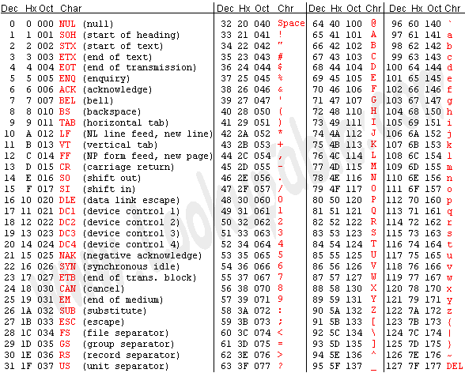
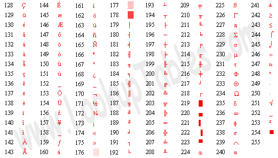
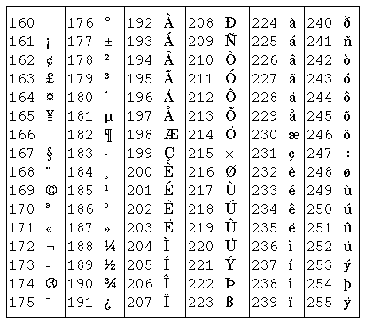

# 1. ASCII 码

ASCII 码的取值范围是 0~127，可以用 7 个 bit 表示。C 语言中 `char` 型变量的大小规定为一字节，如果存放 ASCII 码则只用到低 7 位，高位为 0。以下是 ASCII 码表：

  

  
<b>图 A.1. ASCII 码表</b>

绝大多数计算机的一个字节是 8 位，取值范围是 0~255，而 ASCII 码并没有规定编号为 128~255 的字符，为了能表示更多字符，各厂商制定了很多种 ASCII 码的扩展规范。注意，虽然通常把这些规范称为扩展 ASCII 码（Extended ASCII），但其实它们并不属于 ASCII 码标准。例如以下这种扩展 ASCII 码由 IBM 制定，在字符终端下被广泛采用，其中包含了很多表格边线字符用来画界面。

  

  
<b>图 A.2. IBM 的扩展 ASCII 码表</b>

在图形界面中最广泛使用的扩展 ASCII 码是 ISO-8859-1，也称为 Latin-1，其中包含欧洲各国语言中最常用的非英文字母，但毕竟只有 128 个字符，某些语言中的某些字母没有包含。如下表所示。

  

  
<b>图 A.3. ISO-8859-1</b>

编号为 128~159 的是一些控制字符，在上表中没有列出。
