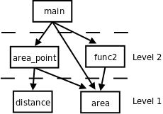

# 2. 增量式开发

目前为止你看到了很多示例代码，也在它们的基础上做了很多改动并在这个过程中巩固所学的知识。但是如果从头开始编写一个程序解决某个问题，应该按什么步骤来写呢？本节提出一种增量式（Incremental）开发的思路，很适合初学者。

现在问题来了：我们要编一个程序求圆的面积，圆的半径以两个端点的座标(x1, y1)和(x2, y2)给出。首先分析和分解问题，把大问题分解成小问题，再对小问题分别求解。这个问题可分为两步：

1. 由两个端点座标求半径的长度，我们知道平面上两点间距离的公式是：

```text
distance = √((x2-x1)2+(y2-y1)2)
```

括号里的部分都可以用我们学过的 C 语言表达式来表示，求平方根可以用 `math.h` 中的 `sqrt` 函数，因此这个小问题全部都可以用我们学过的知识解决。这个公式可以实现成一个函数，参数是两点的座标，返回值是 `distance` 。

2. 上一步算出的距离是圆的半径，已知圆的半径之后求面积的公式是：

```text
area = π·radius2
```

也可以用我们学过的 C 语言表达式来解决，这个公式也可以实现成一个函数，参数是 `radius` ，返回值是 `area` 。

首先编写 `distance` 这个函数，我们已经明确了它的参数是两点的座标，返回值是两点间距离，可以先写一个简单的函数定义：

```c
double distance(double x1, double y1, double x2, double y2)
{
	return 0.0;
}
```

初学者写到这里就已经不太自信了：这个函数定义写得对吗？虽然我是按我理解的语法规则写的，但书上没有和这个一模一样的例子，万一不小心遗漏了什么呢？既然不自信就不要再往下写了，没有一个平稳的心态来写程序很可能会引入 Bug。所以在函数定义中插一个 `return 0.0` 立刻结束掉它，然后立刻测试这个函数定义得有没有错：

```c
int main(void)
{
	printf("distance is %f\n", distance(1.0, 2.0, 4.0, 6.0));
	return 0;
}
```

编译，运行，一切正常。这时你就会建立起信心了：既然没问题，就不用管它了，继续往下写。在测试时给这个函数的参数是(1.0, 2.0)和(4.0, 6.0)，两点的 `x` 座标距离是 3.0， `y` 座标距离是 4.0，因此两点间距离应该是 5.0，你必须事先知道正确答案是 5.0，这样你才能测试程序计算的结果对不对。当然，现在函数还没实现，计算结果肯定是不对的。现在我们再往函数里添一点代码：

```c
double distance(double x1, double y1, double x2, double y2)
{
	double dx = x2 - x1;
	double dy = y2 - y1;
	printf("dx is %f\ndy is %f\n", dx, dy);

	return 0.0;
}
```

如果你不确定 `dx` 和 `dy` 这样初始化行不行，那么就此打住，在函数里插一条打印语句把 `dx` 和 `dy` 的值打出来看看。把它和上面的 `main` 函数一起编译运行，由于我们事先知道结果应该是 3.0 和 4.0，因此能够验证程序算得对不对。一旦验证无误，函数里的这句打印就可以撤掉了，像这种打印语句，以及我们用来测试的 `main` 函数，都起到了类似脚手架（Scaffold）的作用：在盖房子时很有用，但它不是房子的一部分，房子盖好之后就可以拆掉了。房子盖好之后可能还需要维修、加盖、翻新，又要再加上脚手架，这很麻烦，要是当初不用拆就好了，可是不拆不行，不拆多难看啊。写代码却可以有一个更高明的解决办法：把 Scaffolding 的代码注释掉。

```c
double distance(double x1, double y1, double x2, double y2)
{
	double dx = x2 - x1;
	double dy = y2 - y1;
	/* printf("dx is %f\ndy is %f\n", dx, dy); */
	return 0.0;
}
```

这样如果以后出了新的 Bug 又需要跟踪调试时，还可以把这句重新加进代码中使用。两点的 x 座标距离和 y 座标距离都没问题了，下面求它们的平方和：

```c
double distance(double x1, double y1, double x2, double y2)
{
	double dx = x2 - x1;
	double dy = y2 - y1;
	double dsquared = dx * dx + dy * dy;
	printf("dsquared is %f\n", dsquared);

	return 0.0;
}
```

然后再编译、运行，看看是不是得 25.0。这样的增量式开发非常适合初学者，每写一行代码都编译运行，确保没问题了再写一下行，一方面在写代码时更有信心，另一方面也方便了调试：总是有一个先前的正确版本做参照，改动之后如果出了问题，几乎可以肯定就是刚才改的那行代码出的问题，这样就避免了必须从很多行代码中查找分析到底是哪一行出的问题。在这个过程中 `printf` 功不可没，你怀疑哪一行代码有问题，就插一个 `printf` 进去看看中间的计算结果，任何错误都可以通过这个办法找出来。以后我们会介绍程序调试工具 `gdb` ，它提供了更强大的调试功能帮你分析更隐蔽的错误。但即使有了 `gdb` ， `printf` 这个最原始的办法仍然是最直接、最有效的。最后一步，我们完成这个函数：

**例 5.1. distance 函数**

```c
#include <math.h>
#include <stdio.h>

double distance(double x1, double y1, double x2, double y2)
{
	double dx = x2 - x1;
	double dy = y2 - y1;
	double dsquared = dx * dx + dy * dy;
	double result = sqrt(dsquared);

	return result;
}

int main(void)
{
	printf("distance is %f\n", distance(1.0, 2.0, 4.0, 6.0));
	return 0;
}
```

然后编译运行，看看是不是得 5.0。随着编程经验越来越丰富，你可能每次写若干行代码再一起测试，而不是像现在这样每写一行就测试一次，但不管怎么样，增量式开发的思路是很有用的，它可以帮你节省大量的调试时间，不管你有多强，都不应该一口气写完整个程序再编译运行，那几乎是一定会有 Bug 的，到那时候再找 Bug 就难了。

这个程序中引入了很多临时变量： `dx` 、 `dy` 、 `dsquared` 、 `result` ，如果你有信心把整个表达式一次性写好，也可以不用临时变量：

```c
double distance(double x1, double y1, double x2, double y2)
{
	return sqrt((x2-x1) * (x2-x1) + (y2-y1) * (y2-y1));
}
```

这样写简洁得多了。但如果写错了呢？只知道是这一长串表达式有错，根本不知道错在哪，而且整个函数就一个语句，插 `printf` 都没地方插。所以用临时变量有它的好处，使程序更清晰，调试更方便，而且有时候可以避免不必要的计算，例如上面这一行表达式要把 `(x2-x1)` 计算两遍，如果算完 `(x2-x1)` 把结果存在一个临时变量 `dx` 里，就不需要再算第二遍了。

接下来编写 `area` 这个函数：

```c
double area(double radius)
{
	return 3.1416 * radius * radius;
}
```

给出两点的座标求距离，给出半径求圆的面积，这两个子问题都解决了，如何把它们组合起来解决整个问题呢？给出半径的两端点座标(1.0, 2.0)和(4.0, 6.0)求圆的面积，先用 `distance` 函数求出半径的长度，再把这个长度传给 `area` 函数：

```c
double radius = distance(1.0, 2.0, 4.0, 6.0);
double result = area(radius);
```

也可以这样：

```c
double result = area(distance(1.0, 2.0, 4.0, 6.0));
```

我们一直把“给出半径的两端点座标求圆的面积”这个问题当作整个问题来看，如果它也是一个更大的程序当中的子问题呢？我们可以把先前的两个函数组合起来做成一个新的函数以便日后使用：

```c
double area_point(double x1, double y1, double x2, double y2)
{
	return area(distance(x1, y1, x2, y2));
}
```

还有另一种组合的思路，不是把 `distance` 和 `area` 两个函数调用组合起来，而是把那两个函数中的语句组合到一起：

```c
double area_point(double x1, double y1, double x2, double y2)
{
	double dx = x2 - x1;
	double dy = y2 - y1;
	double radius = sqrt(dx * dx + dy * dy);

	return 3.1416 * radius * radius;
}
```

这样组合是不理想的。这样组合了之后，原来写的 `distance` 和 `area` 两个函数还要不要了呢？如果不要了删掉，那么如果有些情况只需要求两点间的距离，或者只需要给定半径长度求圆的面积呢？ `area_point` 把所有语句都写在一起，太不灵活了，满足不了这样的需要。如果保留 `distance` 和 `area` 同时也保留这个 `area_point` 怎么样呢？ `area_point` 和 `distance` 有相同的代码，一旦在 `distance` 函数中发现了 Bug，或者要升级 `distance` 这个函数采用更高的计算精度，那么不仅要修改 `distance` ，还要记着修改 `area_point` ，同理，要修改 `area` 也要记着修改 `area_point` ，维护重复的代码是非常容易出错的，在任何时候都要尽量避免。因此，**尽可能复用（Reuse）以前写的代码，避免写重复的代码**。封装就是为了复用，把解决各种小问题的代码封装成函数，在解决第一个大问题时可以用这些函数，在解决第二个大问题时可以复用这些函数。

解决问题的过程是把大的问题分成小的问题，小的问题再分成更小的问题，这个过程在代码中的体现就是函数的分层设计（Stratify）。 `distance` 和 `area` 是两个底层函数，解决一些很小的问题，而 `area_point` 是一个上层函数，上层函数通过调用底层函数来解决更大的问题，底层和上层函数都可以被更上一层的函数调用，最终所有的函数都直接或间接地被 `main` 函数调用。如下图所示：

<div align="center">

  

  <p><b>图 5.1. 函数的分层设计</b></p>

</div>
