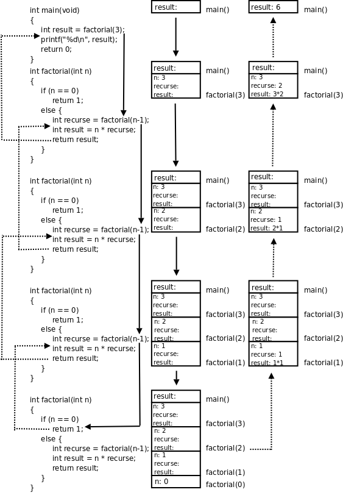

# 3. 递归

如果定义一个概念需要用到这个概念本身，我们称它的定义是递归的（Recursive）。例如：

* frabjuous

  an adjective used to describe something that is frabjuous.

这只是一个玩笑，如果你在字典上看到这么一个词条肯定要怒了。然而数学上确实有很多概念是用它自己来定义的，比如 n 的阶乘（Factorial）是这样定义的：n 的阶乘等于 n 乘以 n-1 的阶乘。如果这样就算定义完了，恐怕跟上面那个词条有异曲同工之妙了：n-1 的阶乘是什么？是 n-1 乘以 n-2 的阶乘。那 n-2 的阶乘又是什么？这样下去永远也没完。因此需要定义一个最关键的基础条件（Base Case）：0 的阶乘等于 1。

```text
0! = 1
n! = n · (n-1)!
```

因此，3!=3*2!，2!=2*1!，1!=1*0!=1*1=1，正因为有了 Base Case，才不会永远没完地数下去，知道了 1!=1 我们再反过来算回去，2!=2*1!=2*1=2，3!=3*2!=3*2=6。下面用程序来完成这一计算过程，我们要写一个计算阶乘的函数 `factorial` ，先把 Base Case 这种最简单的情况写进去：

```c
int factorial(int n)
{
	if (n == 0)
		return 1;
}
```

如果参数 `n` 不是 0 应该 `return` 什么呢？根据定义，应该 `return n*factorial(n-1);` ，为了下面的分析方便，我们引入几个临时变量把这个语句拆分一下：

```c
int factorial(int n)
{
	if (n == 0)
		return 1;
	else {
		int recurse = factorial(n-1);
		int result = n * recurse;
		return result;
	}
}
```

`factorial ` 这个函数居然可以自己调用自己？是的。自己直接或间接调用自己的函数称为递归函数。这里的`factorial ` 是直接调用自己，有些时候函数 A 调用函数 B，函数 B 又调用函数 A，也就是函数 A 间接调用自己，这也是递归函数。如果你觉得迷惑，可以把`factorial(n-1) ` 这一步看成是在调用另一个函数－－另一个有着相同函数名和相同代码的函数，调用它就是跳到它的代码里执行，然后再返回`factorial(n-1) ` 这个调用的下一步继续执行。我们以`factorial(3)` 为例分析整个调用过程，如下图所示：

<div align="center">

  

  <p><b>图 5.2. factorial(3)的调用过程</b></p>

</div>

图中用实线箭头表示调用，用虚线箭头表示返回，右侧的框表示在调用和返回过程中各层函数调用的存储空间变化情况。

1. `main() ` 有一个局部变量`result` ，用一个框表示。

2. 调用 `factorial(3)` 时要分配参数和局部变量的存储空间，于是在 `main()` 的下面又多了一个框表示 `factorial(3)` 的参数和局部变量，其中 `n` 已初始化为 3。

3. `factorial(3) ` 又调用`factorial(2) ` ，又要分配`factorial(2) ` 的参数和局部变量，于是在`main() ` 和`factorial(3) ` 下面又多了一个框。[第 4 节 “全局变量、局部变量和作用域”](ch03s04.md#func.localvar)讲过，每次调用函数时分配参数和局部变量的存储空间，退出函数时释放它们的存储空间。`factorial(3) ` 和`factorial(2) ` 是两次不同的调用，`factorial(3) ` 的参数`n ` 和`factorial(2) ` 的参数`n ` 各有各的存储单元，虽然我们写代码时只写了一次参数`n ` ，但运行时却是两个不同的参数`n ` 。并且由于调用`factorial(2) ` 时`factorial(3) ` 还没退出，所以两个函数调用的参数`n` 同时存在，所以在原来的基础上多画一个框。

4. 依此类推，请读者对照着图自己分析整个调用过程。读者会发现这个过程和前面我们用数学公式计算 3!的过程是一样的，都是先一步步展开然后再一步步收回去。

我们看上图右侧存储空间的变化过程，随着函数调用的层层深入，存储空间的一端逐渐增长，然后随着函数调用的层层返回，存储空间的这一端又逐渐缩短，并且每次访问参数和局部变量时只能访问这一端的存储单元，而不能访问内部的存储单元，比如当 `factorial(2)` 的存储空间位于末端时，只能访问它的参数和局部变量，而不能访问 `factorial(3)` 和 `main()` 的参数和局部变量。具有这种性质的数据结构称为堆栈或栈（Stack），随着函数调用和返回而不断变化的这一端称为栈顶，每个函数调用的参数和局部变量的存储空间（上图的每个小方框）称为一个栈帧（Stack Frame）。操作系统为程序的运行预留了一块栈空间，函数调用时就在这个栈空间里分配栈帧，函数返回时就释放栈帧。

在写一个递归函数时，你如何证明它是正确的？像上面那样跟踪函数的调用和返回过程算是一种办法，但只是 `factorial(3)` 就已经这么麻烦了，如果是 `factorial(100)` 呢？虽然我们已经证明了 `factorial(3)` 是正确的，因为它跟我们用数学公式计算的过程一样，结果也一样，但这不能代替 `factorial(100)` 的证明，你怎么办？别的函数你可以跟踪它的调用过程去证明它的正确性，因为每个函数只调用一次就返回了，但是对于递归函数，这么跟下去只会跟得你头都大了。事实上并不是每个函数调用都需要钻进去看的。我们在调用 `printf` 时没有钻进去看它是怎么打印的，我们只是**相信**它能打印，能正确完成它的工作，然后就继续写下面的代码了。在上一节中，我们写了 `distance` 和 `area` 函数，然后立刻测试证明了这两个函数是正确的，然后我们写 `area_point` 时调用了这两个函数：

```c
return area(distance(x1, y1, x2, y2));
```

在写这一句的时候，我们需要钻进 `distance` 和 `area` 函数中去走一趟才知道我们调用得是否正确吗？不需要，因为我们已经**相信**这两个函数能正确工作了，也就是相信把座标传给 `distance` 它就能返回正确的距离，把半径传给 `area` 它就能返回正确的面积，因此调用它们去完成另外一件工作也应该是正确的。这种“相信”称为 Leap of Faith，首先相信一些结论，然后再用它们去证明另外一些结论。

在写 `factorial(n)` 的代码时写到这个地方：

```c
...
int recurse = factorial(n-1);
int result = n * recurse;
...
```

这时，如果我们相信 `factorial(n-1)` 是正确的，也就是相信传给它 `n-1` 它就能返回(n-1)!，那么 `recurse` 就是(n-1)!，那么 `result` 就是 n*(n-1)!，也就是 n!，这正是我们要返回的 `factorial(n)` 的结果。当然这有点奇怪：我们还没写完 `factorial` 这个函数，凭什么要相信 `factorial(n-1)` 是正确的？可 Leap of Faith 本身就是 Leap（跳跃）的，不是吗？**如果你相信你正在写的递归函数是正确的，并调用它，然后在此基础上写完这个递归函数，那么它就会是正确的，从而值得你相信它正确。**

这么说好像有点儿玄，我们从数学上严格证明一下 `factorial` 函数的正确性。刚才说了， `factorial(n)` 的正确性依赖于 `factorial(n-1)` 的正确性，只要后者正确，在后者的结果上乘个 `n` 返回这一步显然也没有疑问，那么我们的函数实现就是正确的。因此要证明 `factorial(n)` 的正确性就是要证明 `factorial(n-1)` 的正确性，同理，要证明 `factorial(n-1)` 的正确性就是要证明 `factorial(n-2)` 的正确性，依此类推下去，最后是：要证明 `factorial(1)` 的正确性就是要证明 `factorial(0)` 的正确性。而 `factorial(0)` 的正确性不依赖于别的函数调用，它就是程序中的一个小的分支 `return 1;` ，这个 1 是我们根据阶乘的定义写的，肯定是正确的，因此 `factorial(1)` 的实现是正确的，因此 `factorial(2)` 也正确，依此类推，最后 `factorial(n)` 也是正确的。其实这就是在中学时学的数学归纳法（Mathematical Induction），用数学归纳法来证明只需要证明两点：Base Case 正确，递推关系正确。**写递归函数时一定要记得写 Base Case**，否则即使递推关系正确，整个函数也不正确。如果 `factorial` 函数漏掉了 Base Case：

```c
int factorial(int n)
{
	int recurse = factorial(n-1);
	int result = n * recurse;
	return result;
}
```

那么这个函数就会永远调用下去，直到操作系统为程序预留的栈空间耗尽程序崩溃（段错误）为止，这称为无穷递归（Infinite recursion）。

到目前为止我们只学习了全部 C 语法的一个小的子集，但是现在应该告诉你：这个子集是完备的，它本身就可以作为一门编程语言了，以后还要学习很多 C 语言特性，但全部都可以用已经学过的这些特性来代替。也就是说，以后要学的 C 语言特性会使代码写起来更加方便，但不是必不可少的，现在学的这些已经完全覆盖了[第 1 节 “程序和编程语言”](intro.program.md)讲的五种基本指令了。有的读者会说循环还没讲到呢，是的，循环在下一章才讲，但有一个重要的结论就是**递归和循环是等价的**，用循环能做的事用递归都能做，反之亦然，事实上有的编程语言（比如某些 LISP 实现）只有递归而没有循环。计算机指令能做的所有事情就是数据存取、运算、测试和分支、循环（或递归），在计算机上运行高级语言写的程序最终也要翻译成指令，指令做不到的事情高级语言写的程序肯定也做不到，虽然高级语言有丰富的语法特性，但也只是比指令写起来更方便而已，能做的事情是一样多的。那么，为什么计算机要设计成这样？在设计时怎么想到计算机应该具备这几样功能，而不是更多或更少的功能？这些要归功于早期的计算机科学家，例如 Alan Turing，他们在计算机还没有诞生的年代就从数学理论上为计算机的设计指明了方向。有兴趣的读者可以参考有关计算理论的教材，例如[\[IATLC\]](bi01.md#bibli.iatlc)。

递归绝不只是为解决一些奇技淫巧的数学题[^8]而想出来的招，它是计算机的精髓所在，也是编程语言的精髓所在。我们学习在 C 的语法时已经看到很多递归定义了，例如在[第 1 节 “数学函数”](ch03s01.md#func.mathfunc)讲过的语法规则中，“表达式”就是递归定义的：

```text
表达式 → 表达式(参数列表)
参数列表 → 表达式, 表达式, ...
```

再比如在[第 1 节 “if 语句”](ch04s01.md#cond.if)讲过的语规则中，“语句”也是递归定义的：

```text
语句 → if (控制表达式) 语句
```

可见编译器在解析我们写的程序时一定也用了大量的递归，有关编译器的实现原理可参考[\[Dragon Book\]](bi01.md#bibli.dragonbook)。

## 习题

1、编写递归函数求两个正整数 `a` 和 `b` 的最大公约数（GCD，Greatest Common Divisor），使用 Euclid 算法：

1. 如果 `a` 除以 `b` 能整除，则最大公约数是 `b` 。

2. 否则，最大公约数等于 `b` 和 `a%b` 的最大公约数。

Euclid 算法是很容易证明的，请读者自己证明一下为什么这么算就能算出最大公约数。最后，修改你的程序使之适用于所有整数，而不仅仅是正整数。

2、编写递归函数求 Fibonacci 数列的第 `n` 项，这个数列是这样定义的：

```text
fib(0)=1
fib(1)=1
fib(n)=fib(n-1)+fib(n-2)
```

上面两个看似毫不相干的问题之间却有一个有意思的联系：

* Lamé定理

  如果 Euclid 算法需要 k 步来计算两个数的 GCD，那么这两个数之中较小的一个必然大于等于 Fibonacci 数列的第 k 项。

感兴趣的读者可以参考[\[SICP\]](bi01.md#bibli.sicp)第 1.2 节的简略证明。

[^8]: 例如很多编程书都会举例的汉诺塔问题，本书不打算再重复这个题目了。
