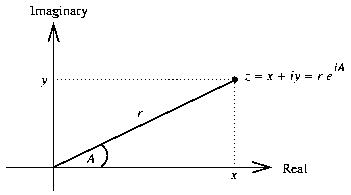
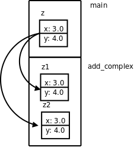

# 1. 复合类型与结构体

在编程语言中，最基本的、不可再分的数据类型称为基本类型（Primitive Type），例如整型、浮点型；根据语法规则由基本类型组合而成的类型称为复合类型（Compound Type），例如字符串是由很多字符组成的。有些场合下要把复合类型当作一个整体来用，而另外一些场合下需要分解组成这个复合类型的各种基本类型，复合类型的这种两面性为数据抽象（Data Abstraction）奠定了基础。[\[SICP\]](bi01.md#bibli.sicp)指出，在学习一门编程语言时要特别注意以下三个方面：

1. 这门语言提供了哪些 Primitive，比如基本类型，比如基本运算符、表达式和语句。

2. 这门语言提供了哪些组合规则，比如基本类型如何组成复合类型，比如简单的表达式和语句如何组成复杂的表达式和语句。

3. 这门语言提供了哪些抽象机制，包括数据抽象和过程抽象（Procedure Abstraction）。

本章以结构体为例讲解数据类型的组合和数据抽象。至于过程抽象，我们在[第 2 节 “if/else 语句”](ch04s02.md#cond.ifelse)已经见过最简单的形式，就是把一组语句用一个函数名封装起来，当作一个整体使用，本章将介绍更复杂的过程抽象。

现在我们用 C 语言表示一个复数。从直角座标系来看，复数由实部和虚部组成，从极座标系来看，复数由模和辐角组成，两种座标系可以相互转换，如下图所示：

<div align="center">

  

  <p><b>图 7.1. 复数</b></p>

</div>

如果用实部和虚部表示一个复数，我们可以写成由两个 `double` 型组成的结构体：

```c
struct complex_struct {
	double x, y;
};
```

这一句定义了标识符 `complex_struct` （同样遵循标识符的命名规则），这种标识符在 C 语言中称为 Tag， `struct complex_struct { double x, y; }` 整个可以看作一个类型名[^12]，就像 `int` 或 `double` 一样，只不过它是一个复合类型，如果用这个类型名来定义变量，可以这样写：

```c
struct complex_struct {
	double x, y;
} z1, z2;
```

这样 `z1` 和 `z2` 就是两个变量名，变量定义后面带个;号是我们早就习惯的。但即使像先前的例子那样只定义了 `complex_struct` 这个 Tag 而不定义变量，}后面的;号也不能少。这点一定要注意，类型定义也是一种声明，声明都要以;号结尾，结构体类型定义的}后面少;号是初学者常犯的错误。不管是用上面两种形式的哪一种定义了 `complex_struct` 这个 Tag，以后都可以直接用 `struct complex_struct` 来代替类型名了。例如可以这样定义另外两个复数变量：

```c
struct complex_struct z3, z4;
```

如果在定义结构体类型的同时定义了变量，也可以不必写 Tag，例如：

```c
struct {
	double x, y;
} z1, z2;
```

但这样就没办法再次引用这个结构体类型了，因为它没有名字。每个复数变量都有两个成员（Member）x 和 y，可以用.运算符（.号，Period）来访问，这两个成员的存储空间是相邻的[^13]，合在一起组成复数变量的存储空间。看下面的例子：

**例 7.1. 定义和访问结构体**

```c
#include <stdio.h>

int main(void)
{
	struct complex_struct { double x, y; } z;
	double x = 3.0;
	z.x = x;
	z.y = 4.0;
	if (z.y < 0)
		printf("z=%f%fi\n", z.x, z.y);
	else
		printf("z=%f+%fi\n", z.x, z.y);

	return 0;
}
```

注意上例中变量 `x` 和变量 `z` 的成员 `x` 的名字并不冲突，因为变量 `z` 的成员 `x` 只能通过表达式 `z.x` 来访问，编译器可以从语法上区分哪个 `x` 是变量 `x` ，哪个 `x` 是变量 `z` 的成员 `x` ，[第 3 节 “变量的存储布局”](ch19s03.md#asmc.layout)会讲到这两个标识符 `x` 属于不同的命名空间。结构体 Tag 也可以定义在全局作用域中，这样定义的 Tag 在其定义之后的各函数中都可以使用。例如：

```c
struct complex_struct { double x, y; };

int main(void)
{
	struct complex_struct z;
	...
}
```

结构体变量也可以在定义时初始化，例如：

```c
struct complex_struct z = { 3.0, 4.0 };
```

Initializer 中的数据依次赋给结构体的各成员。如果 Initializer 中的数据比结构体的成员多，编译器会报错，但如果只是末尾多个逗号则不算错。如果 Initializer 中的数据比结构体的成员少，未指定的成员将用 0 来初始化，就像未初始化的全局变量一样。例如以下几种形式的初始化都是合法的：

```c
double x = 3.0;
struct complex_struct z1 = { x, 4.0, }; /* z1.x=3.0, z1.y=4.0 */
struct complex_struct z2 = { 3.0, }; /* z2.x=3.0, z2.y=0.0 */
struct complex_struct z3 = { 0 }; /* z3.x=0.0, z3.y=0.0 */
```

注意， `z1` 必须是局部变量才能用另一个变量 `x` 的值来初始化它的成员，如果是全局变量就只能用常量表达式来初始化。这也是 C99 的新特性，C89 只允许在{}中使用常量表达式来初始化，无论是初始化全局变量还是局部变量。

{}这种语法不能用于结构体的赋值，例如这样是错误的：

```c
struct complex_struct z1;
z1 = { 3.0, 4.0 };
```

以前我们初始化基本类型的变量所使用的 Initializer 都是表达式，表达式当然也可以用来赋值，但现在这种由{}括起来的 Initializer 并不是表达式，所以不能用来赋值[^14]。Initializer 的语法总结如下：

```text
Initializer → 表达式
Initializer → { 初始化列表 }
初始化列表 → Designated-Initializer, Designated-Initializer, ...
（最后一个 Designated-Initializer 末尾可以有一个多余的,号）
Designated-Initializer → Initializer
Designated-Initializer → .标识符 = Initializer
Designated-Initializer → [常量表达式] = Initializer
```

Designated Initializer 是 C99 引入的新特性，用于初始化稀疏（Sparse）结构体和稀疏数组很方便。有些时候结构体或数组中只有某一个或某几个成员需要初始化，其它成员都用 0 初始化即可，用 Designated Initializer 语法可以针对每个成员做初始化（Memberwise Initialization），很方便。例如：

```c
struct complex_struct z1 = { .y = 4.0 }; /* z1.x=0.0, z1.y=4.0 */
```

数组的 Memberwise Initialization 语法将在下一章介绍。

结构体类型用在表达式中有很多限制，不像基本类型那么自由，比如+ - * /等算术运算符和&& || !等逻辑运算符都不能作用于结构体类型， `if` 语句、 `while` 语句中的控制表达式的值也不能是结构体类型。严格来说，可以做算术运算的类型称为算术类型（Arithmetic Type），算术类型包括整型和浮点型。可以表示零和非零，可以参与逻辑与、或、非运算或者做控制表达式的类型称为标量类型（Scalar Type），标量类型包括算术类型和以后要讲的指针类型，详见[图 23.5 “C 语言类型总结”](ch23s09.md#pointer.typesummary)。

结构体变量之间使用赋值运算符是允许的，用一个结构体变量初始化另一个结构体变量也是允许的，例如：

```c
struct complex_struct z1 = { 3.0, 4.0 };
struct complex_struct z2 = z1;
z1 = z2;
```

同样地， `z2` 必须是局部变量才能用变量 `z1` 的值来初始化。既然结构体变量之间可以相互赋值和初始化，也就可以当作函数的参数和返回值来传递：

```c
struct complex_struct add_complex(struct complex_struct z1, struct complex_struct z2)
{
	z1.x = z1.x + z2.x;
	z1.y = z1.y + z2.y;
	return z1;
}
```

这个函数实现了两个复数相加，如果在 `main` 函数中这样调用：

```c
struct complex_struct z = { 3.0, 4.0 };
z = add_complex(z, z);
```

那么调用传参的过程如下图所示：

<div align="center">

  

  <p><b>图 7.2. 结构体传参</b></p>

</div>

变量 `z` 在 `main` 函数的栈帧上，参数 `z1` 和 `z2` 在 `add_complex` 函数的栈帧上， `z` 的值分别赋给 `z1` 和 `z2` 。在这个函数里， `z2` 的实部和虚部被累加到 `z1` 中，然后 `return z1;` 可以看成是：

1. 用 `z1` 初始化一个临时变量。

2. 函数返回并释放栈帧。

3. 把临时变量的值赋给变量 `z` ，释放临时变量。

由.运算符组成的表达式能不能做左值取决于.运算符左边的表达式能不能做左值。在上面的例子中， `z` 是一个变量，可以做左值，因此表达式 `z.x` 也可以做左值，但表达式 `add_complex(z, z).x` 只能做右值而不能做左值，因为表达式 `add_complex(z, z)` 不能做左值。

[^12]: 其实 C99 已经定义了复数类型_Complex。如果包含 C 标准库的头文件 complex.h，也可以用 complex 做类型名。当然，只要不包含头文件 complex.h 就可以自己定义标识符 complex，但为了尽量减少混淆，本章的示例代码都用 complex_struct 做标识符而不用 complex。

[^13]: 我们在会看到，结构体成员之间也可能有若干个填充字节。

[^14]: C99 引入一种新的表达式语法 Compound Literal 可以用来赋值，例如 z1 = (struct complex_struct){ 3.0, 4.0 };，本书不使用这种新语法。
