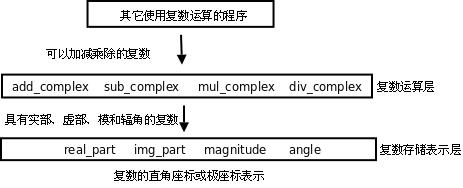

# 2. 数据抽象

现在我们来实现一个完整的复数运算程序。在上一节我们已经定义了复数的结构体类型，现在需要围绕它定义一些函数。复数可以用直角座标或极座标表示，直角座标做加减法比较方便，极座标做乘除法比较方便。如果我们定义的复数结构体是直角座标的，那么应该提供极座标的转换函数，以便在需要的时候可以方便地取它的模和辐角：

```c
#include <math.h>

struct complex_struct {
	double x, y;
};

double real_part(struct complex_struct z)
{
	return z.x;
}

double img_part(struct complex_struct z)
{
	return z.y;
}

double magnitude(struct complex_struct z)
{
	return sqrt(z.x * z.x + z.y * z.y);
}

double angle(struct complex_struct z)
{
	return atan2(z.y, z.x);
}
```

此外，我们还提供两个函数用来构造复数变量，既可以提供直角座标也可以提供极座标，在函数中自动做相应的转换然后返回构造的复数变量：

```c
struct complex_struct make_from_real_img(double x, double y)
{
	struct complex_struct z;
	z.x = x;
	z.y = y;
	return z;
}

struct complex_struct make_from_mag_ang(double r, double A)
{
	struct complex_struct z;
	z.x = r * cos(A);
	z.y = r * sin(A);
	return z;
}
```

在此基础上就可以实现复数的加减乘除运算了：

```c
struct complex_struct add_complex(struct complex_struct z1, struct complex_struct z2)
{
	return make_from_real_img(real_part(z1) + real_part(z2),
				  img_part(z1) + img_part(z2));
}

struct complex_struct sub_complex(struct complex_struct z1, struct complex_struct z2)
{
	return make_from_real_img(real_part(z1) - real_part(z2),
				  img_part(z1) - img_part(z2));
}

struct complex_struct mul_complex(struct complex_struct z1, struct complex_struct z2)
{
	return make_from_mag_ang(magnitude(z1) * magnitude(z2),
				 angle(z1) + angle(z2));
}

struct complex_struct div_complex(struct complex_struct z1, struct complex_struct z2)
{
	return make_from_mag_ang(magnitude(z1) / magnitude(z2),
				 angle(z1) - angle(z2));
}
```

可以看出，复数加减乘除运算的实现并没有直接访问结构体 `complex_struct` 的成员 `x` 和 `y` ，而是把它看成一个整体，通过调用相关函数来取它的直角座标和极座标。这样就可以非常方便地替换掉结构体 `complex_struct` 的存储表示，例如改为用极座标来存储：

```c
#include <math.h>

struct complex_struct {
	double r, A;
};

double real_part(struct complex_struct z)
{
	return z.r * cos(z.A);
}

double img_part(struct complex_struct z)
{
	return z.r * sin(z.A);
}

double magnitude(struct complex_struct z)
{
	return z.r;
}

double angle(struct complex_struct z)
{
	return z.A;
}

struct complex_struct make_from_real_img(double x, double y)
{
	struct complex_struct z;
	z.A = atan2(y, x);
	z.r = sqrt(x * x + y * y);
}

struct complex_struct make_from_mag_ang(double r, double A)
{
	struct complex_struct z;
	z.r = r;
	z.A = A;
	return z;
}
```

虽然结构体 `complex_struct` 的存储表示做了这样的改动， `add_complex` 、 `sub_complex` 、 `mul_complex` 、 `div_complex` 这几个复数运算的函数却不需要做任何改动，仍然可以用，原因在于这几个函数只把结构体 `complex_struct` 当作一个整体来使用，而没有直接访问它的成员，因此也不依赖于它有哪些成员。我们结合下图具体分析一下。

<div align="center">

  

  <p><b>图 7.3. 数据抽象</b></p>

</div>

这里是一种抽象的思想。其实“抽象”这个概念并没有那么抽象，简单地说就是“提取公因式”：ab+ac=a(b+c)。如果 a 变了，ab 和 ac 这两项都需要改，但如果写成 a(b+c)的形式就只需要改其中一个因子。

在我们的复数运算程序中，复数有可能用直角座标或极座标来表示，我们把这个有可能变动的因素提取出来组成复数存储表示层： `real_part` 、 `img_part` 、 `magnitude` 、 `angle` 、 `make_from_real_img` 、 `make_from_mag_ang` 。这一层看到的数据是结构体的两个成员 `x` 和 `y` ，或者 `r` 和 `A` ，如果改变了结构体的实现就要改变这一层函数的实现，但函数接口不改变，因此调用这一层函数接口的复数运算层也不需要改变。复数运算层看到的数据只是一个抽象的“复数”的概念，知道它有直角座标和极座标，可以调用复数存储表示层的函数得到这些座标。再往上看，其它使用复数运算的程序看到的数据是一个更为抽象的“复数”的概念，只知道它是一个数，像整数、小数一样可以加减乘除，甚至连它有直角座标和极座标也不需要知道。

这里的复数存储表示层和复数运算层称为抽象层（Abstraction Layer），从底层往上层来看，复数越来越抽象了，把所有这些层组合在一起就是一个完整的系统。**组合使得系统可以任意复杂，而抽象使得系统的复杂性是可以控制的，任何改动都只局限在某一层，而不会波及整个系统**。著名的计算机科学家 Butler Lampson 说过：“All problems in computer science can be solved by another level of indirection.”这里的 indirection 其实就是 abstraction 的意思。

## 习题

1、在本节的基础上实现一个打印复数的函数，打印的格式是 x+yi，如果实部或虚部为 0 则省略，例如：1.0、-2.0i、-1.0+2.0i、1.0-2.0i。最后编写一个 `main` 函数测试本节的所有代码。想一想这个打印函数应该属于上图中的哪一层？

2、实现一个用分子分母的格式来表示有理数的结构体 `rational` 以及相关的函数， `rational` 结构体之间可以做加减乘除运算，运算的结果仍然是 `rational` 。测试代码如下：

```c
int main(void)
{
	struct rational a = make_rational(1, 8); /* a=1/8 */
	struct rational b = make_rational(-1, 8); /* b=-1/8 */
	print_rational(add_rational(a, b));
	print_rational(sub_rational(a, b));
	print_rational(mul_rational(a, b));
	print_rational(div_rational(a, b));

	return 0;
}
```

注意要约分为最简分数，例如 1/8 和-1/8 相减的打印结果应该是 1/4 而不是 2/8，可以利用[第 3 节 “递归”](ch05s03.md#func2.recursion)练习题中的 Euclid 算法来约分。在动手编程之前先思考一下这个问题实现了什么样的数据抽象，抽象层应该由哪些函数组成。
