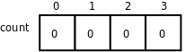

# 1. 数组的基本概念

数组（Array）也是一种复合数据类型，它由一系列相同类型的元素（Element）组成。例如定义一个由 4 个 `int` 型元素组成的数组 count：

```c
int count[4];
```

和结构体成员类似，数组 `count` 的 4 个元素的存储空间也是相邻的。结构体成员可以是基本数据类型，也可以是复合数据类型，数组中的元素也是如此。根据组合规则，我们可以定义一个由 4 个结构体元素组成的数组：

```c
struct complex_struct {
	double x, y;
} a[4];
```

也可以定义一个包含数组成员的结构体：

```c
struct {
	double x, y;
	int count[4];
} s;
```

数组类型的长度应该用一个整数常量表达式来指定[^16]。数组中的元素通过下标（或者叫索引，Index）来访问。例如前面定义的由 4 个 `int` 型元素组成的数组 `count` 图示如下：

<div align="center">

  

  <p><b>图 8.1. 数组 count</b></p>

</div>

整个数组占了 4 个 `int` 型的存储单元，存储单元用小方框表示，里面的数字是存储在这个单元中的数据（假设都是 0），而框外面的数字是下标，这四个单元分别用 `count[0]` 、 `count[1]` 、 `count[2]` 、 `count[3]` 来访问。注意，在定义数组 `int count[4];` 时，方括号（Bracket）中的数字 4 表示数组的长度，而在访问数组时，方括号中的数字表示访问数组的第几个元素。和我们平常数数不同，数组元素是从“第 0 个”开始数的，大多数编程语言都是这么规定的，所以计算机术语中有 Zeroth 这个词。这样规定使得访问数组元素非常方便，比如 `count` 数组中的每个元素占 4 个字节，则 `count[i]` 表示从数组开头跳过 `4*i` 个字节之后的那个存储单元。这种数组下标的表达式不仅可以表示存储单元中的值，也可以表示存储单元本身，也就是说可以做左值，因此以下语句都是正确的：

```c
count[0] = 7;
count[1] = count[0] * 2;
++count[2];
```

到目前为止我们学习了五种后缀运算符：后缀++、后缀--、结构体取成员.、数组取下标[]、函数调用()。还学习了五种单目运算符（或者叫前缀运算符）：前缀++、前缀--、正号+、负号-、逻辑非!。在 C 语言中后缀运算符的优先级最高，单目运算符的优先级仅次于后缀运算符，比其它运算符的优先级都高，所以上面举例的 `++count[2]` 应该看作对 `count[2]` 做前缀++运算。

数组下标也可以是表达式，但表达式的值必须是整型的。例如：

```c
int i = 10;
count[i] = count[i+1];
```

使用数组下标不能超出数组的长度范围，这一点在使用变量做数组下标时尤其要注意。C 编译器并不检查 `count[-1]` 或是 `count[100]` 这样的访问越界错误，编译时能顺利通过，所以属于运行时错误[^17]。但有时候这种错误很隐蔽，发生访问越界时程序可能并不会立即崩溃，而执行到后面某个正确的语句时却有可能突然崩溃（在[第 4 节 “段错误”](ch10s04.md#gdb.segfault)我们会看到这样的例子）。所以从一开始写代码时就要小心避免出问题，事后依靠调试来解决问题的成本是很高的。

数组也可以像结构体一样初始化，未赋初值的元素也是用 0 来初始化，例如：

```c
int count[4] = { 3, 2, };
```

则 `count[0]` 等于 3， `count[1]` 等于 2，后面两个元素等于 0。如果定义数组的同时初始化它，也可以不指定数组的长度，例如：

```c
int count[] = { 3, 2, 1, };
```

编译器会根据 Initializer 有三个元素确定数组的长度为 3。利用 C99 的新特性也可以做 Memberwise Initialization：

```c
int count[4] = { [2] = 3 };
```

下面举一个完整的例子：

**例 8.1. 定义和访问数组**

```c
#include <stdio.h>

int main(void)
{
	int count[4] = { 3, 2, }, i;

	for (i = 0; i < 4; i++)
		printf("count[%d]=%d\n", i, count[i]);
	return 0;
}
```

这个例子通过循环把数组中的每个元素依次访问一遍，在计算机术语中称为遍历（Traversal）。注意控制表达式 `i < 4` ，如果写成 `i <= 4` 就错了，因为 `count[4]` 是访问越界。

数组和结构体虽然有很多相似之处，但也有一个显著的不同：数组不能相互赋值或初始化。例如这样是错的：

```c
int a[5] = { 4, 3, 2, 1 };
int b[5] = a;
```

相互赋值也是错的：

```c
a = b;
```

既然不能相互赋值，也就**不能用数组类型作为函数的参数或返回值**。如果写出这样的函数定义：

```c
void foo(int a[5])
{
	...
}
```

然后这样调用：

```c
int array[5] = {0};
foo(array);
```

编译器也不会报错，但这样写并不是传一个数组类型参数的意思。对于数组类型有一条特殊规则：**数组类型做右值使用时，自动转换成指向数组首元素的指针**。所以上面的函数调用其实是传一个指针类型的参数，而不是数组类型的参数。接下来的几章里有的函数需要访问数组，我们就把数组定义为全局变量给函数访问，等以后讲了指针再使用传参的办法。这也解释了为什么数组类型不能相互赋值或初始化，例如上面提到的 `a = b` 这个表达式， `a` 和 `b` 都是数组类型的变量，但是 `b` 做右值使用，自动转换成指针类型，而左边仍然是数组类型，所以编译器报的错是 `error: incompatible types in assignment` 。

## 习题

1、编写一个程序，定义两个类型和长度都相同的数组，将其中一个数组的所有元素拷贝给另一个。既然数组不能直接赋值，想想应该怎么实现。

[^16]: C99 的新特性允许在数组长度表达式中使用变量，称为变长数组（VLA，Variable Length Array），VLA 只能定义为局部变量而不能是全局变量，与 VLA 有关的语法规则比较复杂，而且很多编译器不支持这种新特性，不建议使用。

[^17]: 你可能会想为什么编译器对这么明显的错误都视而不见？理由一，这种错误并不总是显而易见的，在会讲到通过指针而不是数组名来访问数组的情况，指针指向数组中的什么位置只有运行时才知道，编译时无法检查是否越界，而运行时每次访问数组元素都检查越界会严重影响性能，所以干脆不检查了；理由二，指出 C 语言的设计精神是：相信每个 C 程序员都是高手，不要阻止程序员去干他们需要干的事，高手们使用 count[-1]这种技巧其实并不少见，不应该当作错误。
