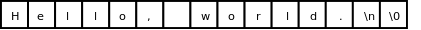

# 4. 字符串

之前我一直对字符串避而不谈，不做详细解释，现在已经具备了必要的基础知识，可以深入讨论一下字符串了。字符串可以看作一个数组，它的每个元素是字符型的，例如字符串 `"Hello, world.\n"` 图示如下：

<div align="center">

  

  <p><b>图 8.2. 字符串</b></p>

</div>

注意每个字符末尾都有一个字符 `'\0'` 做结束符，这里的 `\0` 是 ASCII 码的八进制表示，也就是 ASCII 码为 0 的 Null 字符，在 C 语言中这种字符串也称为以零结尾的字符串（Null-terminated String）。数组元素可以通过数组名加下标的方式访问，而字符串字面值也可以像数组名一样使用，可以加下标访问其中的字符：

```c
char c = "Hello, world.\n"[0];
```

但是通过下标修改其中的字符却是不允许的：

```c
"Hello, world.\n"[0] = 'A';
```

这行代码会产生编译错误，说字符串字面值是只读的，不允许修改。字符串字面值还有一点和数组名类似，做右值使用时自动转换成指向首元素的指针，在[第 3 节 “形参和实参”](ch03s03.md#func.paraarg)我们看到 `printf` 原型的第一个参数是指针类型，而 `printf("hello world")` 其实就是传一个指针参数给 `printf` 。

前面讲过数组可以像结构体一样初始化，如果是字符数组，也可以用一个字符串字面值来初始化：

```c
char str[10] = "Hello";
```

相当于：

```c
char str[10] = { 'H', 'e', 'l', 'l', 'o', '\0' };
```

`str ` 的后四个元素没有指定，自动初始化为 0，即 Null 字符。注意，虽然字符串字面值`"Hello" ` 是只读的，但用它初始化的数组`str ` 却是可读可写的。数组`str ` 中保存了一串字符，以`'\0' ` 结尾，也可以叫字符串。在本书中只要是以 Null 字符结尾的一串字符都叫字符串，不管是像`str ` 这样的数组，还是像`"Hello"` 这样的字符串字面值。

如果用于初始化的字符串字面值比数组还长，比如：

```c
char str[10] = "Hello, world.\n";
```

则数组 `str` 只包含字符串的前 10 个字符，不包含 Null 字符，这种情况编译器会给出警告。如果要用一个字符串字面值准确地初始化一个字符数组，最好的办法是不指定数组的长度，让编译器自己计算：

```c
char str[] = "Hello, world.\n";
```

字符串字面值的长度包括 Null 字符在内一共 15 个字符，编译器会确定数组 `str` 的长度为 15。

有一种情况需要特别注意，如果用于初始化的字符串字面值比数组刚好长出一个 Null 字符的长度，比如：

```c
char str[14] = "Hello, world.\n";
```

则数组 `str` 不包含 Null 字符，并且编译器不会给出警告，[\[C99 Rationale\]](bi01.md#bibli.rationale)说这样规定是为程序员方便，以前的很多编译器都是这样实现的，不管它有理没理，C 标准既然这么规定了我们也没办法，只能自己小心了。

补充一点， `printf` 函数的格式化字符串中可以用 `%s` 表示字符串的占位符。在学字符数组以前，我们用 `%s` 没什么意义，因为

```c
printf("string: %s\n", "Hello");
```

还不如写成

```c
printf("string: Hello\n");
```

但现在字符串可以保存在一个数组里面，用 `%s` 来打印就很有必要了：

```c
printf("string: %s\n", str);
```

`printf ` 会从数组`str ` 的开头一直打印到 Null 字符为止，Null 字符本身是 Non-printable 字符，不打印。这其实是一个危险的信号：如果数组`str ` 中没有 Null 字符，那么`printf` 函数就会访问数组越界，后果可能会很诡异：有时候打印出乱码，有时候看起来没错误，有时候引起程序崩溃。
