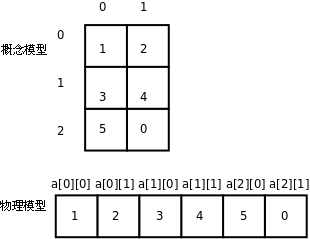
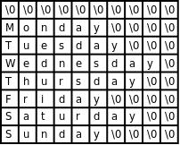

# 5. 多维数组

就像结构体可以嵌套一样，数组也可以嵌套，一个数组的元素可以是另外一个数组，这样就构成了多维数组（Multi-dimensional Array）。例如定义并初始化一个二维数组：

```c
int a[3][2] = { 1, 2, 3, 4, 5 };
```

数组 `a` 有 3 个元素， `a[0]` 、 `a[1]` 、 `a[2]` 。每个元素也是一个数组，例如 `a[0]` 是一个数组，它有两个元素 `a[0][0]` 、 `a[0][1]` ，这两个元素的类型是 `int` ，值分别是 1、2，同理，数组 `a[1]` 的两个元素是 3、4，数组 `a[2]` 的两个元素是 5、0。如下图所示：

<div align="center">

  

  <p><b>图 8.3. 多维数组</b></p>

</div>

从概念模型上看，这个二维数组是三行两列的表格，元素的两个下标分别是行号和列号。从物理模型上看，这六个元素在存储器中仍然是连续存储的，就像一维数组一样，相当于把概念模型的表格一行一行接起来拼成一串，C 语言的这种存储方式称为 Row-major 方式，而有些编程语言（例如 FORTRAN）是把概念模型的表格一列一列接起来拼成一串存储的，称为 Column-major 方式。

多维数组也可以像嵌套结构体一样用嵌套 Initializer 初始化，例如上面的二维数组也可以这样初始化：

```c
int a[][2] = { { 1, 2 },
		{ 3, 4 },
		{ 5, } };
```

注意，除了第一维的长度可以由编译器自动计算而不需要指定，其余各维都必须明确指定长度。利用 C99 的新特性也可以做 Memberwise Initialization，例如：

```c
int a[3][2] = { [0][1] = 9, [2][1] = 8 };
```

结构体和数组嵌套的情况也可以做 Memberwise Initialization，例如：

```c
struct complex_struct {
	double x, y;
} a[4] = { [0].x = 8.0 };

struct {
	double x, y;
	int count[4];
} s = { .count[2] = 9 };
```

如果是多维字符数组，也可以嵌套使用字符串字面值做 Initializer，例如：

**例 8.4. 多维字符数组**

```c
#include <stdio.h>

void print_day(int day)
{
	char days[8][10] = { "", "Monday", "Tuesday",
			     "Wednesday", "Thursday", "Friday",
			     "Saturday", "Sunday" };

	if (day < 1 || day > 7)
		printf("Illegal day number!\n");
	printf("%s\n", days[day]);
}

int main(void)
{
	print_day(2);
	return 0;
}
```

<div align="center">

  

  <p><b>图 8.4. 多维字符数组</b></p>

</div>

这个程序中定义了一个多维字符数组 `char days[8][10];` ，为了使 1~7 刚好映射到 `days[1]~days[7]` ，我们把 `days[0]` 空出来不用，所以第一维的长度是 8，为了使最长的字符串 `"Wednesday"` 能够保存到一行，末尾还能多出一个 Null 字符的位置，所以第二维的长度是 10。

这个程序和[例 4.1 “switch 语句”](ch04s04.md#cond.switch1)的功能其实是一样的，但是代码简洁多了。简洁的代码不仅可读性强，而且维护成本也低，像[例 4.1 “switch 语句”](ch04s04.md#cond.switch1)那样一堆 `case` 、 `printf` 和 `break` ，如果漏写一个 `break` 就要出 Bug。这个程序之所以简洁，是因为用数据代替了代码。具体来说，通过下标访问字符串组成的数组可以代替一堆 `case` 分支判断，这样就可以把每个 `case` 里重复的代码（ `printf` 调用）提取出来，从而又一次达到了“提取公因式”的效果。这种方法称为数据驱动的编程（Data-driven Programming），写代码最重要的是选择正确的数据结构来组织信息，设计控制流程和算法尚在其次，只要数据结构选择得正确，其它代码自然而然就变得容易理解和维护了，就像这里的 `printf` 自然而然就被提取出来了。[\[人月神话\]](bi01.md#bibli.manmonth)中说过：“Show me your flowcharts and conceal your tables, and I shall continue to be mystified. Show me your tables, and I won't usually need your flowcharts; they'll be obvious.”

最后，综合本章的知识，我们来写一个最简单的小游戏－－剪刀石头布：

**例 8.5. 剪刀石头布**

```c
#include <stdio.h>
#include <stdlib.h>
#include <time.h>

int main(void)
{
	char gesture[3][10] = { "scissor", "stone", "cloth" };
	int man, computer, result, ret;

	srand(time(NULL));
	while (1) {
		computer = rand() % 3;
	  	printf("\nInput your gesture (0-scissor 1-stone 2-cloth):\n");
		ret = scanf("%d", &man);
	  	if (ret != 1 || man < 0 || man > 2) {
			printf("Invalid input! Please input 0, 1 or 2.\n");
			continue;
		}
		printf("Your gesture: %s\tComputer's gesture: %s\n",
			gesture[man], gesture[computer]);

		result = (man - computer + 4) % 3 - 1;
		if (result > 0)
			printf("You win!\n");
		else if (result == 0)
			printf("Draw!\n");
		else
			printf("You lose!\n");
	}
	return 0;
}
```

0、1、2 三个整数分别是剪刀石头布在程序中的内部表示，用户也要求输入 0、1 或 2，然后和计算机随机生成的 0、1 或 2 比胜负。这个程序的主体是一个死循环，需要按 Ctrl-C 退出程序。以往我们写的程序都只有打印输出，在这个程序中我们第一次碰到处理用户输入的情况。我们简单介绍一下 `scanf` 函数的用法，到[第 2.9 节 “格式化 I/O 函数”](ch25s02.md#stdlib.formatio)再详细解释。 `scanf("%d", &man)` 这个调用的功能是等待用户输入一个整数并回车，这个整数会被 `scanf` 函数保存在 `man` 这个整型变量里。如果用户输入合法（输入的确实是数字而不是别的字符），则 `scanf` 函数返回 1，表示成功读入一个数据。但即使用户输入的是整数，我们还需要进一步检查是不是在 0~2 的范围内，写程序时对用户输入要格外小心，用户有可能输入任何数据，他才不管游戏规则是什么。

和 `printf` 类似， `scanf` 也可以用 `%c` 、 `%f` 、 `%s` 等转换说明。如果在传给 `scanf` 的第一个参数中用 `%d` 、 `%f` 或 `%c` 表示读入一个整数、浮点数或字符，则第二个参数的形式应该是&运算符加相应类型的变量名，表示读进来的数保存到这个变量中，&运算符的作用是得到一个指针类型，到[第 1 节 “指针的基本概念”](ch23s01.md#pointer.intro)再详细解释；如果在第一个参数中用 `%s` 读入一个字符串，则第二个参数应该是数组名，数组名前面不加&，因为数组类型做右值时自动转换成指针类型，在[第 2 节 “断点”](ch10s02.md#gdb.bp)有 `scanf` 读入字符串的例子。

留给读者思考的问题是： `(man - computer + 4) % 3 - 1` 这个神奇的表达式是如何比较出 0、1、2 这三个数字在“剪刀石头布”意义上的大小的？
