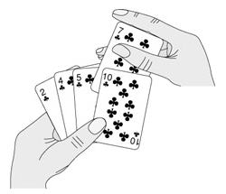

# 2. 插入排序

插入排序算法类似于玩扑克时抓牌的过程，玩家每拿到一张牌都要插入到手中已有的牌里，使之从小到大排好序。例如（该图出自[\[算法导论\]](bi01.md#bibli.algorithm)）：

<div align="center">

  

  <p><b>图 11.1. 扑克牌的插入排序</b></p>

</div>

也许你没有意识到，但其实你的思考过程是这样的：现在抓到一张 7，把它和手里的牌从右到左依次比较，7 比 10 小，应该再往左插，7 比 5 大，好，就插这里。为什么比较了 10 和 5 就可以确定 7 的位置？为什么不用再比较左边的 4 和 2 呢？因为这里有一个重要的前提：手里的牌已经是排好序的。现在我插了 7 之后，手里的牌仍然是排好序的，下次再抓到的牌还可以用这个方法插入。

编程对一个数组进行插入排序也是同样道理，但和插入扑克牌有一点不同，不可能在两个相邻的存储单元之间再插入一个单元，因此要将插入点之后的数据依次往后移动一个单元。排序算法如下：

**例 11.1. 插入排序**

```c
#include <stdio.h>

#define LEN 5
int a[LEN] = { 10, 5, 2, 4, 7 };

void insertion_sort(void)
{
	int i, j, key;
	for (j = 1; j < LEN; j++) {
		printf("%d, %d, %d, %d, %d\n",
		       a[0], a[1], a[2], a[3], a[4]);
		key = a[j];
		i = j - 1;
		while (i >= 0 && a[i] > key) {
			a[i+1] = a[i];
			i--;
		}
		a[i+1] = key;
	}
	printf("%d, %d, %d, %d, %d\n",
	       a[0], a[1], a[2], a[3], a[4]);
}

int main(void)
{
	insertion_sort();
	return 0;
}
```

为了更清楚地观察排序过程，我们在每次循环开头插了打印语句，在排序结束后也插了打印语句。程序运行结果是：

```text
10, 5, 2, 4, 7
5, 10, 2, 4, 7
2, 5, 10, 4, 7
2, 4, 5, 10, 7
2, 4, 5, 7, 10
```

如何严格证明这个算法是正确的？换句话说，只要反复执行该算法的 `for` 循环体，执行 `LEN-1` 次，就一定能把数组 `a` 排好序，而不管数组 `a` 的原始数据是什么，如何证明这一点呢？我们可以借助 Loop Invariant 的概念和数学归纳法来理解循环结构的算法，假如某个判断条件满足以下三条准则，它就称为 Loop Invariant：

1. 第一次执行循环体之前该判断条件为真。

2. 如果“第 N-1 次循环之后（或者说第 N 次循环之前）该判断条件为真”这个前提可以成立，那么就有办法证明第 N 次循环之后该判断条件仍为真。

3. 如果在所有循环结束后该判断条件为真，那么就有办法证明该算法正确地解决了问题。

只要我们找到这个 Loop Invariant，就可以证明一个循环结构的算法是正确的。上述插入排序算法的 Loop Invariant 是这样的判断条件：**第 `j` 次循环之前，子序列 a[0..j-1]是排好序的**。在上面的打印结果中，我把子序列 a[0..j-1]加粗表示。下面我们验证一下 Loop Invariant 的三条准则：

1. 第一次执行循环之前， `j=1` ，子序列 a[0..j-1]只有一个元素 `a[0]` ，只有一个元素的序列显然是排好序的。

2. 第 `j` 次循环之前，如果“子序列 a[0..j-1]是排好序的”这个前提成立，现在要把 `key=a[j]` 插进去，按照该算法的步骤，把 `a[j-1]` 、 `a[j-2]` 、 `a[j-3]` 等等比 `key` 大的元素都依次往后移一个，直到找到合适的位置给 `key` 插入，就能证明循环结束时子序列 a[0..j]是排好序的。就像插扑克牌一样，“手中已有的牌是排好序的”这个前提很重要，如果没有这个前提，就不能证明再插一张牌之后也是排好序的。

3. 当循环结束时， `j=LEN` ，如果“子序列 a[0..j-1]是排好序的”这个前提成立，那就是说 a[0..LEN-1]是排好序的，也就是说整个数组 `a` 的 `LEN` 个元素都排好序了。

可见，有了这三条，就可以用数学归纳法证明这个循环是正确的。这和[第 3 节 “递归”](ch05s03.md#func2.recursion)证明递归程序正确性的思想是一致的，这里的第一条就相当于递归的 Base Case，第二条就相当于递归的递推关系。这再次说明了递归和循环是等价的。
