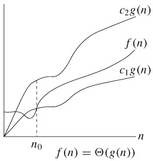
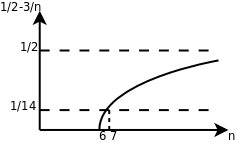

# 3. 算法的时间复杂度分析

解决同一个问题可以有很多种算法，比较评价算法的好坏，一个重要的标准就是算法的时间复杂度。现在研究一下插入排序算法的执行时间，按照习惯，输入长度 `LEN` 以下用 n 表示。设循环中各条语句的执行时间分别是 c1、c2、c3、c4、c5 这样五个常数[^23]：

```c
void insertion_sort(void)			执行时间
{
	int i, j, key;
	for (j = 1; j < LEN; j++) {
		key = a[j];			c1
		i = j - 1;			c2
		while (i >= 0 && a[i] > key) {
			a[i+1] = a[i];		c3
			i--;			c4
		}
		a[i+1] = key;			c5
	}
}
```

显然外层 `for` 循环的执行次数是 n-1 次，假设内层的 `while` 循环执行 m 次，则总的执行时间粗略估计是(n-1)*(c1+c2+c5+m*(c3+c4))。当然， `for` 和 `while` 后面()括号中的赋值和条件判断的执行也需要时间，而我没有设一个常数来表示，这不影响我们的粗略估计。

这里有一个问题，m 不是个常数，也不取决于输入长度 n，而是取决于具体的输入数据。在最好情况下，数组 `a` 的原始数据已经排好序了， `while` 循环一次也不执行，总的执行时间是(c1+c2+c5)*n-(c1+c2+c5)，可以表示成 an+b 的形式，是 n 的线性函数（Linear Function）。那么在最坏情况（Worst Case）下又如何呢？所谓最坏情况是指数组 `a` 的原始数据正好是从大到小排好序的，请读者想一想为什么这是最坏情况，然后把上式中的 m 替换掉算一下执行时间是多少。

数组 `a` 的原始数据属于最好和最坏情况的都比较少见，如果原始数据是随机的，可称为平均情况（Average Case）。如果原始数据是随机的，那么每次循环将已排序的子序列 a[1..j-1]与新插入的元素 `key` 相比较，子序列中平均都有一半的元素比 `key` 大而另一半比 `key` 小，请读者把上式中的 m 替换掉算一下执行时间是多少。最后的结论应该是：在最坏情况和平均情况下，总的执行时间都可以表示成 an2+bn+c 的形式，是 n 的二次函数（Quadratic Function）。

在分析算法的时间复杂度时，我们更关心最坏情况而不是最好情况，理由如下：

1. 最坏情况给出了算法执行时间的上界，我们可以确信，无论给什么输入，算法的执行时间都不会超过这个上界，这样为比较和分析提供了便利。

2. 对于某些算法，最坏情况是最常发生的情况，例如在数据库中查找某个信息的算法，最坏情况就是数据库中根本不存在该信息，都找遍了也没有，而某些应用场合经常要查找一个信息在数据库中存在不存在。

3. 虽然最坏情况是一种悲观估计，但是对于很多问题，平均情况和最坏情况的时间复杂度差不多，比如插入排序这个例子，平均情况和最坏情况的时间复杂度都是输入长度 n 的二次函数。

比较两个多项式 a1n+b1 和 a2n2+b2n+c2 的值（n 取正整数）可以得出结论：n 的最高次指数是最主要的决定因素，常数项、低次幂项和系数都是次要的。比如 100n+1 和 n2+1，虽然后者的系数小，当 n 较小时前者的值较大，但是当 n>100 时，后者的值就远远大于前者了。如果同一个问题可以用两种算法解决，其中一种算法的时间复杂度为线性函数，另一种算法的时间复杂度为二次函数，当问题的输入长度 n 足够大时，前者明显优于后者。因此我们可以用一种更粗略的方式表示算法的时间复杂度，把系数和低次幂项都省去，线性函数记作Θ(n)，二次函数记作Θ(n2)。

Θ(g(n))表示和 g(n)同一量级的一类函数，例如所有的二次函数 f(n)都和 g(n)=n2 属于同一量级，都可以用Θ(n2)来表示，甚至有些不是二次函数的也和 n2 属于同一量级，例如 2n2+3lgn。“同一量级”这个概念可以用下图来说明（该图出自[\[算法导论\]](bi01.md#bibli.algorithm)）：

<div align="center">

  

  <p><b>图 11.2. Θ-notation</b></p>

</div>

如果可以找到两个正的常数 c1 和 c2，使得 n 足够大的时候（也就是 n≥n0 的时候）f(n)总是夹在 c1g(n)和 c2g(n)之间，就说 f(n)和 g(n)是同一量级的，f(n)就可以用Θ(g(n))来表示。

以二次函数为例，比如 1/2n2-3n，要证明它是属于Θ(n2)这个集合的，我们必须确定 c1、c2 和 n0，这些常数不随 n 改变，并且当 n≥n0 以后，c1n2≤1/2n2-3n≤c2n2 总是成立的。为此我们从不等式的每一边都除以 n2，得到 c1≤1/2-3/n≤c2。见下图：

<div align="center">

  

  <p><b>图 11.3. 1/2-3/n</b></p>

</div>

这样就很容易看出来，无论 n 取多少，该函数一定小于 1/2，因此 c2=1/2，当 n=6 时函数值为 0，n>6 时该函数都大于 0，可以取 n0=7，c1=1/14，这样当 n≥n0 时都有 1/2-3/n≥c1。通过这个证明过程可以得出结论，当 n 足够大时任何 an2+bn+c 都夹在 c1n2 和 c2n2 之间，相对于 n2 项来说 bn+c 的影响可以忽略，a 可以通过选取合适的 c1、c2 来补偿。

几种常见的时间复杂度函数按数量级从小到大的顺序依次是：Θ(lgn)，Θ(sqrt(n))，Θ(n)，Θ(nlgn)，Θ(n2)，Θ(n3)，Θ(2n)，Θ(n!)。其中，lgn 通常表示以 10 为底 n 的对数，但是对于Θ-notation 来说，Θ(lgn)和Θ(log2n)并无区别（想一想这是为什么），在算法分析中 lgn 通常表示以 2 为底 n 的对数。可是什么算法的时间复杂度里会出现 lgn 呢？回顾插入排序的时间复杂度分析，无非是循环体的执行时间乘以循环次数，只有加和乘运算，怎么会出来 lg 呢？下一节归并排序的时间复杂度里面就有 lg，请读者留心 lg 运算是从哪出来的。

除了Θ-notation 之外，表示算法的时间复杂度常用的还有一种 Big-O notation。我们知道插入排序在最坏情况和平均情况下时间复杂度是Θ(n2)，在最好情况下是Θ(n)，数量级比Θ(n2)要小，那么总结起来在各种情况下插入排序的时间复杂度是 O(n2)。Θ的含义和“等于”类似，而大 O 的含义和“小于等于”类似。

[^23]: 受内存管理机制的影响，指令的执行时间不一定是常数，但执行时间的上界（Upper Bound）肯定是常数，我们这里假设语句的执行时间是常数只是一个粗略估计。
