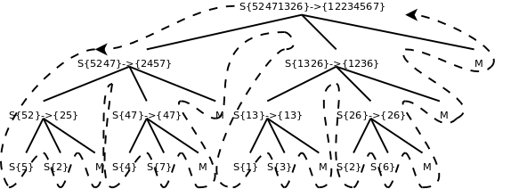

# 4. 归并排序

插入排序算法采取增量式（Incremental）的策略解决问题，每次添一个元素到已排序的子序列中，逐渐将整个数组排序完毕，它的时间复杂度是 O(n2)。下面介绍另一种典型的排序算法－－归并排序，它采取分而治之（Divide-and-Conquer）的策略，时间复杂度是Θ(nlgn)。归并排序的步骤如下：

1. Divide: 把长度为 n 的输入序列分成两个长度为 n/2 的子序列。

2. Conquer: 对这两个子序列分别采用归并排序。

3. Combine: 将两个排序好的子序列合并成一个最终的排序序列。

在描述归并排序的步骤时又调用了归并排序本身，可见这是一个递归的过程。

**例 11.2. 归并排序**

```c
#include <stdio.h>

#define LEN 8
int a[LEN] = { 5, 2, 4, 7, 1, 3, 2, 6 };

void merge(int start, int mid, int end)
{
	int n1 = mid - start + 1;
	int n2 = end - mid;
	int left[n1], right[n2];
	int i, j, k;

	for (i = 0; i < n1; i++) /* left holds a[start..mid] */
		left[i] = a[start+i];
	for (j = 0; j < n2; j++) /* right holds a[mid+1..end] */
		right[j] = a[mid+1+j];

	i = j = 0;
	k = start;
	while (i < n1 && j < n2)
		if (left[i] < right[j])
			a[k++] = left[i++];
		else
			a[k++] = right[j++];

	while (i < n1) /* left[] is not exhausted */
		a[k++] = left[i++];
	while (j < n2) /* right[] is not exhausted */
		a[k++] = right[j++];
}

void sort(int start, int end)
{
	int mid;
	if (start < end) {
		mid = (start + end) / 2;
		printf("sort (%d-%d, %d-%d) %d %d %d %d %d %d %d %d\n",
		       start, mid, mid+1, end,
		       a[0], a[1], a[2], a[3], a[4], a[5], a[6], a[7]);
		sort(start, mid);
		sort(mid+1, end);
		merge(start, mid, end);
		printf("merge (%d-%d, %d-%d) to %d %d %d %d %d %d %d %d\n",
		       start, mid, mid+1, end,
		       a[0], a[1], a[2], a[3], a[4], a[5], a[6], a[7]);
	}
}

int main(void)
{
	sort(0, LEN-1);
	return 0;
}
```

执行结果是：

```text
sort (0-3, 4-7) 5 2 4 7 1 3 2 6
sort (0-1, 2-3) 5 2 4 7 1 3 2 6
sort (0-0, 1-1) 5 2 4 7 1 3 2 6
merge (0-0, 1-1) to 2 5 4 7 1 3 2 6
sort (2-2, 3-3) 2 5 4 7 1 3 2 6
merge (2-2, 3-3) to 2 5 4 7 1 3 2 6
merge 0-1, 2-3) to 2 4 5 7 1 3 2 6
sort (4-5, 6-7) 2 4 5 7 1 3 2 6
sort (4-4, 5-5) 2 4 5 7 1 3 2 6
merge (4-4, 5-5) to 2 4 5 7 1 3 2 6
sort (6-6, 7-7) 2 4 5 7 1 3 2 6
merge (6-6, 7-7) to 2 4 5 7 1 3 2 6
merge (4-5, 6-7) to 2 4 5 7 1 2 3 6
merge (0-3, 4-7) to 1 2 2 3 4 5 6 7
```

`sort ` 函数把 a[start..end]平均分成两个子序列，分别是 a[start..mid]和 a[mid+1..end]，对这两个子序列分别递归调用`sort ` 函数进行排序，然后调用`merge ` 函数将排好序的两个子序列合并起来，由于两个子序列都已经排好序了，合并的过程很简单，每次循环取两个子序列中最小的元素进行比较，将较小的元素取出放到最终的排序序列中，如果其中一个子序列的元素已取完，就把另一个子序列剩下的元素都放到最终的排序序列中。为了便于理解程序，我在`sort` 函数开头和结尾插了打印语句，可以看出调用过程是这样的：

<div align="center">

  

  <p><b>图 11.4. 归并排序调用过程</b></p>

</div>

图中 S 表示 `sort` 函数，M 表示 `merge` 函数，整个控制流程沿虚线所示的方向调用和返回。由于 `sort` 函数递归调用了自己两次，所以各函数之间的调用关系呈树状结构。画这个图只是为了清楚地展现归并排序的过程，读者在理解递归函数时一定不要全部展开来看，而是要抓住 Base Case 和递推关系来理解。我们分析一下归并排序的时间复杂度，以下分析出自[\[算法导论\]](bi01.md#bibli.algorithm)。

首先分析 `merge` 函数的时间复杂度。在 `merge` 函数中演示了 C99 的新特性－－可变长数组，当然也可以避免使用这一特性，比如把 `left` 和 `right` 都按最大长度 `LEN` 分配。不管用哪种办法，定义数组并分配存储空间的执行时间都可以看作常数，与数组的长度无关，常数用Θ-notation 记作Θ(1)。设子序列 a[start..mid]的长度为 `n1` ，子序列[mid+1..end]的长度为 `n2` ，a[start..end]的总长度为 n=n1+n2，则前两个 `for` 循环的执行时间是Θ(n1+n2)，也就是Θ(n)，后面三个 `for` 循环合在一起看，每走一次循环就会在最终的排序序列中确定一个元素，最终的排序序列共有 n 个元素，所以执行时间也是Θ(n)。两个Θ(n)再加上若干常数项， `merge` 函数总的执行时间仍是Θ(n)，其中 n=end-start+1。

然后分析 `sort` 函数的时间复杂度，当输入长度 n=1，也就是 `start==end` 时， `if` 条件不成立，执行时间为常数Θ(1)，当输入长度 n>1 时：

```text
总的执行时间 = 2 × 输入长度为 n/2 的 sort 函数的执行时间 + merge 函数的执行时间Θ(n)
```

设输入长度为 n 的 `sort` 函数的执行时间为 T(n)，综上所述：

这是一个递推公式（Recurrence），我们需要消去等号右侧的 T(n)，把 T(n)写成 n 的函数。其实符合一定条件的 Recurrence 的展开有数学公式可以套，这里我们略去严格的数学证明，只是从直观上看一下这个递推公式的结果。当 n=1 时可以设 T(1)=c1，当 n>1 时可以设 T(n)=2T(n/2)+c2n，我们取 c1 和 c2 中较大的一个设为 c，把原来的公式改为：

这样计算出的结果应该是 T(n)的上界。下面我们把 T(n/2)展开成 2T(n/4)+cn/2（下图中的(c)），然后再把 T(n/4)进一步展开，直到最后全部变成 T(1)=c（下图中的(d)）：

把图(d)中所有的项加起来就是总的执行时间。这是一个树状结构，每一层的和都是 cn，共有 lgn+1 层，因此总的执行时间是 cnlgn+cn，相比 nlgn 来说，cn 项可以忽略，因此 T(n)的上界是Θ(nlgn)。

如果先前取 c1 和 c2 中较小的一个设为 c，计算出的结果应该是 T(n)的下界，然而推导过程一样，结果也是Θ(nlgn)。既然 T(n)的上下界都是Θ(nlgn)，显然 T(n)就是Θ(nlgn)。

和插入排序的平均情况相比归并排序更快一些，虽然 `merge` 函数的步骤较多，引入了较大的常数、系数和低次项，但是对于较大的输入长度 n，这些都不是主要因素，归并排序的时间复杂度是Θ(nlgn)，而插入排序的平均情况是Θ(n2)，这就决定了归并排序是更快的算法。但是不是任何情况下归并排序都优于插入排序呢？哪些情况适用插入排序而不适用归并排序？留给读者思考。

## 习题

1、快速排序是另外一种采用分而治之策略的排序算法，在平均情况下的时间复杂度也是Θ(nlgn)，但比归并排序有更小的时间常数。它的基本思想是这样的：

```c
int partition(int start, int end)
{
	从 a[start..end]中选取一个 pivot 元素（比如选 a[start]为 pivot）;
	在一个循环中移动 a[start..end]的数据，将 a[start..end]分成两半，
	使 a[start..mid-1]比 pivot 元素小，a[mid+1..end]比 pivot 元素大，而 a[mid]就是 pivot 元素;
	return mid;
}

void quicksort(int start, int end)
{
	int mid;
	if (end > start) {
		mid = partition(start, end);
		quicksort(start, mid-1);
		quicksort(mid+1, end);
	}
}
```

请补完 `partition` 函数，这个函数有多种写法，请选择时间常数尽可能小的实现方法。想想快速排序在最好和最坏情况下的时间复杂度是多少？快速排序在平均情况下的时间复杂度分析起来比较复杂，有兴趣的读者可以参考[\[算法导论\]](bi01.md#bibli.algorithm)。
