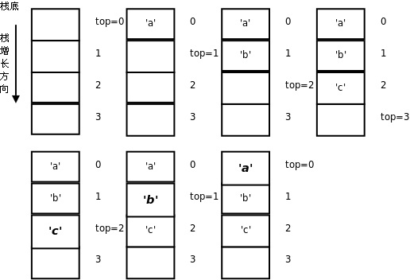

# 2. 堆栈

在[第 3 节 “递归”](ch05s03.md#func2.recursion)中我们已经对堆栈这种数据结构有了初步认识。堆栈是一组元素的集合，类似于数组，不同之处在于，数组可以按下标随机访问，这次访问 `a[5]` 下次可以访问 `a[1]` ，但是堆栈的访问规则被限制为 Push 和 Pop 两种操作，Push（入栈或压栈）向栈顶添加元素，Pop（出栈或弹出）则取出当前栈顶的元素，也就是说，只能访问栈顶元素而不能访问栈中其它元素。如果所有元素的类型相同，堆栈的存储也可以用数组来实现，访问操作可以通过函数接口提供。看以下的示例程序。

**例 12.1. 用堆栈实现倒序打印**

```c
#include <stdio.h>

char stack[512];
int top = 0;

void push(char c)
{
	stack[top++] = c;
}

char pop(void)
{
	return stack[--top];
}

int is_empty(void)
{
	return top == 0;
}

int main(void)
{
	push('a');
	push('b');
	push('c');

	while(!is_empty())
		putchar(pop());
	putchar('\n');

	return 0;
}
```

运行结果是 `cba` 。运行过程图示如下：

<div align="center">

  

  <p><b>图 12.1. 用堆栈实现倒序打印</b></p>

</div>

数组 `stack` 是堆栈的存储空间，变量 `top` 总是保存数组中栈顶的下一个元素的下标，我们说“ `top` 总是指向栈顶的下一个元素”，或者把 `top` 叫做栈顶指针（Pointer）。在[第 2 节 “插入排序”](ch11s02.md#sortsearch.insertion)中介绍了 Loop Invariant 的概念，可以用它检验循环的正确性，这里的“ `top` 总是指向栈顶的下一个元素”其实也是一种 Invariant，Push 和 Pop 操作总是维持这个条件不变，这种 Invariant 描述的对象是一个数据结构而不是一个循环，在 DbC 中称为 Class Invariant。Pop 操作的语义是取出栈顶元素，但上例的实现其实并没有清除原来的栈顶元素，只是把 `top` 指针移动了一下，原来的栈顶元素仍然存在那里，这就足够了，因为此后通过 Push 和 Pop 操作不可能再访问到已经取出的元素，下次 Push 操作就会覆盖它。 `putchar` 函数的作用是把一个字符打印到屏幕上，和 `printf` 的 `%c` 作用相同。布尔函数 `is_empty` 的作用是防止 Pop 操作访问越界。这里我们预留了足够大的栈空间（512 个元素），其实严格来说 Push 操作之前也应该检查栈是否满了。

在 `main` 函数中，入栈的顺序是 `'a'` 、 `'b'` 、 `'c'` ，而出栈打印的顺序却是 `'c'` 、 `'b'` 、 `'a'` ，最后入栈的 `'c'` 最早出来，因此堆栈这种数据结构的特点可以概括为 LIFO（Last In First Out，后进先出）。我们也可以写一个递归函数做倒序打印，利用函数调用的栈帧实现后进先出：

**例 12.2. 用递归实现倒序打印**

```c
#include <stdio.h>
#define LEN 3

char buf[LEN]={'a', 'b', 'c'};

void print_backward(int pos)
{
     if(pos == LEN)
	  return;
     print_backward(pos+1);
     putchar(buf[pos]);
}

int main(void)
{
     print_backward(0);
     putchar('\n');

     return 0;
}
```

也许你会说，又是堆栈又是递归的，倒序打印一个数组犯得着这么大动干戈吗？写一个简单的循环不就行了：

```c
for (i = LEN-1; i >= 0; i--)
	putchar(buf[i]);
```

对于数组来说确实没必要搞这么复杂，因为数组既可以从前向后访问也可以从后向前访问，甚至可以随机访问，但有些数据结构的访问并没有这么自由，下一节你就会看到这样的数据结构。
