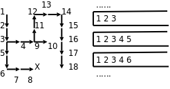

# 3. 深度优先搜索

现在我们用堆栈解决一个有意思的问题，定义一个二维数组：

```c
int maze[5][5] = {
	0, 1, 0, 0, 0,
	0, 1, 0, 1, 0,
	0, 0, 0, 0, 0,
	0, 1, 1, 1, 0,
	0, 0, 0, 1, 0,
};
```

它表示一个迷宫，其中的 1 表示墙壁，0 表示可以走的路，只能横着走或竖着走，不能斜着走，要求编程序找出从左上角到右下角的路线。程序如下：

**例 12.3. 用深度优先搜索解迷宫问题**

```c
#include <stdio.h>

#define MAX_ROW 5
#define MAX_COL 5

struct point { int row, col; } stack[512];
int top = 0;

void push(struct point p)
{
	stack[top++] = p;
}

struct point pop(void)
{
	return stack[--top];
}

int is_empty(void)
{
	return top == 0;
}

int maze[MAX_ROW][MAX_COL] = {
	0, 1, 0, 0, 0,
	0, 1, 0, 1, 0,
	0, 0, 0, 0, 0,
	0, 1, 1, 1, 0,
	0, 0, 0, 1, 0,
};

void print_maze(void)
{
	int i, j;
	for (i = 0; i < MAX_ROW; i++) {
		for (j = 0; j < MAX_COL; j++)
			printf("%d ", maze[i][j]);
		putchar('\n');
	}
	printf("*********\n");
}

struct point predecessor[MAX_ROW][MAX_COL] = {
	{{-1,-1}, {-1,-1}, {-1,-1}, {-1,-1}, {-1,-1}},
	{{-1,-1}, {-1,-1}, {-1,-1}, {-1,-1}, {-1,-1}},
	{{-1,-1}, {-1,-1}, {-1,-1}, {-1,-1}, {-1,-1}},
	{{-1,-1}, {-1,-1}, {-1,-1}, {-1,-1}, {-1,-1}},
	{{-1,-1}, {-1,-1}, {-1,-1}, {-1,-1}, {-1,-1}},
};

void visit(int row, int col, struct point pre)
{
	struct point visit_point = { row, col };
	maze[row][col] = 2;
	predecessor[row][col] = pre;
	push(visit_point);
}

int main(void)
{
	struct point p = { 0, 0 };

	maze[p.row][p.col] = 2;
	push(p);

	while (!is_empty()) {
		p = pop();
		if (p.row == MAX_ROW - 1  /* goal */
		    && p.col == MAX_COL - 1)
			break;
		if (p.col+1 < MAX_COL     /* right */
		    && maze[p.row][p.col+1] == 0)
			visit(p.row, p.col+1, p);
		if (p.row+1 < MAX_ROW     /* down */
		    && maze[p.row+1][p.col] == 0)
			visit(p.row+1, p.col, p);
		if (p.col-1 >= 0          /* left */
		    && maze[p.row][p.col-1] == 0)
			visit(p.row, p.col-1, p);
		if (p.row-1 >= 0          /* up */
		    && maze[p.row-1][p.col] == 0)
			visit(p.row-1, p.col, p);
		print_maze();
	}
	if (p.row == MAX_ROW - 1 && p.col == MAX_COL - 1) {
		printf("(%d, %d)\n", p.row, p.col);
		while (predecessor[p.row][p.col].row != -1) {
			p = predecessor[p.row][p.col];
			printf("(%d, %d)\n", p.row, p.col);
		}
	} else
		printf("No path!\n");

	return 0;
}
```

运行结果如下：

```text
2 1 0 0 0
2 1 0 1 0
0 0 0 0 0
0 1 1 1 0
0 0 0 1 0
*********
2 1 0 0 0
2 1 0 1 0
2 0 0 0 0
0 1 1 1 0
0 0 0 1 0
*********
2 1 0 0 0
2 1 0 1 0
2 2 0 0 0
2 1 1 1 0
0 0 0 1 0
*********
2 1 0 0 0
2 1 0 1 0
2 2 0 0 0
2 1 1 1 0
2 0 0 1 0
*********
2 1 0 0 0
2 1 0 1 0
2 2 0 0 0
2 1 1 1 0
2 2 0 1 0
*********
2 1 0 0 0
2 1 0 1 0
2 2 0 0 0
2 1 1 1 0
2 2 2 1 0
*********
2 1 0 0 0
2 1 0 1 0
2 2 0 0 0
2 1 1 1 0
2 2 2 1 0
*********
2 1 0 0 0
2 1 0 1 0
2 2 2 0 0
2 1 1 1 0
2 2 2 1 0
*********
2 1 0 0 0
2 1 2 1 0
2 2 2 2 0
2 1 1 1 0
2 2 2 1 0
*********
2 1 2 0 0
2 1 2 1 0
2 2 2 2 0
2 1 1 1 0
2 2 2 1 0
*********
2 1 2 2 0
2 1 2 1 0
2 2 2 2 0
2 1 1 1 0
2 2 2 1 0
*********
2 1 2 2 2
2 1 2 1 0
2 2 2 2 0
2 1 1 1 0
2 2 2 1 0
*********
2 1 2 2 2
2 1 2 1 2
2 2 2 2 0
2 1 1 1 0
2 2 2 1 0
*********
2 1 2 2 2
2 1 2 1 2
2 2 2 2 2
2 1 1 1 0
2 2 2 1 0
*********
2 1 2 2 2
2 1 2 1 2
2 2 2 2 2
2 1 1 1 2
2 2 2 1 0
*********
2 1 2 2 2
2 1 2 1 2
2 2 2 2 2
2 1 1 1 2
2 2 2 1 2
*********
(4, 4)
(3, 4)
(2, 4)
(1, 4)
(0, 4)
(0, 3)
(0, 2)
(1, 2)
(2, 2)
(2, 1)
(2, 0)
(1, 0)
(0, 0)
```

这次堆栈里的元素是结构体类型的，用来表示迷宫中一个点的 x 和 y 座标。我们用一个新的数据结构保存走迷宫的路线，每个走过的点都有一个前趋（Predecessor）点，表示是从哪儿走到当前点的，比如 `predecessor[4][4]` 是座标为(3, 4)的点，就表示从(3, 4)走到了(4, 4)，一开始 `predecessor` 的各元素初始化为无效座标(-1, -1)。在迷宫中探索路线的同时就把路线保存在 `predecessor` 数组中，已经走过的点在 `maze` 数组中记为 2 防止重复走，最后找到终点时就根据 `predecessor` 数组保存的路线从终点打印到起点。为了帮助理解，我把这个算法改写成伪代码（Pseudocode）如下：

```c
将起点标记为已走过并压栈;
while (栈非空) {
	从栈顶弹出一个点 p;
	if (p 这个点是终点)
		break;
	否则沿右、下、左、上四个方向探索相邻的点
	if (和 p 相邻的点有路可走，并且还没走过)
		将相邻的点标记为已走过并压栈，它的前趋就是 p 点;
}
if (p 点是终点) {
	打印 p 点的座标;
	while (p 点有前趋) {
		p 点 = p 点的前趋;
		打印 p 点的座标;
	}
} else
	没有路线可以到达终点;
```

我在 `while` 循环的末尾插了打印语句，每探索一步都打印出当前迷宫的状态（标记了哪些点），从打印结果可以看出这种搜索算法的特点是：每次探索完各个方向相邻的点之后，取其中一个相邻的点走下去，一直走到无路可走了再退回来，取另一个相邻的点再走下去。这称为深度优先搜索（DFS，Depth First Search）。探索迷宫和堆栈变化的过程如下图所示。

<div align="center">

  

  <p><b>图 12.2. 深度优先搜索</b></p>

</div>

图中各点的编号表示探索顺序，堆栈中保存的应该是座标，我在画图时为了直观就把各点的编号写在堆栈里了。可见正是堆栈后进先出的性质使这个算法具有了深度优先的特点。如果在探索问题的解时走进了死胡同，则需要退回来从另一条路继续探索，这种思想称为回溯（Backtrack），一个典型的例子是很多编程书上都会讲的八皇后问题。

最后我们打印终点的座标并通过 `predecessor` 数据结构找到它的前趋，这样顺藤摸瓜一直打印到起点。那么能不能从起点到终点正向打印路线呢？在上一节我们看到，数组支持随机访问也支持顺序访问，如果在一个循环里打印数组，既可以正向打印也可以反向打印。但 `predecessor` 这种数据结构却有很多限制：

1. 不能随机访问一条路线上的任意点，只能通过一个点找到另一个点，通过另一个点再找第三个点，因此只能顺序访问。

2. 每个点只知道它的前趋是谁，而不知道它的后继（Successor）是谁，所以只能反向顺序访问。

可见，**有什么样的数据结构就决定了可以用什么样的算法**。那为什么不再建一个 `successor` 数组来保存每个点的后继呢？从 DFS 算法的过程可以看出，虽然每个点的前趋只有一个，后继却不止一个，如果我们为每个点只保存一个后继，则无法保证这个后继指向正确的路线。由此可见，**有什么样的算法就决定了可以用什么样的数据结构**。设计算法和设计数据结构这两件工作是紧密联系的。

## 习题

1、修改本节的程序，要求从起点到终点正向打印路线。你能想到几种办法？

2、本节程序中 `predecessor` 这个数据结构占用的存储空间太多了，改变它的存储方式可以节省空间，想想该怎么改。

3、上一节我们实现了一个基于堆栈的程序，然后改写成递归程序，用函数调用的栈帧替代自己实现的堆栈。本节的 DFS 算法也是基于堆栈的，请把它改写成递归程序，这样改写可以避免使用 `predecessor` 数据结构，想想该怎么做。
