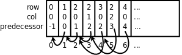
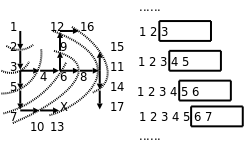

# 4. 队列与广度优先搜索

队列也是一组元素的集合，也提供两种基本操作：Enqueue（入队）将元素添加到队尾，Dequeue（出队）从队头取出元素并返回。就像排队买票一样，先来先服务，先入队的人也是先出队的，这种方式称为 FIFO（First In First Out，先进先出），有时候队列本身也被称为 FIFO。

下面我们用队列解决迷宫问题。程序如下：

**例 12.4. 用广度优先搜索解迷宫问题**

```c
#include <stdio.h>

#define MAX_ROW 5
#define MAX_COL 5

struct point { int row, col, predecessor; } queue[512];
int head = 0, tail = 0;

void enqueue(struct point p)
{
	queue[tail++] = p;
}

struct point dequeue(void)
{
	return queue[head++];
}

int is_empty(void)
{
	return head == tail;
}

int maze[MAX_ROW][MAX_COL] = {
	0, 1, 0, 0, 0,
	0, 1, 0, 1, 0,
	0, 0, 0, 0, 0,
	0, 1, 1, 1, 0,
	0, 0, 0, 1, 0,
};

void print_maze(void)
{
	int i, j;
	for (i = 0; i < MAX_ROW; i++) {
		for (j = 0; j < MAX_COL; j++)
			printf("%d ", maze[i][j]);
		putchar('\n');
	}
	printf("*********\n");
}

void visit(int row, int col)
{
	struct point visit_point = { row, col, head-1 };
	maze[row][col] = 2;
	enqueue(visit_point);
}

int main(void)
{
	struct point p = { 0, 0, -1 };

	maze[p.row][p.col] = 2;
	enqueue(p);

	while (!is_empty()) {
		p = dequeue();
		if (p.row == MAX_ROW - 1  /* goal */
		    && p.col == MAX_COL - 1)
			break;
		if (p.col+1 < MAX_COL     /* right */
		    && maze[p.row][p.col+1] == 0)
			visit(p.row, p.col+1);
		if (p.row+1 < MAX_ROW     /* down */
		    && maze[p.row+1][p.col] == 0)
			visit(p.row+1, p.col);
		if (p.col-1 >= 0          /* left */
		    && maze[p.row][p.col-1] == 0)
			visit(p.row, p.col-1);
		if (p.row-1 >= 0          /* up */
		    && maze[p.row-1][p.col] == 0)
			visit(p.row-1, p.col);
		print_maze();
	}
	if (p.row == MAX_ROW - 1 && p.col == MAX_COL - 1) {
		printf("(%d, %d)\n", p.row, p.col);
		while (p.predecessor != -1) {
			p = queue[p.predecessor];
			printf("(%d, %d)\n", p.row, p.col);
		}
	} else
		printf("No path!\n");

	return 0;
}
```

运行结果如下：

```text
2 1 0 0 0
2 1 0 1 0
0 0 0 0 0
0 1 1 1 0
0 0 0 1 0
*********
2 1 0 0 0
2 1 0 1 0
2 0 0 0 0
0 1 1 1 0
0 0 0 1 0
*********
2 1 0 0 0
2 1 0 1 0
2 2 0 0 0
2 1 1 1 0
0 0 0 1 0
*********
2 1 0 0 0
2 1 0 1 0
2 2 2 0 0
2 1 1 1 0
0 0 0 1 0
*********
2 1 0 0 0
2 1 0 1 0
2 2 2 0 0
2 1 1 1 0
2 0 0 1 0
*********
2 1 0 0 0
2 1 2 1 0
2 2 2 2 0
2 1 1 1 0
2 0 0 1 0
*********
2 1 0 0 0
2 1 2 1 0
2 2 2 2 0
2 1 1 1 0
2 2 0 1 0
*********
2 1 0 0 0
2 1 2 1 0
2 2 2 2 2
2 1 1 1 0
2 2 0 1 0
*********
2 1 2 0 0
2 1 2 1 0
2 2 2 2 2
2 1 1 1 0
2 2 0 1 0
*********
2 1 2 0 0
2 1 2 1 0
2 2 2 2 2
2 1 1 1 0
2 2 2 1 0
*********
2 1 2 0 0
2 1 2 1 2
2 2 2 2 2
2 1 1 1 2
2 2 2 1 0
*********
2 1 2 2 0
2 1 2 1 2
2 2 2 2 2
2 1 1 1 2
2 2 2 1 0
*********
2 1 2 2 0
2 1 2 1 2
2 2 2 2 2
2 1 1 1 2
2 2 2 1 0
*********
2 1 2 2 0
2 1 2 1 2
2 2 2 2 2
2 1 1 1 2
2 2 2 1 2
*********
2 1 2 2 2
2 1 2 1 2
2 2 2 2 2
2 1 1 1 2
2 2 2 1 2
*********
2 1 2 2 2
2 1 2 1 2
2 2 2 2 2
2 1 1 1 2
2 2 2 1 2
*********
(4, 4)
(3, 4)
(2, 4)
(2, 3)
(2, 2)
(2, 1)
(2, 0)
(1, 0)
(0, 0)
```

其实仍然可以像[例 12.3 “用深度优先搜索解迷宫问题”](ch12s03.md#stackqueue.dfs)一样用 `predecessor` 数组表示每个点的前趋，但我想换一种更方便的数据结构，直接在每个点的结构体中加一个成员表示前趋：

```c
struct point { int row, col, predecessor; } queue[512];
int head = 0, tail = 0;
```

变量 `head` 和 `tail` 是队头和队尾指针， `head` 总是指向队头， `tail` 总是指向队尾的下一个元素。每个点的 `predecessor` 成员也是一个指针，指向它的前趋在 `queue` 数组中的位置。如下图所示：

<div align="center">

  

  <p><b>图 12.3. 广度优先搜索的队列数据结构</b></p>

</div>

为了帮助理解，我把这个算法改写成伪代码如下：

```c
将起点标记为已走过并入队;
while (队列非空) {
	出队一个点 p;
	if (p 这个点是终点)
		break;
	否则沿右、下、左、上四个方向探索相邻的点
	if (和 p 相邻的点有路可走，并且还没走过)
		将相邻的点标记为已走过并入队，它的前趋就是刚出队的 p 点;
}
if (p 点是终点) {
	打印 p 点的座标;
	while (p 点有前趋) {
		p 点 = p 点的前趋;
		打印 p 点的座标;
	}
} else
	没有路线可以到达终点;
```

从打印的搜索过程可以看出，这个算法的特点是沿各个方向同时展开搜索，每个可以走通的方向轮流往前走一步，这称为广度优先搜索（BFS，Breadth First Search）。探索迷宫和队列变化的过程如下图所示。

<div align="center">

  

  <p><b>图 12.4. 广度优先搜索</b></p>

</div>

广度优先是一种步步为营的策略，每次都从各个方向探索一步，将前线推进一步，图中的虚线就表示这个前线，队列中的元素总是由前线的点组成的，可见正是队列先进先出的性质使这个算法具有了广度优先的特点。广度优先搜索还有一个特点是可以找到从起点到终点的最短路径，而深度优先搜索找到的不一定是最短路径，比较本节和上一节程序的运行结果可以看出这一点，想一想为什么。

## 习题

1、本节的例子直接在队列元素中加一个指针成员表示前趋，想一想为什么上一节的[例 12.3 “用深度优先搜索解迷宫问题”](ch12s03.md#stackqueue.dfs)不能采用这种方法表示前趋？

2、本节例子中给队列分配的存储空间是 512 个元素，其实没必要这么多，那么解决这个问题至少要分配多少个元素的队列空间呢？跟什么因素有关？
