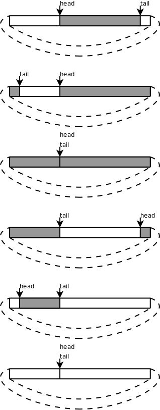

# 5. 环形队列

比较[例 12.3 “用深度优先搜索解迷宫问题”](ch12s03.md#stackqueue.dfs)的栈操作和[例 12.4 “用广度优先搜索解迷宫问题”](ch12s04.md#stackqueue.bfs)的队列操作可以发现，栈操作的 `top` 指针在 Push 时增大而在 Pop 时减小，栈空间是可以重复利用的，而队列的 `head` 、 `tail` 指针都在一直增大，虽然前面的元素已经出队了，但它所占的存储空间却不能重复利用。在[例 12.4 “用广度优先搜索解迷宫问题”](ch12s04.md#stackqueue.bfs)的解法中，出队的元素仍然有用，保存着走过的路径和每个点的前趋，但大多数程序并不是这样使用队列的，一般情况下出队的元素就不再有保存价值了，这些元素的存储空间应该回收利用，由此想到把队列改造成环形队列（Circular Queue）：把 `queue` 数组想像成一个圈， `head` 和 `tail` 指针仍然是一直增大的，当指到数组末尾时就自动回到数组开头，就像两个人围着操场赛跑，沿着它们跑的方向看，从 `head` 到 `tail` 之间是队列的有效元素，从 `tail` 到 `head` 之间是空的存储位置，如果 `head` 追上 `tail` 就表示队列空了，如果 `tail` 追上 `head` 就表示队列的存储空间满了。如下图所示：

  

  
<b>图 12.5. 环形队列</b>

## 习题

1、现在把迷宫问题的要求改一下，只要求程序给出最后结论就可以了，回答“有路能到达终点”或者“没有路能到达终点”，而不需要把路径打印出来。请把[例 12.4 “用广度优先搜索解迷宫问题”](ch12s04.md#stackqueue.bfs)改用环形队列实现，然后试验一下解决这个问题至少需要分配多少个元素的队列空间。
