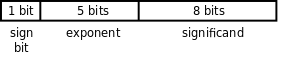
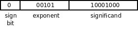
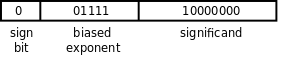
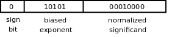
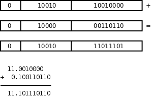

# 4. 浮点数

浮点数在计算机中的表示是基于科学计数法（Scientific Notation）的，我们知道 32767 这个数用科学计数法可以写成 3.2767×104，3.2767 称为尾数（Mantissa，或者叫 Significand），4 称为指数（Exponent）。浮点数在计算机中的表示与此类似，只不过基数（Radix）是 2 而不是 10。下面我们用一个简单的模型来解释浮点数的基本概念。我们的模型由三部分组成：符号位、指数部分（表示 2 的多少次方）和尾数部分（小数点前面是 0，尾数部分只表示小数点后的数字）。

<div align="center">

  

  <p><b>图 14.6. 一种浮点数格式</b></p>

</div>

如果要表示 17 这个数，我们知道 17=17.0×100=0.17×102，类似地，17=(10001)2×20=(0.10001)2×25，把尾数的有效数字全部移到小数点后，这样就可以表示为：

<div align="center">

  

  <p><b>图 14.7. 17 的浮点数表示</b></p>

</div>

如果我们要表示 0.25 就遇到新的困难了，因为 0.25=1×2-2=(0.1)2×2-1，而我们的模型中指数部分没有规定如何表示负数。我们可以在指数部分规定一个符号位，然而更广泛采用的办法是使用偏移的指数（Biased Exponent）。规定一个偏移值，比如 16，实际的指数要加上这个偏移值再填写到指数部分，这样比 16 大的就表示正指数，比 16 小的就表示负指数。要表示 0.25，指数部分应该填 16-1=15：

<div align="center">

  

  <p><b>图 14.8. 0.25 的偏移指数浮点数表示</b></p>

</div>

现在还有一个问题需要解决：每个浮点数的表示都不唯一，例如 17=(0.10001)2×25=(0.010001)2×26，这样给计算机处理增加了复杂性。为了解决这个问题，我们规定尾数部分的最高位必须是 1，也就是说尾数必须以 0.1 开头，对指数做相应的调整，这称为正规化（Normalize）。由于尾数部分的最高位必须是 1，这个 1 就不必保存了，可以节省出一位来用于提高精度，我们说最高位的 1 是隐含的（Implied）。这样 17 就只有一种表示方法了，指数部分应该是 16+5=21=(10101)2，尾数部分去掉最高位的 1 是 0001：

<div align="center">

  

  <p><b>图 14.9. 17 的正规化尾数浮点数表示</b></p>

</div>

两个浮点数相加，首先把小数点对齐然后相加：

<div align="center">

  

  <p><b>图 14.10. 浮点数相加</b></p>

</div>

由于浮点数表示的精度有限，计算结果末尾的 10 两位被舍去了。做浮点运算时要注意精度损失（Significance Loss）问题，有时计算顺序不同也会导致不同的结果，比如 11.0010000+0.00000001+0.00000001=11.0010000+0.00000001=11.0010000，后面加的两个很小的数全被舍去了，没有对计算结果产生任何影响，但如果调一下计算顺序它们就能影响到计算结果了，0.00000001+0.00000001+11.0010000=0.00000010+11.0010000=11.0010001。再比如 128.25=(10000000.01)2，需要 10 个有效位，而我们的模型中尾数部分是 8 位，算上隐含的最高位 1 一共有 9 个有效位，那么 128.25 的浮点数表示只能舍去末尾的 1，表示成(10000000.0)2，其实跟 128 相等了。在[第 2 节 “if/else 语句”](ch04s02.md#cond.ifelse)讲过浮点数不能做精确比较，现在读者应该知道为什么不能精确比较了。

整数运算会产生溢出，浮点运算也会产生溢出，浮点运算的溢出也分上溢和下溢两种，但和整数运算的定义不同。假设整数采用 8 位 2's Complement 表示法，取值范围是-128~127，如果计算结果是-130 则称为下溢，计算结果是 130 则称为上溢。假设按本节介绍的浮点数表示法，取值范围是-(0.111111111)2×215~(0.111111111)2×215，如果计算结果超出这个范围则称为上溢；如果计算结果未超出这个范围但绝对值太小了，在-(0.1)2×2-16~(0.1)2×2-16 之间，那么也同样无法表示，称为下溢。

浮点数是一个相当复杂的话题，不同平台的浮点数表示和浮点运算也有较大差异，本节只是通过这个简单的模型介绍一些基本概念而不深入讨论，理解了这些基本概念有助于你理解浮点数标准，目前业界广泛采用的符点数标准是由 IEEE（Institute of Electrical and Electronics Engineers）制定的 IEEE 754。

最后讨论一个细节问题。我们知道，定义全局变量时如果没有 Initializer 就用 0 初始化，定义数组时如果 Initializer 中提供的元素不够那么剩下的元素也用 0 初始化。例如：

```c
int i;
double d;
double a[10] = { 1.0 };
```

“用 0 初始化”的意思是变量 `i` 、变量 `d` 和数组元素 `a[1]~a[9]` 的所有字节都用 0 填充，或者说所有 bit 都是 0。无论是用 Sign and Magnitude 表示法、1's Complement 表示法还是 2's Complement 表示法，一个整数的所有 bit 是 0 都表示 0 值，但一个浮点数的所有 bit 是 0 一定表示 0 值吗？严格来说不一定，某种平台可能会规定一个浮点数的所有 bit 是 0 并不表示 0 值，但[\[C99 Rationale\]](bi01.md#bibli.rationale)第 6.7.8 节的条款 25 提到：As far as the committee knows, all machines treat all bits zero as a representation of floating-point zero. But, all bits zero might not be the canonical representation of zero. 因此在绝大多数平台上，一个浮点数的所有 bit 是 0 就表示 0 值。
