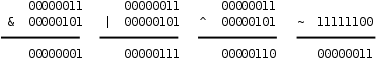
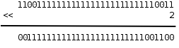
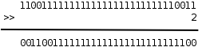

# 1. 位运算

整数在计算机中用二进制的位来表示，C 语言提供一些运算符可以直接操作整数中的位，称为位运算，这些运算符的操作数都必须是整型的。在以后的学习中你会发现，有些信息利用整数中的某几个位来存储，要访问这些位，仅仅有对整数的操作是不够的，必须借助位运算，例如[第 2 节 “Unicode 和 UTF-8”](apas02.md#app-encoding.utf8)介绍的 UTF-8 编码就是如此，学完本节之后你应该能自己写出 UTF-8 的编码和解码程序。本节首先介绍各种位运算符，然后介绍与位运算有关的编程技巧。

## 1.1. 按位与、或、异或、取反运算

在[第 3 节 “布尔代数”](ch04s03.md#cond.bool)讲过逻辑与、或、非运算，并列出了真值表，对于整数中的位也可以做与、或、非运算，C 语言提供了按位与（Bitwise AND）运算符&、按位或（Bitwise OR）运算符|和按位取反（Bitwise NOT）运算符~，此外还有按位异或（Bitwise XOR）运算符^，我们在[第 1 节 “为什么计算机用二进制计数”](ch14s01.md#number.binary)讲过异或运算。下面用二进制的形式举几个例子。

<div align="center">

  

  <p><b>图 16.1. 位运算</b></p>

</div>

注意，&、|、^运算符都是要做 Usual Arithmetic Conversion 的（其中有一步是 Integer Promotion），~运算符也要做 Integer Promotion，所以在 C 语言中其实并不存在 8 位整数的位运算，操作数在做位运算之前都至少被提升为 `int` 型了，上面用 8 位整数举例只是为了书写方便。比如：

```c
unsigned char c = 0xfc;
unsigned int i = ~c;
```

计算过程是这样的：常量 0xfc 是 `int` 型的，赋给 `c` 要转成 `unsigned char` ，值不变； `c` 的十六进制表示是 fc，计算 `~c` 时先提升为整型（000000fc）然后取反，最后结果是 ffffff03。注意，如果把 `~c` 看成是 8 位整数的取反，最后结果就得 3 了，这就错了。为了避免出错，一是尽量避免不同类型之间的赋值，二是每一步计算都要按上一章讲的类型转换规则仔细检查。

## 1.2. 移位运算

移位运算符（Bitwise Shift）包括左移<<和右移>>。左移将一个整数的各二进制位全部左移若干位，例如 0xcfffffff3<<2 得到 0x3fffffcc：

<div align="center">

  

  <p><b>图 16.2. 左移运算</b></p>

</div>

最高两位的 11 被移出去了，最低两位又补了两个 0，其它位依次左移两位。但要注意，移动的位数必须小于左操作数的总位数，比如上面的例子，左边是 `unsigned int` 型，如果左移的位数大于等于 32 位，则结果是 Undefined。移位运算符不同于+ - * / ==等运算符，两边操作数的类型不要求一致，但两边操作数都要做 Integer Promotion，整个表达式的类型和左操作数提升后的类型相同。

复习一下[第 2 节 “不同进制之间的换算”](ch14s02.md#number.convert)讲过的知识可以得出结论，**在一定的取值范围内，将一个整数左移 1 位相当于乘以 2**。比如二进制 11（十进制 3）左移一位变成 110，就是 6，再左移一位变成 1100，就是 12。读者可以自己验证这条规律对有符号数和无符号数都成立，对负数也成立。当然，如果左移改变了最高位（符号位），那么结果肯定不是乘以 2 了，所以我加了个前提“在一定的取值范围内”。由于计算机做移位比做乘法快得多，编译器可以利用这一点做优化，比如看到源代码中有 `i * 8` ，可以编译成移位指令而不是乘法指令。

当操作数是无符号数时，右移运算的规则和左移类似，例如 0xcfffffff3>>2 得到 0x33fffffc：

<div align="center">

  

  <p><b>图 16.3. 右移运算</b></p>

</div>

最低两位的 11 被移出去了，最高两位又补了两个 0，其它位依次右移两位。和左移类似，移动的位数也必须小于左操作数的总位数，否则结果是 Undefined。在一定的取值范围内，将一个整数右移 1 位相当于除以 2，小数部分截掉。

当操作数是有符号数时，右移运算的规则比较复杂：

* 如果是正数，那么高位移入 0

* 如果是负数，那么高位移入 1 还是 0 不一定，这是 Implementation-defined 的。对于 x86 平台的 `gcc` 编译器，最高位移入 1，也就是仍保持负数的符号位，这种处理方式对负数仍然保持了“右移 1 位相当于除以 2”的性质。

综上所述，由于类型转换和移位等问题，用有符号数做位运算是很不方便的，所以，**建议只对无符号数做位运算，以减少出错的可能**。

## 习题

1、下面两行 `printf` 打印的结果有何不同？请读者比较分析一下。 `%x` 转换说明的含义详见[第 2.9 节 “格式化 I/O 函数”](ch25s02.md#stdlib.formatio)。

```c
int i = 0xcffffff3;
printf("%x\n", 0xcffffff3>>2);
printf("%x\n", i>>2);
```

## 1.3. 掩码

如果要对一个整数中的某些位进行操作，怎样表示这些位在整数中的位置呢？可以用掩码（Mask）来表示。比如掩码 0x0000ff00 表示对一个 32 位整数的 8~15 位进行操作，举例如下。

1、取出 8~15 位。

```c
unsigned int a, b, mask = 0x0000ff00;
a = 0x12345678;
b = (a & mask) >> 8; /* 0x00000056 */
```

这样也可以达到同样的效果：

```c
b = (a >> 8) & ~(~0U << 8);
```

2、将 8~15 位清 0。

```c
unsigned int a, b, mask = 0x0000ff00;
a = 0x12345678;
b = a & ~mask; /* 0x12340078 */
```

3、将 8~15 位置 1。

```c
unsigned int a, b, mask = 0x0000ff00;
a = 0x12345678;
b = a | mask; /* 0x1234ff78 */
```

## 习题

1、统计一个无符号整数的二进制表示中 1 的个数，函数原型是 `int countbit(unsigned int x);` 。

2、用位操作实现无符号整数的乘法运算，函数原型是 `unsigned int multiply(unsigned int x, unsigned int y);` 。例如：(11011)2×(10010)2=((11011)2<<1)+((11011)2<<4)。

3、对一个 32 位无符号整数做循环右移，函数原型是 `unsigned int rotate_right(unsigned int x);` 。所谓循环右移就是把低位移出去的部分再补到高位上去，例如 `rotate_right(0xdeadbeef, 16)` 的值应该是 0xefdeadbe。

## 1.4. 异或运算的一些特性

1、一个数和自己做异或的结果是 0。如果需要一个常数 0，x86 平台的编译器可能会生成这样的指令： `xorl %eax, %eax` 。不管 `eax` 寄存器里的值原来是多少，做异或运算都能得到 0，这条指令比同样效果的 `movl $0, %eax` 指令快，因为前者只需要在 CPU 内部计算，而后者需要访问内存，在下一章[第 5 节 “Memory Hierarchy”](ch17s05.md#arch.memh)详细介绍。

2、从异或的真值表可以看出，不管是 0 还是 1，和 0 做异或保持原值不变，和 1 做异或得到原值的相反值。可以利用这个特性配合掩码实现某些位的翻转，例如：

```c
unsigned int a, b, mask = 1U << 6;
a = 0x12345678;
b = a ^ mask; /* flip the 6th bit */
```

3、如果 a1 ^ a2 ^ a3 ^ ... ^ an 的结果是 1，则表示 a1、a2、a3...an 之中 1 的个数为奇数个，否则为偶数个。这条性质可用于奇偶校验（Parity Check），比如在串口通信过程中，每个字节的数据都计算一个校验位，数据和校验位一起发送出去，这样接收方可以根据校验位粗略地判断接收到的数据是否有误。

4、x ^ x ^ y == y，因为 x ^ x == 0，0 ^ y == y。这个性质有什么用呢？我们来看这样一个问题：交换两个变量的值，不得借助额外的存储空间，所以就不能采用 `temp = a; a = b; b = temp;` 的办法了。利用位运算可以这样做交换：

```c
a = a ^ b;
b = b ^ a;
a = a ^ b;
```

分析一下这个过程。为了避免混淆，把 a 和 b 的初值分别记为 a0 和 b0。第一行， `a = a0 ^ b0` ；第二行，把 a 的新值代入，得到 `b = b0 ^ a0 ^ b0` ，等号右边的 b0 相当于上面公式中的 x，a0 相当于 y，所以结果为 a0；第三行，把 a 和 b 的新值代入，得到 `a = a0 ^ b0 ^ a0` ，结果为 b0。注意这个过程不能把同一个变量自己跟自己交换，而利用中间变量 `temp` 则可以交换。

## 习题

1、请在网上查找有关 RAID（Redundant Array of Independent Disks，独立磁盘冗余阵列）的资料，理解其实现原理，其实就是利用了本节的性质 3 和 4。

2、交换两个变量的值，不得借助额外的存储空间，除了本节讲的方法之外你还能想出什么方法？本节讲的方法不能把同一个变量自己跟自己交换，你的方法有没有什么局限性？
