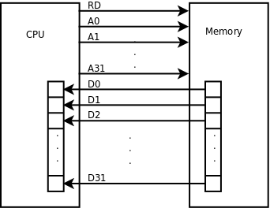
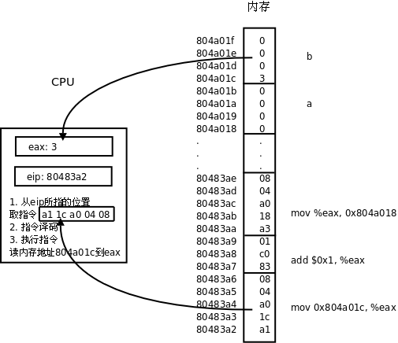

# 2. CPU

CPU 总是周而复始地做同一件事：从内存取指令，然后解释执行它，然后再取下一条指令，再解释执行。CPU 最核心的功能单元包括：

* 寄存器（Register），是 CPU 内部的高速存储器，像内存一样可以存取数据，但比访问内存快得多。随后的几章我们会详细介绍 x86 的寄存器 `eax` 、 `esp` 、 `eip` 等等，有些寄存器只能用于某种特定的用途，比如 `eip` 用作程序计数器，这称为特殊寄存器（Special-purpose Register），而另外一些寄存器可以用在各种运算和读写内存的指令中，比如 `eax` 寄存器，这称为通用寄存器（General-purpose Register）。

* 程序计数器（PC，Program Counter），是一种特殊寄存器，保存着 CPU 取下一条指令的地址，CPU 按程序计数器保存的地址去内存中取指令然后解释执行，这时程序计数器保存的地址会自动加上该指令的长度，指向内存中的下一条指令。

* 指令译码器（Instruction Decoder）。CPU 取上来的指令由若干个字节组成，这些字节中有些位表示内存地址，有些位表示寄存器编号，有些位表示这种指令做什么操作，是加减乘除还是读写内存，指令译码器负责解释这条指令的含义，然后调动相应的执行单元去执行它。

* 算术逻辑单元（ALU，Arithmetic and Logic Unit）。如果译码器将一条指令解释为运算指令，就调动算术逻辑单元去做运算，比如加减乘除、位运算、逻辑运算。指令中会指示运算结果保存到哪里，可能保存到寄存器中，也可能保存到内存中。

* 地址和数据总线（Bus）。CPU 和内存之间用地址总线、数据总线和控制线连接起来，每条线上有 1 和 0 两种状态。如果在执行指令过程中需要访问内存，比如从内存读一个数到寄存器，执行过程可以想像成这样：

  

  
<b>图 17.2. 访问内存读数据的过程</b>

    1. CPU 内部将寄存器对接到数据总线上，使寄存器的每一位对接到一条数据线，等待接收数据。

    2. CPU 通过控制线发一个读请求，并且将内存地址通过地址线发给内存。

    3. 内存收到地址和读请求之后，将相应的内存单元对接到数据总线的另一端，这样，内存单元每一位的 1 或 0 状态通过一条数据线到达 CPU 寄存器中相应的位，就完成了数据传送。

往内存里写数据的过程与此类似，只是数据线上的传输方向相反。

上图中画了 32 条地址线和 32 条数据线，CPU 寄存器也是 32 位，可以说这种体系结构是 32 位的，比如 x86 就是这样的体系结构，目前主流的处理器是 32 位或 64 位的。地址线、数据线和 CPU 寄存器的位数通常是一致的，从上图可以看出数据线和 CPU 寄存器的位数应该一致，另外有些寄存器（比如程序计数器）需要保存一个内存地址，因而地址线和 CPU 寄存器的位数也应该一致。处理器的位数也称为字长，字（Word）这个概念用得比较混乱，在有些上下文中指 16 位，在有些上下文中指 32 位（这种情况下 16 位被称为半字 Half Word），在有些上下文中指处理器的字长，如果处理器是 32 位那么一个字就是 32 位，如果处理器是 64 位那么一个字就是 64 位。32 位计算机有 32 条地址线，地址空间（Address Space）从 0x00000000 到 0xffffffff，共 4GB，而 64 位计算机有更大的地址空间。

最后还要说明一点，本节所说的地址线、数据线是指 CPU 的内总线，是直接和 CPU 的执行单元相连的，内总线经过 MMU 和总线接口的转换之后引出到芯片引脚才是外总线，外地址线和外数据线的位数都有可能和内总线不同，例如 32 位处理器的外地址总线可寻址的空间可以大于 4GB，到[第 4 节 “MMU”](ch17s04.md#arch.mmu)再详细解释。

我们结合[表 1.1 “一个语句的三种表示”](intro.program.md#intro.instruction)看一下 CPU 取指执行的过程。

  

  
<b>图 17.3. CPU 的取指执行过程</b>

1. ``eip ` 寄存器指向地址 0x80483a2，CPU 从这里开始取一条 5 个字节的指令，然后`eip ` 寄存器指向下一条指令的起始地址 0x80483a7。`

2. CPU 对这 5 个字节译码，得知这条指令要求从地址 0x804a01c 开始取 4 个字节保存到 `eax` 寄存器。

3. 执行指令，读内存，取上来的数是 3，保存到 `eax` 寄存器。注意，地址 0x804a01c~0x804a01f 里存储的四个字节不能按地址从低到高的顺序看成 0x03000000，而要按地址从高到低的顺序看成 0x00000003。也就是说，对于多字节的整数类型，低地址保存的是整数的低位，这称为小端（Little Endian）字节序（Byte Order）。x86 平台是小端字节序的，而另外一些平台规定低地址保存整数的高位，称为大端（Big Endian）字节序。

4. CPU 从 `eip` 寄存器指向的地址取一条 3 个字节的指令，然后 `eip` 寄存器指向下一条指令的起始地址 0x80483aa。

5. CPU 对这 3 个字节译码，得知这条指令要求把 `eax` 寄存器的值加 1，结果仍保存到 `eax` 寄存器。

6. 执行指令，现在 `eax` 寄存器中的数是 4。

7. CPU 从 `eip` 寄存器指向的地址取一条 5 个字节的指令，然后 `eip` 寄存器指向下一条指令的起始地址 0x80483af。

8. CPU 对这 5 个字节译码，得知这条指令要求把 `eax` 寄存器的值保存到从地址 0x804a018 开始的 4 个字节。

9. 执行指令，把 4 这个值保存到从地址 0x804a018 开始的 4 个字节（按小端字节序保存）。
