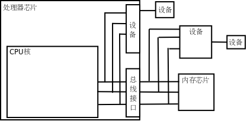

# 3. 设备

CPU 执行指令除了访问内存之外还要访问很多设备（Device），如键盘、鼠标、硬盘、显示器等，那么它们和 CPU 之间如何连接呢？如下图所示。

  

  
<b>图 17.4. 设备</b>

有些设备像内存芯片一样连接到处理器的地址总线和数据总线，正因为地址线和数据线上可以挂多个设备和内存芯片所以才叫“总线”，但不同的设备和内存芯片应该占不同的地址范围。访问这种设备就像访问内存一样，按地址读写即可，但和访问内存不同的是，往一个地址写数据只是给设备发一个命令，数据不一定要保存，而从一个地址读数据也不一定是读先前保存在这个地址的数据，而是得到设备的当前状态。设备中可供读写访问的单元通常称为设备寄存器（注意和 CPU 寄存器不是一回事），操作设备的过程就是读写这些设备寄存器的过程，比如向串口发送寄存器里写数据，串口设备就会把数据发送出去，读串口接收寄存器的值，就可以读取串口设备接收到的数据。

还有一些设备集成在处理器芯片中。在上图中，从 CPU 核引出的地址和数据总线有一端经总线接口引出到芯片引脚上了，还有一端没有引出，而是接到芯片内部集成的设备上，无论是在 CPU 外部接总线的设备还是在 CPU 内部接总线的设备都有各自的地址范围，都可以像访问内存一样访问，很多体系结构（比如 ARM）采用这种方式操作设备，称为内存映射 I/O（Memory-mapped I/O）。但是 x86 比较特殊，x86 对于设备有独立的端口地址空间，CPU 核需要引出额外的地址线来连接片内设备（和访问内存所用的地址线不同），访问设备寄存器时用特殊的 `in` / `out` 指令，而不是和访问内存用同样的指令，这种方式称为端口 I/O（Port I/O）。

从 CPU 的角度来看，访问设备只有内存映射 I/O 和端口 I/O 两种，要么像内存一样访问，要么用一种专用的指令访问。其实访问设备是相当复杂的，计算机的设备五花八门，各种设备的性能要求都不一样，有的要求带宽大，有的要求响应快，有的要求热插拔，于是出现了各种适应不同要求的设备总线，比如 PCI、AGP、USB、1394、SATA 等等，这些设备总线并不直接和 CPU 相连，CPU 通过内存映射 I/O 或端口 I/O 访问相应的总线控制器，通过总线控制器再去访问挂在总线上的设备。所以上图中标有“设备”的框可能是实际的设备，也可能是设备总线的控制器。

在 x86 平台上，硬盘是挂在 IDE、SATA 或 SCSI 总线上的设备，保存在硬盘上的程序是不能被 CPU 直接取指令执行的，操作系统在执行程序时会把它从硬盘拷贝到内存，这样 CPU 才能取指令执行，这个过程称为加载（Load）。程序加载到内存之后，成为操作系统调度执行的一个任务，就称为进程（Process）。进程和程序不是一一对应的。一个程序可以多次加载到内存，成为同时运行的多个进程，例如可以同时开多个终端窗口，每个窗口都运行一个 Shell 进程，而它们对应的程序都是磁盘上的 `/bin/bash` 文件。

操作系统（Operating System）本身也是一段保存在磁盘上的程序，计算机在启动时执行一段固定的启动代码（称为 Bootloader）首先把操作系统从磁盘加载到内存，然后执行操作系统中的代码把用户需要的其它程序加载到内存。操作系统和其它用户程序的不同之处在于：操作系统是常驻内存的，而其它用户程序则不一定，用户需要运行哪个程序，操作系统就把它加载到内存，用户不需要哪个程序，操作系统就把它终止掉，释放它所占的内存。操作系统最核心的功能是管理进程调度、管理内存的分配使用和管理各种设备，做这些工作的程序称为内核（Kernel），在我的系统上内核程序是 `/boot/vmlinuz-2.6.28-13-generic` 文件，它在计算机启动时加载到内存并常驻内存。广义上操作系统的概念还包括一些必不可少的用户程序，比如 Shell 是每个 Linux 系统必不可少的，而 Office 办公套件则是可有可无的，所以前者也属于广义上操作系统的范畴，而后者属于应用软件。

访问设备还有一点和访问内存不同。内存只是保存数据而不会产生新的数据，如果 CPU 不去读它，它也不需要主动提供数据给 CPU，所以内存总是被动地等待被读或者被写。而设备往往会自己产生数据，并且需要主动通知 CPU 来读这些数据，例如敲键盘产生一个输入字符，用户希望计算机马上响应自己的输入，这就要求键盘设备主动通知 CPU 来读这个字符并做相应处理，给用户响应。这是由中断（Interrupt）机制实现的，每个设备都有一条中断线，通过中断控制器连接到 CPU，当设备需要主动通知 CPU 时就引发一个中断信号，CPU 正在执行的指令将被打断，程序计数器会指向某个固定的地址（这个地址由体系结构定义），于是 CPU 从这个地址开始取指令（或者说跳转到这个地址），执行中断服务程序（ISR，Interrupt Service Routine），完成中断处理之后再返回先前被打断的地方执行后续指令。比如某种体系结构规定发生中断时跳转到地址 0x00000010 执行，那么就要事先把一段 ISR 程序加载到这个地址，ISR 程序是内核代码的一部分，在这段代码中首先判断是哪个设备引发了中断，然后调用该设备的中断处理函数做进一步处理。

由于各种设备的操作方法各不相同，每种设备都需要专门的设备驱动程序（Device Driver），一个操作系统为了支持广泛的设备就需要有大量的设备驱动程序，事实上 Linux 内核源代码中绝大部分是设备驱动程序。设备驱动程序通常是内核里的一组函数，通过读写设备寄存器实现对设备的初始化、读、写等操作，有些设备还要提供一个中断处理函数供 ISR 调用。
