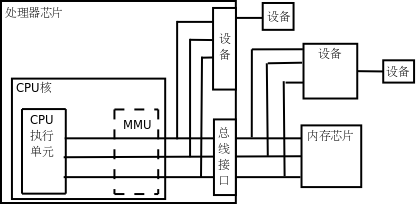
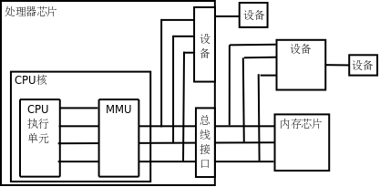
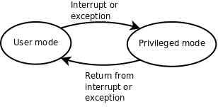

# 4. MMU

现代操作系统普遍采用虚拟内存管理（Virtual Memory Management）机制，这需要处理器中的 MMU（Memory Management Unit，内存管理单元）提供支持，本节简要介绍 MMU 的作用。

首先引入两个概念，虚拟地址和物理地址。如果处理器没有 MMU，或者有 MMU 但没有启用，CPU 执行单元发出的内存地址将直接传到芯片引脚上，被内存芯片（以下称为物理内存，以便与虚拟内存区分）接收，这称为物理地址（Physical Address，以下简称 PA），如下图所示。

  

  
<b>图 17.5. 物理地址</b>

如果处理器启用了 MMU，CPU 执行单元发出的内存地址将被 MMU 截获，从 CPU 到 MMU 的地址称为虚拟地址（Virtual Address，以下简称 VA），而 MMU 将这个地址翻译成另一个地址发到 CPU 芯片的外部地址引脚上，也就是将 VA 映射成 PA，如下图所示。

  

  
<b>图 17.6. 虚拟地址</b>

如果是 32 位处理器，则内地址总线是 32 位的，与 CPU 执行单元相连（图中只是示意性地画了 4 条地址线），而经过 MMU 转换之后的外地址总线则不一定是 32 位的。也就是说，虚拟地址空间和物理地址空间是独立的，32 位处理器的虚拟地址空间是 4GB，而物理地址空间既可以大于也可以小于 4GB。

MMU 将 VA 映射到 PA 是以页（Page）为单位的，32 位处理器的页尺寸通常是 4KB。例如，MMU 可以通过一个映射项将 VA 的一页 0xb7001000~0xb7001fff 映射到 PA 的一页 0x2000~0x2fff，如果 CPU 执行单元要访问虚拟地址 0xb7001008，则实际访问到的物理地址是 0x2008。物理内存中的页称为物理页面或者页帧（Page Frame）。虚拟内存的哪个页面映射到物理内存的哪个页帧是通过页表（Page Table）来描述的，页表保存在物理内存中，MMU 会查找页表来确定一个 VA 应该映射到什么 PA。

操作系统和 MMU 是这样配合的：

1. 操作系统在初始化或分配、释放内存时会执行一些指令在物理内存中填写页表，然后用指令设置 MMU，告诉 MMU 页表在物理内存中的什么位置。

2. 设置好之后，CPU 每次执行访问内存的指令都会自动引发 MMU 做查表和地址转换操作，地址转换操作由硬件自动完成，不需要用指令控制 MMU 去做。

我们在程序中使用的变量和函数都有各自的地址，程序被编译后，这些地址就成了指令中的地址，指令中的地址被 CPU 解释执行，就成了 CPU 执行单元发出的内存地址，所以在启用 MMU 的情况下，程序中使用的地址都是虚拟地址，都会引发 MMU 做查表和地址转换操作。那为什么要设计这么复杂的内存管理机制呢？多了一层 VA 到 PA 的转换到底换来了什么好处？All problems in computer science can be solved by another level of indirection.还记得这句话吗？多了一层间接必然是为了解决什么问题的，等讲完了必要的预备知识之后，将在[第 5 节 “虚拟内存管理”](ch20s05.md#link.vm)讨论虚拟内存管理机制的作用。

MMU 除了做地址转换之外，还提供内存保护机制。各种体系结构都有用户模式（User Mode）和特权模式（Privileged Mode）之分，操作系统可以在页表中设置每个内存页面的访问权限，有些页面不允许访问，有些页面只有在 CPU 处于特权模式时才允许访问，有些页面在用户模式和特权模式都可以访问，访问权限又分为可读、可写和可执行三种。这样设定好之后，当 CPU 要访问一个 VA 时，MMU 会检查 CPU 当前处于用户模式还是特权模式，访问内存的目的是读数据、写数据还是取指令，如果和操作系统设定的页面权限相符，就允许访问，把它转换成 PA，否则不允许访问，产生一个异常（Exception）。异常的处理过程和中断类似，不同的是中断由外部设备产生而异常由 CPU 内部产生，中断产生的原因和 CPU 当前执行的指令无关，而异常的产生就是由于 CPU 当前执行的指令出了问题，例如访问内存的指令被 MMU 检查出权限错误，除法指令的除数为 0 等都会产生异常。

  

  
<b>图 17.7. 处理器模式</b>

通常操作系统把虚拟地址空间划分为用户空间和内核空间，例如 x86 平台的 Linux 系统虚拟地址空间是 0x00000000~0xffffffff，前 3GB（0x00000000~0xbfffffff）是用户空间，后 1GB（0xc0000000~0xffffffff）是内核空间。用户程序加载到用户空间，在用户模式下执行，不能访问内核中的数据，也不能跳转到内核代码中执行。这样可以保护内核，如果一个进程访问了非法地址，顶多这一个进程崩溃，而不会影响到内核和整个系统的稳定性。CPU 在产生中断或异常时不仅会跳转到中断或异常服务程序，还会自动切换模式，从用户模式切换到特权模式，因此从中断或异常服务程序可以跳转到内核代码中执行。事实上，整个内核就是由各种中断和异常处理程序组成的。总结一下：在正常情况下处理器在用户模式执行用户程序，在中断或异常情况下处理器切换到特权模式执行内核程序，处理完中断或异常之后再返回用户模式继续执行用户程序。

段错误我们已经遇到过很多次了，它是这样产生的：

1. 用户程序要访问的一个 VA，经 MMU 检查无权访问。

2. MMU 产生一个异常，CPU 从用户模式切换到特权模式，跳转到内核代码中执行异常服务程序。

3. 内核把这个异常解释为段错误，把引发异常的进程终止掉。
