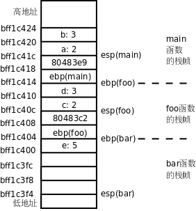

# 1. 函数调用

我们用下面的代码来研究函数调用的过程。

**例 19.1. 研究函数的调用过程**

```c
int bar(int c, int d)
{
	int e = c + d;
	return e;
}

int foo(int a, int b)
{
	return bar(a, b);
}

int main(void)
{
	foo(2, 3);
	return 0;
}
```

如果在编译时加上 `-g` 选项（在[第 10 章 **gdb**](ch10.md#gdb)讲过 `-g` 选项），那么用 `objdump` 反汇编时可以把 C 代码和汇编代码穿插起来显示，这样 C 代码和汇编代码的对应关系看得更清楚。反汇编的结果很长，以下只列出我们关心的部分。

```text
$ gcc main.c -g
$ objdump -dS a.out
...
08048394 <bar>:
int bar(int c, int d)
{
 8048394:	55                   	push   %ebp
 8048395:	89 e5                	mov    %esp,%ebp
 8048397:	83 ec 10             	sub    $0x10,%esp
	int e = c + d;
 804839a:	8b 55 0c             	mov    0xc(%ebp),%edx
 804839d:	8b 45 08             	mov    0x8(%ebp),%eax
 80483a0:	01 d0                	add    %edx,%eax
 80483a2:	89 45 fc             	mov    %eax,-0x4(%ebp)
	return e;
 80483a5:	8b 45 fc             	mov    -0x4(%ebp),%eax
}
 80483a8:	c9                   	leave
 80483a9:	c3                   	ret

080483aa <foo>:

int foo(int a, int b)
{
 80483aa:	55                   	push   %ebp
 80483ab:	89 e5                	mov    %esp,%ebp
 80483ad:	83 ec 08             	sub    $0x8,%esp
	return bar(a, b);
 80483b0:	8b 45 0c             	mov    0xc(%ebp),%eax
 80483b3:	89 44 24 04          	mov    %eax,0x4(%esp)
 80483b7:	8b 45 08             	mov    0x8(%ebp),%eax
 80483ba:	89 04 24             	mov    %eax,(%esp)
 80483bd:	e8 d2 ff ff ff       	call   8048394 <bar>
}
 80483c2:	c9                   	leave
 80483c3:	c3                   	ret

080483c4 <main>:

int main(void)
{
 80483c4:	8d 4c 24 04          	lea    0x4(%esp),%ecx
 80483c8:	83 e4 f0             	and    $0xfffffff0,%esp
 80483cb:	ff 71 fc             	pushl  -0x4(%ecx)
 80483ce:	55                   	push   %ebp
 80483cf:	89 e5                	mov    %esp,%ebp
 80483d1:	51                   	push   %ecx
 80483d2:	83 ec 08             	sub    $0x8,%esp
	foo(2, 3);
 80483d5:	c7 44 24 04 03 00 00 	movl   $0x3,0x4(%esp)
 80483dc:	00
 80483dd:	c7 04 24 02 00 00 00 	movl   $0x2,(%esp)
 80483e4:	e8 c1 ff ff ff       	call   80483aa <foo>
	return 0;
 80483e9:	b8 00 00 00 00       	mov    $0x0,%eax
}
 80483ee:	83 c4 08             	add    $0x8,%esp
 80483f1:	59                   	pop    %ecx
 80483f2:	5d                   	pop    %ebp
 80483f3:	8d 61 fc             	lea    -0x4(%ecx),%esp
 80483f6:	c3                   	ret
...
```

要查看编译后的汇编代码，其实还有一种办法是 `gcc -S main.c` ，这样只生成汇编代码 `main.s` ，而不生成二进制的目标文件。

整个程序的执行过程是 `main` 调用 `foo` ， `foo` 调用 `bar` ，我们用 `gdb` 跟踪程序的执行，直到 `bar` 函数中的 `int e = c + d;` 语句执行完毕准备返回时，这时在 `gdb` 中打印函数栈帧。

```text
(gdb) start
...
main () at main.c:14
14		foo(2, 3);
(gdb) s
foo (a=2, b=3) at main.c:9
9		return bar(a, b);
(gdb) s
bar (c=2, d=3) at main.c:3
3		int e = c + d;
(gdb) disassemble
Dump of assembler code for function bar:
0x08048394 <bar+0>:	push   %ebp
0x08048395 <bar+1>:	mov    %esp,%ebp
0x08048397 <bar+3>:	sub    $0x10,%esp
0x0804839a <bar+6>:	mov    0xc(%ebp),%edx
0x0804839d <bar+9>:	mov    0x8(%ebp),%eax
0x080483a0 <bar+12>:	add    %edx,%eax
0x080483a2 <bar+14>:	mov    %eax,-0x4(%ebp)
0x080483a5 <bar+17>:	mov    -0x4(%ebp),%eax
0x080483a8 <bar+20>:	leave
0x080483a9 <bar+21>:	ret
End of assembler dump.
(gdb) si
0x0804839d	3		int e = c + d;
(gdb) si
0x080483a0	3		int e = c + d;
(gdb) si
0x080483a2	3		int e = c + d;
(gdb) si
4		return e;
(gdb) si
5	}
(gdb) bt
#0  bar (c=2, d=3) at main.c:5
#1  0x080483c2 in foo (a=2, b=3) at main.c:9
#2  0x080483e9 in main () at main.c:14
(gdb) info registers
eax            0x5	5
ecx            0xbff1c440	-1074674624
edx            0x3	3
ebx            0xb7fe6ff4	-1208061964
esp            0xbff1c3f4	0xbff1c3f4
ebp            0xbff1c404	0xbff1c404
esi            0x8048410	134513680
edi            0x80482e0	134513376
eip            0x80483a8	0x80483a8 <bar+20>
eflags         0x200206	[ PF IF ID ]
cs             0x73	115
ss             0x7b	123
ds             0x7b	123
es             0x7b	123
fs             0x0	0
gs             0x33	51
(gdb) x/20 $esp
0xbff1c3f4:	0x00000000	0xbff1c6f7	0xb7efbdae	0x00000005
0xbff1c404:	0xbff1c414	0x080483c2	0x00000002	0x00000003
0xbff1c414:	0xbff1c428	0x080483e9	0x00000002	0x00000003
0xbff1c424:	0xbff1c440	0xbff1c498	0xb7ea3685	0x08048410
0xbff1c434:	0x080482e0	0xbff1c498	0xb7ea3685	0x00000001
(gdb)
```

这里又用到几个新的 `gdb` 命令。 `disassemble` 可以反汇编当前函数或者指定的函数，单独用 `disassemble` 命令是反汇编当前函数，如果 `disassemble` 命令后面跟函数名或地址则反汇编指定的函数。以前我们讲过 `step` 命令可以一行代码一行代码地单步调试，而这里用到的 `si` 命令可以一条指令一条指令地单步调试。 `info registers` 可以显示所有寄存器的当前值。在 `gdb` 中表示寄存器名时前面要加个 `$` ，例如 `p $esp` 可以打印 `esp` 寄存器的值，在上例中 `esp` 寄存器的值是 0xbff1c3f4，所以 `x/20 $esp` 命令查看内存中从 0xbff1c3f4 地址开始的 20 个 32 位数。在执行程序时，操作系统为进程分配一块栈空间来保存函数栈帧， `esp` 寄存器总是指向栈顶，在 x86 平台上这个栈是从高地址向低地址增长的，我们知道每次调用一个函数都要分配一个栈帧来保存参数和局部变量，现在我们详细分析这些数据在栈空间的布局，根据 `gdb` 的输出结果图示如下[^29]：

<div align="center">

  

  <p><b>图 19.1. 函数栈帧</b></p>

</div>

图中每个小方格表示 4 个字节的内存单元，例如 `b: 3` 这个小方格占的内存地址是 0xbf822d20~0xbf822d23，我把地址写在每个小方格的下边界线上，是为了强调该地址是内存单元的起始地址。我们从 `main` 函数的这里开始看起：

```text
foo(2, 3);
 80483d5:	c7 44 24 04 03 00 00 	movl   $0x3,0x4(%esp)
 80483dc:	00
 80483dd:	c7 04 24 02 00 00 00 	movl   $0x2,(%esp)
 80483e4:	e8 c1 ff ff ff       	call   80483aa <foo>
	return 0;
 80483e9:	b8 00 00 00 00       	mov    $0x0,%eax
```

要调用函数 `foo` 先要把参数准备好，第二个参数保存在 `esp+4` 指向的内存位置，第一个参数保存在 `esp` 指向的内存位置，可见参数是从右向左依次压栈的。然后执行 `call` 指令，这个指令有两个作用：

1. `foo ` 函数调用完之后要返回到`call ` 的下一条指令继续执行，所以把`call ` 的下一条指令的地址 0x80483e9 压栈，同时把`esp ` 的值减 4，`esp` 的值现在是 0xbf822d18。

2. 修改程序计数器 `eip` ，跳转到 `foo` 函数的开头执行。

现在看 `foo` 函数的汇编代码：

```text
int foo(int a, int b)
{
 80483aa:	55                   	push   %ebp
 80483ab:	89 e5                	mov    %esp,%ebp
 80483ad:	83 ec 08             	sub    $0x8,%esp
```

`push %ebp ` 指令把`ebp ` 寄存器的值压栈，同时把`esp ` 的值减 4。`esp ` 的值现在是 0xbf822d14，下一条指令把这个值传送给`ebp ` 寄存器。这两条指令合起来是把原来`ebp ` 的值保存在栈上，然后又给`ebp ` 赋了新值。在每个函数的栈帧中，`ebp ` 指向栈底，而`esp ` 指向栈顶，在函数执行过程中`esp ` 随着压栈和出栈操作随时变化，而`ebp ` 是不动的，函数的参数和局部变量都是通过`ebp ` 的值加上一个偏移量来访问，例如`foo ` 函数的参数`a ` 和`b ` 分别通过`ebp+8 ` 和`ebp+12 ` 来访问。所以下面的指令把参数`a ` 和`b ` 再次压栈，为调用`bar ` 函数做准备，然后把返回地址压栈，调用`bar` 函数：

```text
return bar(a, b);
 80483b0:	8b 45 0c             	mov    0xc(%ebp),%eax
 80483b3:	89 44 24 04          	mov    %eax,0x4(%esp)
 80483b7:	8b 45 08             	mov    0x8(%ebp),%eax
 80483ba:	89 04 24             	mov    %eax,(%esp)
 80483bd:	e8 d2 ff ff ff       	call   8048394 <bar>
```

现在看 `bar` 函数的指令：

```text
int bar(int c, int d)
{
 8048394:	55                   	push   %ebp
 8048395:	89 e5                	mov    %esp,%ebp
 8048397:	83 ec 10             	sub    $0x10,%esp
	int e = c + d;
 804839a:	8b 55 0c             	mov    0xc(%ebp),%edx
 804839d:	8b 45 08             	mov    0x8(%ebp),%eax
 80483a0:	01 d0                	add    %edx,%eax
 80483a2:	89 45 fc             	mov    %eax,-0x4(%ebp)
```

这次又把 `foo` 函数的 `ebp` 压栈保存，然后给 `ebp` 赋了新值，指向 `bar` 函数栈帧的栈底，通过 `ebp+8` 和 `ebp+12` 分别可以访问参数 `c` 和 `d` 。 `bar` 函数还有一个局部变量 `e` ，可以通过 `ebp-4` 来访问。所以后面几条指令的意思是把参数 `c` 和 `d` 取出来存在寄存器中做加法，计算结果保存在 `eax` 寄存器中，再把 `eax` 寄存器存回局部变量 `e` 的内存单元。

在 `gdb` 中可以用 `bt` 命令和 `frame` 命令查看每层栈帧上的参数和局部变量，现在可以解释它的工作原理了：如果我当前在 `bar` 函数中，我可以通过 `ebp` 找到 `bar` 函数的参数和局部变量，也可以找到 `foo` 函数的 `ebp` 保存在栈上的值，有了 `foo` 函数的 `ebp` ，又可以找到它的参数和局部变量，也可以找到 `main` 函数的 `ebp` 保存在栈上的值，因此各层函数栈帧通过保存在栈上的 `ebp` 的值串起来了。

现在看 `bar` 函数的返回指令：

```text
return e;
 80483a5:	8b 45 fc             	mov    -0x4(%ebp),%eax
}
 80483a8:	c9                   	leave
 80483a9:	c3                   	ret
```

`bar ` 函数有一个`int ` 型的返回值，这个返回值是通过`eax ` 寄存器传递的，所以首先把`e ` 的值读到`eax ` 寄存器中。然后执行`leave ` 指令，这个指令是函数开头的`push %ebp ` 和`mov %esp,%ebp` 的逆操作：

1. 把 `ebp` 的值赋给 `esp` ，现在 `esp` 的值是 0xbf822d04。

2. 现在 `esp` 所指向的栈顶保存着 `foo` 函数栈帧的 `ebp` ，把这个值恢复给 `ebp` ，同时 `esp` 增加 4， `esp` 的值变成 0xbf822d08。

最后是 `ret` 指令，它是 `call` 指令的逆操作：

1. 现在 `esp` 所指向的栈顶保存着返回地址，把这个值恢复给 `eip` ，同时 `esp` 增加 4， `esp` 的值变成 0xbf822d0c。

2. 修改了程序计数器 `eip` ，因此跳转到返回地址 0x80483c2 继续执行。

地址 0x80483c2 处是 `foo` 函数的返回指令：

```text
80483c2:	c9                   	leave
 80483c3:	c3                   	ret
```

重复同样的过程，又返回到了 `main` 函数。注意函数调用和返回过程中的这些规则：

1. 参数压栈传递，并且是从右向左依次压栈。

2. `ebp` 总是指向当前栈帧的栈底。

3. 返回值通过 `eax` 寄存器传递。

这些规则并不是体系结构所强加的， `ebp` 寄存器并不是必须这么用，函数的参数和返回值也不是必须这么传，只是操作系统和编译器选择了以这样的方式实现 C 代码中的函数调用，这称为 Calling Convention，Calling Convention 是操作系统二进制接口规范（ABI，Application Binary Interface）的一部分。

## 习题

1、在[第 2 节 “自定义函数”](ch03s02.md#func.ourfirstfunc)讲过，Old Style C 风格的函数声明可以不指定参数个数和类型，这样编译器不会对函数调用做检查，那么如果调用时的参数类型不对或者参数个数不对会怎么样呢？比如把本节的例子改成这样：

```c
int foo();
int bar();

int main(void)
{
	foo(2, 3, 4);
	return 0;
}

int foo(int a, int b)
{
	return bar(a);
}

int bar(int c, int d)
{
	int e = c + d;
	return e;
}
```

`main ` 函数调用`foo ` 时多传了一个参数，那么参数`a ` 和`b ` 分别取什么值？多的参数怎么办？`foo ` 调用`bar ` 时少传了一个参数，那么参数`d ` 的值从哪里取得？请读者利用反汇编和`gdb` 自己分析一下。我们再看一个参数类型不符的例子：

```c
#include <stdio.h>

int main(void)
{
	void foo();
	char c = 60;
	foo(c);
	return 0;
}

void foo(double d)
{
	printf("%f\n", d);
}
```

打印结果是多少？如果把声明 `void foo();` 改成 `void foo(double);` ，打印结果又是多少？

[^29]: Linux 内核为每个新进程指定的栈空间的起始地址都会有些不同，所以每次运行这个程序得到的地址都不一样，但通常都是 0xbf??????这样一个地址。
