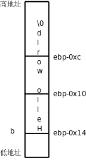

# 3. 变量的存储布局

首先看下面的例子：

**例 19.2. 研究变量的存储布局**

```c
#include <stdio.h>

const int A = 10;
int a = 20;
static int b = 30;
int c;

int main(void)
{
	static int a = 40;
	char b[] = "Hello world";
	register int c = 50;

	printf("Hello world %d\n", c);

	return 0;
}
```

我们在全局作用域和 `main` 函数的局部作用域各定义了一些变量，并且引入一些新的关键字 `const` 、 `static` 、 `register` 来修饰变量，那么这些变量的存储空间是怎么分配的呢？我们编译之后用 `readelf` 命令看它的符号表，了解各变量的地址分布。注意在下面的清单中我把符号表按地址从低到高的顺序重新排列了，并且只截取我们关心的那几行。

```text
$ gcc main.c -g
$ readelf -a a.out
...
    68: 08048540     4 OBJECT  GLOBAL DEFAULT   15 A
    69: 0804a018     4 OBJECT  GLOBAL DEFAULT   23 a
    52: 0804a01c     4 OBJECT  LOCAL  DEFAULT   23 b
    53: 0804a020     4 OBJECT  LOCAL  DEFAULT   23 a.1589
    81: 0804a02c     4 OBJECT  GLOBAL DEFAULT   24 c
...
```

变量 A 用 `const` 修饰，表示 A 是只读的，不可修改，它被分配的地址是 0x8048540，从 `readelf` 的输出可以看到这个地址位于 `.rodata` 段：

```text
Section Headers:
  [Nr] Name              Type            Addr     Off    Size   ES Flg Lk Inf Al
...
  [13] .text             PROGBITS        08048360 000360 0001bc 00  AX  0   0 16
...
  [15] .rodata           PROGBITS        08048538 000538 00001c 00   A  0   0  4
...
  [23] .data             PROGBITS        0804a010 001010 000014 00  WA  0   0  4
  [24] .bss              NOBITS          0804a024 001024 00000c 00  WA  0   0  4
...
```

它在文件中的地址是 0x538~0x554，我们用 `hexdump` 命令看看这个段的内容：

```text
$ hexdump -C a.out
...
00000530  5c fe ff ff 59 5b c9 c3  03 00 00 00 01 00 02 00  |\...Y[..........|
00000540  0a 00 00 00 48 65 6c 6c  6f 20 77 6f 72 6c 64 20  |....Hello world |
00000550  25 64 0a 00 00 00 00 00  00 00 00 00 00 00 00 00  |%d..............|
...
```

其中 0x540 地址处的 `0a 00 00 00` 就是变量 A。我们还看到程序中的字符串字面值 `"Hello world %d\n"` 分配在 `.rodata` 段的末尾，在[第 4 节 “字符串”](ch08s04.md#array.string)说过字符串字面值是只读的，相当于在全局作用域定义了一个 `const` 数组：

```c
const char helloworld[] = {'H', 'e', 'l', 'l', 'o', ' ',
		 	'w', 'o', 'r', 'l', 'd', ' ', '%', 'd', '\n', '\0'};
```

程序加载运行时， `.rodata` 段和 `.text` 段通常合并到一个 Segment 中，操作系统将这个 Segment 的页面只读保护起来，防止意外的改写。这一点从 `readelf` 的输出也可以看出来：

```text
Section to Segment mapping:
  Segment Sections...
   00
   01     .interp
   02     .interp .note.ABI-tag .hash .gnu.hash .dynsym .dynstr .gnu.version .gnu.version_r .rel.dyn .rel.plt .init .plt .text .fini .rodata .eh_frame
   03     .ctors .dtors .jcr .dynamic .got .got.plt .data .bss
   04     .dynamic
   05     .note.ABI-tag
   06
   07     .ctors .dtors .jcr .dynamic .got
```

注意，像 `A` 这种 `const` 变量在定义时必须初始化。因为只有初始化时才有机会给它一个值，一旦定义之后就不能再改写了，也就是不能再赋值了。

从上面 `readelf` 的输出可以看到 `.data` 段从地址 0x804a010 开始，长度是 0x14，也就是到地址 0x804a024 结束。在 `.data` 段中有三个变量， `a` ， `b` 和 `a.1589` 。

`a ` 是一个`GLOBAL ` 的符号，而`b ` 被`static ` 关键字修饰了，导致它成为一个`LOCAL ` 的符号，所以`static ` 在这里的作用是声明`b ` 这个符号为`LOCAL ` 的，不被链接器处理，在下一章我们会看到，如果把多个目标文件链接在一起，`LOCAL ` 的符号只能在某一个目标文件中定义和使用，而不能定义在一个目标文件中却在另一个目标文件中使用。一个函数定义前面也可以用`static ` 修饰，表示这个函数名符号是`LOCAL` 的。

还有一个 `a.1589` 是什么呢？它就是 `main` 函数中的 `static int a` 。函数中的 `static` 变量不同于以前我们讲的局部变量，它并不是在调用函数时分配，在函数返回时释放，而是像全局变量一样静态分配，所以用“static”（静态）这个词。另一方面，函数中的 `static` 变量的作用域和以前讲的局部变量一样，只在函数中起作用，比如 `main` 函数中的 `a` 这个变量名只在 `main` 函数中起作用，在别的函数中说变量 `a` 就不是指它了，所以编译器给它的符号名加了一个后缀，变成 `a.1589` ，以便和全局变量 `a` 以及其它函数的变量 `a` 区分开。

`.bss ` 段从地址 0x804a024 开始（紧挨着`.data ` 段），长度为 0xc，也就是到地址 0x804a030 结束。变量`c ` 位于这个段。从上面的`readelf ` 输出可以看到，`.data ` 和`.bss ` 在加载时合并到一个 Segment 中，这个 Segment 是可读可写的。`.bss ` 段和`.data ` 段的不同之处在于，`.bss ` 段在文件中不占存储空间，在加载时这个段用 0 填充。所以我们在[第 4 节 “全局变量、局部变量和作用域”](ch03s04.md#func.localvar)讲过，全局变量如果不初始化则初值为 0，同理可以推断，`static ` 变量（不管是函数里的还是函数外的）如果不初始化则初值也是 0，也分配在`.bss` 段。

现在还剩下函数中的 `b` 和 `c` 这两个变量没有分析。上一节我们讲过函数的参数和局部变量是分配在栈上的， `b` 是数组也一样，也是分配在栈上的，我们看 `main` 函数的反汇编代码：

```text
$ objdump -dS a.out
...
        char b[]="Hello world";
 8048430:       c7 45 ec 48 65 6c 6c    movl   $0x6c6c6548,-0x14(%ebp)
 8048437:       c7 45 f0 6f 20 77 6f    movl   $0x6f77206f,-0x10(%ebp)
 804843e:       c7 45 f4 72 6c 64 00    movl   $0x646c72,-0xc(%ebp)
        register int c = 50;
 8048445:       b8 32 00 00 00          mov    $0x32,%eax

        printf("Hello world %d\n", c);
 804844a:       89 44 24 04             mov    %eax,0x4(%esp)
 804844e:       c7 04 24 44 85 04 08    movl   $0x8048544,(%esp)
 8048455:       e8 e6 fe ff ff          call   8048340 <printf@plt>
...
```

可见，给 `b` 初始化用的这个字符串 `"Hello world"` 并没有分配在 `.rodata` 段，而是直接写在指令里了，通过三条 `movl` 指令把 12 个字节写到栈上，这就是 `b` 的存储空间，如下图所示。

<div align="center">

  

  <p><b>图 19.4. 数组的存储布局</b></p>

</div>

注意，虽然栈是从高地址向低地址增长的，但数组总是从低地址向高地址排列的，按从低地址到高地址的顺序依次是 `b[0]` 、 `b[1]` 、 `b[2]` ……这样，

```text
数组元素 b[n]的地址 = 数组的基地址（b 做右值就表示这个基地址） + n × 每个元素的字节数
```

当 n=0 时，元素 `b[0]` 的地址就是数组的基地址，因此数组下标要从 0 开始而不是从 1 开始。

变量 `c` 并没有在栈上分配存储空间，而是直接存在 `eax` 寄存器里，后面调用 `printf` 也是直接从 `eax` 寄存器里取出 `c` 的值当参数压栈，这就是 `register` 关键字的作用，指示编译器尽可能分配一个寄存器来存储这个变量。我们还看到调用 `printf` 时对于 `"Hello world %d\n"` 这个参数压栈的是它在 `.rodata` 段中的首地址，而不是把整个字符串压栈，所以在[第 4 节 “字符串”](ch08s04.md#array.string)中说过，字符串在使用时可以看作数组名，如果做右值则表示数组首元素的地址（或者说指向数组首元素的指针），我们以后讲指针还要继续讨论这个问题。

以前我们用“全局变量”和“局部变量”这两个概念，主要是从作用域上区分的，现在看来用这两个概念给变量分类太笼统了，需要进一步细分。我们总结一下相关的 C 语法。

作用域（Scope）这个概念适用于所有标识符，而不仅仅是变量，C 语言的作用域分为以下几类：

* 函数作用域（Function Scope），标识符在整个函数中都有效。只有语句标号属于函数作用域。标号在函数中不需要先声明后使用，在前面用一个 `goto` 语句也可以跳转到后面的某个标号，但仅限于同一个函数之中。

* 文件作用域（File Scope），标识符从它声明的位置开始直到这个程序文件[^30]的末尾都有效。例如上例中 `main` 函数外面的 `A` 、 `a` 、 `b` 、 `c` ，还有 `main` 也算， `printf` 其实是在 `stdio.h` 中声明的，被包含到这个程序文件中了，所以也算文件作用域的。

* 块作用域（Block Scope），标识符位于一对{}括号中（函数体或语句块），从它声明的位置开始到右}括号之间有效。例如上例中 `main` 函数里的 `a` 、 `b` 、 `c` 。此外，函数定义中的形参也算块作用域的，从声明的位置开始到函数末尾之间有效。

* 函数原型作用域（Function Prototype Scope），标识符出现在函数原型中，这个函数原型只是一个声明而不是定义（没有函数体），那么标识符从声明的位置开始到在这个原型末尾之间有效。例如 `int foo(int a, int b);` 中的 `a` 和 `b` 。

对属于同一命名空间（Name Space）的重名标识符，内层作用域的标识符将覆盖外层作用域的标识符，例如局部变量名在它的函数中将覆盖重名的全局变量。命名空间可分为以下几类：

* 语句标号单独属于一个命名空间。例如在函数中局部变量和语句标号可以重名，互不影响。由于使用标号的语法和使用其它标识符的语法都不一样，编译器不会把它和别的标识符弄混。

* `struct ` ，`enum ` 和`union ` （下一节介绍`union ` ）的类型 Tag 属于一个命名空间。由于 Tag 前面总是带`struct ` ，`enum ` 或`union` 关键字，所以编译器不会把它和别的标识符弄混。

* `struct ` 和`union ` 的成员名属于一个命名空间。由于成员名总是通过`. ` 或`->` 运算符来访问而不会单独使用，所以编译器不会把它和别的标识符弄混。

* 所有其它标识符，例如变量名、函数名、宏定义、 `typedef` 的类型名、 `enum` 成员等等都属于同一个命名空间。如果有重名的话，宏定义覆盖所有其它标识符，因为它在预处理阶段而不是编译阶段处理，除了宏定义之外其它几类标识符按上面所说的规则处理，内层作用域覆盖外层作用域。

标识符的链接属性（Linkage）有三种：

* 外部链接（External Linkage），如果最终的可执行文件由多个程序文件链接而成，一个标识符在任意程序文件中即使声明多次也都代表同一个变量或函数，则这个标识符具有 External Linkage。具有 External Linkage 的标识符编译后在符号表中是 `GLOBAL` 的符号。例如上例中 `main` 函数外面的 `a` 和 `c` ， `main` 和 `printf` 也算。

* 内部链接（Internal Linkage），如果一个标识符在某个程序文件中即使声明多次也都代表同一个变量或函数，则这个标识符具有 Internal Linkage。例如上例中 `main` 函数外面的 `b` 。如果有另一个 `foo.c` 程序和 `main.c` 链接在一起，在 `foo.c` 中也声明一个 `static int b;` ，则那个 `b` 和这个 `b` 不代表同一个变量。具有 Internal Linkage 的标识符编译后在符号表中是 `LOCAL` 的符号，但 `main` 函数里面那个 `a` 不能算 Internal Linkage 的，因为即使在同一个程序文件中，在不同的函数中声明多次，也不代表同一个变量。

* 无链接（No Linkage）。除以上情况之外的标识符都属于 No Linkage 的，例如函数的局部变量，以及不表示变量和函数的其它标识符。

存储类修饰符（Storage Class Specifier）有以下几种关键字，可以修饰变量或函数声明：

* `static` ，用它修饰的变量的存储空间是静态分配的，用它修饰的文件作用域的变量或函数具有 Internal Linkage。

* `auto ` ，用它修饰的变量在函数调用时自动在栈上分配存储空间，函数返回时自动释放，例如上例中`main ` 函数里的`b ` 其实就是用`auto ` 修饰的，只不过`auto ` 可以省略不写，`auto` 不能修饰文件作用域的变量。

* `register ` ，编译器对于用`register ` 修饰的变量会尽可能分配一个专门的寄存器来存储，但如果实在分配不开寄存器，编译器就把它当`auto ` 变量处理了，`register ` 不能修饰文件作用域的变量。现在一般编译器的优化都做得很好了，它自己会想办法有效地利用 CPU 的寄存器，所以现在`register` 关键字也用得比较少了。

* `extern ` ，上面讲过，链接属性是根据一个标识符多次声明时是不是代表同一个变量或函数来分类的，`extern` 关键字就用于多次声明同一个标识符，下一章再详细介绍它的用法。

* `typedef ` ，在[第 2.4 节 “sizeof 运算符与 typedef 类型声明”](ch16s02.md#op.sizeoftypedef)讲过这个关键字，它并不是用来修饰变量的，而是定义一个类型名。在那一节也讲过，看`typedef ` 声明怎么看呢，首先去掉`typedef ` 把它看成变量声明，看这个变量是什么类型的，那么`typedef ` 就定义了一个什么类型，也就是说，`typedef` 在语法结构中出现的位置和前面几个关键字一样，也是修饰变量声明的，所以从语法（而不是语义）的角度把它和前面几个关键字归类到一起。

注意，上面介绍的 `const` 关键字不是一个 Storage Class Specifier，虽然看起来它也修饰一个变量声明，但是在以后介绍的更复杂的声明中 `const` 在语法结构中允许出现的位置和 Storage Class Specifier 是不完全相同的。 `const` 和以后要介绍的 `restrict` 和 `volatile` 关键字属于同一类语法元素，称为类型限定符（Type Qualifier）。

变量的生存期（Storage Duration，或者 Lifetime）分为以下几类：

* 静态生存期（Static Storage Duration），具有外部或内部链接属性，或者被 `static` 修饰的变量，在程序开始执行时分配和初始化一次，此后便一直存在直到程序结束。这种变量通常位于 `.rodata` ， `.data` 或 `.bss` 段，例如上例中 `main` 函数外的 `A` ， `a` ， `b` ， `c` ，以及 `main` 函数里的 `a` 。

* 自动生存期（Automatic Storage Duration），链接属性为无链接并且没有被 `static` 修饰的变量，这种变量在进入块作用域时在栈上或寄存器中分配，在退出块作用域时释放。例如上例中 `main` 函数里的 `b` 和 `c` 。

* 动态分配生存期（Allocated Storage Duration），以后会讲到调用 `malloc` 函数在进程的堆空间中分配内存，调用 `free` 函数可以释放这种存储空间。

[^30]: 为了容易阅读，这里我用了“程序文件”这个不严格的叫法。如果有文件 a.c 包含了 b.h 和 c.h，那么我所说的“程序文件”指的是经过预处理把 b.h 和 c.h 在 a.c 中展开之后生成的代码，在 C 标准中称为编译单元（Translation Unit）。每个编译单元可以分别编译成一个.o 目标文件，最后这些目标文件用链接器链接到一起，成为一个可执行文件。C 标准中大量使用一些非常不通俗的名词，除了编译单元之外，还有编译器叫 Translator，变量叫 Object，本书不会采用这些名词，因为我不是在写 C 标准。
