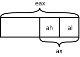
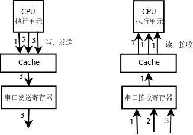

# 6. volatile 限定符

现在探讨一下编译器优化会对生成的指令产生什么影响，在此基础上介绍 C 语言的 `volatile` 限定符。看下面的例子。

**例 19.7. volatile 限定符**

```c
/* artificial device registers */
unsigned char recv;
unsigned char send;

/* memory buffer */
unsigned char buf[3];

int main(void)
{
	buf[0] = recv;
	buf[1] = recv;
	buf[2] = recv;
	send = ~buf[0];
	send = ~buf[1];
	send = ~buf[2];

	return 0;
}
```

我们用 `recv` 和 `send` 这两个全局变量来模拟设备寄存器。假设某种平台采用内存映射 I/O，串口发送寄存器和串口接收寄存器位于固定的内存地址，而 `recv` 和 `send` 这两个全局变量也有固定的内存地址，所以在这个例子中把它们假想成串口接收寄存器和串口发送寄存器。在 `main` 函数中，首先从串口接收三个字节存到 `buf` 中，然后把这三个字节取反，依次从串口发送出去[^31]。我们查看这段代码的反汇编结果：

```text
buf[0] = recv;
 80483a2:       0f b6 05 19 a0 04 08    movzbl 0x804a019,%eax
 80483a9:       a2 1a a0 04 08          mov    %al,0x804a01a
        buf[1] = recv;
 80483ae:       0f b6 05 19 a0 04 08    movzbl 0x804a019,%eax
 80483b5:       a2 1b a0 04 08          mov    %al,0x804a01b
        buf[2] = recv;
 80483ba:       0f b6 05 19 a0 04 08    movzbl 0x804a019,%eax
 80483c1:       a2 1c a0 04 08          mov    %al,0x804a01c
        send = ~buf[0];
 80483c6:       0f b6 05 1a a0 04 08    movzbl 0x804a01a,%eax
 80483cd:       f7 d0                   not    %eax
 80483cf:       a2 18 a0 04 08          mov    %al,0x804a018
        send = ~buf[1];
 80483d4:       0f b6 05 1b a0 04 08    movzbl 0x804a01b,%eax
 80483db:       f7 d0                   not    %eax
 80483dd:       a2 18 a0 04 08          mov    %al,0x804a018
        send = ~buf[2];
 80483e2:       0f b6 05 1c a0 04 08    movzbl 0x804a01c,%eax
 80483e9:       f7 d0                   not    %eax
 80483eb:       a2 18 a0 04 08          mov    %al,0x804a018
```

`movz ` 指令把字长较短的值存到字长较长的存储单元中，存储单元的高位用 0 填充。该指令可以有`b ` （byte）、`w ` （word）、`l ` （long）三种后缀，分别表示单字节、两字节和四字节。比如`movzbl 0x804a019,%eax ` 表示把地址 0x804a019 处的一个字节存到`eax ` 寄存器中，而`eax ` 寄存器是四字节的，高三字节用 0 填充，而下一条指令`mov %al,0x804a01a ` 中的`al ` 寄存器正是`eax ` 寄存器的低字节，把这个字节存到地址 0x804a01a 处的一个字节中。可以用不同的名字单独访问 x86 寄存器的低 8 位、次低 8 位、低 16 位或者完整的 32 位，以`eax ` 为例，`al ` 表示低 8 位，`ah ` 表示次低 8 位，`ax` 表示低 16 位，如下图所示。

<div align="center">

  

  <p><b>图 19.7. eax 寄存器</b></p>

</div>

但如果指定优化选项 `-O` 编译，反汇编的结果就不一样了：

```text
$ gcc main.c -g -O
$ objdump -dS a.out|less
...
        buf[0] = recv;
 80483ae:       0f b6 05 19 a0 04 08    movzbl 0x804a019,%eax
 80483b5:       a2 1a a0 04 08          mov    %al,0x804a01a
        buf[1] = recv;
 80483ba:       a2 1b a0 04 08          mov    %al,0x804a01b
        buf[2] = recv;
 80483bf:       a2 1c a0 04 08          mov    %al,0x804a01c
        send = ~buf[0];
        send = ~buf[1];
        send = ~buf[2];
 80483c4:       f7 d0                   not    %eax
 80483c6:       a2 18 a0 04 08          mov    %al,0x804a018
...
```

前三条语句从串口接收三个字节，而编译生成的指令显然不符合我们的意图：只有第一条语句从内存地址 0x804a019 读一个字节到寄存器 `eax` 中，然后从寄存器 `al` 保存到 `buf[0]` ，后两条语句就不再从内存地址 0x804a019 读取，而是直接把寄存器 `al` 的值保存到 `buf[1]` 和 `buf[2]` 。后三条语句把 `buf` 中的三个字节取反再发送到串口，编译生成的指令也不符合我们的意图：只有最后一条语句把 `eax` 的值取反写到内存地址 0x804a018 了，前两条语句形同虚设，根本不生成指令。

为什么编译器优化的结果会错呢？因为编译器并不知道 0x804a018 和 0x804a019 是设备寄存器的地址，把它们当成普通的内存单元了。如果是普通的内存单元，只要程序不去改写它，它就不会变，可以先把内存单元里的值读到寄存器缓存起来，以后每次用到这个值就直接从寄存器读取，这样效率更高，我们知道读寄存器远比读内存要快。另一方面，如果对一个普通的内存单元连续做三次写操作，只有最后一次的值会保存到内存单元中，所以前两次写操作是多余的，可以优化掉。访问设备寄存器的代码这样优化就错了，因为设备寄存器往往具有以下特性：

* 设备寄存器中的数据不需要改写就可以自己发生变化，每次读上来的值都可能不一样。

* 连续多次向设备寄存器中写数据并不是在做无用功，而是有特殊意义的。

用优化选项编译生成的指令明显效率更高，但使用不当会出错，为了避免编译器自作聪明，把不该优化的也优化了，程序员应该明确告诉编译器哪些内存单元的访问是不能优化的，在 C 语言中可以用 `volatile` 限定符修饰变量，就是告诉编译器，即使在编译时指定了优化选项，每次读这个变量仍然要老老实实从内存读取，每次写这个变量也仍然要老老实实写回内存，不能省略任何步骤。我们把代码的开头几行改成：

```c
/* artificial device registers */
volatile unsigned char recv;
volatile unsigned char send;
```

然后指定优化选项 `-O` 编译，查看反汇编的结果：

```text
buf[0] = recv;
 80483a2:       0f b6 05 19 a0 04 08    movzbl 0x804a019,%eax
 80483a9:       a2 1a a0 04 08          mov    %al,0x804a01a
        buf[1] = recv;
 80483ae:       0f b6 15 19 a0 04 08    movzbl 0x804a019,%edx
 80483b5:       88 15 1b a0 04 08       mov    %dl,0x804a01b
        buf[2] = recv;
 80483bb:       0f b6 0d 19 a0 04 08    movzbl 0x804a019,%ecx
 80483c2:       88 0d 1c a0 04 08       mov    %cl,0x804a01c
        send = ~buf[0];
 80483c8:       f7 d0                   not    %eax
 80483ca:       a2 18 a0 04 08          mov    %al,0x804a018
        send = ~buf[1];
 80483cf:       f7 d2                   not    %edx
 80483d1:       88 15 18 a0 04 08       mov    %dl,0x804a018
        send = ~buf[2];
 80483d7:       f7 d1                   not    %ecx
 80483d9:       88 0d 18 a0 04 08       mov    %cl,0x804a018
```

确实每次读 `recv` 都从内存地址 0x804a019 读取，每次写 `send` 也都写到内存地址 0x804a018 了。值得注意的是，每次写 `send` 并不需要取出 `buf` 中的值，而是取出先前缓存在寄存器 `eax` 、 `edx` 、 `ecx` 中的值，做取反运算然后写下去，这是因为 `buf` 并没有用 `volatile` 限定，读者可以试着在 `buf` 的定义前面也加上 `volatile` ，再优化编译，再查看反汇编的结果。

`gcc ` 的编译优化选项有`-O0 ` 、`-O ` 、`-O1 ` 、`-O2 ` 、`-O3 ` 、`-Os ` 几种。`-O0 ` 表示不优化，这是缺省的选项。`-O1 ` 、`-O2 ` 和`-O3 ` 这几个选项一个比一个优化得更多，编译时间也更长。`-O ` 和`-O1 ` 相同。`-Os ` 表示为缩小目标文件的尺寸而优化。具体每种选项做了哪些优化请参考`gcc(1)` 的 Man Page。

从上面的例子还可以看到，如果在编译时指定了优化选项，源代码和生成指令的次序可能无法对应，甚至有些源代码可能不对应任何指令，被彻底优化掉了。这一点在用 `gdb` 做源码级调试时尤其需要注意（做指令级调试没关系），在为调试而编译时不要指定优化选项，否则可能无法一步步跟踪源代码的执行过程。

有了 `volatile` 限定符，是可以防止编译器优化对设备寄存器的访问，但是对于有 Cache 的平台，仅仅这样还不够，还是无法防止 Cache 优化对设备寄存器的访问。在访问普通的内存单元时，Cache 对程序员是透明的，比如执行了 `movzbl 0x804a019,%eax` 这样一条指令，我们并不知道 `eax` 的值是真的从内存地址 0x804a019 读到的，还是从 Cache 中读到的，如果 Cache 已经缓存了这个地址的数据就从 Cache 读，如果 Cache 没有缓存就从内存读，这些步骤都是硬件自动做的，而不是用指令控制 Cache 去做的，程序员写的指令中只有寄存器、内存地址，而没有 Cache，程序员甚至不需要知道 Cache 的存在。同样道理，如果执行了 `mov %al,0x804a01a` 这样一条指令，我们并不知道寄存器的值是真的写回内存了，还是只写到了 Cache 中，以后再由 Cache 写回内存，即使只写到了 Cache 中而暂时没有写回内存，下次读 0x804a01a 这个地址时仍然可以从 Cache 中读到上次写的数据。然而，在读写设备寄存器时 Cache 的存在就不容忽视了，如果串口发送和接收寄存器的内存地址被 Cache 缓存了会有什么问题呢？如下图所示。

<div align="center">

  

  <p><b>图 19.8. 串口发送和接收寄存器被 Cache 缓存会有什么问题</b></p>

</div>

如果串口发送寄存器的地址被 Cahce 缓存，CPU 执行单元对串口发送寄存器做写操作都写到 Cache 中去了，串口发送寄存器并没有及时得到数据，也就不能及时发送，CPU 执行单元先后发出的 1、2、3 三个字节都会写到 Cache 中的同一个单元，最后 Cache 中只保存了第 3 个字节，如果这时 Cache 把数据写回到串口发送寄存器，只能把第 3 个字节发送出去，前两个字节就丢失了。与此类似，如果串口接收寄存器的地址被 Cache 缓存，CPU 执行单元在读第 1 个字节时，Cache 会从串口接收寄存器读上来缓存，然而串口接收寄存器后面收到的 2、3 两个字节 Cache 并不知道，因为 Cache 把串口接收寄存器当作普通内存单元，并且相信内存单元中的数据是不会自己变的，以后每次读串口接收寄存器时，Cache 都会把缓存的第 1 个字节提供给 CPU 执行单元。

通常，有 Cache 的平台都有办法对某一段地址范围禁用 Cache，一般是在页表中设置的，可以设定哪些页面允许 Cache 缓存，哪些页面不允许 Cache 缓存，MMU 不仅要做地址转换和访问权限检查，也要和 Cache 协同工作。

除了设备寄存器需要用 `volatile` 限定之外，当一个全局变量被同一进程中的多个控制流程访问时也要用 `volatile` 限定，比如信号处理函数和多线程。

[^31]: 实际的串口设备通常有一些标志位指示是否有数据到达以及是否可以发送下一个字节的数据，通常要先查询这些标志位再做读写操作，在这个例子中我们抓主要矛盾，忽略这些细节。
