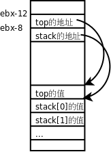

# 4. 共享库

## 4.1. 编译、链接、运行

组成共享库的目标文件和一般的目标文件有所不同，在编译时要加 `-fPIC` 选项，例如：

```text
$ gcc -c -fPIC stack/stack.c stack/push.c stack/pop.c stack/is_empty.c
```

`-f ` 后面跟一些编译选项，`PIC ` 是其中一种，表示生成位置无关代码（Position Independent Code）。那么用`-fPIC` 生成的目标文件和一般的目标文件有什么不同呢？下面分析这个问题。

我们知道一般的目标文件称为 Relocatable，在链接时可以把目标文件中各段的地址做重定位，重定位时需要修改指令。我们先不加 `-fPIC` 选项编译生成目标文件：

```text
$ gcc -c -g stack/stack.c stack/push.c stack/pop.c stack/is_empty.c
```

由于接下来要用 `objdump -dS` 把反汇编指令和源代码穿插起来分析，所以用 `-g` 选项加调试信息。注意，加调试信息必须在编译每个目标文件时用 `-g` 选项，而不能只在最后编译生成可执行文件时用 `-g` 选项。反汇编查看 `push.o` ：

```text
$ objdump -dS push.o

push.o:     file format elf32-i386

Disassembly of section .text:

00000000 <push>:
/* push.c */
extern char stack[512];
extern int top;

void push(char c)
{
   0:	55                   	push   %ebp
   1:	89 e5                	mov    %esp,%ebp
   3:	83 ec 04             	sub    $0x4,%esp
   6:	8b 45 08             	mov    0x8(%ebp),%eax
   9:	88 45 fc             	mov    %al,-0x4(%ebp)
	stack[++top] = c;
   c:	a1 00 00 00 00       	mov    0x0,%eax
  11:	83 c0 01             	add    $0x1,%eax
  14:	a3 00 00 00 00       	mov    %eax,0x0
  19:	8b 15 00 00 00 00    	mov    0x0,%edx
  1f:	0f b6 45 fc          	movzbl -0x4(%ebp),%eax
  23:	88 82 00 00 00 00    	mov    %al,0x0(%edx)
}
  29:	c9                   	leave
  2a:	c3                   	ret
```

指令中凡是用到 `stack` 和 `top` 的地址都用 0x0 表示，准备在重定位时修改。再看 `readelf` 输出的 `.rel.text` 段的信息：

```text
Relocation section '.rel.text' at offset 0x848 contains 4 entries:
 Offset     Info    Type            Sym.Value  Sym. Name
0000000d  00001001 R_386_32          00000000   top
00000015  00001001 R_386_32          00000000   top
0000001b  00001001 R_386_32          00000000   top
00000025  00001101 R_386_32          00000000   stack
```

标出了指令中有四处需要在重定位时修改。下面编译链接成可执行文件之后再做反汇编分析：

```text
$ gcc -g main.c stack.o push.o pop.o is_empty.o -Istack -o main
$ objdump -dS main
...
080483c0 <push>:
/* push.c */
extern char stack[512];
extern int top;

void push(char c)
{
 80483c0:       55                      push   %ebp
 80483c1:       89 e5                   mov    %esp,%ebp
 80483c3:       83 ec 04                sub    $0x4,%esp
 80483c6:       8b 45 08                mov    0x8(%ebp),%eax
 80483c9:       88 45 fc                mov    %al,-0x4(%ebp)
        stack[++top] = c;
 80483cc:       a1 10 a0 04 08          mov    0x804a010,%eax
 80483d1:       83 c0 01                add    $0x1,%eax
 80483d4:       a3 10 a0 04 08          mov    %eax,0x804a010
 80483d9:       8b 15 10 a0 04 08       mov    0x804a010,%edx
 80483df:       0f b6 45 fc             movzbl -0x4(%ebp),%eax
 80483e3:       88 82 40 a0 04 08       mov    %al,0x804a040(%edx)
}
 80483e9:       c9                      leave
 80483ea:       c3                      ret
 80483eb:       90                      nop
...
```

原来指令中的 0x0 被修改成了 0x804a010 和 0x804a040，这样做了重定位之后，各段的加载地址就定死了，因为在指令中使用了绝对地址。

现在看用 `-fPIC` 编译生成的目标文件有什么不同：

```text
$ gcc -c -g -fPIC stack/stack.c stack/push.c stack/pop.c stack/is_empty.c
$ objdump -dS push.o

push.o:     file format elf32-i386

Disassembly of section .text:

00000000 <push>:
/* push.c */
extern char stack[512];
extern int top;

void push(char c)
{
   0:	55                   	push   %ebp
   1:	89 e5                	mov    %esp,%ebp
   3:	53                   	push   %ebx
   4:	83 ec 04             	sub    $0x4,%esp
   7:	e8 fc ff ff ff       	call   8 <push+0x8>
   c:	81 c3 02 00 00 00    	add    $0x2,%ebx
  12:	8b 45 08             	mov    0x8(%ebp),%eax
  15:	88 45 f8             	mov    %al,-0x8(%ebp)
	stack[++top] = c;
  18:	8b 83 00 00 00 00    	mov    0x0(%ebx),%eax
  1e:	8b 00                	mov    (%eax),%eax
  20:	8d 50 01             	lea    0x1(%eax),%edx
  23:	8b 83 00 00 00 00    	mov    0x0(%ebx),%eax
  29:	89 10                	mov    %edx,(%eax)
  2b:	8b 83 00 00 00 00    	mov    0x0(%ebx),%eax
  31:	8b 08                	mov    (%eax),%ecx
  33:	8b 93 00 00 00 00    	mov    0x0(%ebx),%edx
  39:	0f b6 45 f8          	movzbl -0x8(%ebp),%eax
  3d:	88 04 0a             	mov    %al,(%edx,%ecx,1)
}
  40:	83 c4 04             	add    $0x4,%esp
  43:	5b                   	pop    %ebx
  44:	5d                   	pop    %ebp
  45:	c3                   	ret

Disassembly of section .text.__i686.get_pc_thunk.bx:

00000000 <__i686.get_pc_thunk.bx>:
   0:	8b 1c 24             	mov    (%esp),%ebx
   3:	c3                   	ret
```

指令中用到的 `stack` 和 `top` 的地址不再以 0x0 表示，而是以 `0x0(%ebx)` 表示，但其中还是留有 0x0 准备做进一步修改。再看 `readelf` 输出的 `.rel.text` 段：

```text
Relocation section '.rel.text' at offset 0x94c contains 6 entries:
 Offset     Info    Type            Sym.Value  Sym. Name
00000008  00001202 R_386_PC32        00000000   __i686.get_pc_thunk.bx
0000000e  0000130a R_386_GOTPC       00000000   _GLOBAL_OFFSET_TABLE_
0000001a  00001403 R_386_GOT32       00000000   top
00000025  00001403 R_386_GOT32       00000000   top
0000002d  00001403 R_386_GOT32       00000000   top
00000035  00001503 R_386_GOT32       00000000   stack
```

`top ` 和`stack ` 对应的记录类型不再是`R_386_32 ` 了，而是`R_386_GOT32` ，有什么区别呢？我们先编译生成共享库再做反汇编分析：

```text
$ gcc -shared -o libstack.so stack.o push.o pop.o is_empty.o
$ objdump -dS libstack.so
...
0000047c <push>:
/* push.c */
extern char stack[512];
extern int top;

void push(char c)
{
 47c:	55                   	push   %ebp
 47d:	89 e5                	mov    %esp,%ebp
 47f:	53                   	push   %ebx
 480:	83 ec 04             	sub    $0x4,%esp
 483:	e8 ef ff ff ff       	call   477 <__i686.get_pc_thunk.bx>
 488:	81 c3 6c 1b 00 00    	add    $0x1b6c,%ebx
 48e:	8b 45 08             	mov    0x8(%ebp),%eax
 491:	88 45 f8             	mov    %al,-0x8(%ebp)
	stack[++top] = c;
 494:	8b 83 f4 ff ff ff    	mov    -0xc(%ebx),%eax
 49a:	8b 00                	mov    (%eax),%eax
 49c:	8d 50 01             	lea    0x1(%eax),%edx
 49f:	8b 83 f4 ff ff ff    	mov    -0xc(%ebx),%eax
 4a5:	89 10                	mov    %edx,(%eax)
 4a7:	8b 83 f4 ff ff ff    	mov    -0xc(%ebx),%eax
 4ad:	8b 08                	mov    (%eax),%ecx
 4af:	8b 93 f8 ff ff ff    	mov    -0x8(%ebx),%edx
 4b5:	0f b6 45 f8          	movzbl -0x8(%ebp),%eax
 4b9:	88 04 0a             	mov    %al,(%edx,%ecx,1)
}
 4bc:	83 c4 04             	add    $0x4,%esp
 4bf:	5b                   	pop    %ebx
 4c0:	5d                   	pop    %ebp
 4c1:	c3                   	ret
 4c2:	90                   	nop
 4c3:	90                   	nop
...
```

和先前的结果不同，指令中的 `0x0(%ebx)` 被修改成 `-0xc(%ebx)` 和 `-0x8(%ebx)` ，而不是修改成绝对地址。所以共享库各段的加载地址并没有定死，可以加载到任意位置，因为指令中没有使用绝对地址，因此称为位置无关代码。另外，注意这几条指令：

```text
494:	8b 83 f4 ff ff ff    	mov    -0xc(%ebx),%eax
 49a:	8b 00                	mov    (%eax),%eax
 49c:	8d 50 01             	lea    0x1(%eax),%edx
```

和先前的指令对比一下：

```text
80483cc:       a1 10 a0 04 08          mov    0x804a010,%eax
 80483d1:       83 c0 01                add    $0x1,%eax
```

可以发现， `-0xc(%ebx)` 这个地址并不是变量 `top` 的地址，这个地址的内存单元中又保存了另外一个地址，这另外一个地址才是变量 `top` 的地址，所以 `mov -0xc(%ebx),%eax` 是把变量 `top` 的地址传给 `eax` ，而 `mov (%eax),%eax` 才是从 `top` 的地址中取出 `top` 的值传给 `eax` 。 `lea 0x1(%eax),%edx` 是把 `top` 的值加 1 存到 `edx` 中，如下图所示：

<div align="center">

  

  <p><b>图 20.3. 间接寻址</b></p>

</div>

`top ` 和`stack` 的绝对地址保存在一个地址表中，而指令通过地址表做间接寻址，因此避免了将绝对地址写死在指令中，这也是一种避免硬编码的策略。

现在把 `main.c` 和共享库编译链接在一起，然后运行：

```text
$ gcc main.c -g -L. -lstack -Istack -o main
$ ./main
./main: error while loading shared libraries: libstack.so: cannot open shared object file: No such file or directory
```

结果出乎意料，编译的时候没问题，由于指定了 `-L.` 选项，编译器可以在当前目录下找到 `libstack.so` ，而运行时却说找不到 `libstack.so` 。那么运行时在哪些路径下找共享库呢？我们先用 `ldd` 命令查看可执行文件依赖于哪些共享库：

```text
$ ldd main
	linux-gate.so.1 =>  (0xb7f5c000)
	libstack.so => not found
	libc.so.6 => /lib/tls/i686/cmov/libc.so.6 (0xb7dcf000)
	/lib/ld-linux.so.2 (0xb7f42000)
```

`ldd ` 模拟运行一遍`main ` ，在运行过程中做动态链接，从而得知这个可执行文件依赖于哪些共享库，每个共享库都在什么路径下，加载到进程地址空间的什么地址。`/lib/ld-linux.so.2 ` 是动态链接器，它的路径是在编译链接时指定的，我们在[第 2 节 “`main ` 函数和启动例程”](ch19s02.md#asmc.main)讲过`gcc ` 在做链接时用`-dynamic-linker ` 指定动态链接器的路径，它也像其它共享库一样加载到进程的地址空间中。`libc.so.6 ` 的路径`/lib/tls/i686/cmov/libc.so.6 ` 是由动态链接器`ld-linux.so.2 ` 在做动态链接时搜索到的，而`libstack.so ` 的路径没有找到。`linux-gate.so.1 ` 这个共享库其实并不存在于文件系统中，它是由内核虚拟出来的共享库，所以它没有对应的路径，它负责处理系统调用。总之，共享库的搜索路径由动态链接器决定，从`ld.so(8)` 的 Man Page 可以查到共享库路径的搜索顺序：

1. 首先在环境变量 `LD_LIBRARY_PATH` 所记录的路径中查找。

2. 然后从缓存文件 `/etc/ld.so.cache` 中查找。这个缓存文件由 `ldconfig` 命令读取配置文件 `/etc/ld.so.conf` 之后生成，稍后详细解释。

3. 如果上述步骤都找不到，则到默认的系统路径中查找，先是/usr/lib 然后是/lib。

先试试第一种方法，在运行 `main` 时通过环境变量 `LD_LIBRARY_PATH` 把当前目录添加到共享库的搜索路径：

```text
$ LD_LIBRARY_PATH=. ./main
```

这种方法只适合在开发中临时用一下，通常 `LD_LIBRARY_PATH` 是不推荐使用的，尽量不要设置这个环境变量，理由可以参考 Why LD_LIBRARY_PATH is bad（[http://www.visi.com/~barr/ldpath.html](http://www.visi.com/~barr/ldpath.md)）。

再试试第二种方法，这是最常用的方法。把 `libstack.so` 所在目录的绝对路径（比如/home/akaedu/somedir）添加到 `/etc/ld.so.conf` 中（该文件中每个路径占一行），然后运行 `ldconfig` ：

```text
$ sudo ldconfig -v
...
/home/akaedu/somedir:
        libstack.so -> libstack.so
/lib:
        libe2p.so.2 -> libe2p.so.2.3
        libncursesw.so.5 -> libncursesw.so.5.6
...
/usr/lib:
        libkdeinit_klauncher.so -> libkdeinit_klauncher.so
        libv4l2.so.0 -> libv4l2.so.0
...
/usr/lib64:
/lib/tls: (hwcap: 0x8000000000000000)
/usr/lib/sse2: (hwcap: 0x0000000004000000)
...
/usr/lib/tls: (hwcap: 0x8000000000000000)
...
/usr/lib/i686: (hwcap: 0x0008000000000000)
/usr/lib/i586: (hwcap: 0x0004000000000000)
...
/usr/lib/i486: (hwcap: 0x0002000000000000)
...
/lib/tls/i686: (hwcap: 0x8008000000000000)
/usr/lib/i686/cmov: (hwcap: 0x0008000000008000)
...
/lib/tls/i686/cmov: (hwcap: 0x8008000000008000)
```

`ldconfig ` 命令除了处理`/etc/ld.so.conf ` 中配置的目录之外，还处理一些默认目录，如`/lib ` 、`/usr/lib ` 等，处理之后生成`/etc/ld.so.cache ` 缓存文件，动态链接器就从这个缓存中搜索共享库。hwcap 是 x86 平台的 Linux 特有的一种机制，系统检测到当前平台是 i686 而不是`i586 ` 或`i486 ` ，所以在运行程序时使用 i686 的库，这样可以更好地发挥平台的性能，也可以利用一些新的指令，所以上面`ldd ` 命令的输出结果显示动态链接器搜索到的`libc ` 是`/lib/tls/i686/cmov/libc.so.6 ` ，而不是`/lib/libc.so.6 ` 。现在再用`ldd ` 命令查看，`libstack.so` 就能找到了：

```text
$ ldd main
	linux-gate.so.1 =>  (0xb809c000)
	libstack.so => /home/akaedu/somedir/libstack.so (0xb806a000)
	libc.so.6 => /lib/tls/i686/cmov/libc.so.6 (0xb7f0c000)
	/lib/ld-linux.so.2 (0xb8082000)
```

第三种方法就是把 `libstack.so` 拷到 `/usr/lib` 或 `/lib` 目录，这样可以确保动态链接器能找到这个共享库。

其实还有第四种方法，在编译可执行文件 `main` 的时候就把 `libstack.so` 的路径写死在可执行文件中：

```text
$ gcc main.c -g -L. -lstack -Istack -o main -Wl,-rpath,/home/akaedu/somedir
```

`-Wl,-rpath,/home/akaedu/somedir ` 表示`-rpath /home/akaedu/somedir ` 是由`gcc ` 传递给链接器的选项。可以看到`readelf ` 的结果多了一条`rpath` 记录：

```text
$ readelf -a main
...
Dynamic section at offset 0xf10 contains 23 entries:
  Tag        Type                         Name/Value
 0x00000001 (NEEDED)                     Shared library: [libstack.so]
 0x00000001 (NEEDED)                     Shared library: [libc.so.6]
 0x0000000f (RPATH)                      Library rpath: [/home/akaedu/somedir]
...
```

还可以看出，可执行文件运行时需要哪些共享库也都记录在 `.dynamic` 段中。当然 `rpath` 这种办法也是不推荐的，把共享库的路径定死了，失去了灵活性。

## 4.2. 动态链接的过程

本节研究一下在 `main.c` 中调用共享库的函数 `push` 是如何实现的。首先反汇编看一下 `main` 的指令：

```text
$ objdump -dS main
...
Disassembly of section .plt:

080483a8 <__gmon_start__@plt-0x10>:
 80483a8:	ff 35 f8 9f 04 08    	pushl  0x8049ff8
 80483ae:	ff 25 fc 9f 04 08    	jmp    *0x8049ffc
 80483b4:	00 00                	add    %al,(%eax)
...
080483d8 <push@plt>:
 80483d8:	ff 25 08 a0 04 08    	jmp    *0x804a008
 80483de:	68 10 00 00 00       	push   $0x10
 80483e3:	e9 c0 ff ff ff       	jmp    80483a8 <_init+0x30>

Disassembly of section .text:
...
080484a4 <main>:
/* main.c */
#include <stdio.h>
#include "stack.h"

int main(void)
{
 80484a4:	8d 4c 24 04          	lea    0x4(%esp),%ecx
 80484a8:	83 e4 f0             	and    $0xfffffff0,%esp
 80484ab:	ff 71 fc             	pushl  -0x4(%ecx)
 80484ae:	55                   	push   %ebp
 80484af:	89 e5                	mov    %esp,%ebp
 80484b1:	51                   	push   %ecx
 80484b2:	83 ec 04             	sub    $0x4,%esp
	push('a');
 80484b5:	c7 04 24 61 00 00 00 	movl   $0x61,(%esp)
 80484bc:	e8 17 ff ff ff       	call   80483d8 <push@plt>
...
```

和[第 3 节 “静态库”](ch20s03.md#link.staticlib)链接静态库不同， `push` 函数没有链接到可执行文件中。而且 `call 80483d8 <push@plt>` 这条指令调用的也不是 `push` 函数的地址。共享库是位置无关代码，在运行时可以加载到任意地址，其加载地址只有在动态链接时才能确定，所以在 `main` 函数中不可能直接通过绝对地址调用 `push` 函数，也是通过间接寻址来找 `push` 函数的。对照着上面的指令，我们用 `gdb` 跟踪一下：

```text
$ gdb main
...
(gdb) start
Breakpoint 1 at 0x80484b5: file main.c, line 7.
Starting program: /home/akaedu/somedir/main
main () at main.c:7
7		push('a');
(gdb) si
0x080484bc	7		push('a');
(gdb) si
0x080483d8 in push@plt ()
Current language:  auto; currently asm
```

跳转到 `.plt` 段中，现在将要执行一条 `jmp *0x804a008` 指令，我们看看 0x804a008 这个地址里存的是什么：

```text
(gdb) x 0x804a008
0x804a008 <_GLOBAL_OFFSET_TABLE_+20>:	0x080483de
```

原来就是下一条指令 `push $0x10` 的地址。继续跟踪下去：

```text
(gdb) si
0x080483de in push@plt ()
(gdb) si
0x080483e3 in push@plt ()
(gdb) si
0x080483a8 in ?? ()
(gdb) si
0x080483ae in ?? ()
(gdb) si
0xb806a080 in ?? () from /lib/ld-linux.so.2
```

最终进入了动态链接器 `/lib/ld-linux.so.2` ，在其中完成动态链接的过程并调用 `push` 函数，我们不深入这些细节了，直接用 `finish` 命令返回到 `main` 函数：

```text
(gdb) finish
Run till exit from #0  0xb806a080 in ?? () from /lib/ld-linux.so.2
main () at main.c:8
8		return 0;
Current language:  auto; currently c
```

这时再看看 0x804a008 这个地址里存的是什么：

```text
(gdb) x 0x804a008
0x804a008 <_GLOBAL_OFFSET_TABLE_+20>:	0xb803f47c
(gdb) x 0xb803f47c
0xb803f47c <push>:	0x53e58955
```

动态链接器已经把 `push` 函数的地址存在这里了，所以下次再调用 `push` 函数就可以直接从 `jmp *0x804a008` 指令跳到它的地址，而不必再进入 `/lib/ld-linux.so.2` 做动态链接了。

## 4.3. 共享库的命名惯例

你可能已经注意到了，系统的共享库通常带有符号链接，例如：

```text
$ ls -l  /lib
...
-rwxr-xr-x  1 root root 1315024 2009-01-09 22:10 libc-2.8.90.so
lrwxrwxrwx  1 root root      14 2008-07-04 05:58 libcap.so.1 -> libcap.so.1.10
-rw-r--r--  1 root root   10316 2007-08-01 03:20 libcap.so.1.10
lrwxrwxrwx  1 root root      14 2008-11-01 08:55 libcap.so.2 -> libcap.so.2.10
-rw-r--r--  1 root root   13792 2008-06-12 21:39 libcap.so.2.10
...
lrwxrwxrwx  1 root root      14 2009-01-13 09:28 libc.so.6 -> libc-2.8.90.so
...
$ ls -l /usr/lib/libc.so
-rw-r--r-- 1 root root 238 2009-01-09 21:59 /usr/lib/libc.so
```

按照共享库的命名惯例，每个共享库有三个文件名：real name、soname 和 linker name。真正的库文件（而不是符号链接）的名字是 real name，包含完整的共享库版本号。例如上面的 `libcap.so.1.10` 、 `libc-2.8.90.so` 等。

soname 是一个符号链接的名字，只包含共享库的主版本号，主版本号一致即可保证库函数的接口一致，因此应用程序的 `.dynamic` 段只记录共享库的 soname，只要 soname 一致，这个共享库就可以用。例如上面的 `libcap.so.1` 和 `libcap.so.2` 是两个主版本号不同的 `libcap` ，有些应用程序依赖于 `libcap.so.1` ，有些应用程序依赖于 `libcap.so.2` ，但对于依赖 `libcap.so.1` 的应用程序来说，真正的库文件不管是 `libcap.so.1.10` 还是 `libcap.so.1.11` 都可以用，所以使用共享库可以很方便地升级库文件而不需要重新编译应用程序，这是静态库所没有的优点。注意 `libc` 的版本编号有一点特殊， `libc-2.8.90.so` 的主版本号是 6 而不是 2 或 2.8。

linker name 仅在编译链接时使用， `gcc` 的 `-L` 选项应该指定 linker name 所在的目录。有的 linker name 是库文件的一个符号链接，有的 linker name 是一段链接脚本。例如上面的 `libc.so` 就是一个 linker name，它是一段链接脚本：

```text
$ cat /usr/lib/libc.so
/* GNU ld script
   Use the shared library, but some functions are only in
   the static library, so try that secondarily.  */
OUTPUT_FORMAT(elf32-i386)
GROUP ( /lib/libc.so.6 /usr/lib/libc_nonshared.a  AS_NEEDED ( /lib/ld-linux.so.2 ) )
```

下面重新编译我们的 `libstack` ，指定它的 soname：

```text
$ gcc -shared -Wl,-soname,libstack.so.1 -o libstack.so.1.0 stack.o push.o pop.o is_empty.o
```

这样编译生成的库文件是 `libstack.so.1.0` ，是 real name，但这个库文件中记录了它的 soname 是 `libstack.so.1` ：

```text
$ readelf -a libstack.so.1.0
...
Dynamic section at offset 0xf10 contains 22 entries:
  Tag        Type                         Name/Value
 0x00000001 (NEEDED)                     Shared library: [libc.so.6]
 0x0000000e (SONAME)                     Library soname: [libstack.so.1]
...
```

如果把 `libstack.so.1.0` 所在的目录加入 `/etc/ld.so.conf` 中，然后运行 `ldconfig` 命令， `ldconfig` 会自动创建一个 soname 的符号链接：

```text
$ sudo ldconfig
$ ls -l libstack*
lrwxrwxrwx 1 root    root       15 2009-01-21 17:52 libstack.so.1 -> libstack.so.1.0
-rwxr-xr-x 1 akaedu  akaedu  10142 2009-01-21 17:49 libstack.so.1.0
```

但这样编译链接 `main.c` 却会报错：

```text
$ gcc main.c -L. -lstack -Istack -o main
/usr/bin/ld: cannot find -lstack
collect2: ld returned 1 exit status
```

注意，要做这个实验，你得把先前编译的 `libstack` 共享库、静态库都删掉，如果先前拷到 `/lib` 或者 `/usr/lib` 下了也删掉，只留下 `libstack.so.1.0` 和 `libstack.so.1` ，这样你会发现编译器不认这两个名字，因为编译器只认 linker name。可以先创建一个 linker name 的符号链接，然后再编译就没问题了：

```text
$ ln -s libstack.so.1.0 libstack.so
$ gcc main.c -L. -lstack -Istack -o main
```
