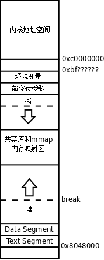
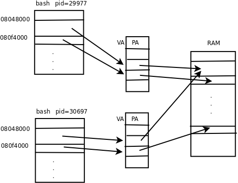
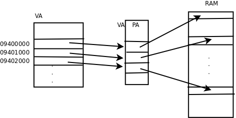
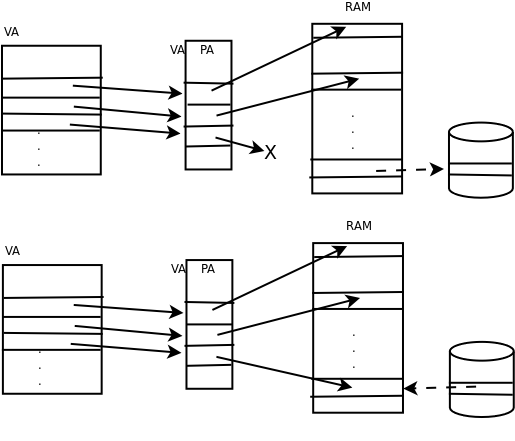

# 5. 虚拟内存管理

我们知道操作系统利用体系结构提供的 VA 到 PA 的转换机制实现虚拟内存管理。有了共享库的基础知识之后，现在我们可以进一步理解虚拟内存管理了。首先分析一个例子：

```text
$ ps
  PID TTY          TIME CMD
29977 pts/0    00:00:00 bash
30032 pts/0    00:00:00 ps
$ cat /proc/29977/maps
08048000-080f4000 r-xp 00000000 08:15 688142     /bin/bash
080f4000-080f9000 rw-p 000ac000 08:15 688142     /bin/bash
080f9000-080fe000 rw-p 080f9000 00:00 0
09283000-09497000 rw-p 09283000 00:00 0          [heap]
b7ca8000-b7cb2000 r-xp 00000000 08:15 581665     /lib/tls/i686/cmov/libnss_files-2.8.90.so
b7cb2000-b7cb3000 r--p 00009000 08:15 581665     /lib/tls/i686/cmov/libnss_files-2.8.90.so
b7cb3000-b7cb4000 rw-p 0000a000 08:15 581665     /lib/tls/i686/cmov/libnss_files-2.8.90.so
...
b7e15000-b7f6d000 r-xp 00000000 08:15 581656     /lib/tls/i686/cmov/libc-2.8.90.so
b7f6d000-b7f6f000 r--p 00158000 08:15 581656     /lib/tls/i686/cmov/libc-2.8.90.so
b7f6f000-b7f70000 rw-p 0015a000 08:15 581656     /lib/tls/i686/cmov/libc-2.8.90.so
...
b7fbd000-b7fd7000 r-xp 00000000 08:15 565466     /lib/ld-2.8.90.so
b7fd7000-b7fd8000 r-xp b7fd7000 00:00 0          [vdso]
b7fd8000-b7fd9000 r--p 0001a000 08:15 565466     /lib/ld-2.8.90.so
b7fd9000-b7fda000 rw-p 0001b000 08:15 565466     /lib/ld-2.8.90.so
bfac5000-bfada000 rw-p bffeb000 00:00 0          [stack]
```

用 `ps` 命令查看当前终端下的进程，得知 `bash` 进程的 id 是 29977，然后用 `cat /proc/29977/maps` 命令查看它的虚拟地址空间。 `/proc` 目录中的文件并不是真正的磁盘文件，而是由内核虚拟出来的文件系统，当前系统中运行的每个进程在 `/proc` 下都有一个子目录，目录名就是进程的 id，查看目录下的文件可以得到该进程的相关信息。此外，用 `pmap 29977` 命令也可以得到类似的输出结果。

<div align="center">

  

  <p><b>图 20.4. 进程地址空间</b></p>

</div>

在[第 4 节 “MMU”](ch17s04.md#arch.mmu)讲过，x86 平台的虚拟地址空间是 0x0000 0000~0xffff ffff，大致上前 3GB（0x0000 0000~0xbfff ffff）是用户空间，后 1GB（0xc000 0000~0xffff ffff）是内核空间，在这里得到了印证。0x0804 8000-0x080f 4000 是从 `/bin/bash` 加载到内存的，访问权限为 `r-x` ，表示 Text Segment，包含 `.text` 段、 `.rodata` 段、 `.plt` 段等。0x080f 4000-0x080f 9000 也是从 `/bin/bash` 加载到内存的，访问权限为 `rw-` ，表示 Data Segment，包含 `.data` 段、 `.bss` 段等。

0x0928 3000-0x0949 7000 不是从磁盘文件加载到内存的，这段空间称为堆（Heap），以后会讲到用 `malloc` 函数动态分配内存是在这里分配的。从 0xb7ca 8000 开始是共享库的映射空间，每个共享库也分为几个 Segment，每个 Segment 有不同的访问权限。可以看到，从堆空间的结束地址（0x0949 7000）到共享库映射空间的起始地址（0xb7ca 8000）之间有很大的地址空洞，在动态分配内存时堆空间是可以向高地址增长的。堆空间的地址上限（0x09497000）称为 Break，堆空间要向高地址增长就要抬高 Break，映射新的虚拟内存页面到物理内存，这是通过系统调用 `brk` 实现的， `malloc` 函数也是调用 `brk` 向内核请求分配内存的。

`/lib/ld-2.8.90.so ` 就是动态链接器`/lib/ld-linux.so.2 ` ，后者是前者的符号链接。标有`[vdso] ` 的地址范围是`linux-gate.so.1` 的映射空间，我们讲过这个共享库是由内核虚拟出来的。0xbfac 5000-0xbfad a000 是栈空间，其中高地址的部分保存着进程的环境变量和命令行参数，低地址的部分保存函数栈帧，栈空间是向低地址增长的，但显然没有堆空间那么大的可供增长的余地，因为实际的应用程序动态分配大量内存的并不少见，但是有几十层深的函数调用并且每层调用都有很多局部变量的非常少见。总之，栈空间是可能用尽的，并且比堆空间更容易用尽，在[第 3 节 “递归”](ch05s03.md#func2.recursion)讲过，无穷递归会用尽栈空间最终导致段错误。

虚拟内存管理起到了什么作用呢？可以从以下几个方面来理解。

第一，虚拟内存管理可以控制物理内存的访问权限。物理内存本身是不限制访问的，任何地址都可以读写，而操作系统要求不同的页面具有不同的访问权限，这是利用 CPU 模式和 MMU 的内存保护机制实现的。例如，Text Segment 被只读保护起来，防止被错误的指令意外改写，内核地址空间也被保护起来，防止在用户模式下执行错误的指令意外改写内核数据。这样，执行错误指令或恶意代码的破坏能力受到了限制，顶多使当前进程因段错误终止，而不会影响整个系统的稳定性。

第二，虚拟内存管理最主要的作用是让每个进程有独立的地址空间。所谓独立的地址空间是指，不同进程中的同一个 VA 被 MMU 映射到不同的 PA，并且在某一个进程中访问任何地址都不可能访问到另外一个进程的数据，这样使得任何一个进程由于执行错误指令或恶意代码导致的非法内存访问都不会意外改写其它进程的数据，不会影响其它进程的运行，从而保证整个系统的稳定性。另一方面，每个进程都认为自己独占整个虚拟地址空间，这样链接器和加载器的实现会比较容易，不必考虑各进程的地址范围是否冲突。

继续前面的实验，再打开一个终端窗口，看一下这个新的 `bash` 进程的地址空间，可以发现和先前的 `bash` 进程地址空间的布局差不多：

```text
$ ps
  PID TTY          TIME CMD
30697 pts/1    00:00:00 bash
30749 pts/1    00:00:00 ps
$ cat /proc/30697/maps
08048000-080f4000 r-xp 00000000 08:15 688142     /bin/bash
080f4000-080f9000 rw-p 000ac000 08:15 688142     /bin/bash
080f9000-080fe000 rw-p 080f9000 00:00 0
082d7000-084f9000 rw-p 082d7000 00:00 0          [heap]
b7cf1000-b7cfb000 r-xp 00000000 08:15 581665     /lib/tls/i686/cmov/libnss_files-2.8.90.so
b7cfb000-b7cfc000 r--p 00009000 08:15 581665     /lib/tls/i686/cmov/libnss_files-2.8.90.so
b7cfc000-b7cfd000 rw-p 0000a000 08:15 581665     /lib/tls/i686/cmov/libnss_files-2.8.90.so
...
b7e5e000-b7fb6000 r-xp 00000000 08:15 581656     /lib/tls/i686/cmov/libc-2.8.90.so
b7fb6000-b7fb8000 r--p 00158000 08:15 581656     /lib/tls/i686/cmov/libc-2.8.90.so
b7fb8000-b7fb9000 rw-p 0015a000 08:15 581656     /lib/tls/i686/cmov/libc-2.8.90.so
...
b8006000-b8020000 r-xp 00000000 08:15 565466     /lib/ld-2.8.90.so
b8020000-b8021000 r-xp b8020000 00:00 0          [vdso]
b8021000-b8022000 r--p 0001a000 08:15 565466     /lib/ld-2.8.90.so
b8022000-b8023000 rw-p 0001b000 08:15 565466     /lib/ld-2.8.90.so
bff0e000-bff23000 rw-p bffeb000 00:00 0          [stack]
```

该进程也占用了 0x0000 0000-0xbfff ffff 的地址空间，Text Segment 也是 0x0804 8000-0x080f 4000，Data Segment 也是 0x080f 4000-0x080f 9000，和先前的进程一模一样，因为这些地址是在编译链接时写进 `/bin/bash` 这个可执行文件的，两个进程都加载它。这两个进程在同一个系统中同时运行着，它们的 Data Segment 占用相同的 VA，但是两个进程各自干各自的事情，显然 Data Segment 中的数据应该是不同的，相同的 VA 怎么会有不同的数据呢？因为它们被映射到不同的 PA。如下图所示。

<div align="center">

  

  <p><b>图 20.5. 进程地址空间是独立的</b></p>

</div>

从图中还可以看到，两个进程都是 `bash` 进程，Text Segment 是一样的，并且 Text Segment 是只读的，不会被改写，因此操作系统会安排两个进程的 Text Segment 共享相同的物理页面。由于每个进程都有自己的一套 VA 到 PA 的映射表，整个地址空间中的任何 VA 都在每个进程自己的映射表中查找相应的 PA，因此不可能访问到其它进程的地址，也就没有可能意外改写其它进程的数据。

另外，注意到两个进程的共享库加载地址并不相同，共享库的加载地址是在运行时决定的，而不是写在 `/bin/bash` 这个可执行文件中。但即使如此，也不影响两个进程共享相同物理页面中的共享库，当然，只有只读的部分是共享的，可读可写的部分不共享。

使用共享库可以大大节省内存。比如 `libc` ，系统中几乎所有的进程都映射 `libc` 到自己的进程地址空间，而 `libc` 的只读部分在物理内存中只需要存在一份，就可以被所有进程共享，这就是“共享库”这个名称的由来了。

现在我们也可以理解为什么共享库必须是位置无关代码了。比如 `libc` ，不同的进程虽然共享 `libc` 所在的物理页面，但这些物理页面被映射到各进程的虚拟地址空间时却位于不同的地址，所以要求 `libc` 的代码不管加载到什么地址都能正确执行。

第三，VA 到 PA 的映射会给分配和释放内存带来方便，物理地址不连续的几块内存可以映射成虚拟地址连续的一块内存。比如要用 `malloc` 分配一块很大的内存空间，虽然有足够多的空闲物理内存，却没有足够大的**连续**空闲内存，这时就可以分配多个不连续的物理页面而映射到连续的虚拟地址范围。如下图所示。

<div align="center">

  

  <p><b>图 20.6. 不连续的 PA 可以映射为连续的 VA</b></p>

</div>

第四，一个系统如果同时运行着很多进程，为各进程分配的内存之和可能会大于实际可用的物理内存，虚拟内存管理使得这种情况下各进程仍然能够正常运行。因为各进程分配的只不过是虚拟内存的页面，这些页面的数据可以映射到物理页面，也可以临时保存到磁盘上而不占用物理页面，在磁盘上临时保存虚拟内存页面的可能是一个磁盘分区，也可能是一个磁盘文件，称为交换设备（Swap Device）。当物理内存不够用时，将一些不常用的物理页面中的数据临时保存到交换设备，然后这个物理页面就认为是空闲的了，可以重新分配给进程使用，这个过程称为换出（Page out）。如果进程要用到被换出的页面，就从交换设备再加载回物理内存，这称为换入（Page in）。换出和换入操作统称为换页（Paging），因此：

```text
系统中可分配的内存总量 = 物理内存的大小 + 交换设备的大小
```

如下图所示。第一张图是换出，将物理页面中的数据保存到磁盘，并解除地址映射，释放物理页面。第二张图是换入，从空闲的物理页面中分配一个，将磁盘暂存的页面加载回内存，并建立地址映射。

<div align="center">

  

  <p><b>图 20.7. 换页</b></p>

</div>
