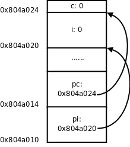
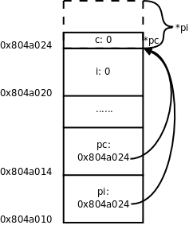

# 1. 指针的基本概念

在[第 12 章 **栈与队列**](ch12.md#stackqueue)讲过，堆栈有栈顶指针，队列有头指针和尾指针，这些概念中的“指针”本质上是一个整数，是数组的索引，通过指针访问数组中的某个元素。在[图 20.3 “间接寻址”](ch20s04.md#link.indirect)我们又看到另外一种指针的概念，把一个变量所在的内存单元的地址保存在另外一个内存单元中，保存地址的这个内存单元称为指针，通过指针和间接寻址访问变量，这种指针在 C 语言中可以用一个指针类型的变量表示，例如某程序中定义了以下全局变量：

```c
int i;
int *pi = &i;
char c;
char *pc = &c;
```

这几个变量的内存布局如下图所示，在初学阶段经常要借助于这样的图来理解指针。

<div align="center">

  

  <p><b>图 23.1. 指针的基本概念</b></p>

</div>

这里的 `&` 是取地址运算符（Address Operator）， `&i` 表示取变量 `i` 的地址， `int *pi = &i;` 表示定义一个指向 `int` 型的指针变量 `pi` ，并用 `i` 的地址来初始化 `pi` 。我们讲过全局变量只能用常量表达式初始化，如果定义 `int p = i;` 就错了，因为 `i` 不是常量表达式，然而用 `i` 的地址来初始化一个指针却没有错，因为 `i` 的地址是在编译链接时能确定的，而不需要到运行时才知道， `&i` 是常量表达式。后面两行代码定义了一个字符型变量 `c` 和一个指向 `c` 的字符型指针 `pc` ，注意 `pi` 和 `pc` 虽然是不同类型的指针变量，但它们的内存单元都占 4 个字节，因为要保存 32 位的虚拟地址，同理，在 64 位平台上指针变量都占 8 个字节。

我们知道，在同一个语句中定义多个数组，每一个都要有 `[]` 号： `int a[5], b[5];` 。同样道理，在同一个语句中定义多个指针变量，每一个都要有 `*` 号，例如：

```c
int *p, *q;
```

如果写成 `int* p, q;` 就错了，这样是定义了一个整型指针 `p` 和一个整型变量 `q` ，定义数组的 `[]` 号写在变量后面，而定义指针的 `*` 号写在变量前面，更容易看错。定义指针的 `*` 号前后空格都可以省，写成 `int*p,*q;` 也算对，但 `*` 号通常和类型 `int` 之间留空格而和变量名写在一起，这样看 `int *p, q;` 就很明显是定义了一个指针和一个整型变量，就不容易看错了。

如果要让 `pi` 指向另一个整型变量 `j` ，可以重新对 `pi` 赋值：

```c
pi = &j;
```

如果要改变 `pi` 所指向的整型变量的值，比如把变量 `j` 的值增加 10，可以写：

```c
*pi = *pi + 10;
```

这里的 `*` 号是指针间接寻址运算符（Indirection Operator）， `*pi` 表示取指针 `pi` 所指向的变量的值，也称为 Dereference 操作，指针有时称为变量的引用（Reference），所以根据指针找到变量称为 Dereference。

`& ` 运算符的操作数必须是左值，因为只有左值才表示一个内存单元，才会有地址，运算结果是指针类型。`* ` 运算符的操作数必须是指针类型，运算结果可以做左值。所以，如果表达式`E ` 可以做左值，`*&E ` 和`E ` 等价，如果表达式`E ` 是指针类型，`&*E ` 和`E` 等价。

指针之间可以相互赋值，也可以用一个指针初始化另一个指针，例如：

```c
int *ptri = pi;
```

或者：

```c
int *ptri;
ptri = pi;
```

表示** `pi` 指向哪就让 `ptri` 也指向哪**，本质上就是把变量 `pi` 所保存的地址值赋给变量 `ptri` 。

用一个指针给另一个指针赋值时要注意，两个指针必须是同一类型的。在我们的例子中， `pi` 是 `int *` 型的， `pc` 是 `char *` 型的， `pi = pc;` 这样赋值就是错误的。但是可以先强制类型转换然后赋值：

```c
pi = (int *)pc;
```

<div align="center">

  

  <p><b>图 23.2. 把 char *指针的值赋给 int *指针</b></p>

</div>

现在 `pi` 指向的地址和 `pc` 一样，但是通过 `*pc` 只能访问到一个字节，而通过 `*pi` 可以访问到 4 个字节，后 3 个字节已经不属于变量 `c` 了，除非你很确定变量 `c` 的一个字节和后面 3 个字节组合而成的 `int` 值是有意义的，否则就不应该给 `pi` 这么赋值。因此使用指针要特别小心，很容易将指针指向错误的地址，访问这样的地址可能导致段错误，可能读到无意义的值，也可能意外改写了某些数据，使得程序在随后的运行中出错。有一种情况需要特别注意，定义一个指针类型的局部变量而没有初始化：

```c
int main(void)
{
	int *p;
	...
	*p = 0;
	...
}
```

我们知道，在堆栈上分配的变量初始值是不确定的，也就是说指针 `p` 所指向的内存地址是不确定的，后面用 `*p` 访问不确定的地址就会导致不确定的后果，如果导致段错误还比较容易改正，如果意外改写了数据而导致随后的运行中出错，就很难找到错误原因了。像这种指向不确定地址的指针称为“野指针”（Unbound Pointer），为避免出现野指针，在定义指针变量时就应该给它明确的初值，或者把它初始化为 `NULL` ：

```c
int main(void)
{
	int *p = NULL;
	...
	*p = 0;
	...
}
```

`NULL ` 在 C 标准库的头文件`stddef.h` 中定义：

```c
#define NULL ((void *)0)
```

就是把地址 0 转换成指针类型，称为空指针，它的特殊之处在于，操作系统不会把任何数据保存在地址 0 及其附近，也不会把地址 0~0xfff 的页面映射到物理内存，所以任何对地址 0 的访问都会立刻导致段错误。 `*p = 0;` 会导致段错误，就像放在眼前的炸弹一样很容易找到，相比之下，野指针的错误就像埋下地雷一样，更难发现和排除，这次走过去没事，下次走过去就有事。

讲到这里就该讲一下 `void *` 类型了。在编程时经常需要一种通用指针，可以转换为任意其它类型的指针，任意其它类型的指针也可以转换为通用指针，最初 C 语言没有 `void *` 类型，就把 `char *` 当通用指针，需要转换时就用类型转换运算符 `()` ，ANSI 在将 C 语言标准化时引入了 `void *` 类型， `void *` 指针与其它类型的指针之间可以隐式转换，而不必用类型转换运算符。注意，只能定义 `void *` 指针，而不能定义 `void` 型的变量，因为 `void *` 指针和别的指针一样都占 4 个字节，而如果定义 `void` 型变量（也就是类型暂时不确定的变量），编译器不知道该分配几个字节给变量。同样道理， `void *` 指针不能直接 Dereference，而必须先转换成别的类型的指针再做 Dereference。 `void *` 指针常用于函数接口，比如：

```c
void func(void *pv)
{
	/* *pv = 'A' is illegal */
	char *pchar = pv;
	*pchar = 'A';
}

int main(void)
{
	char c;
	func(&c);
	printf("%c\n", c);
...
}
```

下一章讲函数接口时再详细介绍 `void *` 指针的用处。
