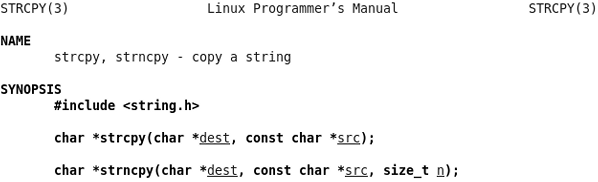
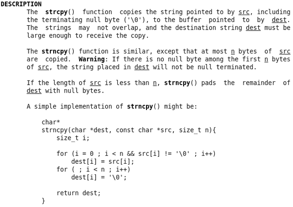
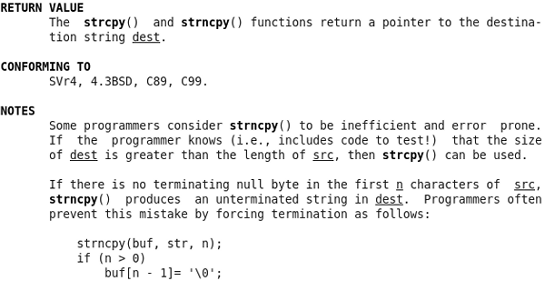
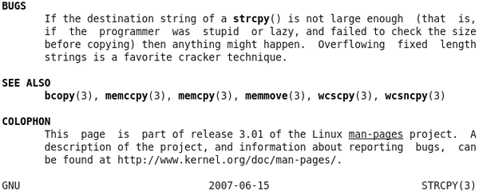
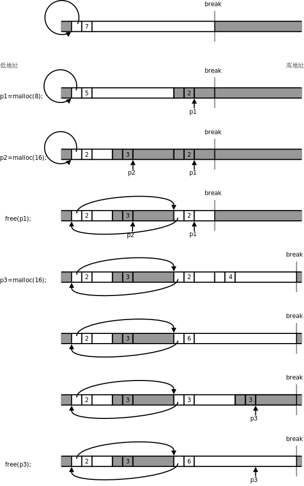

# 1. 本章的预备知识

这一节介绍本章的范例代码要用的几个 C 标准库函数。我们先体会一下这几个函数的接口是怎么设计的，Man Page 是怎么写的。其它常用的 C 标准库函数将在下一章介绍。

## 1.1. strcpy 与 strncpy

从现在开始我们要用到很多库函数，在学习每个库函数时一定要看 Man Page。Man Page 随时都在我们手边，想查什么只要敲一个命令就行，然而很多初学者就是不喜欢看 Man Page，宁可满世界去查书、查资料，也不愿意看 Man Page。据我分析原因有三：

1. 英文不好。那还是先学好了英文再学编程吧，否则即使你把这本书都学透了也一样无法胜任开发工作，因为你没有进一步学习的能力。

2. Man Page 的语言不够友好。Man Page 不像本书这样由浅入深地讲解，而是平铺直叙，不过看习惯了就好了，每个 Man Page 都不长，多看几遍自然可以抓住重点，理清头绪。本节分析一个例子，帮助读者把握 Man Page 的语言特点。

3. Man Page 通常没有例子。描述一个函数怎么用，一靠接口，二靠文档，而不是靠例子。函数的用法无非是本章所总结的几种模式，只要把本章学透了，你就不需要每个函数都得有个例子教你怎么用了。

总之，Man Page 是一定要看的，一开始看不懂硬着头皮也要看，为了鼓励读者看 Man Page，本书不会像[\[K&R\]](bi01.md#bibli.kr)那样把库函数总结成一个附录附在书后面。现在我们来分析 `strcpy(3)` 。

<div align="center">

  

  <p><b>图 24.1. strcpy(3)</b></p>

</div>

这个 Man Page 描述了两个函数， `strcpy` 和 `strncpy` ，敲命令 `man strcpy` 或者 `man strncpy` 都可以看到这个 Man Page。这两个函数的作用是把一个字符串拷贝给另一个字符串。**SYNOPSIS**部分给出了这两个函数的原型，以及要用这些函数需要包含哪些头文件。参数 `dest` 、 `src` 和 `n` 都加了下划线，有时候并不想从头到尾阅读整个 Man Page，而是想查一下某个参数的含义，通过下划线和参数名就能很快找到你关心的部分。

`dest ` 表示 Destination，`src ` 表示 Source，看名字就能猜到是把`src ` 所指向的字符串拷贝到`dest ` 所指向的内存空间。这一点从两个参数的类型也能看出来，`dest ` 是`char * ` 型的，而`src ` 是`const char * ` 型的，说明`src ` 所指向的内存空间在函数中只能读不能改写，而`dest ` 所指向的内存空间在函数中是要改写的，显然改写的目的是当函数返回后调用者可以读取改写的结果。因此可以猜到`strcpy` 函数是这样用的：

```c
char buf[10];
strcpy(buf, "hello");
printf(buf);
```

至于 `strncpy` 的参数 `n` 是干什么用的，单从函数接口猜不出来，就需要看下面的文档。

<div align="center">

  

  <p><b>图 24.2. strcpy(3)</b></p>

</div>

在文档中强调了 `strcpy` 在拷贝字符串时会把结尾的 `'\0'` 也拷到 `dest` 中，因此保证了 `dest` 中是以 `'\0'` 结尾的字符串。但另外一个要注意的问题是， `strcpy` 只知道 `src` 字符串的首地址，不知道长度，它会一直拷贝到 `'\0'` 为止，所以 `dest` 所指向的内存空间要足够大，否则有可能写越界，例如：

```c
char buf[10];
strcpy(buf, "hello world");
```

如果没有保证 `src` 所指向的内存空间以 `'\0'` 结尾，也有可能读越界，例如：

```c
char buf[10] = "abcdefghij", str[4] = "hell";
strcpy(buf, str);
```

因为 `strcpy` 函数的实现者通过函数接口无法得知 `src` 字符串的长度和 `dest` 内存空间的大小，所以“确保不会写越界”应该是调用者的责任，调用者提供的 `dest` 参数应该指向足够大的内存空间，“确保不会读越界”也是调用者的责任，调用者提供的 `src` 参数指向的内存应该确保以 `'\0'` 结尾。

此外，文档中还强调了 `src` 和 `dest` 所指向的内存空间不能有重叠。凡是有指针参数的 C 标准库函数基本上都有这条要求，每个指针参数所指向的内存空间互不重叠，例如这样调用是不允许的：

```c
char buf[10] = "hello";
strcpy(buf, buf+1);
```

`strncpy ` 的参数`n ` 指定最多从`src ` 中拷贝`n ` 个字节到`dest ` 中，换句话说，如果拷贝到`'\0' ` 就结束，如果拷贝到`n ` 个字节还没有碰到`'\0' ` ，那么也结束，调用者负责提供适当的`n ` 值，以确保读写不会越界，比如让`n ` 的值等于`dest` 所指向的内存空间的大小：

```c
char buf[10];
strncpy(buf, "hello world", sizeof(buf));
```

然而这意味着什么呢？文档中特别用了**Warning**指出，这意味着 `dest` 有可能不是以 `'\0'` 结尾的。例如上面的调用，虽然把 `"hello world"` 截断到 10 个字符拷贝至 `buf` 中，但 `buf` 不是以 `'\0'` 结尾的，如果再 `printf(buf)` 就会读越界。如果你需要确保 `dest` 以 `'\0'` 结束，可以这么调用：

```c
char buf[10];
strncpy(buf, "hello world", sizeof(buf));
buf[sizeof(buf)-1] = '\0';
```

`strncpy ` 还有一个特性，如果`src ` 字符串全部拷完了不足`n ` 个字节，那么还差多少个字节就补多少个`'\0' ` ，但是正如上面所述，这并不保证`dest ` 一定以`'\0' ` 结束，当`src ` 字符串的长度大于`n ` 时，不但不补多余的`'\0' ` ，连字符串的结尾`'\0' ` 也不拷贝。`strcpy(3) ` 的文档已经相当友好了，为了帮助理解，还给出一个`strncpy` 的简单实现。

<div align="center">

  

  <p><b>图 24.3. strcpy(3)</b></p>

</div>

函数的 Man Page 都有一部分专门讲返回值的。这两个函数的返回值都是 `dest` 指针。可是为什么要返回 `dest` 指针呢？ `dest` 指针本来就是调用者传过去的，再返回一遍 `dest` 指针并没有提供任何有用的信息。之所以这么规定是为了把函数调用当作一个指针类型的表达式使用，比如 `printf("%s\n", strcpy(buf, "hello"))` ，一举两得，如果 `strcpy` 的返回值是 `void` 就没有这么方便了。

**CONFORMING TO**部分描述了这个函数是遵照哪些标准实现的。 `strcpy` 和 `strncpy` 是 C 标准库函数，当然遵照 C99 标准。以后我们还会看到 `libc` 中有些函数属于 POSIX 标准但并不属于 C 标准，例如 `write(2)` 。

**NOTES**部分给出一些提示信息。这里指出如何确保 `strncpy` 的 `dest` 以 `'\0'` 结尾，和我们上面给出的代码类似，但由于 `n` 是个变量，在执行 `buf[n - 1]= '\0';` 之前先检查一下 `n` 是否大于 0，如果 `n` 不大于 0， `buf[n - 1]` 就访问越界了，所以要避免。

<div align="center">

  

  <p><b>图 24.4. strcpy(3)</b></p>

</div>

**BUGS**部分说明了使用这些函数可能引起的 Bug，这部分一定要仔细看。用 `strcpy` 比用 `strncpy` 更加不安全，如果在调用 `strcpy` 之前不仔细检查 `src` 字符串的长度就有可能写越界，这是一个很常见的错误，例如：

```c
void foo(char *str)
{
	char buf[10];
	strcpy(buf, str);
	...
}
```

`str ` 所指向的字符串有可能超过 10 个字符而导致写越界，在[第 4 节 “段错误”](ch10s04.md#gdb.segfault)我们看到过，这种写越界可能当时不出错，而在函数返回时出现段错误，原因是写越界覆盖了保存在栈帧上的返回地址，函数返回时跳转到非法地址，因而出错。像`buf ` 这种由调用者分配并传给函数读或写的一段内存通常称为缓冲区（Buffer），缓冲区写越界的错误称为缓冲区溢出（Buffer Overflow）。如果只是出现段错误那还不算严重，更严重的是缓冲区溢出 Bug 经常被恶意用户利用，使函数返回时跳转到一个事先设好的地址，执行事先设好的指令，如果设计得巧妙甚至可以启动一个 Shell，然后随心所欲执行任何命令，可想而知，如果一个用`root` 权限执行的程序存在这样的 Bug，被攻陷了，后果将很严重。至于怎样巧妙设计和攻陷一个有缓冲区溢出 Bug 的程序，有兴趣的读者可以参考[\[SmashStack\]](bi01.md#bibli.smashstack)。

## 习题

1、自己实现一个 `strcpy` 函数，尽可能简洁，按照本书的编码风格你能用三行代码写出函数体吗？

2、编一个函数，输入一个字符串，要求做一个新字符串，把其中所有的一个或多个连续的空白字符都压缩为一个空格。这里所说的空白包括空格、'\t'、'\n'、'\r'。例如原来的字符串是：

```c
This Content hoho       is ok
        ok?

        file system
uttered words   ok ok      ?
end.
```

压缩了空白之后就是：

```c
This Content hoho is ok ok? file system uttered words ok ok ? end.
```

实现该功能的函数接口要求符合下述规范：

```c
char *shrink_space(char *dest, const char *src, size_t n);
```

各项参数和返回值的含义和 `strncpy` 类似。完成之后，为自己实现的函数写一个 Man Page。

## 1.2. malloc 与 free

程序中需要动态分配一块内存时怎么办呢？可以像上一节那样定义一个缓冲区数组。这种方法不够灵活，C89 要求定义的数组是固定长度的，而程序往往在运行时才知道要动态分配多大的内存，例如：

```c
void foo(char *str, int n)
{
	char buf[?];
	strncpy(buf, str, n);
	...
}
```

`n ` 是由参数传进来的，事先不知道是多少，那么`buf ` 该定义多大呢？在[第 1 节 “数组的基本概念”](ch08s01.md#array.intro)讲过 C99 引入 VLA 特性，可以定义`char buf[n+1] = {}; ` ，这样可确保`buf ` 是以`'\0'` 结尾的。但即使用 VLA 仍然不够灵活，VLA 是在栈上动态分配的，函数返回时就要释放，如果我们希望动态分配一块全局的内存空间，在各函数中都可以访问呢？由于全局数组无法定义成 VLA，所以仍然不能满足要求。

其实在[第 5 节 “虚拟内存管理”](ch20s05.md#link.vm)提过，进程有一个堆空间，C 标准库函数 `malloc` 可以在堆空间动态分配内存，它的底层通过 `brk` 系统调用向操作系统申请内存。动态分配的内存用完之后可以用 `free` 释放，更准确地说是归还给 `malloc` ，这样下次调用 `malloc` 时这块内存可以再次被分配。本节学习这两个函数的用法和工作原理。

```c
#include <stdlib.h>

void *malloc(size_t size);
返回值：成功返回所分配内存空间的首地址，出错返回 NULL

void free(void *ptr);
```

`malloc ` 的参数`size ` 表示要分配的字节数，如果分配失败（可能是由于系统内存耗尽）则返回`NULL ` 。由于`malloc ` 函数不知道用户拿到这块内存要存放什么类型的数据，所以返回通用指针`void * ` ，用户程序可以转换成其它类型的指针再访问这块内存。`malloc` 函数保证它返回的指针所指向的地址满足系统的对齐要求，例如在 32 位平台上返回的指针一定对齐到 4 字节边界，以保证用户程序把它转换成任何类型的指针都能用。

动态分配的内存用完之后可以用 `free` 释放掉，传给 `free` 的参数正是先前 `malloc` 返回的内存块首地址。举例如下：

**例 24.1. malloc 和 free**

```c
#include <stdio.h>
#include <stdlib.h>
#include <string.h>

typedef struct {
	int number;
	char *msg;
} unit_t;

int main(void)
{
	unit_t *p = malloc(sizeof(unit_t));

	if (p == NULL) {
		printf("out of memory\n");
		exit(1);
	}
	p->number = 3;
	p->msg = malloc(20);
	strcpy(p->msg, "Hello world!");
	printf("number: %d\nmsg: %s\n", p->number, p->msg);
	free(p->msg);
	free(p);
	p = NULL;

	return 0;
}
```

关于这个程序要注意以下几点：

* `unit_t *p = malloc(sizeof(unit_t)); ` 这一句，等号右边是`void * ` 类型，等号左边是`unit_t * ` 类型，编译器会做隐式类型转换，我们讲过`void *` 类型和任何指针类型之间可以相互隐式转换。

* 虽然内存耗尽是很不常见的错误，但写程序要规范， `malloc` 之后应该判断是否成功。以后要学习的大部分系统函数都有成功的返回值和失败的返回值，每次调用系统函数都应该判断是否成功。

* `free(p); ` 之后，`p ` 所指的内存空间是归还了，但是`p ` 的值并没有变，因为从`free ` 的函数接口来看根本就没法改变`p ` 的值，`p ` 现在指向的内存空间已经不属于用户，换句话说，`p ` 成了野指针，为避免出现野指针，我们应该在`free(p); ` 之后手动置`p = NULL;` 。

* 应该先 `free(p->msg)` ，再 `free(p)` 。如果先 `free(p)` ， `p` 成了野指针，就不能再通过 `p->msg` 访问内存了。

上面的例子只有一个简单的顺序控制流程，分配内存，赋值，打印，释放内存，退出程序。这种情况下即使不用 `free` 释放内存也可以，因为程序退出时整个进程地址空间都会释放，包括堆空间，该进程占用的所有内存都会归还给操作系统。但如果一个程序长年累月运行（例如网络服务器程序），并且在循环或递归中调用 `malloc` 分配内存，则必须有 `free` 与之配对，分配一次就要释放一次，否则每次循环都分配内存，分配完了又不释放，就会慢慢耗尽系统内存，这种错误称为内存泄漏（Memory Leak）。另外， `malloc` 返回的指针一定要保存好，只有把它传给 `free` 才能释放这块内存，如果这个指针丢失了，就没有办法 `free` 这块内存了，也会造成内存泄漏。例如：

```c
void foo(void)
{
	char *p = malloc(10);
	...
}
```

`foo ` 函数返回时要释放局部变量`p` 的内存空间，它所指向的内存地址就丢失了，这 10 个字节也就没法释放了。内存泄漏的 Bug 很难找到，因为它不会像访问越界一样导致程序运行错误，少量内存泄漏并不影响程序的正确运行，大量的内存泄漏会使系统内存紧缺，导致频繁换页，不仅影响当前进程，而且把整个系统都拖得很慢。

关于 `malloc` 和 `free` 还有一些特殊情况。 `malloc(0)` 这种调用也是合法的，也会返回一个非 `NULL` 的指针，这个指针也可以传给 `free` 释放，但是不能通过这个指针访问内存。 `free(NULL)` 也是合法的，不做任何事情，但是 `free` 一个野指针是不合法的，例如先调用 `malloc` 返回一个指针 `p` ，然后连着调用两次 `free(p);` ，则后一次调用会产生运行时错误。

[\[K&R\]](bi01.md#bibli.kr)的 8.7 节给出了 `malloc` 和 `free` 的简单实现，基于环形链表。目前读者还没有学习链表，看那段代码会有点困难，我再做一些简化，图示如下，目的是让读者理解 `malloc` 和 `free` 的工作原理。 `libc` 的实现比这要复杂得多，但基本工作原理也是如此。读者只要理解了基本工作原理，就很容易分析在使用 `malloc` 和 `free` 时遇到的各种 Bug 了。

<div align="center">

  

  <p><b>图 24.5. 简单的 malloc 和 free 实现</b></p>

</div>

图中白色背景的框表示 `malloc` 管理的空闲内存块，深色背景的框不归 `malloc` 管，可能是已经分配给用户的内存块，也可能不属于当前进程，Break 之上的地址不属于当前进程，需要通过 `brk` 系统调用向内核申请。每个内存块开头都有一个头节点，里面有一个指针字段和一个长度字段，指针字段把所有空闲块的头节点串在一起，组成一个环形链表，长度字段记录着头节点和后面的内存块加起来一共有多长，以 8 字节为单位（也就是以头节点的长度为单位）。

1. 一开始堆空间由一个空闲块组成，长度为 7×8=56 字节，除头节点之外的长度为 48 字节。

2. 调用 `malloc` 分配 8 个字节，要在这个空闲块的末尾截出 16 个字节，其中新的头节点占了 8 个字节，另外 8 个字节返回给用户使用，注意返回的指针 `p1` 指向头节点后面的内存块。

3. 又调用 `malloc` 分配 16 个字节，又在空闲块的末尾截出 24 个字节，步骤和上一步类似。

4. 调用 `free` 释放 `p1` 所指向的内存块，内存块（包括头节点在内）归还给了 `malloc` ，现在 `malloc` 管理着两块不连续的内存，用环形链表串起来。注意这时 `p1` 成了野指针，指向不属于用户的内存， `p1` 所指向的内存地址在 Break 之下，是属于当前进程的，所以访问 `p1` 时不会出现段错误，但在访问 `p1` 时这段内存可能已经被 `malloc` 再次分配出去了，可能会读到意外改写数据。另外注意，此时如果通过 `p2` 向右写越界，有可能覆盖右边的头节点，从而破坏 `malloc` 管理的环形链表， `malloc` 就无法从一个空闲块的指针字段找到下一个空闲块了，找到哪去都不一定，全乱套了。

5. 调用 `malloc` 分配 16 个字节，现在虽然有两个空闲块，各有 8 个字节可分配，但是这两块不连续， `malloc` 只好通过 `brk` 系统调用抬高 Break，获得新的内存空间。在[\[K&R\]](bi01.md#bibli.kr)的实现中，每次调用 `sbrk` 函数时申请 1024×8=8192 个字节，在 Linux 系统上 `sbrk` 函数也是通过 `brk` 实现的，这里为了画图方便，我们假设每次调用 `sbrk` 申请 32 个字节，建立一个新的空闲块。

6. 新申请的空闲块和前一个空闲块连续，因此可以合并成一个。在能合并时要尽量合并，以免空闲块越割越小，无法满足大的分配请求。

7. 在合并后的这个空闲块末尾截出 24 个字节，新的头节点占 8 个字节，另外 16 个字节返回给用户。

8. 调用 `free(p3)` 释放这个内存块，由于它和前一个空闲块连续，又重新合并成一个空闲块。注意，Break 只能抬高而不能降低，从内核申请到的内存以后都归 `malloc` 管了，即使调用 `free` 也不会还给内核。

## 习题

1、小练习：编写一个小程序让它耗尽系统内存。观察一下，分配了多少内存后才会出现分配失败？内存耗尽之后会怎么样？会不会死机？
