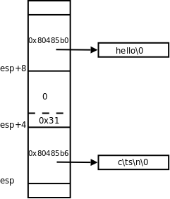

# 6. 可变参数

到目前为止我们只见过一个带有可变参数的函数 `printf` ：

```c
int printf(const char *format, ...);
```

以后还会见到更多这样的函数。现在我们实现一个简单的 `myprintf` 函数：

**例 24.9. 用可变参数实现简单的 printf 函数**

```c
#include <stdio.h>
#include <stdarg.h>

void myprintf(const char *format, ...)
{
     va_list ap;
     char c;

     va_start(ap, format);
     while (c = *format++) {
	  switch(c) {
	  case 'c': {
	       /* char is promoted to int when passed through '...' */
	       char ch = va_arg(ap, int);
	       putchar(ch);
	       break;
	  }
	  case 's': {
	       char *p = va_arg(ap, char *);
	       fputs(p, stdout);
	       break;
	  }
	  default:
	       putchar(c);
	  }
     }
     va_end(ap);
}

int main(void)
{
     myprintf("c\ts\n", '1', "hello");
     return 0;
}
```

要处理可变参数，需要用 C 到标准库的 `va_list` 类型和 `va_start` 、 `va_arg` 、 `va_end` 宏，这些定义在 `stdarg.h` 头文件中。这些宏是如何取出可变参数的呢？我们首先对照反汇编分析在调用 `myprintf` 函数时这些参数的内存布局。

```text
myprintf("c\ts\n", '1', "hello");
 80484c5:	c7 44 24 08 b0 85 04 	movl   $0x80485b0,0x8(%esp)
 80484cc:	08
 80484cd:	c7 44 24 04 31 00 00 	movl   $0x31,0x4(%esp)
 80484d4:	00
 80484d5:	c7 04 24 b6 85 04 08 	movl   $0x80485b6,(%esp)
 80484dc:	e8 43 ff ff ff       	call   8048424 <myprintf>
```

<div align="center">

  

  <p><b>图 24.6. myprintf 函数的参数布局</b></p>

</div>

这些参数是从右向左依次压栈的，所以第一个参数靠近栈顶，第三个参数靠近栈底。这些参数在内存中是连续存放的，每个参数都对齐到 4 字节边界。第一个和第三个参数都是指针类型，各占 4 个字节，虽然第二个参数只占一个字节，但为了使第三个参数对齐到 4 字节边界，所以第二个参数也占 4 个字节。现在给出一个 `stdarg.h` 的简单实现，这个实现出自[\[Standard C Library\]](bi01.md#bibli.standardclib)：

**例 24.10. stdarg.h 的一种实现**

```c
/* stdarg.h standard header */
#ifndef _STDARG
#define _STDARG

/* type definitions */
typedef char *va_list;
/* macros */
#define va_arg(ap, T) \
	(* (T *)(((ap) += _Bnd(T, 3U)) - _Bnd(T, 3U)))
#define va_end(ap) (void)0
#define va_start(ap, A) \
	(void)((ap) = (char *)&(A) + _Bnd(A, 3U))
#define _Bnd(X, bnd) (sizeof (X) + (bnd) & ~(bnd))
#endif
```

这个头文件中的内部宏定义 `_Bnd(X, bnd)` 将类型或变量 `X` 的长度对齐到 `bnd+1` 字节的整数倍，例如 `_Bnd(char, 3U)` 的值是 4， `_Bnd(int, 3U)` 也是 4。

在 `myprintf` 中定义的 `va_list ap;` 其实是一个指针， `va_start(ap, format)` 使 `ap` 指向 `format` 参数的下一个参数，也就是指向上图中 `esp+4` 的位置。然后 `va_arg(ap, int)` 把第二个参数的值按 `int` 型取出来，同时使 `ap` 指向第三个参数，也就是指向上图中 `esp+8` 的位置。然后 `va_arg(ap, char *)` 把第三个参数的值按 `char *` 型取出来，同时使 `ap` 指向更高的地址。 `va_end(ap)` 在我们的简单实现中不起任何作用，在有些实现中可能会把 `ap` 改写成无效值，C 标准要求在函数返回前调用 `va_end` 。

如果把 `myprintf` 中的 `char ch = va_arg(ap, int);` 改成 `char ch = va_arg(ap, char);` ，用我们这个 `stdarg.h` 的简单实现是没有问题的。但如果改用 `libc` 提供的 `stdarg.h` ，在编译时会报错：

```text
$ gcc main.c
main.c: In function ‘myprintf’:
main.c:33: warning: ‘char’ is promoted to ‘int’ when passed through ‘...’
main.c:33: note: (so you should pass ‘int’ not ‘char’ to ‘va_arg’)
main.c:33: note: if this code is reached, the program will abort
$ ./a.out
Illegal instruction
```

因此要求 `char` 型的可变参数必须按 `int` 型来取，这是为了与 C 标准一致，我们在[第 3.1 节 “Integer Promotion”](ch15s03.md#type.intpromo)讲过 Default Argument Promotion 规则，传递 `char` 型的可变参数时要提升为 `int` 型。

从 `myprintf` 的例子可以理解 `printf` 的实现原理， `printf` 函数根据第一个参数（格式化字符串）来确定后面有几个参数，分别是什么类型。保证参数的类型、个数与格式化字符串的描述相匹配是调用者的责任，实现者只管按格式化字符串的描述从栈上取数据，如果调用者传递的参数类型或个数不正确，实现者是没有办法避免错误的。

还有一种方法可以确定可变参数的个数，就是在参数列表的末尾传一个 Sentinel，例如 `NULL` 。 `execl(3)` 就采用这种方法确定参数的个数。下面实现一个 `printlist` 函数，可以打印若干个传入的字符串。

**例 24.11. 根据 Sentinel 判断可变参数的个数**

```c
#include <stdio.h>
#include <stdarg.h>

void printlist(int begin, ...)
{
     va_list ap;
     char *p;

     va_start(ap, begin);
     p = va_arg(ap, char *);

     while (p != NULL) {
	  fputs(p, stdout);
	  putchar('\n');
	  p = va_arg(ap, char*);
     }
     va_end(ap);
}

int main(void)
{
     printlist(0, "hello", "world", "foo", "bar", NULL);
     return 0;
}
```

`printlist ` 的第一个参数`begin ` 的值并没有用到，但是 C 语言规定至少要定义一个有名字的参数，因为`va_start ` 宏要用到参数列表中最后一个有名字的参数，从它的地址开始找可变参数的位置。实现者应该在文档中说明参数列表必须以`NULL` 结尾，如果调用者不遵守这个约定，实现者是没有办法避免错误的。

## 习题

1、实现一个功能更完整的 `printf` ，能够识别 `%` ，能够处理 `%d` 、 `%f` 对应的整数参数。在实现中不许调用 `printf(3)` 这个 Man Page 中描述的任何函数。
