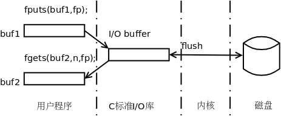

# 2. 标准 I/O 库函数

## 2.1. 文件的基本概念

我们已经多次用到了文件，例如源文件、目标文件、可执行文件、库文件等，现在学习如何用 C 标准库对文件进行读写操作，对文件的读写也属于 I/O 操作的一种，本节介绍的大部分函数在头文件 `stdio.h` 中声明，称为标准 I/O 库函数。

文件可分为文本文件（Text File）和二进制文件（Binary File）两种，源文件是文本文件，而目标文件、可执行文件和库文件是二进制文件。文本文件是用来保存字符的，文件中的字节都是字符的某种编码（例如 ASCII 或 UTF-8），用 `cat` 命令可以查看其中的字符，用 `vi` 可以编辑其中的字符，而二进制文件不是用来保存字符的，文件中的字节表示其它含义，例如可执行文件中有些字节表示指令，有些字节表示各 Section 和 Segment 在文件中的位置，有些字节表示各 Segment 的加载地址。

在[第 5.1 节 “目标文件”](ch18s05.md#asm.relocatable)中我们用 `hexdump` 命令查看过一个二进制文件。我们再做一个小实验，用 `vi` 编辑一个文件 `textfile` ，在其中输入 `5678` 然后保存退出，用 `ls -l` 命令可以看到它的长度是 5：

```text
$ ls -l textfile
-rw-r--r-- 1 akaedu akaedu 5 2009-03-20 10:58 textfile
```

`5678 ` 四个字符各占一个字节，`vi ` 会自动在文件末尾加一个换行符，所以文件长度是 5。用`od` 命令查看该文件的内容：

```text
$ od -tx1 -tc -Ax textfile
000000 35 36 37 38 0a
         5   6   7   8  \n
000005
```

`-tx1 ` 选项表示将文件中的字节以十六进制的形式列出来，每组一个字节，`-tc ` 选项表示将文件中的 ASCII 码以字符形式列出来。和`hexdump ` 类似，输出结果最左边的一列是文件中的地址，默认以八进制显示，`-Ax ` 选项要求以十六进制显示文件中的地址。这样我们看到，这个文件中保存了 5 个字符，以 ASCII 码保存。ASCII 码的范围是 0~127，所以 ASCII 码文本文件中每个字节只用到低 7 位，最高位都是 0。以后我们会经常用到`od` 命令。

文本文件是一个模糊的概念。有些时候说文本文件是指用 `vi` 可以编辑出来的文件，例如 `/etc` 目录下的各种配置文件，这些文件中只包含 ASCII 码中的可见字符，而不包含像 `'\0'` 这种不可见字符，也不包含最高位是 1 的非 ASCII 码字节。从广义上来说，只要是专门保存字符的文件都算文本文件，包含不可见字符的也算，采用其它字符编码（例如 UTF-8 编码）的也算。

## 2.2. fopen/fclose

在操作文件之前要用 `fopen` 打开文件，操作完毕要用 `fclose` 关闭文件。打开文件就是在操作系统中分配一些资源用于保存该文件的状态信息，并得到该文件的标识，以后用户程序就可以用这个标识对文件做各种操作，关闭文件则释放文件在操作系统中占用的资源，使文件的标识失效，用户程序就无法再操作这个文件了。

```c
#include <stdio.h>

FILE *fopen(const char *path, const char *mode);
返回值：成功返回文件指针，出错返回 NULL 并设置 errno
```

`path ` 是文件的路径名，`mode ` 表示打开方式。如果文件打开成功，就返回一个`FILE * ` 文件指针来标识这个文件。以后调用其它函数对文件做读写操作都要提供这个指针，以指明对哪个文件进行操作。`FILE ` 是 C 标准库中定义的结构体类型，其中包含该文件在内核中标识（在[第 2 节 “C 标准 I/O 库函数与 Unbuffered I/O 函数”](ch28s02.md#io.twoioflavors)将会讲到这个标识叫做文件描述符）、I/O 缓冲区和当前读写位置等信息，但调用者不必知道`FILE ` 结构体都有哪些成员，我们很快就会看到，调用者只是把文件指针在库函数接口之间传来传去，而文件指针所指的`FILE ` 结构体的成员在库函数内部维护，调用者不应该直接访问这些成员，这种编程思想在面向对象方法论中称为封装（Encapsulation）。像`FILE * ` 这样的指针称为不透明指针（Opaque Pointer）或者叫句柄（Handle），`FILE *` 指针就像一个把手（Handle），抓住这个把手就可以打开门或抽屉，但用户只能抓这个把手，而不能直接抓门或抽屉。

下面说说参数 `path` 和 `mode` ， `path` 可以是相对路径也可以是绝对路径， `mode` 表示打开方式是读还是写。比如 `fp = fopen("/tmp/file2", "w");` 表示打开绝对路径 `/tmp/file2` ，只做写操作， `path` 也可以是相对路径，比如 `fp = fopen("file.a", "r");` 表示在当前工作目录下打开文件 `file.a` ，只做读操作，再比如 `fp = fopen("../a.out", "r");` 只读打开当前工作目录上一层目录下的 `a.out` ， `fp = fopen("Desktop/file3", "w");` 只写打开当前工作目录下子目录 `Desktop` 下的 `file3` 。相对路径是相对于当前工作目录（Current Working Directory）的路径，每个进程都有自己的当前工作目录，Shell 进程的当前工作目录可以用 `pwd` 命令查看：

```text
$ pwd
/home/akaedu
```

通常 Linux 发行版都把 Shell 配置成在提示符前面显示当前工作目录，例如 `~$` 表示当前工作目录是主目录， `/etc$` 表示当前工作目录是 `/etc` 。用 `cd` 命令可以改变 Shell 进程的当前工作目录。在 Shell 下敲命令启动新的进程，则该进程的当前工作目录继承自 Shell 进程的当前工作目录，该进程也可以调用 `chdir(2)` 函数改变自己的当前工作目录。

`mode ` 参数是一个字符串，由`rwatb+ ` 六个字符组合而成，`r ` 表示读，`w ` 表示写，`a ` 表示追加（Append），在文件末尾追加数据使文件的尺寸增大。`t ` 表示文本文件，`b ` 表示二进制文件，有些操作系统的文本文件和二进制文件格式不同，而在 UNIX 系统中，无论文本文件还是二进制文件都是由一串字节组成，`t ` 和`b ` 没有区分，用哪个都一样，也可以省略不写。如果省略`t ` 和`b ` ，`rwa+` 四个字符有以下 6 种合法的组合：

* `"r"`

  只读，文件必须已存在

* "w"

  只写，如果文件不存在则创建，如果文件已存在则把文件长度截断（Truncate）为 0 字节再重新写，也就是替换掉原来的文件内容

* "a"

  只能在文件末尾追加数据，如果文件不存在则创建

* "r+"

  允许读和写，文件必须已存在

* "w+"

  允许读和写，如果文件不存在则创建，如果文件已存在则把文件长度截断为 0 字节再重新写

* "a+"

  允许读和追加数据，如果文件不存在则创建

在打开一个文件时如果出错， `fopen` 将返回 `NULL` 并设置 `errno` ， `errno` 稍后介绍。在程序中应该做出错处理，通常这样写：

```c
if ( (fp = fopen("/tmp/file1", "r")) == NULL) {
	printf("error open file /tmp/file1!\n");
	exit(1);
}
```

比如 `/tmp/file1` 这个文件不存在，而 `r` 打开方式又不会创建这个文件， `fopen` 就会出错返回。

再说说 `fclose` 函数。

```c
#include <stdio.h>

int fclose(FILE *fp);
返回值：成功返回 0，出错返回 EOF 并设置 errno
```

把文件指针传给 `fclose` 可以关闭它所标识的文件，关闭之后该文件指针就无效了，不能再使用了。如果 `fclose` 调用出错（比如传给它一个无效的文件指针）则返回 `EOF` 并设置 `errno` ， `errno` 稍后介绍， `EOF` 在 `stdio.h` 中定义：

```c
/* End of file character.
   Some things throughout the library rely on this being -1.  */
#ifndef EOF
# define EOF (-1)
#endif
```

它的值是-1。 `fopen` 调用应该和 `fclose` 调用配对，打开文件操作完之后一定要记得关闭。如果不调用 `fclose` ，在进程退出时系统会自动关闭文件，但是不能因此就忽略 `fclose` 调用，如果写一个长年累月运行的程序（比如网络服务器程序），打开的文件都不关闭，堆积得越来越多，就会占用越来越多的系统资源。

## 2.3. stdin/stdout/stderr

我们经常用 `printf` 打印到屏幕，也用过 `scanf` 读键盘输入，这些也属于 I/O 操作，但不是对文件做 I/O 操作而是对终端设备做 I/O 操作。所谓终端（Terminal）是指人机交互的设备，也就是可以接受用户输入并输出信息给用户的设备。在计算机刚诞生的年代，终端是电传打字机和打印机，现在的终端通常是键盘和显示器。终端设备和文件一样也需要先打开后操作，终端设备也有对应的路径名， `/dev/tty` 就表示和当前进程相关联的终端设备（在[第 1.1 节 “终端的基本概念”](ch34s01.md#jobs.intro)会讲到这叫进程的控制终端）。也就是说， `/dev/tty` 不是一个普通的文件，它不表示磁盘上的一组数据，而是表示一个设备。用 `ls` 命令查看这个文件：

```text
$ ls -l /dev/tty
crw-rw-rw- 1 root dialout 5, 0 2009-03-20 19:31 /dev/tty
```

开头的 `c` 表示文件类型是字符设备。中间的 `5, 0` 是它的设备号，主设备号 5，次设备号 0，主设备号标识内核中的一个设备驱动程序，次设备号标识该设备驱动程序管理的一个设备。内核通过设备号找到相应的驱动程序，完成对该设备的操作。我们知道常规文件的这一列应该显示文件尺寸，而设备文件的这一列显示设备号，这表明设备文件是没有文件尺寸这个属性的，因为设备文件在磁盘上不保存数据，对设备文件做读写操作并不是读写磁盘上的数据，而是在读写设备。UNIX 的传统是 Everything is a file，键盘、显示器、串口、磁盘等设备在 `/dev` 目录下都有一个特殊的设备文件与之对应，这些设备文件也可以像普通文件一样打开、读、写和关闭，使用的函数接口是相同的。本书中不严格区分“文件”和“设备”这两个概念，遇到“文件”这个词，读者可以根据上下文理解它是指普通文件还是设备，如果需要强调是保存在磁盘上的普通文件，本书会用“常规文件”（Regular File）这个词。

那为什么 `printf` 和 `scanf` 不用打开就能对终端设备进行操作呢？因为在程序启动时（在 `main` 函数还没开始执行之前）会自动把终端设备打开三次，分别赋给三个 `FILE *` 指针 `stdin` 、 `stdout` 和 `stderr` ，这三个文件指针是 `libc` 中定义的全局变量，在 `stdio.h` 中声明， `printf` 向 `stdout` 写，而 `scanf` 从 `stdin` 读，后面我们会看到，用户程序也可以直接使用这三个文件指针。这三个文件指针的打开方式都是可读可写的，但通常 `stdin` 只用于读操作，称为标准输入（Standard Input）， `stdout` 只用于写操作，称为标准输出（Standard Output）， `stderr` 也只用于写操作，称为标准错误输出（Standard Error），通常程序的运行结果打印到标准输出，而错误提示（例如 `gcc` 报的警告和错误）打印到标准错误输出，所以 `fopen` 的错误处理写成这样更符合惯例：

```c
if ( (fp = fopen("/tmp/file1", "r")) == NULL) {
	fputs("Error open file /tmp/file1\n", stderr);
	exit(1);
}
```

`fputs` 函数将在稍后详细介绍。不管是打印到标准输出还是打印到标准错误输出效果是一样的，都是打印到终端设备（也就是屏幕）了，那为什么还要分成标准输出和标准错误输出呢？以后我们会讲到重定向操作，可以把标准输出重定向到一个常规文件，而标准错误输出仍然对应终端设备，这样就可以把正常的运行结果和错误提示分开，而不是混在一起打印到屏幕了。

## 2.4. errno 与 perror 函数

很多系统函数在错误返回时将错误原因记录在 `libc` 定义的全局变量 `errno` 中，每种错误原因对应一个错误码，请查阅 `errno(3)` 的 Man Page 了解各种错误码， `errno` 在头文件 `errno.h` 中声明，是一个整型变量，所有错误码都是正整数。

如果在程序中打印错误信息时直接打印 `errno` 变量，打印出来的只是一个整数值，仍然看不出是什么错误。比较好的办法是用 `perror` 或 `strerror` 函数将 `errno` 解释成字符串再打印。

```c
#include <stdio.h>

void perror(const char *s);
```

`perror ` 函数将错误信息打印到标准错误输出，首先打印参数`s ` 所指的字符串，然后打印:号，然后根据当前`errno` 的值打印错误原因。例如：

**例 25.4. perror**

```c
#include <stdio.h>
#include <stdlib.h>

int main(void)
{
	FILE *fp = fopen("abcde", "r");
	if (fp == NULL) {
		perror("Open file abcde");
		exit(1);
	}
	return 0;
}
```

如果文件 `abcde` 不存在， `fopen` 返回-1 并设置 `errno` 为 `ENOENT` ，紧接着 `perror` 函数读取 `errno` 的值，将 `ENOENT` 解释成字符串 `No such file or directory` 并打印，最后打印的结果是 `Open file abcde: No such file or directory` 。虽然 `perror` 可以打印出错误原因，传给 `perror` 的字符串参数仍然应该提供一些额外的信息，以便在看到错误信息时能够很快定位是程序中哪里出了错，如果在程序中有很多个 `fopen` 调用，每个 `fopen` 打开不同的文件，那么在每个 `fopen` 的错误处理中打印文件名就很有帮助。

如果把上面的程序改成这样：

```c
#include <stdio.h>
#include <stdlib.h>
#include <errno.h>

int main(void)
{
	FILE *fp = fopen("abcde", "r");
	if (fp == NULL) {
		perror("Open file abcde");
		printf("errno: %d\n", errno);
		exit(1);
	}
	return 0;
}
```

则 `printf` 打印的错误号并不是 `fopen` 产生的错误号，而是 `perror` 产生的错误号。 `errno` 是一个全局变量，很多系统函数都会改变它， `fopen` 函数 Man Page 中的**ERRORS**部分描述了它可能产生的错误码， `perror` 函数的 Man Page 中没有 `ERRORS` 部分，说明它本身不产生错误码，但它调用的其它函数也有可能改变 `errno` 变量。大多数系统函数都有一个 Side Effect，就是有可能改变 `errno` 变量（当然也有少数例外，比如 `strcpy` ），所以一个系统函数错误返回后应该马上检查 `errno` ，在检查 `errno` 之前不能再调用其它系统函数。

`strerror` 函数可以根据错误号返回错误原因字符串。

```c
#include <string.h>

char *strerror(int errnum);
返回值：错误码 errnum 所对应的字符串
```

这个函数返回指向静态内存的指针。以后学线程库时我们会看到，有些函数的错误码并不保存在 `errno` 中，而是通过返回值返回，就不能调用 `perror` 打印错误原因了，这时 `strerror` 就派上了用场：

```c
fputs(strerror(n), stderr);
```

## 习题

1、在系统头文件中找到各种错误码的宏定义。

2、做几个小练习，看看 `fopen` 出错有哪些常见的原因。

打开一个没有访问权限的文件。

```c
fp = fopen("/etc/shadow", "r");
if (fp == NULL) {
	perror("Open /etc/shadow");
	exit(1);
}
```

`fopen ` 也可以打开一个目录，传给`fopen ` 的第一个参数目录名末尾可以加`/ ` 也可以不加`/` ，但只允许以只读方式打开。试试如果以可写的方式打开一个存在的目录会怎么样呢？

```c
fp = fopen("/home/akaedu/", "r+");
if (fp == NULL) {
	perror("Open /home/akaedu");
	exit(1);
}
```

请读者自己设计几个实验，看看你还能测试出哪些错误原因？

## 2.5. 以字节为单位的 I/O 函数

`fgetc ` 函数从指定的文件中读一个字节，`getchar ` 从标准输入读一个字节，调用`getchar() ` 相当于调用`fgetc(stdin)` 。

```c
#include <stdio.h>

int fgetc(FILE *stream);
int getchar(void);
返回值：成功返回读到的字节，出错或者读到文件末尾时返回 EOF
```

注意在 Man Page 的函数原型中 `FILE *` 指针参数有时会起名叫 `stream` ，这是因为标准 I/O 库操作的文件有时也叫做流（Stream），文件由一串字节组成，每次可以读或写其中任意数量的字节，以后介绍 TCP 协议时会对流这个概念做更详细的解释。

对于 fgetc 函数的使用有以下几点说明：

* 要用 `fgetc` 函数读一个文件，该文件的打开方式必须是可读的。

* 系统对于每个打开的文件都记录着当前读写位置在文件中的地址（或者说距离文件开头的字节数），也叫偏移量（Offset）。当文件打开时，读写位置是 0，每调用一次 `fgetc` ，读写位置向后移动一个字节，因此可以连续多次调用 `fgetc` 函数依次读取多个字节。

* `fgetc ` 成功时返回读到一个字节，本来应该是`unsigned char ` 型的，但由于函数原型中返回值是`int ` 型，所以这个字节要转换成`int ` 型再返回，那为什么要规定返回值是`int ` 型呢？因为出错或读到文件末尾时`fgetc ` 将返回`EOF ` ，即-1，保存在`int ` 型的返回值中是 0xffffffff，如果读到字节 0xff，由`unsigned char ` 型转换为`int ` 型是 0x000000ff，只有规定返回值是`int ` 型才能把这两种情况区分开，如果规定返回值是`unsigned char ` 型，那么当返回值是 0xff 时无法区分到底是`EOF ` 还是字节 0xff。如果需要保存`fgetc ` 的返回值，一定要保存在`int ` 型变量中，如果写成`unsigned char c = fgetc(fp); ` ，那么根据`c ` 的值又无法区分`EOF ` 和 0xff 字节了。注意，`fgetc ` 读到文件末尾时返回`EOF ` ，只是用这个返回值表示已读到文件末尾，并不是说每个文件末尾都有一个字节是`EOF` （根据上面的分析，EOF 并不是一个字节）。

`fputc ` 函数向指定的文件写一个字节，`putchar ` 向标准输出写一个字节，调用`putchar(c) ` 相当于调用`fputc(c, stdout)` 。

```c
#include <stdio.h>

int fputc(int c, FILE *stream);
int putchar(int c);
返回值：成功返回写入的字节，出错返回 EOF
```

对于 `fputc` 函数的使用也要说明几点：

* 要用 `fputc` 函数写一个文件，该文件的打开方式必须是可写的（包括追加）。

* 每调用一次 `fputc` ，读写位置向后移动一个字节，因此可以连续多次调用 `fputc` 函数依次写入多个字节。但如果文件是以追加方式打开的，每次调用 `fputc` 时总是将读写位置移到文件末尾然后把要写入的字节追加到后面。

下面的例子演示了这四个函数的用法，从键盘读入一串字符写到一个文件中，再从这个文件中读出这些字符打印到屏幕上。

**例 25.5. 用 fputc/fget 读写文件和终端**

```c
#include <stdio.h>
#include <stdlib.h>

int main(void)
{
	FILE *fp;
	int ch;

	if ( (fp = fopen("file2", "w+")) == NULL) {
		perror("Open file file2\n");
		exit(1);
	}
	while ( (ch = getchar()) != EOF)
		fputc(ch, fp);
	rewind(fp);
	while ( (ch = fgetc(fp)) != EOF)
		putchar(ch);
	fclose(fp);
	return 0;
}
```

从终端设备读有点特殊。当调用 `getchar()` 或 `fgetc(stdin)` 时，如果用户没有输入字符， `getchar` 函数就阻塞等待，所谓阻塞是指这个函数调用不返回，也就不能执行后面的代码，这个进程阻塞了，操作系统可以调度别的进程执行。从终端设备读还有一个特点，用户输入一般字符并不会使 `getchar` 函数返回，仍然阻塞着，只有当用户输入回车或者到达文件末尾时 `getchar` 才返回[^34]。这个程序的执行过程分析如下：

```text
$ ./a.out
hello（输入 hello 并回车，这时第一次调用 getchar 返回，读取字符 h 存到文件中，然后连续调用 getchar 五次，读取 ello 和换行符存到文件中，第七次调用 getchar 又阻塞了）
hey（输入 hey 并回车，第七次调用 getchar 返回，读取字符 h 存到文件中，然后连续调用 getchar 三次，读取 ey 和换行符存到文件中，第 11 次调用 getchar 又阻塞了）
（这时输入 Ctrl-D，第 11 次调用 getchar 返回 EOF，跳出循环，进入下一个循环，回到文件开头，把文件内容一个字节一个字节读出来打印，直到文件结束）
hello
hey
```

从终端设备输入时有两种方法表示文件结束，一种方法是在一行的开头输入 Ctrl-D（如果不在一行的开头则需要连续输入两次 Ctrl-D），另一种方法是利用 Shell 的 Heredoc 语法：

```text
$ ./a.out <<END
> hello
> hey
> END
hello
hey
```

`<<END ` 表示从下一行开始是标准输入，直到某一行开头出现`END ` 时结束。`<< ` 后面的结束符可以任意指定，不一定得是`END` ，只要和输入的内容能区分开就行。

在上面的程序中，第一个 `while` 循环结束时 `fp` 所指文件的读写位置在文件末尾，然后调用 `rewind` 函数把读写位置移到文件开头，再进入第二个 `while` 循环从头读取文件内容。

## 习题

1、编写一个简单的文件复制程序。

```text
$ ./mycp dir1/fileA dir2/fileB
```

运行这个程序可以把 `dir1/fileA` 文件拷贝到 `dir2/fileB` 文件。注意各种出错处理。

2、虽然我说 `getchar` 要读到换行符才返回，但上面的程序并没有提供证据支持我的说法，如果看成每敲一个键 `getchar` 就返回一次，也能解释程序的运行结果。请写一个小程序证明 `getchar` 确实是读到换行符才返回的。

## 2.6. 操作读写位置的函数

我们在上一节的例子中看到 `rewind` 函数把读写位置移到文件开头，本节介绍另外两个操作读写位置的函数， `fseek` 可以任意移动读写位置， `ftell` 可以返回当前的读写位置。

```c
#include <stdio.h>

int fseek(FILE *stream, long offset, int whence);
返回值：成功返回 0，出错返回-1 并设置 errno

long ftell(FILE *stream);
返回值：成功返回当前读写位置，出错返回-1 并设置 errno

void rewind(FILE *stream);
```

`fseek ` 的`whence ` 和`offset ` 参数共同决定了读写位置移动到何处，`whence` 参数的含义如下：

* `SEEK_SET`

  从文件开头移动 `offset` 个字节

* `SEEK_CUR`

  从当前位置移动 `offset` 个字节

* `SEEK_END`

  从文件末尾移动 `offset` 个字节

`offset ` 可正可负，负值表示向前（向文件开头的方向）移动，正值表示向后（向文件末尾的方向）移动，如果向前移动的字节数超过了文件开头则出错返回，如果向后移动的字节数超过了文件末尾，再次写入时将增大文件尺寸，从原来的文件末尾到`fseek` 移动之后的读写位置之间的字节都是 0。

先前我们创建过一个文件 `textfile` ，其中有五个字节， `5678` 加一个换行符，现在我们拿这个文件做实验。

**例 25.6. fseek**

```c
#include <stdio.h>
#include <stdlib.h>

int main(void)
{
	FILE* fp;
	if ( (fp = fopen("textfile","r+")) == NULL) {
		perror("Open file textfile");
		exit(1);
	}
	if (fseek(fp, 10, SEEK_SET) != 0) {
		perror("Seek file textfile");
		exit(1);
	}
	fputc('K', fp);
	fclose(fp);
	return 0;
}
```

运行这个程序，然后查看文件 `textfile` 的内容：

```text
$ ./a.out
$ od -tx1 -tc -Ax textfile
000000 35 36 37 38 0a 00 00 00 00 00 4b
         5   6   7   8  \n  \0  \0  \0  \0  \0   K
00000b
```

`fseek(fp, 10, SEEK_SET) ` 将读写位置移到第 10 个字节处（其实是第 11 个字节，从 0 开始数），然后在该位置写入一个字符 K，这样`textfile` 文件就变长了，从第 5 到第 9 个字节自动被填充为 0。

## 2.7. 以字符串为单位的 I/O 函数

`fgets ` 从指定的文件中读一行字符到调用者提供的缓冲区中，`gets` 从标准输入读一行字符到调用者提供的缓冲区中。

```c
#include <stdio.h>

char *fgets(char *s, int size, FILE *stream);
char *gets(char *s);
返回值：成功时 s 指向哪返回的指针就指向哪，出错或者读到文件末尾时返回 NULL
```

`gets ` 函数无需解释，Man Page 的**BUGS**部分已经说得很清楚了：Never use gets()。`gets ` 函数的存在只是为了兼容以前的程序，我们写的代码都不应该调用这个函数。`gets ` 函数的接口设计得很有问题，就像`strcpy ` 一样，用户提供一个缓冲区，却不能指定缓冲区的大小，很可能导致缓冲区溢出错误，这个函数比`strcpy ` 更加危险，`strcpy ` 的输入和输出都来自程序内部，只要程序员小心一点就可以避免出问题，而`gets ` 读取的输入直接来自程序外部，用户可能通过标准输入提供任意长的字符串，程序员无法避免`gets` 函数导致的缓冲区溢出错误，所以唯一的办法就是不要用它。

现在说说 `fgets` 函数，参数 `s` 是缓冲区的首地址， `size` 是缓冲区的长度，该函数从 `stream` 所指的文件中读取以 `'\n'` 结尾的一行（包括 `'\n'` 在内）存到缓冲区 `s` 中，并且在该行末尾添加一个 `'\0'` 组成完整的字符串。

如果文件中的一行太长， `fgets` 从文件中读了 `size-1` 个字符还没有读到 `'\n'` ，就把已经读到的 `size-1` 个字符和一个 `'\0'` 字符存入缓冲区，文件中剩下的半行可以在下次调用 `fgets` 时继续读。

如果一次 `fgets` 调用在读入若干个字符后到达文件末尾，则将已读到的字符串加上 `'\0'` 存入缓冲区并返回，如果再次调用 `fgets` 则返回 `NULL` ，可以据此判断是否读到文件末尾。

注意，对于 `fgets` 来说， `'\n'` 是一个特别的字符，而 `'\0'` 并无任何特别之处，如果读到 `'\0'` 就当作普通字符读入。如果文件中存在 `'\0'` 字符（或者说 0x00 字节），调用 `fgets` 之后就无法判断缓冲区中的 `'\0'` 究竟是从文件读上来的字符还是由 `fgets` 自动添加的结束符，所以 `fgets` 只适合读文本文件而不适合读二进制文件，并且文本文件中的所有字符都应该是可见字符，不能有 `'\0'` 。

`fputs ` 向指定的文件写入一个字符串，`puts` 向标准输出写入一个字符串。

```c
#include <stdio.h>

int fputs(const char *s, FILE *stream);
int puts(const char *s);
返回值：成功返回一个非负整数，出错返回 EOF
```

缓冲区 `s` 中保存的是以 `'\0'` 结尾的字符串， `fputs` 将该字符串写入文件 `stream` ，但并不写入结尾的 `'\0'` 。与 `fgets` 不同的是， `fputs` 并不关心的字符串中的 `'\n'` 字符，字符串中可以有 `'\n'` 也可以没有 `'\n'` 。 `puts` 将字符串 `s` 写到标准输出（不包括结尾的 `'\0'` ），然后自动写一个 `'\n'` 到标准输出。

## 习题

1、用 `fgets` / `fputs` 写一个拷贝文件的程序，根据本节对 `fgets` 函数的分析，应该只能拷贝文本文件，试试用它拷贝二进制文件会出什么问题。

## 2.8. 以记录为单位的 I/O 函数

```c
#include <stdio.h>

size_t fread(void *ptr, size_t size, size_t nmemb, FILE *stream);
size_t fwrite(const void *ptr, size_t size, size_t nmemb, FILE *stream);
返回值：读或写的记录数，成功时返回的记录数等于 nmemb，出错或读到文件末尾时返回的记录数小于 nmemb，也可能返回 0
```

`fread ` 和`fwrite ` 用于读写记录，这里的记录是指一串固定长度的字节，比如一个`int ` 、一个结构体或者一个定长数组。参数`size ` 指出一条记录的长度，而`nmemb ` 指出要读或写多少条记录，这些记录在`ptr ` 所指的内存空间中连续存放，共占`size * nmemb ` 个字节，`fread ` 从文件`stream ` 中读出`size * nmemb ` 个字节保存到`ptr ` 中，而`fwrite ` 把`ptr ` 中的`size * nmemb ` 个字节写到文件`stream` 中。

`nmemb ` 是请求读或写的记录数，`fread ` 和`fwrite ` 返回的记录数有可能小于`nmemb ` 指定的记录数。例如当前读写位置距文件末尾只有一条记录的长度，调用`fread ` 时指定`nmemb ` 为 2，则返回值为 1。如果当前读写位置已经在文件末尾了，或者读文件时出错了，则`fread ` 返回 0。如果写文件时出错了，则`fwrite ` 的返回值小于`nmemb` 指定的值。下面的例子由两个程序组成，一个程序把结构体保存到文件中，另一个程序和从文件中读出结构体。

**例 25.7. fread/fwrite**

```c
/* writerec.c */
#include <stdio.h>
#include <stdlib.h>

struct record {
	char name[10];
	int age;
};

int main(void)
{
	struct record array[2] = {{"Ken", 24}, {"Knuth", 28}};
	FILE *fp = fopen("recfile", "w");
	if (fp == NULL) {
		perror("Open file recfile");
		exit(1);
	}
	fwrite(array, sizeof(struct record), 2, fp);
	fclose(fp);
	return 0;
}
```

```c
/* readrec.c */
#include <stdio.h>
#include <stdlib.h>

struct record {
	char name[10];
	int age;
};

int main(void)
{
	struct record array[2];
	FILE *fp = fopen("recfile", "r");
	if (fp == NULL) {
		perror("Open file recfile");
		exit(1);
	}
	fread(array, sizeof(struct record), 2, fp);
	printf("Name1: %s\tAge1: %d\n", array[0].name, array[0].age);
	printf("Name2: %s\tAge2: %d\n", array[1].name, array[1].age);
	fclose(fp);
	return 0;
}
```

```text
$ gcc writerec.c -o writerec
$ gcc readrec.c -o readrec
$ ./writerec
$ od -tx1 -tc -Ax recfile
000000 4b 65 6e 00 00 00 00 00 00 00 00 00 18 00 00 00
         K   e   n  \0  \0  \0  \0  \0  \0  \0  \0  \0 030  \0  \0  \0
000010 4b 6e 75 74 68 00 00 00 00 00 00 00 1c 00 00 00
         K   n   u   t   h  \0  \0  \0  \0  \0  \0  \0 034  \0  \0  \0
000020
$ ./readrec
Name1: Ken	Age1: 24
Name2: Knuth	Age2: 28
```

我们把一个 `struct record` 结构体看作一条记录，由于结构体中有填充字节，每条记录占 16 字节，把两条记录写到文件中共占 32 字节。该程序生成的 `recfile` 文件是二进制文件而非文本文件，因为其中不仅保存着字符型数据，还保存着整型数据 24 和 28（在 `od` 命令的输出中以八进制显示为 030 和 034）。注意，直接在文件中读写结构体的程序是不可移植的，如果在一种平台上编译运行 `writebin.c` 程序，把生成的 `recfile` 文件拷到另一种平台并在该平台上编译运行 `readbin.c` 程序，则不能保证正确读出文件的内容，因为不同平台的大小端可能不同（因而对整型数据的存储方式不同），结构体的填充方式也可能不同（因而同一个结构体所占的字节数可能不同， `age` 成员在 `name` 成员之后的什么位置也可能不同）。

## 2.9. 格式化 I/O 函数

现在该正式讲一下 `printf` 和 `scanf` 函数了，这两个函数都有很多种形式。

```c
#include <stdio.h>

int printf(const char *format, ...);
int fprintf(FILE *stream, const char *format, ...);
int sprintf(char *str, const char *format, ...);
int snprintf(char *str, size_t size, const char *format, ...);

#include <stdarg.h>

int vprintf(const char *format, va_list ap);
int vfprintf(FILE *stream, const char *format, va_list ap);
int vsprintf(char *str, const char *format, va_list ap);
int vsnprintf(char *str, size_t size, const char *format, va_list ap);

返回值：成功返回格式化输出的字节数（不包括字符串的结尾'\0'），出错返回一个负值
```

`printf ` 格式化打印到标准输出，而`fprintf ` 打印到指定的文件`stream ` 中。`sprintf ` 并不打印到文件，而是打印到用户提供的缓冲区`str ` 中并在末尾加`'\0' ` ，由于格式化后的字符串长度很难预计，所以很可能造成缓冲区溢出，用`snprintf ` 更好一些，参数`size ` 指定了缓冲区长度，如果格式化后的字符串长度超过缓冲区长度，`snprintf ` 就把字符串截断到`size-1 ` 字节，再加上一个`'\0' ` 写入缓冲区，也就是说`snprintf ` 保证字符串以`'\0' ` 结尾。`snprintf ` 的返回值是格式化后的字符串长度（不包括结尾的`'\0'` ），如果字符串被截断，返回的是截断之前的长度，把它和实际缓冲区中的字符串长度相比较就可以知道是否发生了截断。

上面列出的后四个函数在前四个函数名的前面多了个 `v` ，表示可变参数不是以 `...` 的形式传进来，而是以 `va_list` 类型传进来。下面我们用 `vsnprintf` 包装出一个类似 `printf` 的带格式化字符串和可变参数的函数。

**例 25.8. 实现格式化打印错误的 err_sys 函数**

```c
#include <stdio.h>
#include <stdlib.h>
#include <errno.h>
#include <stdarg.h>
#include <string.h>

#define MAXLINE 80

void err_sys(const char *fmt, ...)
{
	int err = errno;
	char buf[MAXLINE+1];
	va_list ap;

	va_start(ap, fmt);

	vsnprintf(buf, MAXLINE, fmt, ap);
	snprintf(buf+strlen(buf), MAXLINE-strlen(buf), ": %s", strerror(err));
	strcat(buf, "\n");
	fputs(buf, stderr);

	va_end(ap);
	exit(1);
}

int main(int argc, char *argv[])
{
	FILE *fp;
	if (argc != 2) {
		fputs("Usage: ./a.out pathname\n", stderr);
		exit(1);
	}
	fp = fopen(argv[1], "r");

	if (fp == NULL)
		err_sys("Line %d - Open file %s", __LINE__, argv[1]);
	printf("Open %s OK\n", argv[1]);
	fclose(fp);
	return 0;
}
```

有了 `err_sys` 函数，不仅简化了 `main` 函数的代码，而且可以把 `fopen` 的错误提示打印得非常清楚，有源代码行号，有打开文件的路径名，一看就知道哪里出错了。

现在总结一下 `printf` 格式化字符串中的转换说明的有哪些写法。在这里只列举几种常用的格式，其它格式请参考 Man Page。每个转换说明以 `%` 号开头，以转换字符结尾，我们以前用过的转换说明仅包含 `%` 号和转换字符，例如 `%d` 、 `%s` ，其实在这两个字符中间还可以插入一些可选项。

**表 25.1. printf 转换说明的可选项**

| 选项 | 描述 | 举例 |
| --- | --- | --- |
| # | 八进制前面加 0（转换字符为 o），十六进制前面加 0x（转换字符为 x）或 0X（转换字符为 X）。 | printf("%#x", 0xff)打印 0xff，printf("%x", 0xff)打印 ff。 |
| - | 格式化后的内容居左，右边可以留空格。 | 见下面的例子 |
| 宽度 | 用一个整数指定格式化后的最小长度，如果格式化后的内容没有这么长，可以在左边留空格，如果前面指定了-号就在右边留空格。宽度有一种特别的形式，不指定整数值而是写成一个*号，表示取一个 int 型参数作为宽度。 | printf("-%10s-", "hello")打印-␣␣␣␣␣hello-，printf("-%-*s-", 10, "hello")打印-hello␣␣␣␣␣-。 |
| . | 用于分隔上一条提到的最小长度和下一条要讲的精度。 | 见下面的例子 |
| 精度 | 用一个整数表示精度，对于字符串来说指定了格式化后保留的最大长度，对于浮点数来说指定了格式化后小数点右边的位数，对于整数来说指定了格式化后的最小位数。精度也可以不指定整数值而是写成一个*号，表示取下一个 int 型参数作为精度。 | printf("%.4s", "hello")打印 hell，printf("-%6.4d-", 100)打印-␣␣0100-，printf("-%*.*f-", 8, 4, 3.14)打印-␣␣3.1400-。 |
| 字长 | 对于整型参数，hh、h、l、ll 分别表示是 char、short、long、long long 型的字长，至于是有符号数还是无符号数则取决于转换字符；对于浮点型参数，L 表示 long double 型的字长。 | printf("%hhd", 255)打印-1。 |

常用的转换字符有：

**表 25.2. printf 的转换字符**

| 转换字符 | 描述 | 举例 |
| --- | --- | --- |
| d i | 取 int 型参数格式化成有符号十进制表示，如果格式化后的位数小于指定的精度，就在左边补 0。 | printf("%.4d", 100)打印 0100。 |
| o u x X | 取 unsigned int 型参数格式化成无符号八进制（o）、十进制（u）、十六进制（x 或 X）表示，x 表示十六进制数字用小写 abcdef，X 表示十六进制数字用大写 ABCDEF，如果格式化后的位数小于指定的精度，就在左边补 0。 | printf("%#X", 0xdeadbeef)打印 0XDEADBEEF，printf("%hhu", -1)打印 255。 |
| c | 取 int 型参数转换成 unsigned char 型，格式化成对应的 ASCII 码字符。 | printf("%c", 256+'A')打印 A。 |
| s | 取 const char *型参数所指向的字符串格式化输出，遇到'\0'结束，或者达到指定的最大长度（精度）结束。 | printf("%.4s", "hello")打印 hell。 |
| p | 取 void *型参数格式化成十六进制表示。相当于%#x。 | printf("%p", main)打印 main 函数的首地址 0x80483c4。 |
| f | 取 double 型参数格式化成[-]ddd.ddd 这样的格式，小数点后的默认精度是 6 位。 | printf("%f", 3.14)打印 3.140000，printf("%f", 0.00000314)打印 0.000003。 |
| e E | 取 double 型参数格式化成[-]d.ddde±dd（转换字符是 e）或[-]d.dddE±dd（转换字符是 E）这样的格式，小数点后的默认精度是 6 位，指数至少是两位。 | printf("%e", 3.14)打印 3.140000e+00。 |
| g G | 取 double 型参数格式化，精度是指有效数字而非小数点后的数字，默认精度是 6。如果指数小于-4 或大于等于精度就按%e（转换字符是 g）或%E（转换字符是 G）格式化，否则按%f 格式化。小数部分的末尾 0 去掉，如果没有小数部分，小数点也去掉。 | printf("%g", 3.00)打印 3，printf("%g", 0.00001234567)打印 1.23457e-05。 |
| % | 格式化成一个%。 | printf("%%")打印一个%。 |

我们在[第 6 节 “可变参数”](ch24s06.md#interface.va)讲过可变参数的原理， `printf` 并不知道实际参数的类型，只能按转换说明指出的参数类型从栈帧上取参数，所以如果实际参数和转换说明的类型不符，结果可能会有些意外，上面也举过几个这样的例子。另外，如果 `s` 指向一个字符串，用 `printf(s)` 打印这个字符串可能得到错误的结果，因为字符串中可能包含 `%` 号而被 `printf` 当成转换说明， `printf` 并不知道后面没有传其它参数，照样会从栈帧上取参数。所以比较保险的办法是 `printf("%s", s)` 。

下面看 `scanf` 函数的各种形式。

```c
#include <stdio.h>

int scanf(const char *format, ...);
int fscanf(FILE *stream, const char *format, ...);
int sscanf(const char *str, const char *format, ...);

#include <stdarg.h>

int vscanf(const char *format, va_list ap);
int vsscanf(const char *str, const char *format, va_list ap);
int vfscanf(FILE *stream, const char *format, va_list ap);
返回值：返回成功匹配和赋值的参数个数，成功匹配的参数可能少于所提供的赋值参数，返回 0 表示一个都不匹配，出错或者读到文件或字符串末尾时返回 EOF 并设置 errno
```

`scanf ` 从标准输入读字符，按格式化字符串`format ` 中的转换说明解释这些字符，转换后赋给后面的参数，后面的参数都是传出参数，因此必须传地址而不能传值。`fscanf ` 从指定的文件`stream ` 中读字符，而`sscanf ` 从指定的字符串`str ` 中读字符。后面三个以`v ` 开头的函数的可变参数不是以`... ` 的形式传进来，而是以`va_list` 类型传进来。

现在总结一下 `scanf` 的格式化字符串和转换说明，这里也只列举几种常用的格式，其它格式请参考 Man Page。 `scanf` 用输入的字符去匹配格式化字符串中的字符和转换说明，如果成功匹配一个转换说明，就给一个参数赋值，如果读到文件或字符串末尾就停止，或者如果遇到和格式化字符串不匹配的地方（比如转换说明是 `%d` 却读到字符 `A` ）就停止。如果遇到不匹配的地方而停止， `scanf` 的返回值可能小于赋值参数的个数，文件的读写位置指向输入中不匹配的地方，下次调用库函数读文件时可以从这个位置继续。

格式化字符串中包括：

* 空格或 Tab，在处理过程中被忽略。

* 普通字符（不包括 `%` ），和输入字符中的非空白字符相匹配。输入字符中的空白字符是指空格、Tab、 `\r` 、 `\n` 、 `\v` 、 `\f` 。

* 转换说明，以 `%` 开头，以转换字符结尾，中间也有若干个可选项。

转换说明中的可选项有：

* `*` 号，表示这个转换说明只是用来匹配一段输入字符，但匹配结果并不赋给后面的参数。

* 用一个整数指定的宽度 N。表示这个转换说明最多匹配 N 个输入字符，或者匹配到输入字符中的下一个空白字符结束。

* 对于整型参数可以指定字长，有 `hh` 、 `h` 、 `l` 、 `ll` （也可以写成一个 `L` ），含义和 `printf` 相同。但 `l` 和 `L` 还有一层含义，当转换字符是 `e` 、 `f` 、 `g` 时，表示赋值参数的类型是 `float *` 而非 `double *` ，这一点跟 `printf` 不同（结合以前讲的类型转换规则思考一下为什么不同），这时前面加上 `l` 或 `L` 分别表示 `double *` 或 `long double *` 型。

常用的转换字符有：

**表 25.3. scanf 的转换字符**

| 转换字符 | 描述 |
| --- | --- |
| d | 匹配十进制整数（开头可以有负号），赋值参数的类型是 int *。 |
| i | 匹配整数（开头可以有负号），赋值参数的类型是 int *，如果输入字符以 0x 或 0X 开头则匹配十六进制整数，如果输入字符以 0 开头则匹配八进制整数。 |
| o u x | 匹配八进制、十进制、十六进制整数（开头可以有负号），赋值参数的类型是 unsigned int *。 |
| c | 匹配一串字符，字符的个数由宽度指定，缺省宽度是 1，赋值参数的类型是 char *，末尾不会添加'\0'。如果输入字符的开头有空白字符，这些空白字符并不被忽略，而是保存到参数中，要想跳过开头的空白字符，可以在格式化字符串中用一个空格去匹配。 |
| s | 匹配一串非空白字符，从输入字符中的第一个非空白字符开始匹配到下一个空白字符之前，或者匹配到指定的宽度，赋值参数的类型是 char *，末尾自动添加'\0'。 |
| e f g | 匹配符点数（开头可以有负号），赋值参数的类型是 float *，也可以指定 double *或 long double *的字长。 |
| % | 转换说明%%匹配一个字符%，不做赋值。 |

下面几个例子出自[\[K&R\]](bi01.md#bibli.kr)。第一个例子，读取用户输入的浮点数累加起来。

**例 25.9. 用 scanf 实现简单的计算器**

```c
#include <stdio.h>

int main(void)  /* rudimentary calculator */
{
	double sum, v;

	sum = 0;
	while (scanf("%lf", &v) == 1)
		printf("\t%.2f\n", sum += v);
	return 0;
}
```

如果我们要读取 `25 Dec 1988` 这样的日期格式，可以这样写：

```c
char *str = "25 Dec 1988";
int day, year;
char monthname[20];

sscanf(str, "%d %s %d", &day, monthname, &year);
```

如果 `str` 中的空白字符再多一些，比如 `" 25 Dec 1998"` ，仍然可以正确读取。如果格式化字符串中的空格和 Tab 再多一些，比如 `"%d %s %d "` ，也可以正确读取。 `scanf` 函数是很强大的，但是要用对了不容易，需要多练习，通过练习体会空白字符的作用。

如果要读取 `12/25/1998` 这样的日期格式，就需要在格式化字符串中用 `/` 匹配输入字符中的 `/` ：

```c
int day, month, year;

scanf("%d/%d/%d", &month, &day, &year);
```

`scanf ` 把换行符也看作空白字符，仅仅当作字段之间的分隔符，如果输入中的字段个数不确定，最好是先用`fgets ` 按行读取，然后再交给`sscanf` 处理。如果我们的程序需要同时识别以上两种日期格式，可以这样写：

```c
while (fgets(line, sizeof(line), stdin) > 0) {
	if (sscanf(line, "%d %s %d", &day, monthname, &year) == 3)
		printf("valid: %s\n", line); /* 25 Dec 1988 form */
	else if (sscanf(line, "%d/%d/%d", &month, &day, &year) == 3)
		printf("valid: %s\n", line); /* mm/dd/yy form */
	else
		printf("invalid: %s\n", line); /* invalid form */
}
```

## 2.10. C 标准库的 I/O 缓冲区

用户程序调用 C 标准 I/O 库函数读写文件或设备，而这些库函数要通过系统调用把读写请求传给内核（以后我们会看到与 I/O 相关的系统调用），最终由内核驱动磁盘或设备完成 I/O 操作。C 标准库为每个打开的文件分配一个 I/O 缓冲区以加速读写操作，通过文件的 `FILE` 结构体可以找到这个缓冲区，用户调用读写函数大多数时候都在 I/O 缓冲区中读写，只有少数时候需要把读写请求传给内核。以 `fgetc` / `fputc` 为例，当用户程序第一次调用 `fgetc` 读一个字节时， `fgetc` 函数可能通过系统调用进入内核读 1K 字节到 I/O 缓冲区中，然后返回 I/O 缓冲区中的第一个字节给用户，把读写位置指向 I/O 缓冲区中的第二个字符，以后用户再调 `fgetc` ，就直接从 I/O 缓冲区中读取，而不需要进内核了，当用户把这 1K 字节都读完之后，再次调用 `fgetc` 时， `fgetc` 函数会再次进入内核读 1K 字节到 I/O 缓冲区中。在这个场景中用户程序、C 标准库和内核之间的关系就像在[第 5 节 “Memory Hierarchy”](ch17s05.md#arch.memh)中 CPU、Cache 和内存之间的关系一样，C 标准库之所以会从内核预读一些数据放在 I/O 缓冲区中，是希望用户程序随后要用到这些数据，C 标准库的 I/O 缓冲区也在用户空间，直接从用户空间读取数据比进内核读数据要快得多。另一方面，用户程序调用 `fputc` 通常只是写到 I/O 缓冲区中，这样 `fputc` 函数可以很快地返回，如果 I/O 缓冲区写满了， `fputc` 就通过系统调用把 I/O 缓冲区中的数据传给内核，内核最终把数据写回磁盘。有时候用户程序希望把 I/O 缓冲区中的数据立刻传给内核，让内核写回设备，这称为 Flush 操作，对应的库函数是 `fflush` ， `fclose` 函数在关闭文件之前也会做 Flush 操作。

下图以 `fgets` / `fputs` 示意了 I/O 缓冲区的作用，使用 `fgets` / `fputs` 函数时在用户程序中也需要分配缓冲区（图中的 `buf1` 和 `buf2` ），注意区分用户程序的缓冲区和 C 标准库的 I/O 缓冲区。

<div align="center">

  

  <p><b>图 25.1. C 标准库的 I/O 缓冲区</b></p>

</div>

C 标准库的 I/O 缓冲区有三种类型：全缓冲、行缓冲和无缓冲。当用户程序调用库函数做写操作时，不同类型的缓冲区具有不同的特性。

* 全缓冲

  如果缓冲区写满了就写回内核。常规文件通常是全缓冲的。

* 行缓冲

  如果用户程序写的数据中有换行符就把这一行写回内核，或者如果缓冲区写满了就写回内核。标准输入和标准输出对应终端设备时通常是行缓冲的。

* 无缓冲

  用户程序每次调库函数做写操作都要通过系统调用写回内核。标准错误输出通常是无缓冲的，这样用户程序产生的错误信息可以尽快输出到设备。

下面通过一个简单的例子证明标准输出对应终端设备时是行缓冲的。

```c
#include <stdio.h>

int main()
{
	printf("hello world");
	while(1);
	return 0;
}
```

运行这个程序，会发现 `hello world` 并没有打印到屏幕上。用 Ctrl-C 终止它，去掉程序中的 `while(1);` 语句再试一次：

```text
$ ./a.out
hello world$
```

`hello world` 被打印到屏幕上，后面直接跟 Shell 提示符，中间没有换行。

我们知道 `main` 函数被启动代码这样调用： `exit(main(argc, argv));` 。 `main` 函数 `return` 时启动代码会调用 `exit` ， `exit` 函数首先关闭所有尚未关闭的 `FILE *` 指针（关闭之前要做 Flush 操作），然后通过 `_exit` 系统调用进入内核退出当前进程[^35]。

在上面的例子中，由于标准输出是行缓冲的， `printf("hello world");` 打印的字符串中没有换行符，所以只把字符串写到标准输出的 I/O 缓冲区中而没有写回内核（写到终端设备），如果敲 Ctrl-C，进程是异常终止的，并没有调用 `exit` ，也就没有机会 Flush I/O 缓冲区，因此字符串最终没有打印到屏幕上。如果把打印语句改成 `printf("hello world\n");` ，有换行符，就会立刻写到终端设备，或者如果把 `while(1);` 去掉也可以写到终端设备，因为程序退出时会调用 `exit` Flush 所有 I/O 缓冲区。在本书的其它例子中， `printf` 打印的字符串末尾都有换行符，以保证字符串在 `printf` 调用结束时就写到终端设备。

我们再做个实验，在程序中直接调用 `_exit` 退出。

```c
#include <stdio.h>
#include <unistd.h>

int main()
{
	printf("hello world");
	_exit(0);
}
```

结果也不会把字符串打印到屏幕上，如果把 `_exit` 调用改成 `exit` 就可以打印到屏幕上。

除了写满缓冲区、写入换行符之外，行缓冲还有一种情况会自动做 Flush 操作。如果：

* 用户程序调用库函数从无缓冲的文件中读取

* 或者从行缓冲的文件中读取，并且这次读操作会引发系统调用从内核读取数据

那么在读取之前会自动 Flush 所有行缓冲。例如：

```c
#include <stdio.h>
#include <unistd.h>

int main()
{
	char buf[20];
	printf("Please input a line: ");
	fgets(buf, 20, stdin);
	return 0;
}
```

虽然调用 `printf` 并不会把字符串写到设备，但紧接着调用 `fgets` 读一个行缓冲的文件（标准输入），在读取之前会自动 Flush 所有行缓冲，包括标准输出。

如果用户程序不想完全依赖于自动的 Flush 操作，可以调 `fflush` 函数手动做 Flush 操作。

```c
#include <stdio.h>

int fflush(FILE *stream);
返回值：成功返回 0，出错返回 EOF 并设置 errno
```

对前面的例子再稍加改动：

```c
#include <stdio.h>

int main()
{
	printf("hello world");
	fflush(stdout);
	while(1);
}
```

虽然字符串中没有换行，但用户程序调用 `fflush` 强制写回内核，因此也能在屏幕上打印出字符串。 `fflush` 函数用于确保数据写回了内核，以免进程异常终止时丢失数据。作为一个特例，调用 `fflush(NULL)` 可以对所有打开文件的 I/O 缓冲区做 Flush 操作。

## 2.11. 本节综合练习

1、编程读写一个文件 `test.txt` ，每隔 1 秒向文件中写入一行记录，类似于这样：

```c
1 2009-7-30 15:16:42
2 2009-7-30 15:16:43
```

该程序应该无限循环，直到按 Ctrl-C 终止。下次再启动程序时在 `test.txt` 文件末尾追加记录，并且序号能够接续上次的序号，比如：

```c
1 2009-7-30 15:16:42
2 2009-7-30 15:16:43
3 2009-7-30 15:19:02
4 2009-7-30 15:19:03
5 2009-7-30 15:19:04
```

这类似于很多系统服务维护的日志文件，例如在我的机器上系统服务进程 `acpid` 维护一个日志文件 `/var/log/acpid` ，就像这样：

```c
$ cat /var/log/acpid
[Sun Oct 26 08:44:46 2008] logfile reopened
[Sun Oct 26 10:11:53 2008] exiting
[Sun Oct 26 18:54:39 2008] starting up
...
```

每次系统启动时 `acpid` 进程就以追加方式打开这个文件，当有事件发生时就追加一条记录，包括事件发生的时刻以及事件描述信息。

获取当前的系统时间需要调用 `time(2)` 函数，返回的结果是一个 `time_t` 类型，其实就是一个大整数，其值表示从 UTC（Coordinated Universal Time）时间 1970 年 1 月 1 日 00:00:00（称为 UNIX 系统的 Epoch 时间）到当前时刻的秒数。然后调用 `localtime(3)` 将 `time_t` 所表示的 UTC 时间转换为本地时间（我们是+8 区，比 UTC 多 8 个小时）并转成 `struct tm` 类型，该类型的各数据成员分别表示年月日时分秒，具体用法请查阅 Man Page。调用 `sleep(3)` 函数可以指定程序睡眠多少秒。

2、INI 文件是一种很常见的配置文件，很多 Windows 程序都采用这种格式的配置文件，在 Linux 系统中 Qt 程序通常也采用这种格式的配置文件。比如：

```c
;Configuration of http
[http]
domain=www.mysite.com
port=8080
cgihome=/cgi-bin

;Configuration of db
[database]
server = mysql
user = myname
password = toopendatabase
```

一个配置文件由若干个 Section 组成，由[]括号括起来的是 Section 名。每个 Section 下面有若干个 `key = value` 形式的键值对（Key-value Pair），等号两边可以有零个或多个空白字符（空格或 Tab），每个键值对占一行。以;号开头的行是注释。每个 Section 结束时有一个或多个空行，空行是仅包含零个或多个空白字符（空格或 Tab）的行。INI 文件的最后一行后面可能有换行符也可能没有。

现在 XML 兴起了，INI 文件显得有点土。现在要求编程把 INI 文件转换成 XML 文件。上面的例子经转换后应该变成这样：

```c
<!-- Configuration of http -->
<http>
        <domain>www.mysite.com</domain>
        <port>8080</port>
        <cgihome>/cgi-bin</cgihome>
</http>

<!-- Configuration of db -->
<database>
        <server>mysql</server>
        <user>myname</user>
        <password>toopendatabase</password>
</database>
```

3、实现类似 `gcc` 的 `-M` 选项的功能，给定一个 `.c` 文件，列出它直接和间接包含的所有头文件，例如有一个 `main.c` 文件：

```c
#include <errno.h>
#include "stack.h"

int main()
{
	return 0;
}
```

你的程序读取这个文件，打印出其中包含的所有头文件的绝对路径：

```text
$ ./a.out main.c
/usr/include/errno.h
/usr/include/features.h
/usr/include/bits/errno.h
/usr/include/linux/errno.h
...
/home/akaedu/stack.h: cannot find
```

如果有的头文件找不到，就像上面例子那样打印 `/home/akaedu/stack.h: cannot find` 。首先复习一下[第 2.2 节 “头文件”](ch20s02.md#link.header)讲过的头文件查找顺序，本题目不必考虑 `-I` 选项指定的目录，只在 `.c` 文件所在的目录以及系统目录 `/usr/include` 中查找。

[^34]: 这些特性取决于终端的工作模式，终端可以配置成一次一行的模式，也可以配置成一次一个字符的模式，默认是一次一行的模式（本书的实验都是在这种模式下做的），关于终端的配置可参考。

[^35]: 其实在调_exit 进内核之前还要调用户程序中通过 atexit(3)注册的退出处理函数，本书不做详细介绍，读者可参考。
