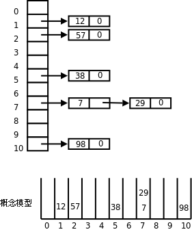

# 3. 哈希表

下图示意了哈希表（Hash Table）这种数据结构。

  

  
<b>图 26.12. 哈希表</b>

如上图所示，首先分配一个指针数组，数组的每个元素是一个链表的头指针，每个链表称为一个槽（Slot）。哪个数据应该放入哪个槽中由哈希函数决定，在这个例子中我们简单地选取哈希函数 h(x) = x % 11，这样任意数据 x 都可以映射成 0~10 之间的一个数，就是槽的编号，将数据放入某个槽的操作就是链表的插入操作。

如果每个槽里至多只有一个数据，可以想像这种情况下 `search` 、 `insert` 和 `delete` 操作的时间复杂度都是 O(1)，但有时会有多个数据被哈希函数映射到同一个槽中，这称为碰撞（Collision），设计一个好的哈希函数可以把数据比较均匀地分布到各个槽中，尽量避免碰撞。如果能把 n 个数据比较均匀地分布到 m 个槽中，每个糟里约有 n/m 个数据，则 `search` 、 `insert` 和 `delete` 和操作的时间复杂度都是 O(n/m)，如果 n 和 m 的比是常数，则时间复杂度仍然是 O(1)。一般来说，要处理的数据越多，构造哈希表时分配的槽也应该越多，所以 n 和 m 成正比这个假设是成立的。

请读者自己编写程序构造这样一个哈希表，并实现 `search` 、 `insert` 和 `delete` 操作。

如果用我们学过的各种数据结构来表示 n 个数据的集合，下表是 `search` 、 `insert` 和 `delete` 操作在平均情况下的时间复杂度比较。

**表 26.1. 各种数据结构的 search、insert 和 delete 操作在平均情况下的时间复杂度比较**

| 数据结构 | search | insert | delete |
| --- | --- | --- | --- |
| 数组 | O(n)，有序数组折半查找是 O(lgn) | O(n) | O(n) |
| 双向链表 | O(n) | O(1) | O(1) |
| 排序二叉树 | O(lgn) | O(lgn) | O(lgn) |
| 哈希表（n 与槽数 m 成正比） | O(1) | O(1) | O(1) |

## 习题

1、统计一个文本文件中每个单词的出现次数，然后按出现次数排序并打印输出。单词由连续的英文字母组成，不区分大小写。

2、实现一个函数求两个数组的交集： `size_t intersect(const int a[], size_t nmema, const int b[], size_t nmemb, int c[], size_t nmemc);` 。数组元素是 32 位 `int` 型的。数组 `a` 有 `nmema` 个元素且各不相同，数组 `b` 有 `nmemb` 个元素且各不相同。要求找出数组 `a` 和数组 `b` 的交集保存到数组 `c` 中， `nmemc` 是数组 `c` 的最大长度，返回值表示交集中实际有多少个元素，如果交集中实际的元素数量超过了 `nmemc` 则返回 `nmemc` 个元素。数组 `a` 和数组 `b` 的元素数量可能会很大（比如上百万个），需要设计尽可能快的算法。
