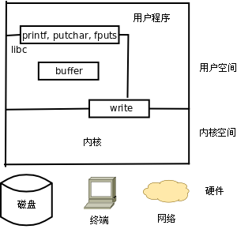
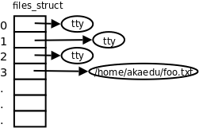

# 2. C 标准 I/O 库函数与 Unbuffered I/O 函数

现在看看 C 标准 I/O 库函数是如何用系统调用实现的。

* `fopen(3)`

  调用 `open(2)` 打开指定的文件，返回一个文件描述符（就是一个 `int` 类型的编号），分配一个 `FILE` 结构体，其中包含该文件的描述符、I/O 缓冲区和当前读写位置等信息，返回这个 `FILE` 结构体的地址。

* `fgetc(3)`

  通过传入的 `FILE *` 参数找到该文件的描述符、I/O 缓冲区和当前读写位置，判断能否从 I/O 缓冲区中读到下一个字符，如果能读到就直接返回该字符，否则调用 `read(2)` ，把文件描述符传进去，让内核读取该文件的数据到 I/O 缓冲区，然后返回下一个字符。注意，对于 C 标准 I/O 库来说，打开的文件由 `FILE *` 指针标识，而对于内核来说，打开的文件由文件描述符标识，文件描述符从 `open` 系统调用获得，在使用 `read` 、 `write` 、 `close` 系统调用时都需要传文件描述符。

* `fputc(3)`

  判断该文件的 I/O 缓冲区是否有空间再存放一个字符，如果有空间则直接保存在 I/O 缓冲区中并返回，如果 I/O 缓冲区已满就调用 `write(2)` ，让内核把 I/O 缓冲区的内容写回文件。

* `fclose(3)`

  如果 I/O 缓冲区中还有数据没写回文件，就调用 `write(2)` 写回文件，然后调用 `close(2)` 关闭文件，释放 `FILE` 结构体和 I/O 缓冲区。

以写文件为例，C 标准 I/O 库函数（ `printf(3)` 、 `putchar(3)` 、 `fputs(3)` ）与系统调用 `write(2)` 的关系如下图所示。

<div align="center">

  

  <p><b>图 28.1. 库函数与系统调用的层次关系</b></p>

</div>

`open ` 、`read ` 、`write ` 、`close` 等系统函数称为无缓冲 I/O（Unbuffered I/O）函数，因为它们位于 C 标准库的 I/O 缓冲区的底层[^36]。用户程序在读写文件时既可以调用 C 标准 I/O 库函数，也可以直接调用底层的 Unbuffered I/O 函数，那么用哪一组函数好呢？

* 用 Unbuffered I/O 函数每次读写都要进内核，调一个系统调用比调一个用户空间的函数要慢很多，所以在用户空间开辟 I/O 缓冲区还是必要的，用 C 标准 I/O 库函数就比较方便，省去了自己管理 I/O 缓冲区的麻烦。

* 用 C 标准 I/O 库函数要时刻注意 I/O 缓冲区和实际文件有可能不一致，在必要时需调用 `fflush(3)` 。

* 我们知道 UNIX 的传统是 Everything is a file，I/O 函数不仅用于读写常规文件，也用于读写设备，比如终端或网络设备。在读写设备时通常是不希望有缓冲的，例如向代表网络设备的文件写数据就是希望数据通过网络设备发送出去，而不希望只写到缓冲区里就算完事儿了，当网络设备接收到数据时应用程序也希望第一时间被通知到，所以网络编程通常直接调用 Unbuffered I/O 函数。

C 标准库函数是 C 标准的一部分，而 Unbuffered I/O 函数是 UNIX 标准的一部分，在所有支持 C 语言的平台上应该都可以用 C 标准库函数（除了有些平台的 C 编译器没有完全符合 C 标准之外），而只有在 UNIX 平台上才能使用 Unbuffered I/O 函数，所以 C 标准 I/O 库函数在头文件 `stdio.h` 中声明，而 `read` 、 `write` 等函数在头文件 `unistd.h` 中声明。在支持 C 语言的非 UNIX 操作系统上，标准 I/O 库的底层可能由另外一组系统函数支持，例如 Windows 系统的底层是 Win32 API，其中读写文件的系统函数是 `ReadFile` 、 `WriteFile` 。

POSIX（Portable Operating System Interface）是由 IEEE 制定的标准，致力于统一各种 UNIX 系统的接口，促进各种 UNIX 系统向互相兼容的发向发展。IEEE 1003.1（也称为 POSIX.1）定义了 UNIX 系统的函数接口，既包括 C 标准库函数，也包括系统调用和其它 UNIX 库函数。POSIX.1 只定义接口而不定义实现，所以并不区分一个函数是库函数还是系统调用，至于哪些函数在用户空间实现，哪些函数在内核中实现，由操作系统的开发者决定，各种 UNIX 系统都不太一样。IEEE 1003.2 定义了 Shell 的语法和各种基本命令的选项等。本书的第三部分不仅讲解基本的系统函数接口，也顺带讲解 Shell、基本命令、帐号和权限以及系统管理的基础知识，这些内容合在一起定义了 UNIX 系统的基本特性。

在 UNIX 的发展历史上主要分成 BSD 和 SYSV 两个派系，各自实现了很多不同的接口，比如 BSD 的网络编程接口是 socket，而 SYSV 的网络编程接口是基于 STREAMS 的 TLI。POSIX 在统一接口的过程中，有些接口借鉴 BSD 的，有些接口借鉴 SYSV 的，还有些接口既不是来自 BSD 也不是来自 SYSV，而是凭空发明出来的（例如本书要讲的 pthread 库就属于这种情况），通过 Man Page 的**COMFORMING TO**部分可以看出来一个函数接口属于哪种情况。Linux 的源代码是完全从头编写的，并不继承 BSD 或 SYSV 的源代码，没有历史的包袱，所以能比较好地遵照 POSIX 标准实现，既有 BSD 的特性也有 SYSV 的特性，此外还有一些 Linux 特有的特性，比如 `epoll(7)` ，依赖于这些接口的应用程序是不可移植的，但在 Linux 系统上运行效率很高。

POSIX 定义的接口有些规定是必须实现的，而另外一些是可以选择实现的。有些非 UNIX 系统也实现了 POSIX 中必须实现的部分，那么也可以声称自己是 POSIX 兼容的，然而要想声称自己是 UNIX，还必须要实现一部分在 POSIX 中规定为可选实现的接口，这由另外一个标准 SUS（Single UNIX Specification）规定。SUS 是 POSIX 的超集，一部分在 POSIX 中规定为可选实现的接口在 SUS 中规定为必须实现，完整实现了这些接口的系统称为 XSI（X/Open System Interface）兼容的。SUS 标准由 The Open Group 维护，该组织拥有 UNIX 的注册商标（[http://www.unix.org/](http://www.unix.org/)），XSI 兼容的系统可以从该组织获得授权使用 UNIX 这个商标。

现在该说说文件描述符了。每个进程在 Linux 内核中都有一个 `task_struct` 结构体来维护进程相关的信息，称为进程描述符（Process Descriptor），而在操作系统理论中称为进程控制块（PCB，Process Control Block）。 `task_struct` 中有一个指针指向 `files_struct` 结构体，称为文件描述符表，其中每个表项包含一个指向已打开的文件的指针，如下图所示。

<div align="center">

  

  <p><b>图 28.2. 文件描述符表</b></p>

</div>

至于已打开的文件在内核中用什么结构体表示，我们将在下一章详细介绍，目前我们在画图时用一个圈表示。用户程序不能直接访问内核中的文件描述符表，而只能使用文件描述符表的索引（即 0、1、2、3 这些数字），这些索引就称为文件描述符（File Descriptor），用 `int` 型变量保存。当调用 `open` 打开一个文件或创建一个新文件时，内核分配一个文件描述符并返回给用户程序，该文件描述符表项中的指针指向新打开的文件。当读写文件时，用户程序把文件描述符传给 `read` 或 `write` ，内核根据文件描述符找到相应的表项，再通过表项中的指针找到相应的文件。

我们知道，程序启动时会自动打开三个文件：标准输入、标准输出和标准错误输出。在 C 标准库中分别用 `FILE *` 指针 `stdin` 、 `stdout` 和 `stderr` 表示。这三个文件的描述符分别是 0、1、2，保存在相应的 `FILE` 结构体中。头文件 `unistd.h` 中有如下的宏定义来表示这三个文件描述符：

```c
#define STDIN_FILENO 0
#define STDOUT_FILENO 1
#define STDERR_FILENO 2
```

[^36]: 事实上 Unbuffered I/O 这个名词是有些误导的，虽然 write 系统调用位于 C 标准库 I/O 缓冲区的底层，但在 write 的底层也可以分配一个内核 I/O 缓冲区，所以 write 也不一定是直接写到文件的，也可能写到内核 I/O 缓冲区中，至于究竟写到了文件中还是内核缓冲区中对于进程来说是没有差别的，如果进程 A 和进程 B 打开同一文件，进程 A 写到内核 I/O 缓冲区中的数据从进程 B 也能读到，而 C 标准库的 I/O 缓冲区则不具有这一特性（想一想为什么）。
