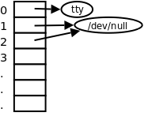

# 6. fcntl

先前我们以 `read` 终端设备为例介绍了非阻塞 I/O，为什么我们不直接对 `STDIN_FILENO` 做非阻塞 `read` ，而要重新 `open` 一遍 `/dev/tty` 呢？因为 `STDIN_FILENO` 在程序启动时已经被自动打开了，而我们需要在调用 `open` 时指定 `O_NONBLOCK` 标志。这里介绍另外一种办法，可以用 `fcntl` 函数改变一个已打开的文件的属性，可以重新设置读、写、追加、非阻塞等标志（这些标志称为 File Status Flag），而不必重新 `open` 文件。

```c
#include <unistd.h>
#include <fcntl.h>

int fcntl(int fd, int cmd);
int fcntl(int fd, int cmd, long arg);
int fcntl(int fd, int cmd, struct flock *lock);
```

这个函数和 `open` 一样，也是用可变参数实现的，可变参数的类型和个数取决于前面的 `cmd` 参数。下面的例子使用 `F_GETFL` 和 `F_SETFL` 这两种 `fcntl` 命令改变 `STDIN_FILENO` 的属性，加上 `O_NONBLOCK` 选项，实现和[例 28.3 “非阻塞读终端”](ch28s04.md#io.nonblockread)同样的功能。

**例 28.5. 用 fcntl 改变 File Status Flag**

```c
#include <unistd.h>
#include <fcntl.h>
#include <errno.h>
#include <string.h>
#include <stdlib.h>

#define MSG_TRY "try again\n"

int main(void)
{
	char buf[10];
	int n;
	int flags;
	flags = fcntl(STDIN_FILENO, F_GETFL);
	flags |= O_NONBLOCK;
	if (fcntl(STDIN_FILENO, F_SETFL, flags) == -1) {
		perror("fcntl");
		exit(1);
	}
tryagain:
	n = read(STDIN_FILENO, buf, 10);
	if (n < 0) {
		if (errno == EAGAIN) {
			sleep(1);
			write(STDOUT_FILENO, MSG_TRY, strlen(MSG_TRY));
			goto tryagain;
		}
		perror("read stdin");
		exit(1);
	}
	write(STDOUT_FILENO, buf, n);
	return 0;
}
```

以下程序通过命令行的第一个参数指定一个文件描述符，同时利用 Shell 的重定向功能在该描述符上打开文件，然后用 `fcntl` 的 `F_GETFL` 命令取出 File Status Flag 并打印。

```c
#include <sys/types.h>
#include <fcntl.h>
#include <stdio.h>
#include <stdlib.h>

int main(int argc, char *argv[])
{
	int val;
	if (argc != 2) {
		fputs("usage: a.out <descriptor#>\n", stderr);
		exit(1);
	}
	if ((val = fcntl(atoi(argv[1]), F_GETFL)) < 0) {
		printf("fcntl error for fd %d\n", atoi(argv[1]));
		exit(1);
	}
	switch(val & O_ACCMODE) {
	case O_RDONLY:
		printf("read only");
		break;
	case O_WRONLY:
		printf("write only");
		break;
	case O_RDWR:
		printf("read write");
		break;
	default:
		fputs("invalid access mode\n", stderr);
		exit(1);
	}
	if (val & O_APPEND)
		printf(", append");
	if (val & O_NONBLOCK)
		printf(", nonblocking");
	putchar('\n');
	return 0;
}
```

运行该程序的几种情况解释如下。

```text
$ ./a.out 0 < /dev/tty
read only
```

Shell 在执行 `a.out` 时将它的标准输入重定向到 `/dev/tty` ，并且是只读的。 `argv[1]` 是 0，因此取出文件描述符 0（也就是标准输入）的 File Status Flag，用掩码 `O_ACCMODE` 取出它的读写位，结果是 `O_RDONLY` 。注意，Shell 的重定向语法不属于程序的命令行参数，这个命行只有两个参数， `argv[0]` 是"./a.out"， `argv[1]` 是"0"，重定向由 Shell 解释，在启动程序时已经生效，程序在运行时并不知道标准输入被重定向了。

```text
$ ./a.out 1 > temp.foo
$ cat temp.foo
write only
```

Shell 在执行 `a.out` 时将它的标准输出重定向到文件 `temp.foo` ，并且是只写的。程序取出文件描述符 1 的 File Status Flag，发现是只写的，于是打印 `write only` ，但是打印不到屏幕上而是打印到 `temp.foo` 这个文件中了。

```text
$ ./a.out 2 2>>temp.foo
write only, append
```

Shell 在执行 `a.out` 时将它的标准错误输出重定向到文件 `temp.foo` ，并且是只写和追加方式。程序取出文件描述符 2 的 File Status Flag，发现是只写和追加方式的。

```text
$ ./a.out 5 5<>temp.foo
read write
```

Shell 在执行 `a.out` 时在它的文件描述符 5 上打开文件 `temp.foo` ，并且是可读可写的。程序取出文件描述符 5 的 File Status Flag，发现是可读可写的。

我们看到一种新的 Shell 重定向语法，如果在<、>、>>、<>前面添一个数字，该数字就表示在哪个文件描述符上打开文件，例如 2>>temp.foo 表示将标准错误输出重定向到文件 temp.foo 并且以追加方式写入文件，注意 2 和>>之间不能有空格，否则 2 就被解释成命令行参数了。文件描述符数字还可以出现在重定向符号右边，例如：

```text
$ command > /dev/null 2>&1
```

首先将某个命令 command 的标准输出重定向到 `/dev/null` ，然后将该命令可能产生的错误信息（标准错误输出）也重定向到和标准输出（用&1 标识）相同的文件，即 `/dev/null` ，如下图所示。

<div align="center">

  

  <p><b>图 28.3. 重定向之后的文件描述符表</b></p>

</div>

`/dev/null` 设备文件只有一个作用，往它里面写任何数据都被直接丢弃。因此保证了该命令执行时屏幕上没有任何输出，既不打印正常信息也不打印错误信息，让命令安静地执行，这种写法在 Shell 脚本中很常见。注意，文件描述符数字写在重定向符号右边需要加&号，否则就被解释成文件名了，2>&1 其中的>左右两边都不能有空格。

除了 `F_GETFL` 和 `F_SETFL` 命令之外， `fcntl` 还有很多命令做其它操作，例如设置文件记录锁等。可以通过 `fcntl` 设置的都是当前进程如何访问设备或文件的访问控制属性，例如读、写、追加、非阻塞、加锁等，但并不设置文件或设备本身的属性，例如文件的读写权限、串口波特率等。下一节要介绍的 `ioctl` 函数用于设置某些设备本身的属性，例如串口波特率、终端窗口大小，注意区分这两个函数的作用。
