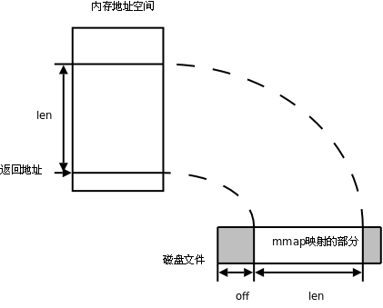

# 8. mmap

`mmap ` 可以把磁盘文件的一部分直接映射到内存，这样文件中的位置直接就有对应的内存地址，对文件的读写可以直接用指针来做而不需要`read ` /`write` 函数。

```c
#include <sys/mman.h>

 void *mmap(void *addr, size_t len, int prot, int flag, int filedes, off_t off);
 int munmap(void *addr, size_t len);
```

该函数各参数的作用图示如下：

<div align="center">

  

  <p><b>图 28.4. mmap 函数</b></p>

</div>

如果 `addr` 参数为 `NULL` ，内核会自己在进程地址空间中选择合适的地址建立映射。如果 `addr` 不是 `NULL` ，则给内核一个提示，应该从什么地址开始映射，内核会选择 `addr` 之上的某个合适的地址开始映射。建立映射后，真正的映射首地址通过返回值可以得到。 `len` 参数是需要映射的那一部分文件的长度。 `off` 参数是从文件的什么位置开始映射，必须是页大小的整数倍（在 32 位体系统结构上通常是 4K）。 `filedes` 是代表该文件的描述符。

`prot` 参数有四种取值：

* PROT_EXEC 表示映射的这一段可执行，例如映射共享库

* PROT_READ 表示映射的这一段可读

* PROT_WRITE 表示映射的这一段可写

* PROT_NONE 表示映射的这一段不可访问

`flag ` 参数有很多种取值，这里只讲两种，其它取值可查看`mmap(2)`

* MAP_SHARED 多个进程对同一个文件的映射是共享的，一个进程对映射的内存做了修改，另一个进程也会看到这种变化。

* MAP_PRIVATE 多个进程对同一个文件的映射不是共享的，一个进程对映射的内存做了修改，另一个进程并不会看到这种变化，也不会真的写到文件中去。

如果 `mmap` 成功则返回映射首地址，如果出错则返回常数 `MAP_FAILED` 。当进程终止时，该进程的映射内存会自动解除，也可以调用 `munmap` 解除映射。 `munmap` 成功返回 0，出错返回-1。

下面做一个简单的实验。

```text
$ vi hello
（编辑该文件的内容为“hello”）
$ od -tx1 -tc hello
0000000 68 65 6c 6c 6f 0a
          h   e   l   l   o  \n
0000006
```

现在用如下程序操作这个文件（注意，把 `fd` 关掉并不影响该文件已建立的映射，仍然可以对文件进行读写）。

```c
#include <stdlib.h>
#include <sys/mman.h>
#include <fcntl.h>

int main(void)
{
	int *p;
	int fd = open("hello", O_RDWR);
	if (fd < 0) {
		perror("open hello");
		exit(1);
	}
	p = mmap(NULL, 6, PROT_WRITE, MAP_SHARED, fd, 0);
	if (p == MAP_FAILED) {
		perror("mmap");
		exit(1);
	}
	close(fd);
	p[0] = 0x30313233;
	munmap(p, 6);
	return 0;
}
```

然后再查看这个文件的内容：

```text
$ od -tx1 -tc hello
 0000000 33 32 31 30 6f 0a
           3   2   1   0   o  \n
 0000006
```

请读者自己分析一下实验结果。

`mmap` 函数的底层也是一个系统调用，在执行程序时经常要用到这个系统调用来映射共享库到该进程的地址空间。例如一个很简单的 hello world 程序：

```c
#include <stdio.h>

int main(void)
{
	printf("hello world\n");
	return 0;
}
```

用 `strace` 命令执行该程序，跟踪该程序执行过程中用到的所有系统调用的参数及返回值：

```text
$ strace ./a.out
execve("./a.out", ["./a.out"], [/* 38 vars */]) = 0
brk(0)                                  = 0x804a000
access("/etc/ld.so.nohwcap", F_OK)      = -1 ENOENT (No such file or directory)
mmap2(NULL, 8192, PROT_READ|PROT_WRITE, MAP_PRIVATE|MAP_ANONYMOUS, -1, 0) = 0xb7fca000
access("/etc/ld.so.preload", R_OK)      = -1 ENOENT (No such file or directory)
open("/etc/ld.so.cache", O_RDONLY)      = 3
fstat64(3, {st_mode=S_IFREG|0644, st_size=63628, ...}) = 0
mmap2(NULL, 63628, PROT_READ, MAP_PRIVATE, 3, 0) = 0xb7fba000
close(3)                                = 0
access("/etc/ld.so.nohwcap", F_OK)      = -1 ENOENT (No such file or directory)
open("/lib/tls/i686/cmov/libc.so.6", O_RDONLY) = 3
read(3, "\177ELF\1\1\1\0\0\0\0\0\0\0\0\0\3\0\3\0\1\0\0\0\260a\1"..., 512) = 512
fstat64(3, {st_mode=S_IFREG|0644, st_size=1339816, ...}) = 0
mmap2(NULL, 1349136, PROT_READ|PROT_EXEC, MAP_PRIVATE|MAP_DENYWRITE, 3, 0) = 0xb7e70000
mmap2(0xb7fb4000, 12288, PROT_READ|PROT_WRITE, MAP_PRIVATE|MAP_FIXED|MAP_DENYWRITE, 3, 0x143) = 0xb7fb4000
mmap2(0xb7fb7000, 9744, PROT_READ|PROT_WRITE, MAP_PRIVATE|MAP_FIXED|MAP_ANONYMOUS, -1, 0) = 0xb7fb7000
close(3)                                = 0
mmap2(NULL, 4096, PROT_READ|PROT_WRITE, MAP_PRIVATE|MAP_ANONYMOUS, -1, 0) = 0xb7e6f000
set_thread_area({entry_number:-1 -> 6, base_addr:0xb7e6f6b0, limit:1048575, seg_32bit:1, contents:0, read_exec_only:0, limit_in_pages:1, seg_not_present:0, useable:1}) = 0
mprotect(0xb7fb4000, 4096, PROT_READ)   = 0
munmap(0xb7fba000, 63628)               = 0
fstat64(1, {st_mode=S_IFCHR|0620, st_rdev=makedev(136, 1), ...}) = 0
mmap2(NULL, 4096, PROT_READ|PROT_WRITE, MAP_PRIVATE|MAP_ANONYMOUS, -1, 0) = 0xb7fc9000
write(1, "hello world\n", 12hello world
)           = 12
exit_group(0)                           = ?
Process 8572 detached
```

可以看到，执行这个程序要映射共享库 `/lib/tls/i686/cmov/libc.so.6` 到进程地址空间。也可以看到， `printf` 函数的底层确实是调用 `write` 。
