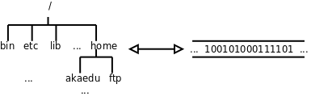

# 1. 引言

本章主要解答以下问题：

1. 文件系统在内核中是如何实现的？如何呈现给用户一个树状的目录结构？如何处理用户的文件和目录操作请求？

2. 磁盘是一种顺序的存储介质，一个树状的目录结构如何扯成一条线存到磁盘上？怎样设计文件系统的存储格式使访问磁盘的效率最高？各种文件和目录操作在磁盘上的实际效果是什么？

  

  
<b>图 29.1. 文件系统的表示和存储</b>

我们首先介绍一种文件系统的存储格式－早期 Linux 广泛使用的 ext2 文件系统。现在 Linux 最常用的 ext3 文件系统也是与 ext2 兼容的，基本格式是一致的，只是多了一些扩展。然后再介绍文件系统在内核中是如何实现的。
