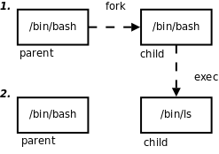

# 1. 引言

我们知道，每个进程在内核中都有一个进程控制块（PCB）来维护进程相关的信息，Linux 内核的进程控制块是 `task_struct` 结构体。现在我们全面了解一下其中都有哪些信息。

* 进程 id。系统中每个进程有唯一的 id，在 C 语言中用 `pid_t` 类型表示，其实就是一个非负整数。

* 进程的状态，有运行、挂起、停止、僵尸等状态。

* 进程切换时需要保存和恢复的一些 CPU 寄存器。

* 描述虚拟地址空间的信息。

* 描述控制终端的信息。

* 当前工作目录（Current Working Directory）。

* `umask` 掩码。

* 文件描述符表，包含很多指向 `file` 结构体的指针。

* 和信号相关的信息。

* 用户 id 和组 id。

* 控制终端、Session 和进程组。

* 进程可以使用的资源上限（Resource Limit）。

目前读者并不需要理解这些信息的细节，在随后几章中讲到某一项时会再次提醒读者它是保存在 PCB 中的。

`fork ` 和`exec ` 是本章要介绍的两个重要的系统调用。`fork ` 的作用是根据一个现有的进程复制出一个新进程，原来的进程称为父进程（Parent Process），新进程称为子进程（Child Process）。系统中同时运行着很多进程，这些进程都是从最初只有一个进程开始一个一个复制出来的。在 Shell 下输入命令可以运行一个程序，是因为 Shell 进程在读取用户输入的命令之后会调用`fork ` 复制出一个新的 Shell 进程，然后新的 Shell 进程调用`exec` 执行新的程序。

我们知道一个程序可以多次加载到内存，成为同时运行的多个进程，例如可以同时开多个终端窗口运行 `/bin/bash` ，另一方面，一个进程在调用 `exec` 前后也可以分别执行两个不同的程序，例如在 Shell 提示符下输入命令 `ls` ，首先 `fork` 创建子进程，这时子进程仍在执行 `/bin/bash` 程序，然后子进程调用 `exec` 执行新的程序 `/bin/ls` ，如下图所示。

  

  
<b>图 30.1. fork/exec</b>

在[第 3 节 “open/close”](ch28s03.md#io.open)中我们做过一个实验：用 `umask` 命令设置 Shell 进程的 `umask` 掩码，然后运行程序 `a.out` ，结果 `a.out` 进程的 `umask` 掩码也和 Shell 进程一样。现在可以解释了，因为 `a.out` 进程是 Shell 进程的子进程，子进程的 PCB 是根据父进程复制而来的，所以其中的 `umask` 掩码也和父进程一样。同样道理，子进程的当前工作目录也和父进程一样，所以我们可以用 `cd` 命令改变 Shell 进程的当前目录，然后用 `ls` 命令列出那个目录下的文件， `ls` 进程其实是在列自己的当前目录，而不是 Shell 进程的当前目录，只不过 `ls` 进程的当前目录正好和 Shell 进程相同。有一个例外，子进程 PCB 中的进程 id 和父进程是不同的。
