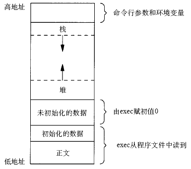
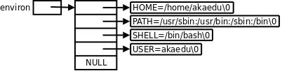

# 2. 环境变量

先前讲过， `exec` 系统调用执行新程序时会把命令行参数和环境变量表传递给 `main` 函数，它们在整个进程地址空间中的位置如下图所示。

<div align="center">

  

  <p><b>图 30.2. 进程地址空间</b></p>

</div>

和命令行参数 `argv` 类似，环境变量表也是一组字符串，如下图所示。

<div align="center">

  

  <p><b>图 30.3. 环境变量</b></p>

</div>

`libc ` 中定义的全局变量`environ ` 指向环境变量表，`environ ` 没有包含在任何头文件中，所以在使用时要用`extern` 声明。例如：

**例 30.1. 打印环境变量**

```c
#include <stdio.h>

int main(void)
{
	extern char **environ;
	int i;
	for(i=0; environ[i]!=NULL; i++)
		printf("%s\n", environ[i]);
	return 0;
}
```

执行结果为

```text
$ ./a.out
SSH_AGENT_PID=5717
SHELL=/bin/bash
DESKTOP_STARTUP_ID=
TERM=xterm
...
```

由于父进程在调用 `fork` 创建子进程时会把自己的环境变量表也复制给子进程，所以 `a.out` 打印的环境变量和 Shell 进程的环境变量是相同的。

按照惯例，环境变量字符串都是 `name=value` 这样的形式，大多数 `name` 由大写字母加下划线组成，一般把 `name` 的部分叫做环境变量， `value` 的部分则是环境变量的值。环境变量定义了进程的运行环境，一些比较重要的环境变量的含义如下：

* PATH

  可执行文件的搜索路径。 `ls` 命令也是一个程序，执行它不需要提供完整的路径名 `/bin/ls` ，然而通常我们执行当前目录下的程序 `a.out` 却需要提供完整的路径名 `./a.out` ，这是因为 `PATH` 环境变量的值里面包含了 `ls` 命令所在的目录 `/bin` ，却不包含 `a.out` 所在的目录。 `PATH` 环境变量的值可以包含多个目录，用 `:` 号隔开。在 Shell 中用 `echo` 命令可以查看这个环境变量的值：

```text
$ echo $PATH
/usr/local/sbin:/usr/local/bin:/usr/sbin:/usr/bin:/sbin:/bin:/usr/games
```

* SHELL

  当前 Shell，它的值通常是 `/bin/bash` 。

* TERM

  当前终端类型，在图形界面终端下它的值通常是 `xterm` ，终端类型决定了一些程序的输出显示方式，比如图形界面终端可以显示汉字，而字符终端一般不行。

* LANG

  语言和 locale，决定了字符编码以及时间、货币等信息的显示格式。

* HOME

  当前用户主目录的路径，很多程序需要在主目录下保存配置文件，使得每个用户在运行该程序时都有自己的一套配置。

用 `environ` 指针可以查看所有环境变量字符串，但是不够方便，如果给出 `name` 要在环境变量表中查找它对应的 `value` ，可以用 `getenv` 函数。

```c
#include <stdlib.h>
char *getenv(const char *name);
```

`getenv ` 的返回值是指向`value ` 的指针，若未找到则为`NULL` 。

修改环境变量可以用以下函数

```c
#include <stdlib.h>

int setenv(const char *name, const char *value, int rewrite);
void unsetenv(const char *name);
```

`putenv ` 和`setenv` 函数若成功则返回为 0，若出错则返回非 0。

`setenv ` 将环境变量`name ` 的值设置为`value ` 。如果已存在环境变量`name` ，那么

* 若 rewrite 非 0，则覆盖原来的定义；

* 若 rewrite 为 0，则不覆盖原来的定义，也不返回错误。

`unsetenv ` 删除`name ` 的定义。即使`name` 没有定义也不返回错误。

**例 30.2. 修改环境变量**

```c
#include <stdlib.h>
#include <stdio.h>

int main(void)
{
	printf("PATH=%s\n", getenv("PATH"));
	setenv("PATH", "hello", 1);
	printf("PATH=%s\n", getenv("PATH"));
	return 0;
}
```

```text
$ ./a.out
PATH=/usr/local/sbin:/usr/local/bin:/usr/sbin:/usr/bin:/sbin:/bin:/usr/games
PATH=hello
$ echo $PATH
/usr/local/sbin:/usr/local/bin:/usr/sbin:/usr/bin:/sbin:/bin:/usr/games
```

可以看出，Shell 进程的环境变量 `PATH` 传给了 `a.out` ，然后 `a.out` 修改了 `PATH` 的值，在 `a.out` 中能打印出修改后的值，但在 Shell 进程中 `PATH` 的值没变。父进程在创建子进程时会复制一份环境变量给子进程，但此后二者的环境变量互不影响。
