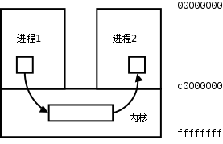

# 4. 进程间通信

每个进程各自有不同的用户地址空间，任何一个进程的全局变量在另一个进程中都看不到，所以进程之间要交换数据必须通过内核，在内核中开辟一块缓冲区，进程 1 把数据从用户空间拷到内核缓冲区，进程 2 再从内核缓冲区把数据读走，内核提供的这种机制称为进程间通信（IPC，InterProcess Communication）。如下图所示。

<div align="center">

  

  <p><b>图 30.6. 进程间通信</b></p>

</div>

## 4.1. 管道

管道是一种最基本的 IPC 机制，由 `pipe` 函数创建：

```c
#include <unistd.h>

int pipe(int filedes[2]);
```

调用 `pipe` 函数时在内核中开辟一块缓冲区（称为管道）用于通信，它有一个读端一个写端，然后通过 `filedes` 参数传出给用户程序两个文件描述符， `filedes[0]` 指向管道的读端， `filedes[1]` 指向管道的写端（很好记，就像 0 是标准输入 1 是标准输出一样）。所以管道在用户程序看起来就像一个打开的文件，通过 `read(filedes[0]);` 或者 `write(filedes[1]);` 向这个文件读写数据其实是在读写内核缓冲区。 `pipe` 函数调用成功返回 0，调用失败返回-1。

开辟了管道之后如何实现两个进程间的通信呢？比如可以按下面的步骤通信。

<div align="center">

  

  <p><b>图 30.7. 管道</b></p>

</div>

1. 父进程调用 `pipe` 开辟管道，得到两个文件描述符指向管道的两端。

2. 父进程调用 `fork` 创建子进程，那么子进程也有两个文件描述符指向同一管道。

3. 父进程关闭管道读端，子进程关闭管道写端。父进程可以往管道里写，子进程可以从管道里读，管道是用环形队列实现的，数据从写端流入从读端流出，这样就实现了进程间通信。

**例 30.7. 管道**

```c
#include <stdlib.h>
#include <unistd.h>
#define MAXLINE 80

int main(void)
{
	int n;
	int fd[2];
	pid_t pid;
	char line[MAXLINE];

	if (pipe(fd) < 0) {
		perror("pipe");
		exit(1);
	}
	if ((pid = fork()) < 0) {
		perror("fork");
		exit(1);
	}
	if (pid > 0) { /* parent */
		close(fd[0]);
		write(fd[1], "hello world\n", 12);
		wait(NULL);
	} else {       /* child */
		close(fd[1]);
		n = read(fd[0], line, MAXLINE);
		write(STDOUT_FILENO, line, n);
	}
	return 0;
}
```

使用管道有一些限制：

* 两个进程通过一个管道只能实现单向通信，比如上面的例子，父进程写子进程读，如果有时候也需要子进程写父进程读，就必须另开一个管道。请读者思考，如果只开一个管道，但是父进程不关闭读端，子进程也不关闭写端，双方都有读端和写端，为什么不能实现双向通信？

* 管道的读写端通过打开的文件描述符来传递，因此要通信的两个进程必须从它们的公共祖先那里继承管道文件描述符。上面的例子是父进程把文件描述符传给子进程之后父子进程之间通信，也可以父进程 `fork` 两次，把文件描述符传给两个子进程，然后两个子进程之间通信，总之需要通过 `fork` 传递文件描述符使两个进程都能访问同一管道，它们才能通信。

使用管道需要注意以下 4 种特殊情况（假设都是阻塞 I/O 操作，没有设置 `O_NONBLOCK` 标志）：

1. 如果所有指向管道写端的文件描述符都关闭了（管道写端的引用计数等于 0），而仍然有进程从管道的读端读数据，那么管道中剩余的数据都被读取后，再次 `read` 会返回 0，就像读到文件末尾一样。

2. 如果有指向管道写端的文件描述符没关闭（管道写端的引用计数大于 0），而持有管道写端的进程也没有向管道中写数据，这时有进程从管道读端读数据，那么管道中剩余的数据都被读取后，再次 `read` 会阻塞，直到管道中有数据可读了才读取数据并返回。

3. 如果所有指向管道读端的文件描述符都关闭了（管道读端的引用计数等于 0），这时有进程向管道的写端 `write` ，那么该进程会收到信号 `SIGPIPE` ，通常会导致进程异常终止。在[第 33 章 **信号**](ch33.md#signal)会讲到怎样使 `SIGPIPE` 信号不终止进程。

4. 如果有指向管道读端的文件描述符没关闭（管道读端的引用计数大于 0），而持有管道读端的进程也没有从管道中读数据，这时有进程向管道写端写数据，那么在管道被写满时再次 `write` 会阻塞，直到管道中有空位置了才写入数据并返回。

管道的这四种特殊情况具有普遍意义。在[第 37 章 **socket 编程**](ch37.md#socket)要讲的 TCP socket 也具有管道的这些特性。

## 习题

1、在[例 30.7 “管道”](ch30s04.md#process.pipe)中，父进程只用到写端，因而把读端关闭，子进程只用到读端，因而把写端关闭，然后互相通信，不使用的读端或写端必须关闭，请读者想一想如果不关闭会有什么问题。

2、请读者修改[例 30.7 “管道”](ch30s04.md#process.pipe)的代码和实验条件，验证我上面所说的四种特殊情况。

## 4.2. 其它 IPC 机制

进程间通信必须通过内核提供的通道，而且必须有一种办法在进程中标识内核提供的某个通道，上一节讲的管道是用打开的文件描述符来标识的。如果要互相通信的几个进程没有从公共祖先那里继承文件描述符，它们怎么通信呢？内核提供一条通道不成问题，问题是如何标识这条通道才能使各进程都可以访问它？文件系统中的路径名是全局的，各进程都可以访问，因此可以用文件系统中的路径名来标识一个 IPC 通道。

FIFO 和 UNIX Domain Socket 这两种 IPC 机制都是利用文件系统中的特殊文件来标识的。可以用 `mkfifo` 命令创建一个 FIFO 文件：

```text
$ mkfifo hello
$ ls -l hello
prw-r--r-- 1 akaedu akaedu 0 2008-10-30 10:44 hello
```

FIFO 文件在磁盘上没有数据块，仅用来标识内核中的一条通道，各进程可以打开这个文件进行 `read` / `write` ，实际上是在读写内核通道（根本原因在于这个 `file` 结构体所指向的 `read` 、 `write` 函数和常规文件不一样），这样就实现了进程间通信。UNIX Domain Socket 和 FIFO 的原理类似，也需要一个特殊的 socket 文件来标识内核中的通道，例如 `/var/run` 目录下有很多系统服务的 socket 文件：

```text
$ ls -l /var/run/
total 52
srw-rw-rw- 1 root        root           0 2008-10-30 00:24 acpid.socket
...
srw-rw-rw- 1 root        root           0 2008-10-30 00:25 gdm_socket
...
srw-rw-rw- 1 root        root           0 2008-10-30 00:24 sdp
...
srwxr-xr-x 1 root        root           0 2008-10-30 00:42 synaptic.socket
```

文件类型 s 表示 socket，这些文件在磁盘上也没有数据块。UNIX Domain Socket 是目前最广泛使用的 IPC 机制，到后面讲 socket 编程时再详细介绍。

现在把进程之间传递信息的各种途径（包括各种 IPC 机制）总结如下：

* 父进程通过 `fork` 可以将打开文件的描述符传递给子进程

* 子进程结束时，父进程调用 `wait` 可以得到子进程的终止信息

* 几个进程可以在文件系统中读写某个共享文件，也可以通过给文件加锁来实现进程间同步

* 进程之间互发信号，一般使用 `SIGUSR1` 和 `SIGUSR2` 实现用户自定义功能

* 管道

* FIFO

* mmap 函数，几个进程可以映射同一内存区

* SYS V IPC，以前的 SYS V UNIX 系统实现的 IPC 机制，包括消息队列、信号量和共享内存，现在已经基本废弃

* UNIX Domain Socket，目前最广泛使用的 IPC 机制
