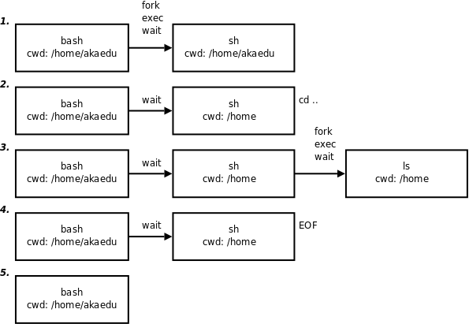

# 2. Shell 如何执行命令

## 2.1. 执行交互式命令

用户在命令行输入命令后，一般情况下 Shell 会 `fork` 并 `exec` 该命令，但是 Shell 的内建命令例外，执行内建命令相当于调用 Shell 进程中的一个函数，并不创建新的进程。以前学过的 `cd` 、 `alias` 、 `umask` 、 `exit` 等命令即是内建命令，凡是用 `which` 命令查不到程序文件所在位置的命令都是内建命令，内建命令没有单独的 man 手册，要在 man 手册中查看内建命令，应该

```text
$ man bash-builtins
```

本节会介绍很多内建命令，如 `export` 、 `shift` 、 `if` 、 `eval` 、 `[` 、 `for` 、 `while` 等等。内建命令虽然不创建新的进程，但也会有 Exit Status，通常也用 0 表示成功非零表示失败，虽然内建命令不创建新的进程，但执行结束后也会有一个状态码，也可以用特殊变量 `$?` 读出。

## 习题

1、在完成[第 5 节 “练习：实现简单的 Shell”](ch30s05.md#process.implementshell)时也许有的读者已经试过了，在自己实现的 Shell 中不能执行 `cd` 命令，因为 `cd` 是一个内建命令，没有程序文件，不能用 `exec` 执行。现在请完善该程序，实现 `cd` 命令的功能，用 `chdir(2)` 函数可以改变进程的当前工作目录。

2、思考一下，为什么 `cd` 命令要实现成内建命令？可不可以实现一个独立的 `cd` 程序，例如 `/bin/cd` ，就像 `/bin/ls` 一样？

## 2.2. 执行脚本

首先编写一个简单的脚本，保存为 `script.sh` ：

**例 31.1. 简单的 Shell 脚本**

```c
#! /bin/sh

cd ..
ls
```

Shell 脚本中用 `#` 表示注释，相当于 C 语言的 `//` 注释。但如果 `#` 位于第一行开头，并且是 `#!` （称为 Shebang）则例外，它表示该脚本使用后面指定的解释器 `/bin/sh` 解释执行。如果把这个脚本文件加上可执行权限然后执行：

```text
$ chmod +x script.sh
$ ./script.sh
```

Shell 会 `fork` 一个子进程并调用 `exec` 执行 `./script.sh` 这个程序， `exec` 系统调用应该把子进程的代码段替换成 `./script.sh` 程序的代码段，并从它的 `_start` 开始执行。然而 `script.sh` 是个文本文件，根本没有代码段和 `_start` 函数，怎么办呢？其实 `exec` 还有另外一种机制，如果要执行的是一个文本文件，并且第一行用 Shebang 指定了解释器，则用解释器程序的代码段替换当前进程，并且从解释器的 `_start` 开始执行，而这个文本文件被当作命令行参数传给解释器。因此，执行上述脚本相当于执行程序

```text
$ /bin/sh ./script.sh
```

以这种方式执行不需要 `script.sh` 文件具有可执行权限。再举个例子，比如某个 `sed` 脚本的文件名是 `script` ，它的开头是

```c
#! /bin/sed -f
```

执行 `./script` 相当于执行程序

```text
$ /bin/sed -f ./script.sh
```

以上介绍了两种执行 Shell 脚本的方法：

```text
$ ./script.sh
$ sh ./script.sh
```

这两种方法本质上是一样的，执行上述脚本的步骤为：

<div align="center">

  

  <p><b>图 31.1. Shell 脚本的执行过程</b></p>

</div>

1. 交互 Shell（ `bash` ） `fork` / `exec` 一个子 Shell（ `sh` ）用于执行脚本，父进程 `bash` 等待子进程 `sh` 终止。

2. `sh ` 读取脚本中的`cd ..` 命令，调用相应的函数执行内建命令，改变当前工作目录为上一级目录。

3. `sh ` 读取脚本中的`ls ` 命令，`fork ` /`exec ` 这个程序，列出当前工作目录下的文件，`sh ` 等待`ls` 终止。

4. `ls ` 终止后，`sh ` 继续执行，读到脚本文件末尾，`sh` 终止。

5. `sh ` 终止后，`bash` 继续执行，打印提示符等待用户输入。

如果将命令行下输入的命令用()括号括起来，那么也会 `fork` 出一个子 Shell 执行小括号中的命令，一行中可以输入由分号;隔开的多个命令，比如：

```text
$ (cd ..;ls -l)
```

和上面两种方法执行 Shell 脚本的效果是相同的， `cd ..` 命令改变的是子 Shell 的 `PWD` ，而不会影响到交互式 Shell。然而命令

```text
$ cd ..;ls -l
```

则有不同的效果， `cd ..` 命令是直接在交互式 Shell 下执行的，改变交互式 Shell 的 `PWD` ，然而这种方式相当于这样执行 Shell 脚本：

```text
$ source ./script.sh
```

或者

```text
$ . ./script.sh
```

`source ` 或者`.` 命令是 Shell 的内建命令，这种方式也不会创建子 Shell，而是直接在交互式 Shell 下逐行执行脚本中的命令。

## 习题

1、解释如下命令的执行过程：

```text
$ (exit 2)
$ echo $?
2
```
