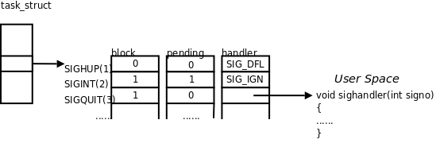

# 3. 阻塞信号

## 3.1. 信号在内核中的表示

以上我们讨论了信号**产生**（Generation）的各种原因，而实际执行信号的处理动作称为信号**递达**（Delivery），信号从产生到递达之间的状态，称为信号**未决**（Pending）。进程可以选择阻塞（Block）某个信号。被阻塞的信号产生时将保持在未决状态，直到进程解除对此信号的阻塞，才执行递达的动作。注意，阻塞和忽略是不同的，只要信号被阻塞就不会递达，而忽略是在递达之后可选的一种处理动作。信号在内核中的表示可以看作是这样的：

<div align="center">

  

  <p><b>图 33.1. 信号在内核中的表示示意图</b></p>

</div>

每个信号都有两个标志位分别表示阻塞和未决，还有一个函数指针表示处理动作。信号产生时，内核在进程控制块中设置该信号的未决标志，直到信号递达才清除该标志。在上图的例子中，

1. `SIGHUP` 信号未阻塞也未产生过，当它递达时执行默认处理动作。

2. `SIGINT` 信号产生过，但正在被阻塞，所以暂时不能递达。虽然它的处理动作是忽略，但在没有解除阻塞之前不能忽略这个信号，因为进程仍有机会改变处理动作之后再解除阻塞。

3. `SIGQUIT ` 信号未产生过，一旦产生`SIGQUIT ` 信号将被阻塞，它的处理动作是用户自定义函数`sighandler` 。

如果在进程解除对某信号的阻塞之前这种信号产生过多次，将如何处理？POSIX.1 允许系统递送该信号一次或多次。Linux 是这样实现的：常规信号在递达之前产生多次只计一次，而实时信号在递达之前产生多次可以依次放在一个队列里。本章不讨论实时信号。从上图来看，每个信号只有一个 bit 的未决标志，非 0 即 1，不记录该信号产生了多少次，阻塞标志也是这样表示的。因此，未决和阻塞标志可以用相同的数据类型 `sigset_t` 来存储， `sigset_t` 称为信号集，这个类型可以表示每个信号的“有效”或“无效”状态，在阻塞信号集中“有效”和“无效”的含义是该信号是否被阻塞，而在未决信号集中“有效”和“无效”的含义是该信号是否处于未决状态。下一节将详细介绍信号集的各种操作。阻塞信号集也叫做当前进程的信号屏蔽字（Signal Mask），这里的“屏蔽”应该理解为阻塞而不是忽略。

## 3.2. 信号集操作函数

`sigset_t ` 类型对于每种信号用一个 bit 表示“有效”或“无效”状态，至于这个类型内部如何存储这些 bit 则依赖于系统实现，从使用者的角度是不必关心的，使用者只能调用以下函数来操作`sigset_t ` 变量，而不应该对它的内部数据做任何解释，比如用`printf ` 直接打印`sigset_t` 变量是没有意义的。

```c
#include <signal.h>

int sigemptyset(sigset_t *set);
int sigfillset(sigset_t *set);
int sigaddset(sigset_t *set, int signo);
int sigdelset(sigset_t *set, int signo);
int sigismember(const sigset_t *set, int signo);
```

函数 `sigemptyset` 初始化 `set` 所指向的信号集，使其中所有信号的对应 bit 清零，表示该信号集不包含任何有效信号。函数 `sigfillset` 初始化 `set` 所指向的信号集，使其中所有信号的对应 bit 置位，表示该信号集的有效信号包括系统支持的所有信号。注意，在使用 `sigset_t` 类型的变量之前，一定要调用 `sigemptyset` 或 `sigfillset` 做初始化，使信号集处于确定的状态。初始化 `sigset_t` 变量之后就可以在调用 `sigaddset` 和 `sigdelset` 在该信号集中添加或删除某种有效信号。这四个函数都是成功返回 0，出错返回-1。 `sigismember` 是一个布尔函数，用于判断一个信号集的有效信号中是否包含某种信号，若包含则返回 1，不包含则返回 0，出错返回-1。

## 3.3. sigprocmask

调用函数 `sigprocmask` 可以读取或更改进程的信号屏蔽字。

```c
#include <signal.h>

int sigprocmask(int how, const sigset_t *set, sigset_t *oset);
```

返回值：若成功则为 0，若出错则为-1

如果 `oset` 是非空指针，则读取进程的当前信号屏蔽字通过 `oset` 参数传出。如果 `set` 是非空指针，则更改进程的信号屏蔽字，参数 `how` 指示如何更改。如果 `oset` 和 `set` 都是非空指针，则先将原来的信号屏蔽字备份到 `oset` 里，然后根据 `set` 和 `how` 参数更改信号屏蔽字。假设当前的信号屏蔽字为 `mask` ，下表说明了 `how` 参数的可选值。

**表 33.1. how 参数的含义**
| 参数 | 含义 |
| ---| ---|
| SIG_BLOCK | set 包含了我们希望添加到当前信号屏蔽字的信号，相当于 mask=mask\|set |
| SIG_UNBLOCK | set 包含了我们希望从当前信号屏蔽字中解除阻塞的信号，相当于 mask=mask&~set |
| SIG_SETMASK | 设置当前信号屏蔽字为 set 所指向的值，相当于 mask=set |

如果调用 `sigprocmask` 解除了对当前若干个未决信号的阻塞，则在 `sigprocmask` 返回前，至少将其中一个信号递达。

## 3.4. sigpending

```c
#include <signal.h>

int sigpending(sigset_t *set);
```

`sigpending ` 读取当前进程的未决信号集，通过`set` 参数传出。调用成功则返回 0，出错则返回-1。

下面用刚学的几个函数做个实验。程序如下：

```c
#include <signal.h>
#include <stdio.h>
#include <unistd.h>

void printsigset(const sigset_t *set)
{
	int i;
	for (i = 1; i < 32; i++)
		if (sigismember(set, i) == 1)
			putchar('1');
		else
			putchar('0');
	puts("");
}

int main(void)
{
	sigset_t s, p;
	sigemptyset(&s);
	sigaddset(&s, SIGINT);
	sigprocmask(SIG_BLOCK, &s, NULL);
	while (1) {
		sigpending(&p);
		printsigset(&p);
		sleep(1);
	}
	return 0;
}
```

程序运行时，每秒钟把各信号的未决状态打印一遍，由于我们阻塞了 `SIGINT` 信号，按 Ctrl-C 将会使 `SIGINT` 信号处于未决状态，按 Ctrl-\仍然可以终止程序，因为 `SIGQUIT` 信号没有阻塞。

```text
$ ./a.out
0000000000000000000000000000000
0000000000000000000000000000000（这时按 Ctrl-C）
0100000000000000000000000000000
0100000000000000000000000000000（这时按 Ctrl-\）
Quit (core dumped)
```
