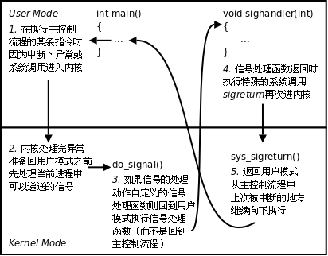
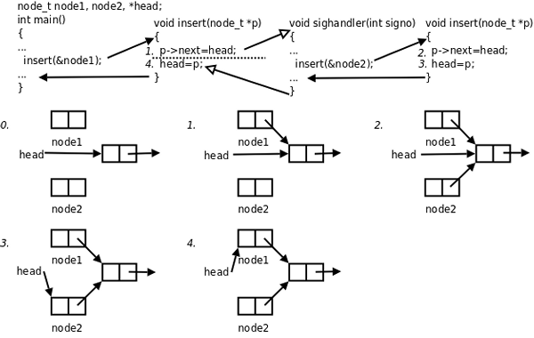

# 4. 捕捉信号

## 4.1. 内核如何实现信号的捕捉

如果信号的处理动作是用户自定义函数，在信号递达时就调用这个函数，这称为捕捉信号。由于信号处理函数的代码是在用户空间的，处理过程比较复杂，举例如下：

1. 用户程序注册了 `SIGQUIT` 信号的处理函数 `sighandler` 。

2. 当前正在执行 `main` 函数，这时发生中断或异常切换到内核态。

3. 在中断处理完毕后要返回用户态的 `main` 函数之前检查到有信号 `SIGQUIT` 递达。

4. 内核决定返回用户态后不是恢复 `main` 函数的上下文继续执行，而是执行 `sighandler` 函数， `sighandler` 和 `main` 函数使用不同的堆栈空间，它们之间不存在调用和被调用的关系，是两个独立的控制流程。

5. `sighandler ` 函数返回后自动执行特殊的系统调用`sigreturn` 再次进入内核态。

6. 如果没有新的信号要递达，这次再返回用户态就是恢复 `main` 函数的上下文继续执行了。

<div align="center">

  

  <p><b>图 33.2. 信号的捕捉</b></p>

</div>

上图出自[\[ULK\]](bi01.md#bibli.ulk)。

## 4.2. sigaction

```c
#include <signal.h>

int sigaction(int signo, const struct sigaction *act, struct sigaction *oact);
```

`sigaction ` 函数可以读取和修改与指定信号相关联的处理动作。调用成功则返回 0，出错则返回-1。`signo ` 是指定信号的编号。若`act ` 指针非空，则根据`act ` 修改该信号的处理动作。若`oact ` 指针非空，则通过`oact ` 传出该信号原来的处理动作。`act ` 和`oact ` 指向`sigaction` 结构体：

```c
struct sigaction {
   void      (*sa_handler)(int);   /* addr of signal handler, */
                                       /* or SIG_IGN, or SIG_DFL */
   sigset_t sa_mask;               /* additional signals to block */
   int      sa_flags;              /* signal options, Figure 10.16 */

   /* alternate handler */
   void     (*sa_sigaction)(int, siginfo_t *, void *);
};
```

将 `sa_handler` 赋值为常数 `SIG_IGN` 传给 `sigaction` 表示忽略信号，赋值为常数 `SIG_DFL` 表示执行系统默认动作，赋值为一个函数指针表示用自定义函数捕捉信号，或者说向内核注册了一个信号处理函数，该函数返回值为 `void` ，可以带一个 `int` 参数，通过参数可以得知当前信号的编号，这样就可以用同一个函数处理多种信号。显然，这也是一个回调函数，不是被 `main` 函数调用，而是被系统所调用。

当某个信号的处理函数被调用时，内核自动将当前信号加入进程的信号屏蔽字，当信号处理函数返回时自动恢复原来的信号屏蔽字，这样就保证了在处理某个信号时，如果这种信号再次产生，那么它会被阻塞到当前处理结束为止。如果在调用信号处理函数时，除了当前信号被自动屏蔽之外，还希望自动屏蔽另外一些信号，则用 `sa_mask` 字段说明这些需要额外屏蔽的信号，当信号处理函数返回时自动恢复原来的信号屏蔽字。

`sa_flags ` 字段包含一些选项，本章的代码都把`sa_flags ` 设为 0，`sa_sigaction` 是实时信号的处理函数，本章不详细解释这两个字段，有兴趣的读者参考[\[APUE2e\]](bi01.md#bibli.apue)。

## 4.3. pause

```c
#include <unistd.h>

int pause(void);
```

`pause ` 函数使调用进程挂起直到有信号递达。如果信号的处理动作是终止进程，则进程终止，`pause ` 函数没有机会返回；如果信号的处理动作是忽略，则进程继续处于挂起状态，`pause ` 不返回；如果信号的处理动作是捕捉，则调用了信号处理函数之后`pause ` 返回-1，`errno ` 设置为`EINTR ` ，所以`pause ` 只有出错的返回值（想想以前还学过什么函数只有出错返回值？）。错误码`EINTR` 表示“被信号中断”。

下面我们用 `alarm` 和 `pause` 实现 `sleep(3)` 函数，称为 `mysleep` 。

**例 33.2. mysleep**

```c
#include <unistd.h>
#include <signal.h>
#include <stdio.h>

void sig_alrm(int signo)
{
	/* nothing to do */
}

unsigned int mysleep(unsigned int nsecs)
{
	struct sigaction newact, oldact;
	unsigned int unslept;

	newact.sa_handler = sig_alrm;
	sigemptyset(&newact.sa_mask);
	newact.sa_flags = 0;
	sigaction(SIGALRM, &newact, &oldact);

	alarm(nsecs);
	pause();

	unslept = alarm(0);
	sigaction(SIGALRM, &oldact, NULL);

	return unslept;
}

int main(void)
{
	while(1){
		mysleep(2);
		printf("Two seconds passed\n");
	}
	return 0;
}
```

1. `main ` 函数调用`mysleep ` 函数，后者调用`sigaction ` 注册了`SIGALRM ` 信号的处理函数`sig_alrm` 。

2. 调用 `alarm(nsecs)` 设定闹钟。

3. 调用 `pause` 等待，内核切换到别的进程运行。

4. `nsecs ` 秒之后，闹钟超时，内核发`SIGALRM` 给这个进程。

5. 从内核态返回这个进程的用户态之前处理未决信号，发现有 `SIGALRM` 信号，其处理函数是 `sig_alrm` 。

6. 切换到用户态执行 `sig_alrm` 函数，进入 `sig_alrm` 函数时 `SIGALRM` 信号被自动屏蔽，从 `sig_alrm` 函数返回时 `SIGALRM` 信号自动解除屏蔽。然后自动执行系统调用 `sigreturn` 再次进入内核，再返回用户态继续执行进程的主控制流程（ `main` 函数调用的 `mysleep` 函数）。

7. `pause ` 函数返回-1，然后调用`alarm(0) ` 取消闹钟，调用`sigaction ` 恢复`SIGALRM` 信号以前的处理动作。

以下问题留给读者思考：

1、信号处理函数 `sig_alrm` 什么都没干，为什么还要注册它作为 `SIGALRM` 的处理函数？不注册信号处理函数可以吗？

2、为什么在 `mysleep` 函数返回前要恢复 `SIGALRM` 信号原来的 `sigaction` ？

3、 `mysleep` 函数的返回值表示什么含义？什么情况下返回非 0 值？。

## 4.4. 可重入函数

当捕捉到信号时，不论进程的主控制流程当前执行到哪儿，都会先跳到信号处理函数中执行，从信号处理函数返回后再继续执行主控制流程。信号处理函数是一个单独的控制流程，因为它和主控制流程是异步的，二者不存在调用和被调用的关系，并且使用不同的堆栈空间。引入了信号处理函数使得一个进程具有多个控制流程，如果这些控制流程访问相同的全局资源（全局变量、硬件资源等），就有可能出现冲突，如下面的例子所示。

<div align="center">

  

  <p><b>图 33.3. 不可重入函数</b></p>

</div>

`main ` 函数调用`insert ` 函数向一个链表`head ` 中插入节点`node1 ` ，插入操作分为两步，刚做完第一步的时候，因为硬件中断使进程切换到内核，再次回用户态之前检查到有信号待处理，于是切换到`sighandler ` 函数，`sighandler ` 也调用`insert ` 函数向同一个链表`head ` 中插入节点`node2 ` ，插入操作的两步都做完之后从`sighandler ` 返回内核态，再次回到用户态就从`main ` 函数调用的`insert ` 函数中继续往下执行，先前做第一步之后被打断，现在继续做完第二步。结果是，`main ` 函数和`sighandler` 先后向链表中插入两个节点，而最后只有一个节点真正插入链表中了。

像上例这样， `insert` 函数被不同的控制流程调用，有可能在第一次调用还没返回时就再次进入该函数，这称为重入， `insert` 函数访问一个全局链表，有可能因为重入而造成错乱，像这样的函数称为不可重入函数，反之，如果一个函数只访问自己的局部变量或参数，则称为可重入（ `Reentrant` ）函数。想一下，为什么两个不同的控制流程调用同一个函数，访问它的同一个局部变量或参数就不会造成错乱？

如果一个函数符合以下条件之一则是不可重入的：

* 调用了 `malloc` 或 `free` ，因为 `malloc` 也是用全局链表来管理堆的。

* 调用了标准 I/O 库函数。标准 I/O 库的很多实现都以不可重入的方式使用全局数据结构。

SUS 规定有些系统函数必须以线程安全的方式实现，这里就不列了，请参考[\[APUE2e\]](bi01.md#bibli.apue)。

## 4.5. sig_atomic_t 类型与 volatile 限定符

在上面的例子中， `main` 和 `sighandler` 都调用 `insert` 函数则有可能出现链表的错乱，其根本原因在于，对全局链表的插入操作要分两步完成，不是一个原子操作，假如这两步操作必定会一起做完，中间不可能被打断，就不会出现错乱了。下一节线程会讲到如何保证一个代码段以原子操作完成。

现在想一下，如果对全局数据的访问只有一行代码，是不是原子操作呢？比如， `main` 和 `sighandler` 都对一个全局变量赋值，会不会出现错乱呢？比如下面的程序：

```c
long long a;
int main(void)
{
	a=5;
	return 0;
}
```

带调试信息编译，然后带源代码反汇编：

```text
$ gcc main.c -g
$ objdump -dS a.out
```

其中 main 函数的指令中有：

```text
a=5;
 8048352:       c7 05 50 95 04 08 05    movl   $0x5,0x8049550
 8048359:       00 00 00
 804835c:       c7 05 54 95 04 08 00    movl   $0x0,0x8049554
 8048363:       00 00 00
```

虽然 C 代码只有一行，但是在 32 位机上对一个 64 位的 `long long` 变量赋值需要两条指令完成，因此不是原子操作。同样地，读取这个变量到寄存器需要两个 32 位寄存器才放得下，也需要两条指令，不是原子操作。请读者设想一种时序， `main` 和 `sighandler` 都对这个变量 `a` 赋值，最后变量 `a` 的值发生错乱。

如果上述程序在 64 位机上编译执行，则有可能用一条指令完成赋值，因而是原子操作。如果 `a` 是 32 位的 `int` 变量，在 32 位机上赋值是原子操作，在 16 位机上就不是。如果在程序中需要使用一个变量，要保证对它的读写都是原子操作，应该采用什么类型呢？为了解决这些平台相关的问题，C 标准定义了一个类型 `sig_atomic_t` ，在不同平台的 C 语言库中取不同的类型，例如在 32 位机上定义 `sig_atomic_t` 为 `int` 类型。

在使用 `sig_atomic_t` 类型的变量时，还需要注意另一个问题。看如下的例子：

```c
#include <signal.h>

sig_atomic_t a=0;
int main(void)
{
	/* register a sighandler */
	while(!a); /* wait until a changes in sighandler */
	/* do something after signal arrives */
	return 0;
}
```

为了简洁，这里只写了一个代码框架来说明问题。在 `main` 函数中首先要注册某个信号的处理函数 `sighandler` ，然后在一个 `while` 死循环中等待信号发生，如果有信号递达则执行 `sighandler` ，在 `sighandler` 中将 `a` 改为 1，这样再次回到 `main` 函数时就可以退出 `while` 循环，执行后续处理。用上面的方法编译和反汇编这个程序，在 `main` 函数的指令中有：

```text
/* register a sighandler */
	while(!a); /* wait until a changes in sighandler */
 8048352:       a1 3c 95 04 08          mov    0x804953c,%eax
 8048357:       85 c0                   test   %eax,%eax
 8048359:       74 f7                   je     8048352 <main+0xe>
```

将全局变量 `a` 从内存读到 `eax` 寄存器，对 `eax` 和 `eax` 做 AND 运算，若结果为 0 则跳回循环开头，再次从内存读变量 `a` 的值，可见这三条指令等价于 C 代码的 `while(!a);` 循环。如果在编译时加了优化选项，例如：

```text
$ gcc main.c -O1 -g
$ objdump -dS a.out
```

则 `main` 函数的指令中有：

```text
8048352:       83 3d 3c 95 04 08 00    cmpl   $0x0,0x804953c
	/* register a sighandler */
	while(!a); /* wait until a changes in sighandler */
 8048359:       74 fe                   je     8048359 <main+0x15>
```

第一条指令将全局变量 `a` 的内存单元直接和 0 比较，如果相等，则第二条指令成了一个死循环，注意，这是一个真正的死循环：即使 `sighandler` 将 `a` 改为 1，只要没有影响 Zero 标志位，回到 `main` 函数后仍然死在第二条指令上，因为不会再次从内存读取变量 `a` 的值。

是编译器优化得有错误吗？不是的。设想一下，如果程序只有单一的执行流程，只要当前执行流程没有改变 `a` 的值， `a` 的值就没有理由会变，不需要反复从内存读取，因此上面的两条指令和 `while(!a);` 循环是等价的，并且优化之后省去了每次循环读内存的操作，效率非常高。所以不能说编译器做错了，只能说**编译器无法识别程序中存在多个执行流程**。之所以程序中存在多个执行流程，是因为调用了特定平台上的特定库函数，比如 `sigaction` 、 `pthread_create` ，这些不是 C 语言本身的规范，不归编译器管，程序员应该自己处理这些问题。C 语言提供了 `volatile` 限定符，如果将上述变量定义为 `volatile sig_atomic_t a=0;` 那么即使指定了优化选项，编译器也不会优化掉对变量 a 内存单元的读写。

对于程序中存在多个执行流程访问同一全局变量的情况， `volatile` 限定符是必要的，此外，虽然程序只有单一的执行流程，但是变量属于以下情况之一的，也需要 `volatile` 限定：

* 变量的内存单元中的数据不需要写操作就可以自己发生变化，每次读上来的值都可能不一样

* 即使多次向变量的内存单元中写数据，只写不读，也并不是在做无用功，而是有特殊意义的

什么样的内存单元会具有这样的特性呢？肯定不是普通的内存，而是映射到内存地址空间的硬件寄存器，例如串口的接收寄存器属于上述第一种情况，而发送寄存器属于上述第二种情况。

** `sig_atomic_t` 类型的变量应该总是加上 `volatile` 限定符**，因为要使用 `sig_atomic_t` 类型的理由也正是要加 `volatile` 限定符的理由。

## 4.6. 竞态条件与 sigsuspend 函数

现在重新审视[例 33.2 “mysleep”](ch33s04.md#signal.mysleep)，设想这样的时序：

1. 注册 `SIGALRM` 信号的处理函数。

2. 调用 `alarm(nsecs)` 设定闹钟。

3. 内核调度优先级更高的进程取代当前进程执行，并且优先级更高的进程有很多个，每个都要执行很长时间

4. `nsecs ` 秒钟之后闹钟超时了，内核发送`SIGALRM` 信号给这个进程，处于未决状态。

5. 优先级更高的进程执行完了，内核要调度回这个进程执行。 `SIGALRM` 信号递达，执行处理函数 `sig_alrm` 之后再次进入内核。

6. 返回这个进程的主控制流程， `alarm(nsecs)` 返回，调用 `pause()` 挂起等待。

7. 可是 `SIGALRM` 信号已经处理完了，还等待什么呢？

出现这个问题的根本原因是系统运行的时序（Timing）并不像我们写程序时所设想的那样。虽然 `alarm(nsecs)` 紧接着的下一行就是 `pause()` ，但是无法保证 `pause()` 一定会在调用 `alarm(nsecs)` 之后的 `nsecs` 秒之内被调用。由于异步事件在任何时候都有可能发生（这里的异步事件指出现更高优先级的进程），如果我们写程序时考虑不周密，就可能由于时序问题而导致错误，这叫做竞态条件（Race Condition）。

如何解决上述问题呢？读者可能会想到，在调用 `pause` 之前屏蔽 `SIGALRM` 信号使它不能提前递达就可以了。看看以下方法可行吗？

1. 屏蔽 `SIGALRM` 信号;

2. `alarm(nsecs);`

3. 解除对 `SIGALRM` 信号的屏蔽;

4. `pause();`

从解除信号屏蔽到调用 `pause` 之间存在间隙， `SIGALRM` 仍有可能在这个间隙递达。要消除这个间隙，我们把解除屏蔽移到 `pause` 后面可以吗？

1. 屏蔽 `SIGALRM` 信号;

2. `alarm(nsecs);`

3. `pause();`

4. 解除对 `SIGALRM` 信号的屏蔽;

这样更不行了，还没有解除屏蔽就调用 `pause` ， `pause` 根本不可能等到 `SIGALRM` 信号。要是“解除信号屏蔽”和“挂起等待信号”这两步能合并成一个原子操作就好了，这正是 `sigsuspend` 函数的功能。 `sigsuspend` 包含了 `pause` 的挂起等待功能，同时解决了竞态条件的问题，在对时序要求严格的场合下都应该调用 `sigsuspend` 而不是 `pause` 。

```c
#include <signal.h>

int sigsuspend(const sigset_t *sigmask);
```

和 `pause` 一样， `sigsuspend` 没有成功返回值，只有执行了一个信号处理函数之后 `sigsuspend` 才返回，返回值为-1， `errno` 设置为 `EINTR` 。

调用 `sigsuspend` 时，进程的信号屏蔽字由 `sigmask` 参数指定，可以通过指定 `sigmask` 来临时解除对某个信号的屏蔽，然后挂起等待，当 `sigsuspend` 返回时，进程的信号屏蔽字恢复为原来的值，如果原来对该信号是屏蔽的，从 `sigsuspend` 返回后仍然是屏蔽的。

以下用 `sigsuspend` 重新实现 `mysleep` 函数：

```c
unsigned int mysleep(unsigned int nsecs)
{
	struct sigaction    newact, oldact;
	sigset_t            newmask, oldmask, suspmask;
	unsigned int        unslept;

	/* set our handler, save previous information */
	newact.sa_handler = sig_alrm;
	sigemptyset(&newact.sa_mask);
	newact.sa_flags = 0;
	sigaction(SIGALRM, &newact, &oldact);

	/* block SIGALRM and save current signal mask */
	sigemptyset(&newmask);
	sigaddset(&newmask, SIGALRM);
	sigprocmask(SIG_BLOCK, &newmask, &oldmask);

	alarm(nsecs);

	suspmask = oldmask;
	sigdelset(&suspmask, SIGALRM);    /* make sure SIGALRM isn't blocked */
	sigsuspend(&suspmask);            /* wait for any signal to be caught */

	/* some signal has been caught,   SIGALRM is now blocked */

	unslept = alarm(0);
	sigaction(SIGALRM, &oldact, NULL);  /* reset previous action */

	/* reset signal mask, which unblocks SIGALRM */
	sigprocmask(SIG_SETMASK, &oldmask, NULL);
	return(unslept);
}
```

如果在调用 `mysleep` 函数时 `SIGALRM` 信号没有屏蔽：

1. 调用 `sigprocmask(SIG_BLOCK, &newmask, &oldmask);` 时屏蔽 `SIGALRM` 。

2. 调用 `sigsuspend(&suspmask);` 时解除对 `SIGALRM` 的屏蔽，然后挂起等待待。

3. `SIGALRM ` 递达后`suspend ` 返回，自动恢复原来的屏蔽字，也就是再次屏蔽`SIGALRM` 。

4. 调用 `sigprocmask(SIG_SETMASK, &oldmask, NULL);` 时再次解除对 `SIGALRM` 的屏蔽。

## 4.7. 关于 SIGCHLD 信号

进程一章讲过用 `wait` 和 `waitpid` 函数清理僵尸进程，父进程可以阻塞等待子进程结束，也可以非阻塞地查询是否有子进程结束等待清理（也就是轮询的方式）。采用第一种方式，父进程阻塞了就不能处理自己的工作了；采用第二种方式，父进程在处理自己的工作的同时还要记得时不时地轮询一下，程序实现复杂。

其实，子进程在终止时会给父进程发 `SIGCHLD` 信号，该信号的默认处理动作是忽略，父进程可以自定义 `SIGCHLD` 信号的处理函数，这样父进程只需专心处理自己的工作，不必关心子进程了，子进程终止时会通知父进程，父进程在信号处理函数中调用 `wait` 清理子进程即可。

请编写一个程序完成以下功能：父进程 `fork` 出子进程，子进程调用 `exit(2)` 终止，父进程自定义 `SIGCHLD` 信号的处理函数，在其中调用 `wait` 获得子进程的退出状态并打印。

事实上，由于 UNIX 的历史原因，要想不产生僵尸进程还有另外一种办法：父进程调用 `sigaction` 将 `SIGCHLD` 的处理动作置为 `SIG_IGN` ，这样 `fork` 出来的子进程在终止时会自动清理掉，不会产生僵尸进程，也不会通知父进程。系统默认的忽略动作和用户用 `sigaction` 函数自定义的忽略通常是没有区别的，但这是一个特例。此方法对于 Linux 可用，但不保证在其它 UNIX 系统上都可用。请编写程序验证这样做不会产生僵尸进程。
