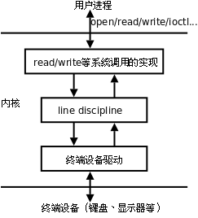
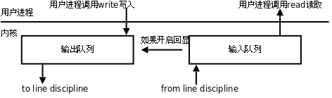
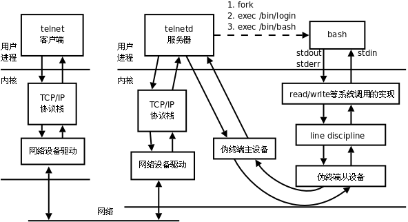

# 1. 终端

## 1.1. 终端的基本概念

在 UNIX 系统中，用户通过终端登录系统后得到一个 Shell 进程，这个终端成为 Shell 进程的控制终端（Controlling Terminal），在[第 1 节 “引言”](ch30s01.md#process.intro)讲过，控制终端是保存在 PCB 中的信息，而我们知道 `fork` 会复制 PCB 中的信息，因此由 Shell 进程启动的其它进程的控制终端也是这个终端。默认情况下（没有重定向），每个进程的标准输入、标准输出和标准错误输出都指向控制终端，进程从标准输入读也就是读用户的键盘输入，进程往标准输出或标准错误输出写也就是输出到显示器上。此外在[第 33 章 **信号**](ch33.md#signal)还讲过，在控制终端输入一些特殊的控制键可以给前台进程发信号，例如 Ctrl-C 表示 `SIGINT` ，Ctrl-\表示 `SIGQUIT` 。

在[第 28 章 **文件与 I/O**](ch28.md#io)中讲过，每个进程都可以通过一个特殊的设备文件 `/dev/tty` 访问它的控制终端。事实上每个终端设备都对应一个不同的设备文件， `/dev/tty` 提供了一个通用的接口，一个进程要访问它的控制终端既可以通过 `/dev/tty` 也可以通过该终端设备所对应的设备文件来访问。 `ttyname` 函数可以由文件描述符查出对应的文件名，该文件描述符必须指向一个终端设备而不能是任意文件。下面我们通过实验看一下各种不同的终端所对应的设备文件名。

**例 34.1. 查看终端对应的设备文件名**

```c
#include <unistd.h>
#include <stdio.h>

int main()
{
    printf("fd 0: %s\n", ttyname(0));
    printf("fd 1: %s\n", ttyname(1));
    printf("fd 2: %s\n", ttyname(2));
    return 0;
}
```

在图形终端窗口下运行这个程序，可能会得到

```text
$ ./a.out
fd 0: /dev/pts/0
fd 1: /dev/pts/0
fd 2: /dev/pts/0
```

再开一个终端窗口运行这个程序，可能又会得到

```text
$ ./a.out
fd 0: /dev/pts/1
fd 1: /dev/pts/1
fd 2: /dev/pts/1
```

用 Ctrl-Alt-F1 切换到字符终端运行这个程序，结果是

```text
$ ./a.out
fd 0: /dev/tty1
fd 1: /dev/tty1
fd 2: /dev/tty1
```

读者可以再试试在 Ctrl-Alt-F2 的字符终端下或者在 `telnet` 或 `ssh` 登陆的网络终端下运行这个程序，看看结果是什么。

## 1.2. 终端登录过程

一台 PC 通常只有一套键盘和显示器，也就是只有一套终端设备，但是可以通过 Ctrl-Alt-F1~Ctrl-Alt-F6 切换到 6 个字符终端，相当于有 6 套虚拟的终端设备，它们共用同一套物理终端设备，对应的设备文件分别是 `/dev/tty1` ~ `/dev/tty6` ，所以称为虚拟终端（Virtual Terminal）。设备文件 `/dev/tty0` 表示当前虚拟终端，比如切换到 Ctrl-Alt-F1 的字符终端时 `/dev/tty0` 就表示 `/dev/tty1` ，切换到 Ctrl-Alt-F2 的字符终端时 `/dev/tty0` 就表示 `/dev/tty2` ，就像 `/dev/tty` 一样也是一个通用的接口，但它不能表示图形终端窗口所对应的终端。

再举个例子，做嵌入式开发时经常会用到串口终端，目标板的每个串口对应一个终端设备，比如 `/dev/ttyS0` 、 `/dev/ttyS1` 等，将主机和目标板用串口线连起来，就可以在主机上通过 Linux 的 `minicom` 或 Windows 的超级终端工具登录到目标板的系统。

内核中处理终端设备的模块包括硬件驱动程序和线路规程（Line Discipline）。

<div align="center">

  

  <p><b>图 34.1. 终端设备模块</b></p>

</div>

硬件驱动程序负责读写实际的硬件设备，比如从键盘读入字符和把字符输出到显示器，线路规程像一个过滤器，对于某些特殊字符并不是让它直接通过，而是做特殊处理，比如在键盘上按下 Ctrl-Z，对应的字符并不会被用户程序的 `read` 读到，而是被线路规程截获，解释成 `SIGTSTP` 信号发给前台进程，通常会使该进程停止。线路规程应该过滤哪些字符和做哪些特殊处理是可以配置的。

终端设备有输入和输出队列缓冲区，如下图所示。

<div align="center">

  

  <p><b>图 34.2. 终端缓冲</b></p>

</div>

以输入队列为例，从键盘输入的字符经线路规程过滤后进入输入队列，用户程序以先进先出的顺序从队列中读取字符，一般情况下，当输入队列满的时候再输入字符会丢失，同时系统会响铃警报。终端可以配置成回显（Echo）模式，在这种模式下，输入队列中的每个字符既送给用户程序也送给输出队列，因此我们在命令行键入字符时，该字符不仅可以被程序读取，我们也可以同时在屏幕上看到该字符的回显。

现在我们来看终端登录的过程：

1、系统启动时， `init` 进程根据配置文件 `/etc/inittab` 确定需要打开哪些终端。例如配置文件中有这样一行：

```c
1:2345:respawn:/sbin/getty 9600 tty1
```

和 `/etc/passwd` 类似，每个字段用 `:` 号隔开。开头的 1 是这一行配置的 id，通常要和 `tty` 的后缀一致，配置 `tty2` 的那一行 id 就应该是 2。第二个字段 2345 表示运行级别 2~5 都执行这个配置。最后一个字段 `/sbin/getty 9600 tty1` 是 `init` 进程要 `fork` / `exec` 的命令，打开终端 `/dev/tty1` ，波特率是 9600（波特率只对串口和 Modem 终端有意义），然后提示用户输入帐号。中间的 `respawn` 字段表示 `init` 进程会监视 `getty` 进程的运行状态，一旦该进程终止， `init` 会再次 `fork` / `exec` 这个命令，所以我们从终端退出登录后会再次提示输入帐号。

有些新的 Linux 发行版已经不用 `/etc/inittab` 这个配置文件了，例如 Ubuntu 用 `/etc/event.d` 目录下的配置文件来配置 `init` 。

2、 `getty` 根据命令行参数打开终端设备作为它的控制终端，把文件描述符 0、1、2 都指向控制终端，然后提示用户输入帐号。用户输入帐号之后， `getty` 的任务就完成了，它再执行 `login` 程序：

```c
execle("/bin/login", "login", "-p", username, NULL, envp);
```

3、 `login` 程序提示用户输入密码（输入密码期间关闭终端的回显），然后验证帐号密码的正确性。如果密码不正确， `login` 进程终止， `init` 会重新 `fork` / `exec` 一个 `getty` 进程。如果密码正确， `login` 程序设置一些环境变量，设置当前工作目录为该用户的主目录，然后执行 Shell：

```c
execl("/bin/bash", "-bash", NULL);
```

注意 `argv[0]` 参数的程序名前面加了一个 `-` ，这样 `bash` 就知道自己是作为登录 Shell 启动的，执行登录 Shell 的启动脚本。从 `getty` 开始 `exec` 到 `login` ，再 `exec` 到 `bash` ，其实都是同一个进程，因此控制终端没变，文件描述符 0、1、2 也仍然指向控制终端。由于 `fork` 会复制 PCB 信息，所以由 Shell 启动的其它进程也都是如此。

## 1.3. 网络登录过程

虚拟终端或串口终端的数目是有限的，虚拟终端一般就是 `/dev/tty1` ~ `/dev/tty6` 六个，串口终端的数目也不超过串口的数目。然而网络终端或图形终端窗口的数目却是不受限制的，这是通过伪终端（Pseudo TTY）实现的。一套伪终端由一个主设备（PTY Master）和一个从设备（PTY Slave）组成。主设备在概念上相当于键盘和显示器，只不过它不是真正的硬件而是一个内核模块，操作它的也不是用户而是另外一个进程。从设备和上面介绍的 `/dev/tty1` 这样的终端设备模块类似，只不过它的底层驱动程序不是访问硬件而是访问主设备。通过[例 34.1 “查看终端对应的设备文件名”](ch34s01.md#jobs.ttyname)的实验结果可以看到，网络终端或图形终端窗口的 Shell 进程以及它启动的其它进程都会认为自己的控制终端是伪终端从设备，例如 `/dev/pts/0` 、 `/dev/pts/1` 等。下面以 `telnet` 为例说明网络登录和使用伪终端的过程。

<div align="center">

  

  <p><b>图 34.3. 伪终端</b></p>

</div>

1. 用户通过 `telnet` 客户端连接服务器。如果服务器配置为独立（Standalone）模式，则在服务器监听连接请求是一个 `telnetd` 进程，它 `fork` 出一个 `telnetd` 子进程来服务客户端，父进程仍监听其它连接请求。另外一种可能是服务器端由系统服务程序 `inetd` 或 `xinetd` 监听连接请求， `inetd` 称为 Internet Super-Server，它监听系统中的多个网络服务端口，如果连接请求的端口号和 `telnet` 服务端口号一致，则 `fork` / `exec` 一个 `telnetd` 子进程来服务客户端。 `xinetd` 是 `inetd` 的升级版本，配置更为灵活。

2. `telnetd ` 子进程打开一个伪终端设备，然后再经过`fork ` 一分为二：父进程操作伪终端主设备，子进程将伪终端从设备作为它的控制终端，并且将文件描述符 0、1、2 指向控制终端，二者通过伪终端通信，父进程还负责和`telnet ` 客户端通信，而子进程负责用户的登录过程，提示输入帐号，然后调用`exec ` 变成`login ` 进程，提示输入密码，然后调用`exec ` 变成 Shell 进程。这个 Shell 进程认为自己的控制终端是伪终端从设备，伪终端主设备可以看作键盘显示器等硬件，而操作这个伪终端的“用户”就是父进程`telnetd` 。

3. 当用户输入命令时， `telnet` 客户端将用户输入的字符通过网络发给 `telnetd` 服务器，由 `telnetd` 服务器代表用户将这些字符输入伪终端。Shell 进程并不知道自己连接的是伪终端而不是真正的键盘显示器，也不知道操作终端的“用户”其实是 `telnetd` 服务器而不是真正的用户。Shell 仍然解释执行命令，将标准输出和标准错误输出写到终端设备，这些数据最终由 `telnetd` 服务器发回给 `telnet` 客户端，然后显示给用户看。

如果 `telnet` 客户端和服务器之间的网络延迟较大，我们会观察到按下一个键之后要过几秒钟才能回显到屏幕上。这说明我们每按一个键 `telnet` 客户端都会立刻把该字符发送给服务器，然后这个字符经过伪终端主设备和从设备之后被 Shell 进程读取，同时回显到伪终端从设备，回显的字符再经过伪终端主设备、 `telnetd` 服务器和网络发回给 `telnet` 客户端，显示给用户看。也许你会觉得吃惊，但真的是这样：每按一个键都要在网络上走个来回！

BSD 系列的 UNIX 在 `/dev` 目录下创建很多 `ptyXX` 和 `ttyXX` 设备文件， `XX` 由字母和数字组成， `ptyXX` 是主设备，相对应的 `ttyXX` 是从设备，伪终端的数目取决于内核配置。而在 SYS V 系列的 UNIX 上，伪终端主设备是 `/dev/ptmx` ，“mx”表示 Multiplex，意思是多个主设备复用同一个设备文件，每打开一次 `/dev/ptmx` ，内核就分配一个主设备，同时在 `/dev/pts` 目录下创建一个从设备文件，当终端关闭时就从 `/dev/pts` 目录下删除相应的从设备文件。Linux 同时支持上述两种伪终端，目前的标准倾向于 SYS V 的伪终端。
