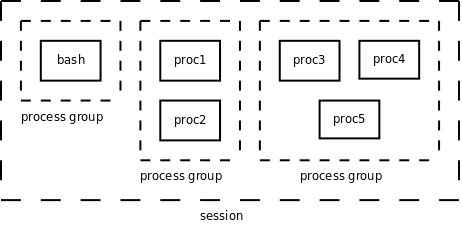

# 2. 作业控制

## 2.1. Session 与进程组

在[第 1 节 “信号的基本概念”](ch33s01.md#signal.intro)中我说过“Shell 可以同时运行一个前台进程和任意多个后台进程”其实是不全面的，现在我们来研究更复杂的情况。事实上，Shell 分前后台来控制的不是进程而是作业（Job）或者进程组（Process Group）。一个前台作业可以由多个进程组成，一个后台作业也可以由多个进程组成，Shell 可以同时运行一个前台作业和任意多个后台作业，这称为作业控制（Job Control）。例如用以下命令启动 5 个进程（这个例子出自[\[APUE2e\]](bi01.md#bibli.apue)）：

```text
$ proc1 | proc2 &
$ proc3 | proc4 | proc5
```

其中 `proc1` 和 `proc2` 属于同一个后台进程组， `proc3` 、 `proc4` 、 `proc5` 属于同一个前台进程组，Shell 进程本身属于一个单独的进程组。这些进程组的控制终端相同，它们属于同一个 Session。当用户在控制终端输入特殊的控制键（例如 Ctrl-C）时，内核会发送相应的信号（例如 `SIGINT` ）给前台进程组的所有进程。各进程、进程组、Session 的关系如下图所示。

<div align="center">

  

  <p><b>图 34.4. Session 与进程组</b></p>

</div>

现在我们从 Session 和进程组的角度重新来看登录和执行命令的过程。

1. `getty ` 或`telnetd ` 进程在打开终端设备之前调用`setsid` 函数创建一个新的 Session，该进程称为 Session Leader，该进程的 id 也可以看作 Session 的 id，然后该进程打开终端设备作为这个 Session 中所有进程的控制终端。在创建新 Session 的同时也创建了一个新的进程组，该进程是这个进程组的 Process Group Leader，该进程的 id 也是进程组的 id。

2. 在登录过程中， `getty` 或 `telnetd` 进程变成 `login` ，然后变成 Shell，但仍然是同一个进程，仍然是 Session Leader。

3. 由 Shell 进程 `fork` 出的子进程本来具有和 Shell 相同的 Session、进程组和控制终端，但是 Shell 调用 `setpgid` 函数将作业中的某个子进程指定为一个新进程组的 Leader，然后调用 `setpgid` 将该作业中的其它子进程也转移到这个进程组中。如果这个进程组需要在前台运行，就调用 `tcsetpgrp` 函数将它设置为前台进程组，由于一个 Session 只能有一个前台进程组，所以 Shell 所在的进程组就自动变成后台进程组。在上面的例子中， `proc3` 、 `proc4` 、 `proc5` 被 Shell 放到同一个前台进程组，其中有一个进程是该进程组的 Leader，Shell 调用 `wait` 等待它们运行结束。一旦它们全部运行结束，Shell 就调用 `tcsetpgrp` 函数将自己提到前台继续接受命令。但是注意，如果 `proc3` 、 `proc4` 、 `proc5` 中的某个进程又 `fork` 出子进程，子进程也属于同一进程组，但是 Shell 并不知道子进程的存在，也不会调用 `wait` 等待它结束。换句话说， `proc3 | proc4 | proc5` 是 Shell 的作业，而这个子进程不是，这是作业和进程组在概念上的区别。一旦作业运行结束，Shell 就把自己提到前台，如果原来的前台进程组还存在（如果这个子进程还没终止），则它自动变成后台进程组（回顾一下[例 30.3 “fork”](ch30s03.md#process.simplefork)）。

下面看两个例子。

```text
$ ps -o pid,ppid,pgrp,session,tpgid,comm | cat
  PID  PPID  PGRP  SESS TPGID COMMAND
 6994  6989  6994  6994  8762 bash
 8762  6994  8762  6994  8762 ps
 8763  6994  8762  6994  8762 cat
```

这个作业由 `ps` 和 `cat` 两个进程组成，在前台运行。从 `PPID` 列可以看出这两个进程的父进程是 `bash` 。从 `PGRP` 列可以看出， `bash` 在 id 为 6994 的进程组中，这个 id 等于 `bash` 的进程 id，所以它是进程组的 Leader，而两个子进程在 id 为 8762 的进程组中， `ps` 是这个进程组的 Leader。从 `SESS` 可以看出三个进程都在同一 Session 中， `bash` 是 Session Leader。从 `TPGID` 可以看出，前台进程组的 id 是 8762，也就是两个子进程所在的进程组。

```text
$ ps -o pid,ppid,pgrp,session,tpgid,comm | cat &
[1] 8835
$   PID  PPID  PGRP  SESS TPGID COMMAND
 6994  6989  6994  6994  6994 bash
 8834  6994  8834  6994  6994 ps
 8835  6994  8834  6994  6994 cat
```

这个作业由 `ps` 和 `cat` 两个进程组成，在后台运行， `bash` 不等作业结束就打印提示信息 `[1] 8835` 然后给出提示符接受新的命令， `[1]` 是作业的编号，如果同时运行多个作业可以用这个编号区分，8835 是该作业中某个进程的 id。请读者自己分析 `ps` 命令的输出结果。

## 2.2. 与作业控制有关的信号

我们通过实验来理解与作业控制有关的信号。

```text
$ cat &
[1] 9386
$ （再次回车）

[1]+  Stopped                 cat
```

将 `cat` 放到后台运行，由于 `cat` 需要读标准输入（也就是终端输入），而后台进程是不能读终端输入的，因此内核发 `SIGTTIN` 信号给进程，该信号的默认处理动作是使进程停止。

```text
$ jobs
[1]+  Stopped                 cat
$ fg %1
cat
hello（回车）
hello
^Z
[1]+  Stopped                 cat
```

`jobs ` 命令可以查看当前有哪些作业。`fg ` 命令可以将某个作业提至前台运行，如果该作业的进程组正在后台运行则提至前台运行，如果该作业处于停止状态，则给进程组的每个进程发`SIGCONT ` 信号使它继续运行。参数`%1 ` 表示将第 1 个作业提至前台运行。`cat ` 提到前台运行后，挂起等待终端输入，当输入`hello ` 并回车后，`cat ` 打印出同样的一行，然后继续挂起等待输入。如果输入 Ctrl-Z 则向所有前台进程发`SIGTSTP` 信号，该信号的默认动作是使进程停止。

```text
$ bg %1
[1]+ cat &

[1]+  Stopped                 cat
```

`bg ` 命令可以让某个停止的作业在后台继续运行，也需要给该作业的进程组的每个进程发`SIGCONT ` 信号。`cat ` 进程继续运行，又要读终端输入，然而它在后台不能读终端输入，所以又收到`SIGTTIN` 信号而停止。

```text
$ ps
  PID TTY          TIME CMD
 6994 pts/0    00:00:05 bash
11022 pts/0    00:00:00 cat
11023 pts/0    00:00:00 ps
$ kill 11022
$ ps
  PID TTY          TIME CMD
 6994 pts/0    00:00:05 bash
11022 pts/0    00:00:00 cat
11024 pts/0    00:00:00 ps
$ fg %1
cat
Terminated
```

用 `kill` 命令给一个停止的进程发 `SIGTERM` 信号，这个信号并不会立刻处理，而要等进程准备继续运行之前处理，默认动作是终止进程。但如果给一个停止的进程发 `SIGKILL` 信号就不同了。

```text
$ cat &
[1] 11121
$ ps
  PID TTY          TIME CMD
 6994 pts/0    00:00:05 bash
11121 pts/0    00:00:00 cat
11122 pts/0    00:00:00 ps

[1]+  Stopped                 cat
$ kill -KILL 11121
[1]+  Killed                  cat
```

`SIGKILL ` 信号既不能被阻塞也不能被忽略，也不能用自定义函数捕捉，只能按系统的默认动作立刻处理。与此类似的还有`SIGSTOP ` 信号，给一个进程发`SIGSTOP ` 信号会使进程停止，这个默认的处理动作不能改变。这样保证了不管什么样的进程都能用`SIGKILL ` 终止或者用`SIGSTOP` 停止，当系统出现异常时管理员总是有办法杀掉有问题的进程或者暂时停掉怀疑有问题的进程。

上面讲了如果后台进程试图从控制终端读，会收到 `SIGTTIN` 信号而停止，如果试图向控制终端写呢？通常是允许写的。如果觉得后台进程向控制终端输出信息干扰了用户使用终端，可以设置一个终端选项禁止后台进程写。

```text
$ cat testfile &
[1] 11426
$ hello

[1]+  Done                    cat testfile
$ stty tostop
$ cat testfile &
[1] 11428

[1]+  Stopped                 cat testfile
$ fg %1
cat testfile
hello
```

首先用 `stty` 命令设置终端选项，禁止后台进程写，然后启动一个后台进程准备往终端写，这时进程收到一个 `SIGTTOU` 信号，默认处理动作也是停止进程。
