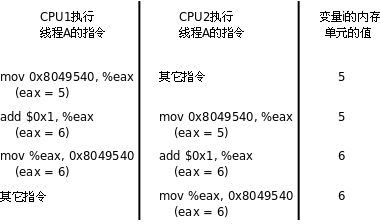

# 3. 线程间同步

## 3.1. mutex

多个线程同时访问共享数据时可能会冲突，这跟前面讲信号时所说的可重入性是同样的问题。比如两个线程都要把某个全局变量增加 1，这个操作在某平台需要三条指令完成：

1. 从内存读变量值到寄存器

2. 寄存器的值加 1

3. 将寄存器的值写回内存

假设两个线程在多处理器平台上同时执行这三条指令，则可能导致下图所示的结果，最后变量只加了一次而非两次。

<div align="center">

  

  <p><b>图 35.1. 并行访问冲突</b></p>

</div>

思考一下，如果这两个线程在单处理器平台上执行，能够避免这样的问题吗？

我们通过一个简单的程序观察这一现象。上图所描述的现象从理论上是存在这种可能的，但实际运行程序时很难观察到，为了使现象更容易观察到，我们把上述三条指令做的事情用更多条指令来做：

```c
val = counter;
		printf("%x: %d\n", (unsigned int)pthread_self(), val + 1);
		counter = val + 1;
```

我们在“读取变量的值”和“把变量的新值保存回去”这两步操作之间插入一个 `printf` 调用，它会执行 `write` 系统调用进内核，为内核调度别的线程执行提供了一个很好的时机。我们在一个循环中重复上述操作几千次，就会观察到访问冲突的现象。

```c
#include <stdio.h>
#include <stdlib.h>
#include <pthread.h>

#define NLOOP 5000

int counter;                /* incremented by threads */

void *doit(void *);

int main(int argc, char **argv)
{
	pthread_t tidA, tidB;

	pthread_create(&tidA, NULL, &doit, NULL);
	pthread_create(&tidB, NULL, &doit, NULL);

        /* wait for both threads to terminate */
	pthread_join(tidA, NULL);
	pthread_join(tidB, NULL);

	return 0;
}

void *doit(void *vptr)
{
	int    i, val;

	/*
	 * Each thread fetches, prints, and increments the counter NLOOP times.
	 * The value of the counter should increase monotonically.
	 */

	for (i = 0; i < NLOOP; i++) {
		val = counter;
		printf("%x: %d\n", (unsigned int)pthread_self(), val + 1);
		counter = val + 1;
	}

	return NULL;
}
```

我们创建两个线程，各自把 `counter` 增加 5000 次，正常情况下最后 `counter` 应该等于 10000，但事实上每次运行该程序的结果都不一样，有时候数到 5000 多，有时候数到 6000 多。

```text
$ ./a.out
b76acb90: 1
b76acb90: 2
b76acb90: 3
b76acb90: 4
b76acb90: 5
b7eadb90: 1
b7eadb90: 2
b7eadb90: 3
b7eadb90: 4
b7eadb90: 5
b76acb90: 6
b76acb90: 7
b7eadb90: 6
b76acb90: 8
...
```

对于多线程的程序，访问冲突的问题是很普遍的，解决的办法是引入互斥锁（Mutex，Mutual Exclusive Lock），获得锁的线程可以完成“读-修改-写”的操作，然后释放锁给其它线程，没有获得锁的线程只能等待而不能访问共享数据，这样“读-修改-写”三步操作组成一个原子操作，要么都执行，要么都不执行，不会执行到中间被打断，也不会在其它处理器上并行做这个操作。

Mutex 用 `pthread_mutex_t` 类型的变量表示，可以这样初始化和销毁：

```c
#include <pthread.h>

int pthread_mutex_destroy(pthread_mutex_t *mutex);
int pthread_mutex_init(pthread_mutex_t *restrict mutex,
       const pthread_mutexattr_t *restrict attr);
pthread_mutex_t mutex = PTHREAD_MUTEX_INITIALIZER;
```

返回值：成功返回 0，失败返回错误号。

`pthread_mutex_init ` 函数对 Mutex 做初始化，参数`attr ` 设定 Mutex 的属性，如果`attr ` 为`NULL ` 则表示缺省属性，本章不详细介绍 Mutex 属性，感兴趣的读者可以参考[\[APUE2e\]](bi01.md#bibli.apue)。用`pthread_mutex_init ` 函数初始化的 Mutex 可以用`pthread_mutex_destroy ` 销毁。如果 Mutex 变量是静态分配的（全局变量或`static ` 变量），也可以用宏定义`PTHREAD_MUTEX_INITIALIZER ` 来初始化，相当于用`pthread_mutex_init ` 初始化并且`attr ` 参数为`NULL` 。Mutex 的加锁和解锁操作可以用下列函数：

```c
#include <pthread.h>

int pthread_mutex_lock(pthread_mutex_t *mutex);
int pthread_mutex_trylock(pthread_mutex_t *mutex);
int pthread_mutex_unlock(pthread_mutex_t *mutex);
```

返回值：成功返回 0，失败返回错误号。

一个线程可以调用 pthread_mutex_lock 获得 Mutex，如果这时另一个线程已经调用 pthread_mutex_lock 获得了该 Mutex，则当前线程需要挂起等待，直到另一个线程调用 pthread_mutex_unlock 释放 Mutex，当前线程被唤醒，才能获得该 Mutex 并继续执行。

如果一个线程既想获得锁，又不想挂起等待，可以调用 pthread_mutex_trylock，如果 Mutex 已经被另一个线程获得，这个函数会失败返回 EBUSY，而不会使线程挂起等待。

现在我们用 Mutex 解决先前的问题：

```c
#include <stdio.h>
#include <stdlib.h>
#include <pthread.h>

#define NLOOP 5000

int counter;                /* incremented by threads */
pthread_mutex_t counter_mutex = PTHREAD_MUTEX_INITIALIZER;

void *doit(void *);

int main(int argc, char **argv)
{
	pthread_t tidA, tidB;

	pthread_create(&tidA, NULL, doit, NULL);
	pthread_create(&tidB, NULL, doit, NULL);

        /* wait for both threads to terminate */
	pthread_join(tidA, NULL);
	pthread_join(tidB, NULL);

	return 0;
}

void *doit(void *vptr)
{
	int     i, val;

	/*
	 * Each thread fetches, prints, and increments the counter NLOOP times.
	 * The value of the counter should increase monotonically.
	 */

	for (i = 0; i < NLOOP; i++) {
		pthread_mutex_lock(&counter_mutex);

		val = counter;
		printf("%x: %d\n", (unsigned int)pthread_self(), val + 1);
		counter = val + 1;

		pthread_mutex_unlock(&counter_mutex);
	}

	return NULL;
}
```

这样运行结果就正常了，每次运行都能数到 10000。

看到这里，读者一定会好奇：Mutex 的两个基本操作 lock 和 unlock 是如何实现的呢？假设 Mutex 变量的值为 1 表示互斥锁空闲，这时某个进程调用 lock 可以获得锁，而 Mutex 的值为 0 表示互斥锁已经被某个线程获得，其它线程再调用 lock 只能挂起等待。那么 lock 和 unlock 的伪代码如下：

```c
lock:
	if(mutex > 0){
		mutex = 0;
		return 0;
	} else
		挂起等待;
	goto lock;

unlock:
	mutex = 1;
	唤醒等待 Mutex 的线程;
	return 0;
```

unlock 操作中唤醒等待线程的步骤可以有不同的实现，可以只唤醒一个等待线程，也可以唤醒所有等待该 Mutex 的线程，然后让被唤醒的这些线程去竞争获得这个 Mutex，竞争失败的线程继续挂起等待。

细心的读者应该已经看出问题了：对 Mutex 变量的读取、判断和修改不是原子操作。如果两个线程同时调用 lock，这时 Mutex 是 1，两个线程都判断 mutex>0 成立，然后其中一个线程置 mutex=0，而另一个线程并不知道这一情况，也置 mutex=0，于是两个线程都以为自己获得了锁。

为了实现互斥锁操作，大多数体系结构都提供了 swap 或 exchange 指令，该指令的作用是把寄存器和内存单元的数据相交换，由于只有一条指令，保证了原子性，即使是多处理器平台，访问内存的总线周期也有先后，一个处理器上的交换指令执行时另一个处理器的交换指令只能等待总线周期。现在我们把 lock 和 unlock 的伪代码改一下（以 x86 的 xchg 指令为例）：

```c
lock:
	movb $0, %al
	xchgb %al, mutex
	if(al 寄存器的内容 > 0){
		return 0;
	} else
		挂起等待;
	goto lock;

unlock:
	movb $1, mutex
	唤醒等待 Mutex 的线程;
	return 0;
```

unlock 中的释放锁操作同样只用一条指令实现，以保证它的原子性。

也许还有读者好奇，“挂起等待”和“唤醒等待线程”的操作如何实现？每个 Mutex 有一个等待队列，一个线程要在 Mutex 上挂起等待，首先在把自己加入等待队列中，然后置线程状态为睡眠，然后调用调度器函数切换到别的线程。一个线程要唤醒等待队列中的其它线程，只需从等待队列中取出一项，把它的状态从睡眠改为就绪，加入就绪队列，那么下次调度器函数执行时就有可能切换到被唤醒的线程。

一般情况下，如果同一个线程先后两次调用 lock，在第二次调用时，由于锁已经被占用，该线程会挂起等待别的线程释放锁，然而锁正是被自己占用着的，该线程又被挂起而没有机会释放锁，因此就永远处于挂起等待状态了，这叫做死锁（Deadlock）。另一种典型的死锁情形是这样：线程 A 获得了锁 1，线程 B 获得了锁 2，这时线程 A 调用 lock 试图获得锁 2，结果是需要挂起等待线程 B 释放锁 2，而这时线程 B 也调用 lock 试图获得锁 1，结果是需要挂起等待线程 A 释放锁 1，于是线程 A 和 B 都永远处于挂起状态了。不难想象，如果涉及到更多的线程和更多的锁，有没有可能死锁的问题将会变得复杂和难以判断。

写程序时应该尽量避免同时获得多个锁，如果一定有必要这么做，则有一个原则：如果所有线程在需要多个锁时都按相同的先后顺序（常见的是按 Mutex 变量的地址顺序）获得锁，则不会出现死锁。比如一个程序中用到锁 1、锁 2、锁 3，它们所对应的 Mutex 变量的地址是锁 1<锁 2<锁 3，那么所有线程在需要同时获得 2 个或 3 个锁时都应该按锁 1、锁 2、锁 3 的顺序获得。如果要为所有的锁确定一个先后顺序比较困难，则应该尽量使用 pthread_mutex_trylock 调用代替 pthread_mutex_lock 调用，以免死锁。

## 3.2. Condition Variable

线程间的同步还有这样一种情况：线程 A 需要等某个条件成立才能继续往下执行，现在这个条件不成立，线程 A 就阻塞等待，而线程 B 在执行过程中使这个条件成立了，就唤醒线程 A 继续执行。在 pthread 库中通过条件变量（Condition Variable）来阻塞等待一个条件，或者唤醒等待这个条件的线程。Condition Variable 用 `pthread_cond_t` 类型的变量表示，可以这样初始化和销毁：

```c
#include <pthread.h>

int pthread_cond_destroy(pthread_cond_t *cond);
int pthread_cond_init(pthread_cond_t *restrict cond,
       const pthread_condattr_t *restrict attr);
pthread_cond_t cond = PTHREAD_COND_INITIALIZER;
```

返回值：成功返回 0，失败返回错误号。

和 Mutex 的初始化和销毁类似， `pthread_cond_init` 函数初始化一个 Condition Variable， `attr` 参数为 `NULL` 则表示缺省属性， `pthread_cond_destroy` 函数销毁一个 Condition Variable。如果 Condition Variable 是静态分配的，也可以用宏定义 `PTHEAD_COND_INITIALIZER` 初始化，相当于用 `pthread_cond_init` 函数初始化并且 `attr` 参数为 `NULL` 。Condition Variable 的操作可以用下列函数：

```c
#include <pthread.h>

int pthread_cond_timedwait(pthread_cond_t *restrict cond,
       pthread_mutex_t *restrict mutex,
       const struct timespec *restrict abstime);
int pthread_cond_wait(pthread_cond_t *restrict cond,
       pthread_mutex_t *restrict mutex);
int pthread_cond_broadcast(pthread_cond_t *cond);
int pthread_cond_signal(pthread_cond_t *cond);
```

返回值：成功返回 0，失败返回错误号。

可见，一个 Condition Variable 总是和一个 Mutex 搭配使用的。一个线程可以调用 `pthread_cond_wait` 在一个 Condition Variable 上阻塞等待，这个函数做以下三步操作：

1. 释放 Mutex

2. 阻塞等待

3. 当被唤醒时，重新获得 Mutex 并返回

`pthread_cond_timedwait ` 函数还有一个额外的参数可以设定等待超时，如果到达了`abstime ` 所指定的时刻仍然没有别的线程来唤醒当前线程，就返回`ETIMEDOUT ` 。一个线程可以调用`pthread_cond_signal ` 唤醒在某个 Condition Variable 上等待的另一个线程，也可以调用`pthread_cond_broadcast` 唤醒在这个 Condition Variable 上等待的所有线程。

下面的程序演示了一个生产者-消费者的例子，生产者生产一个结构体串在链表的表头上，消费者从表头取走结构体。

```c
#include <stdlib.h>
#include <pthread.h>
#include <stdio.h>

struct msg {
	struct msg *next;
	int num;
};

struct msg *head;
pthread_cond_t has_product = PTHREAD_COND_INITIALIZER;
pthread_mutex_t lock = PTHREAD_MUTEX_INITIALIZER;

void *consumer(void *p)
{
	struct msg *mp;

	for (;;) {
		pthread_mutex_lock(&lock);
		while (head == NULL)
			pthread_cond_wait(&has_product, &lock);
		mp = head;
		head = mp->next;
		pthread_mutex_unlock(&lock);
		printf("Consume %d\n", mp->num);
		free(mp);
		sleep(rand() % 5);
	}
}

void *producer(void *p)
{
	struct msg *mp;
	for (;;) {
		mp = malloc(sizeof(struct msg));
		mp->num = rand() % 1000 + 1;
		printf("Produce %d\n", mp->num);
		pthread_mutex_lock(&lock);
		mp->next = head;
		head = mp;
		pthread_mutex_unlock(&lock);
		pthread_cond_signal(&has_product);
		sleep(rand() % 5);
	}
}

int main(int argc, char *argv[])
{
	pthread_t pid, cid;

	srand(time(NULL));
	pthread_create(&pid, NULL, producer, NULL);
	pthread_create(&cid, NULL, consumer, NULL);
	pthread_join(pid, NULL);
	pthread_join(cid, NULL);
	return 0;
}
```

执行结果如下：

```text
$ ./a.out
Produce 744
Consume 744
Produce 567
Produce 881
Consume 881
Produce 911
Consume 911
Consume 567
Produce 698
Consume 698
```

## 习题

1、在本节的例子中，生产者和消费者访问链表的顺序是 LIFO 的，请修改程序，把访问顺序改成 FIFO。

## 3.3. Semaphore

Mutex 变量是非 0 即 1 的，可看作一种资源的可用数量，初始化时 Mutex 是 1，表示有一个可用资源，加锁时获得该资源，将 Mutex 减到 0，表示不再有可用资源，解锁时释放该资源，将 Mutex 重新加到 1，表示又有了一个可用资源。

信号量（Semaphore）和 Mutex 类似，表示可用资源的数量，和 Mutex 不同的是这个数量可以大于 1。

本节介绍的是 POSIX semaphore 库函数，详见 sem_overview(7)，这种信号量不仅可用于同一进程的线程间同步，也可用于不同进程间的同步。

```c
#include <semaphore.h>

int sem_init(sem_t *sem, int pshared, unsigned int value);
int sem_wait(sem_t *sem);
int sem_trywait(sem_t *sem);
int sem_post(sem_t * sem);
int sem_destroy(sem_t * sem);
```

semaphore 变量的类型为 sem_t，sem_init()初始化一个 semaphore 变量，value 参数表示可用资源的数量，pshared 参数为 0 表示信号量用于同一进程的线程间同步，本节只介绍这种情况。在用完 semaphore 变量之后应该调用 sem_destroy()释放与 semaphore 相关的资源。

调用 sem_wait()可以获得资源，使 semaphore 的值减 1，如果调用 sem_wait()时 semaphore 的值已经是 0，则挂起等待。如果不希望挂起等待，可以调用 sem_trywait()。调用 sem_post()可以释放资源，使 semaphore 的值加 1，同时唤醒挂起等待的线程。

上一节生产者－消费者的例子是基于链表的，其空间可以动态分配，现在基于固定大小的环形队列重写这个程序：

```c
#include <stdlib.h>
#include <pthread.h>
#include <stdio.h>
#include <semaphore.h>

#define NUM 5
int queue[NUM];
sem_t blank_number, product_number;

void *producer(void *arg)
{
	int p = 0;
	while (1) {
		sem_wait(&blank_number);
		queue[p] = rand() % 1000 + 1;
		printf("Produce %d\n", queue[p]);
		sem_post(&product_number);
		p = (p+1)%NUM;
		sleep(rand()%5);
	}
}

void *consumer(void *arg)
{
	int c = 0;
	while (1) {
		sem_wait(&product_number);
		printf("Consume %d\n", queue[c]);
		queue[c] = 0;
		sem_post(&blank_number);
		c = (c+1)%NUM;
		sleep(rand()%5);
	}
}

int main(int argc, char *argv[])
{
	pthread_t pid, cid;

	sem_init(&blank_number, 0, NUM);
	sem_init(&product_number, 0, 0);
	pthread_create(&pid, NULL, producer, NULL);
	pthread_create(&cid, NULL, consumer, NULL);
	pthread_join(pid, NULL);
	pthread_join(cid, NULL);
	sem_destroy(&blank_number);
	sem_destroy(&product_number);
	return 0;
}
```

## 习题

1、本节和上一节的例子给出一个重要的提示：用 Condition Variable 可以实现 Semaphore。请用 Condition Variable 实现 Semaphore，然后用自己实现的 Semaphore 重写本节的程序。

## 3.4. 其它线程间同步机制

如果共享数据是只读的，那么各线程读到的数据应该总是一致的，不会出现访问冲突。只要有一个线程可以改写数据，就必须考虑线程间同步的问题。由此引出了读者写者锁（Reader-Writer Lock）的概念，Reader 之间并不互斥，可以同时读共享数据，而 Writer 是独占的（exclusive），在 Writer 修改数据时其它 Reader 或 Writer 不能访问数据，可见 Reader-Writer Lock 比 Mutex 具有更好的并发性。

用挂起等待的方式解决访问冲突不见得是最好的办法，因为这样毕竟会影响系统的并发性，在某些情况下解决访问冲突的问题可以尽量避免挂起某个线程，例如 Linux 内核的 Seqlock、RCU（read-copy-update）等机制。

关于这些同步机制的细节，有兴趣的读者可以参考[\[APUE2e\]](bi01.md#bibli.apue)和[\[ULK\]](bi01.md#bibli.ulk)。
