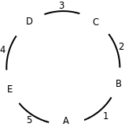

# 4. 编程练习

哲学家就餐问题。这是由计算机科学家 Dijkstra 提出的经典死锁场景。

原版的故事里有五个哲学家(不过我们写的程序可以有 N 个哲学家)，这些哲学家们只做两件事－－思考和吃饭，他们思考的时候不需要任何共享资源，但是吃饭的时候就必须使用餐具，而餐桌上的餐具是有限的，原版的故事里，餐具是叉子，吃饭的时候要用两把叉子把面条从碗里捞出来。很显然把叉子换成筷子会更合理，所以：一个哲学家需要两根筷子才能吃饭。

现在引入问题的关键：这些哲学家很穷，只买得起五根筷子。他们坐成一圈，两个人的中间放一根筷子。哲学家吃饭的时候必须同时得到左手边和右手边的筷子。如果他身边的任何一位正在使用筷子，那他只有等着。

假设哲学家的编号是 A、B、C、D、E，筷子编号是 1、2、3、4、5，哲学家和筷子围成一圈如下图所示：

<div align="center">

  

  <p><b>图 35.2. 哲学家问题</b></p>

</div>

每个哲学家都是一个单独的线程，每个线程循环做以下动作：思考 rand()%10 秒，然后先拿左手边的筷子再拿右手边的筷子（筷子这种资源可以用 mutex 表示），有任何一边拿不到就一直等着，全拿到就吃饭 rand()%10 秒，然后放下筷子。

编写程序仿真哲学家就餐的场景：

```text
Philosopher A fetches chopstick 5
Philosopher B fetches chopstick 1
Philosopher B fetches chopstick 2
Philosopher D fetches chopstick 3
Philosopher B releases chopsticks 1 2
Philosopher A fetches chopstick 1
Philosopher C fetches chopstick 2
Philosopher A releases chopsticks 5 1
...
```

分析一下，这个过程有没有可能产生死锁？调用 usleep(3)函数可以实现微秒级的延时，试着用 usleep(3)加快仿真的速度，看能不能观察到死锁现象。然后修改上述算法避免产生死锁。
