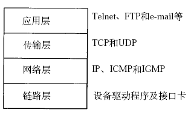
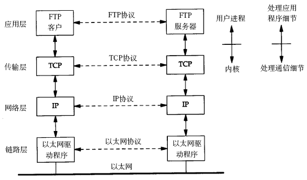
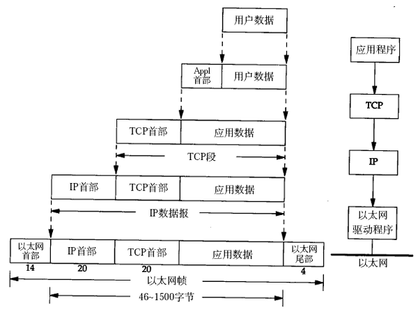
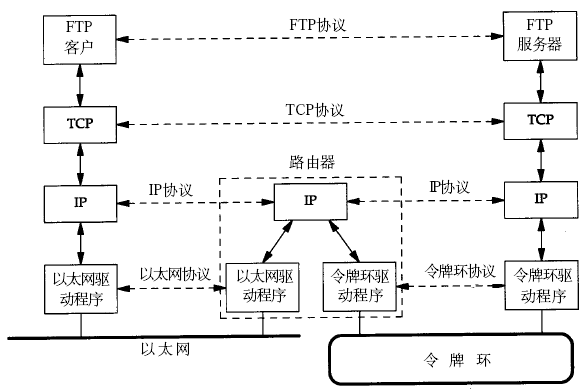
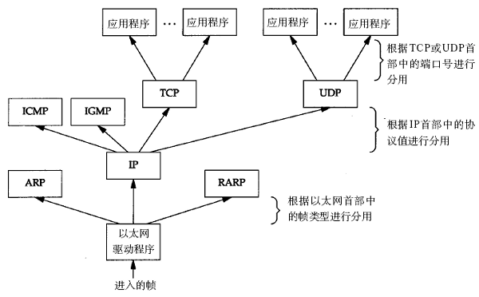

# 1. TCP/IP 协议栈与数据包封装

TCP/IP 网络协议栈分为应用层（Application）、传输层（Transport）、网络层（Network）和链路层（Link）四层。如下图所示（该图出自[\[TCPIP\]](bi01.md#bibli.tcpip)）。

  

  
<b>图 36.1. TCP/IP 协议栈</b>

两台计算机通过 TCP/IP 协议通讯的过程如下所示（该图出自[\[TCPIP\]](bi01.md#bibli.tcpip)）。

  

  
<b>图 36.2. TCP/IP 通讯过程</b>

传输层及其以下的机制由内核提供，应用层由用户进程提供（后面将介绍如何使用 socket API 编写应用程序），应用程序对通讯数据的含义进行解释，而传输层及其以下处理通讯的细节，将数据从一台计算机通过一定的路径发送到另一台计算机。应用层数据通过协议栈发到网络上时，每层协议都要加上一个数据首部（header），称为封装（Encapsulation），如下图所示（该图出自[\[TCPIP\]](bi01.md#bibli.tcpip)）。

  

  
<b>图 36.3. TCP/IP 数据包的封装</b>

不同的协议层对数据包有不同的称谓，在传输层叫做段（segment），在网络层叫做数据报（datagram），在链路层叫做帧（frame）。数据封装成帧后发到传输介质上，到达目的主机后每层协议再剥掉相应的首部，最后将应用层数据交给应用程序处理。

上图对应两台计算机在同一网段中的情况，如果两台计算机在不同的网段中，那么数据从一台计算机到另一台计算机传输过程中要经过一个或多个路由器，如下图所示（该图出自[\[TCPIP\]](bi01.md#bibli.tcpip)）。

  

  
<b>图 36.4. 跨路由器通讯过程</b>

其实在链路层之下还有物理层，指的是电信号的传递方式，比如现在以太网通用的网线（双绞线）、早期以太网采用的的同轴电缆（现在主要用于有线电视）、光纤等都属于物理层的概念。物理层的能力决定了最大传输速率、传输距离、抗干扰性等。集线器（Hub）是工作在物理层的网络设备，用于双绞线的连接和信号中继（将已衰减的信号再次放大使之传得更远）。

链路层有以太网、令牌环网等标准，链路层负责网卡设备的驱动、帧同步（就是说从网线上检测到什么信号算作新帧的开始）、冲突检测（如果检测到冲突就自动重发）、数据差错校验等工作。交换机是工作在链路层的网络设备，可以在不同的链路层网络之间转发数据帧（比如十兆以太网和百兆以太网之间、以太网和令牌环网之间），由于不同链路层的帧格式不同，交换机要将进来的数据包拆掉链路层首部重新封装之后再转发。

网络层的 IP 协议是构成 Internet 的基础。Internet 上的主机通过 IP 地址来标识，Internet 上有大量路由器负责根据 IP 地址选择合适的路径转发数据包，数据包从 Internet 上的源主机到目的主机往往要经过十多个路由器。路由器是工作在第三层的网络设备，同时兼有交换机的功能，可以在不同的链路层接口之间转发数据包，因此路由器需要将进来的数据包拆掉网络层和链路层两层首部并重新封装。IP 协议不保证传输的可靠性，数据包在传输过程中可能丢失，可靠性可以在上层协议或应用程序中提供支持。

网络层负责点到点（point-to-point）的传输（这里的“点”指主机或路由器），而传输层负责端到端（end-to-end）的传输（这里的“端”指源主机和目的主机）。传输层可选择 TCP 或 UDP 协议。TCP 是一种面向连接的、可靠的协议，有点像打电话，双方拿起电话互通身份之后就建立了连接，然后说话就行了，这边说的话那边保证听得到，并且是按说话的顺序听到的，说完话挂机断开连接。也就是说 TCP 传输的双方需要首先建立连接，之后由 TCP 协议保证数据收发的可靠性，丢失的数据包自动重发，上层应用程序收到的总是可靠的数据流，通讯之后关闭连接。UDP 协议不面向连接，也不保证可靠性，有点像寄信，写好信放到邮筒里，既不能保证信件在邮递过程中不会丢失，也不能保证信件是按顺序寄到目的地的。使用 UDP 协议的应用程序需要自己完成丢包重发、消息排序等工作。

目的主机收到数据包后，如何经过各层协议栈最后到达应用程序呢？整个过程如下图所示（该图出自[\[TCPIP\]](bi01.md#bibli.tcpip)）。

  

  
<b>图 36.5. Multiplexing 过程</b>

以太网驱动程序首先根据以太网首部中的“上层协议”字段确定该数据帧的有效载荷（payload，指除去协议首部之外实际传输的数据）是 IP、ARP 还是 RARP 协议的数据报，然后交给相应的协议处理。假如是 IP 数据报，IP 协议再根据 IP 首部中的“上层协议”字段确定该数据报的有效载荷是 TCP、UDP、ICMP 还是 IGMP，然后交给相应的协议处理。假如是 TCP 段或 UDP 段，TCP 或 UDP 协议再根据 TCP 首部或 UDP 首部的“端口号”字段确定应该将应用层数据交给哪个用户进程。IP 地址是标识网络中不同主机的地址，而端口号就是同一台主机上标识不同进程的地址，IP 地址和端口号合起来标识网络中唯一的进程。

注意，虽然 IP、ARP 和 RARP 数据报都需要以太网驱动程序来封装成帧，但是从功能上划分，ARP 和 RARP 属于链路层，IP 属于网络层。虽然 ICMP、IGMP、TCP、UDP 的数据都需要 IP 协议来封装成数据报，但是从功能上划分，ICMP、IGMP 与 IP 同属于网络层，TCP 和 UDP 属于传输层。本文对 RARP、ICMP、IGMP 协议不做进一步介绍，有兴趣的读者可以看参考资料。
