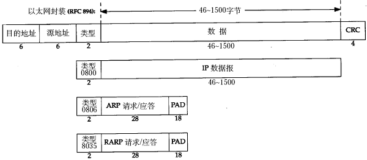

# 2. 以太网(RFC 894)帧格式

以太网的帧格式如下所示（该图出自[\[TCPIP\]](bi01.md#bibli.tcpip)）：

  

  
<b>图 36.6. 以太网帧格式</b>

其中的源地址和目的地址是指网卡的硬件地址（也叫 MAC 地址），长度是 48 位，是在网卡出厂时固化的。用 ifconfig 命令看一下，“HWaddr 00:15:F2:14:9E:3F”部分就是硬件地址。协议字段有三种值，分别对应 IP、ARP、RARP。帧末尾是 CRC 校验码。

以太网帧中的数据长度规定最小 46 字节，最大 1500 字节，ARP 和 RARP 数据包的长度不够 46 字节，要在后面补填充位。最大值 1500 称为以太网的最大传输单元（MTU），不同的网络类型有不同的 MTU，如果一个数据包从以太网路由到拨号链路上，数据包长度大于拨号链路的 MTU 了，则需要对数据包进行分片（fragmentation）。ifconfig 命令的输出中也有“MTU:1500”。注意，MTU 这个概念指数据帧中有效载荷的最大长度，不包括帧首部的长度。
