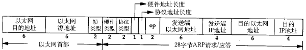

# 3. ARP 数据报格式

在网络通讯时，源主机的应用程序知道目的主机的 IP 地址和端口号，却不知道目的主机的硬件地址，而数据包首先是被网卡接收到再去处理上层协议的，如果接收到的数据包的硬件地址与本机不符，则直接丢弃。因此在通讯前必须获得目的主机的硬件地址。ARP 协议就起到这个作用。源主机发出 ARP 请求，询问“IP 地址是 192.168.0.1 的主机的硬件地址是多少”，并将这个请求广播到本地网段（以太网帧首部的硬件地址填 FF:FF:FF:FF:FF:FF 表示广播），目的主机接收到广播的 ARP 请求，发现其中的 IP 地址与本机相符，则发送一个 ARP 应答数据包给源主机，将自己的硬件地址填写在应答包中。

每台主机都维护一个 ARP 缓存表，可以用 arp -a 命令查看。缓存表中的表项有过期时间（一般为 20 分钟），如果 20 分钟内没有再次使用某个表项，则该表项失效，下次还要发 ARP 请求来获得目的主机的硬件地址。想一想，为什么表项要有过期时间而不是一直有效？

ARP 数据报的格式如下所示（该图出自[\[TCPIP\]](bi01.md#bibli.tcpip)）：

<div align="center">

  

  <p><b>图 36.7. ARP 数据报格式</b></p>

</div>

注意到源 MAC 地址、目的 MAC 地址在以太网首部和 ARP 请求中各出现一次，对于链路层为以太网的情况是多余的，但如果链路层是其它类型的网络则有可能是必要的。硬件类型指链路层网络类型，1 为以太网，协议类型指要转换的地址类型，0x0800 为 IP 地址，后面两个地址长度对于以太网地址和 IP 地址分别为 6 和 4（字节），op 字段为 1 表示 ARP 请求，op 字段为 2 表示 ARP 应答。

下面举一个具体的例子。

请求帧如下（为了清晰在每行的前面加了字节计数，每行 16 个字节）：

```text
以太网首部（14 字节）
0000: ff ff ff ff ff ff 00 05 5d 61 58 a8 08 06
ARP 帧（28 字节）
0000:                                           00 01
0010: 08 00 06 04 00 01 00 05 5d 61 58 a8 c0 a8 00 37
0020: 00 00 00 00 00 00 c0 a8 00 02
填充位（18 字节）
0020:                               00 77 31 d2 50 10
0030: fd 78 41 d3 00 00 00 00 00 00 00 00
```

以太网首部：目的主机采用广播地址，源主机的 MAC 地址是 00:05:5d:61:58:a8，上层协议类型 0x0806 表示 ARP。

ARP 帧：硬件类型 0x0001 表示以太网，协议类型 0x0800 表示 IP 协议，硬件地址（MAC 地址）长度为 6，协议地址（IP 地址）长度为 4，op 为 0x0001 表示请求目的主机的 MAC 地址，源主机 MAC 地址为 00:05:5d:61:58:a8，源主机 IP 地址为 c0 a8 00 37（192.168.0.55），目的主机 MAC 地址全 0 待填写，目的主机 IP 地址为 c0 a8 00 02（192.168.0.2）。

由于以太网规定最小数据长度为 46 字节，ARP 帧长度只有 28 字节，因此有 18 字节填充位，填充位的内容没有定义，与具体实现相关。

应答帧如下：

```text
以太网首部
0000: 00 05 5d 61 58 a8 00 05 5d a1 b8 40 08 06
ARP 帧
0000:                                           00 01
0010: 08 00 06 04 00 02 00 05 5d a1 b8 40 c0 a8 00 02
0020: 00 05 5d 61 58 a8 c0 a8 00 37
填充位
0020:                               00 77 31 d2 50 10
0030: fd 78 41 d3 00 00 00 00 00 00 00 00
```

以太网首部：目的主机的 MAC 地址是 00:05:5d:61:58:a8，源主机的 MAC 地址是 00:05:5d:a1:b8:40，上层协议类型 0x0806 表示 ARP。

ARP 帧：硬件类型 0x0001 表示以太网，协议类型 0x0800 表示 IP 协议，硬件地址（MAC 地址）长度为 6，协议地址（IP 地址）长度为 4，op 为 0x0002 表示应答，源主机 MAC 地址为 00:05:5d:a1:b8:40，源主机 IP 地址为 c0 a8 00 02（192.168.0.2），目的主机 MAC 地址为 00:05:5d:61:58:a8，目的主机 IP 地址为 c0 a8 00 37（192.168.0.55）。

思考题：如果源主机和目的主机不在同一网段，ARP 请求的广播帧无法穿过路由器，源主机如何与目的主机通信？
