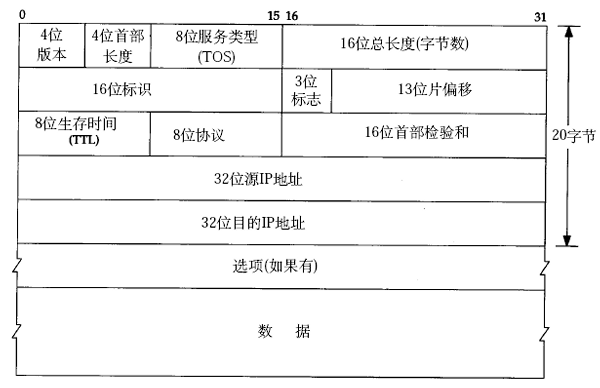

# 4. IP 数据报格式

IP 数据报的格式如下（这里只讨论 IPv4）（该图出自[\[TCPIP\]](bi01.md#bibli.tcpip)）：

  

  
<b>图 36.8. IP 数据报格式</b>

IP 数据报的首部长度和数据长度都是可变长的，但总是 4 字节的整数倍。对于 IPv4，4 位版本字段是 4。4 位首部长度的数值是以 4 字节为单位的，最小值为 5，也就是说首部长度最小是 4x5=20 字节，也就是不带任何选项的 IP 首部，4 位能表示的最大值是 15，也就是说首部长度最大是 60 字节。8 位 TOS 字段有 3 个位用来指定 IP 数据报的优先级（目前已经废弃不用），还有 4 个位表示可选的服务类型（最小延迟、最大呑吐量、最大可靠性、最小成本），还有一个位总是 0。总长度是整个数据报（包括 IP 首部和 IP 层 payload）的字节数。每传一个 IP 数据报，16 位的标识加 1，可用于分片和重新组装数据报。3 位标志和 13 位片偏移用于分片。TTL（Time to live)是这样用的：源主机为数据包设定一个生存时间，比如 64，每过一个路由器就把该值减 1，如果减到 0 就表示路由已经太长了仍然找不到目的主机的网络，就丢弃该包，因此这个生存时间的单位不是秒，而是跳（hop）。协议字段指示上层协议是 TCP、UDP、ICMP 还是 IGMP。然后是校验和，只校验 IP 首部，数据的校验由更高层协议负责。IPv4 的 IP 地址长度为 32 位。选项字段的解释从略。

想一想，前面讲了以太网帧中的最小数据长度为 46 字节，不足 46 字节的要用填充字节补上，那么如何界定这 46 字节里前多少个字节是 IP、ARP 或 RARP 数据报而后面是填充字节？
