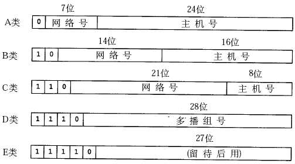
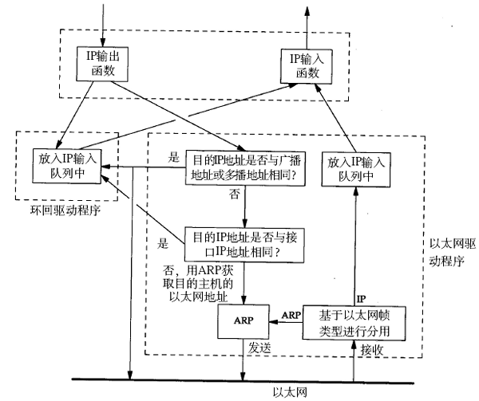

# 5. IP 地址与路由

IPv4 的 IP 地址长度为 4 字节，通常采用点分十进制表示法（dotted decimal representation）例如 0xc0a80002 表示为 192.168.0.2。Internet 被各种路由器和网关设备分隔成很多网段，为了标识不同的网段，需要把 32 位的 IP 地址划分成网络号和主机号两部分，网络号相同的各主机位于同一网段，相互间可以直接通信，网络号不同的主机之间通信则需要通过路由器转发。

过去曾经提出一种划分网络号和主机号的方案，把所有 IP 地址分为五类，如下图所示（该图出自[\[TCPIP\]](bi01.md#bibli.tcpip)）。

<div align="center">

  

  <p><b>图 36.9. IP 地址类</b></p>

</div>

```text
A 类 0.0.0.0 到 127.255.255.255
B 类 128.0.0.0 到 191.255.255.255
C 类 192.0.0.0 到 223.255.255.255
D 类 224.0.0.0 到 239.255.255.255
E 类 240.0.0.0 到 247.255.255.255
```

一个 A 类网络可容纳的地址数量最大，一个 B 类网络的地址数量是 65536，一个 C 类网络的地址数量是 256。D 类地址用作多播地址，E 类地址保留未用。

随着 Internet 的飞速发展，这种划分方案的局限性很快显现出来，大多数组织都申请 B 类网络地址，导致 B 类地址很快就分配完了，而 A 类却浪费了大量地址。这种方式对网络的划分是 flat 的而不是层级结构（hierarchical）的，Internet 上的每个路由器都必须掌握所有网络的信息，随着大量 C 类网络的出现，路由器需要检索的路由表越来越庞大，负担越来越重。

针对这种情况提出了新的划分方案，称为 CIDR（Classless Interdomain Routing）。网络号和主机号的划分需要用一个额外的子网掩码（subnet mask）来表示，而不能由 IP 地址本身的数值决定，也就是说，网络号和主机号的划分与这个 IP 地址是 A 类、B 类还是 C 类无关，因此称为 Classless 的。这样，多个子网就可以汇总（summarize）成一个 Internet 上的网络，例如，有 8 个站点都申请了 C 类网络，本来网络号是 24 位的，但是这 8 个站点通过同一个 ISP（Internet service provider）连到 Internet 上，它们网络号的高 21 位是相同的，只有低三位不同，这 8 个站点就可以汇总，在 Internet 上只需要一个路由表项，数据包通过 Internet 上的路由器到达 ISP，然后在 ISP 这边再通过次级的路由器选路到某个站点。

下面举两个例子：

**表 36.1. 划分子网的例子 1**

| IP 地址 | 140.252.20.68 | 8C FC 14 44 |
| 子网掩码 | 255.255.255.0 | FF FF FF 00 |
| 网络号 | 140.252.20.0 | 8C FC 14 00 |
| 子网地址范围 | 140.252.20.0~140.252.20.255 |  |

**表 36.2. 划分子网的例子 2**

| IP 地址 | 140.252.20.68 | 8C FC 14 44 |
| 子网掩码 | 255.255.255.240 | FF FF FF F0 |
| 网络号 | 140.252.20.64 | 8C FC 14 40 |
| 子网地址范围 | 140.252.20.64~140.252.20.79 |  |

可见，IP 地址与子网掩码做与运算可以得到网络号，主机号从全 0 到全 1 就是子网的地址范围。IP 地址和子网掩码还有一种更简洁的表示方法，例如 140.252.20.68/24，表示 IP 地址为 140.252.20.68，子网掩码的高 24 位是 1，也就是 255.255.255.0。

如果一个组织内部组建局域网，IP 地址只用于局域网内的通信，而不直接连到 Internet 上，理论上使用任意的 IP 地址都可以，但是 RFC 1918 规定了用于组建局域网的私有 IP 地址，这些地址不会出现在 Internet 上，如下表所示。

* 10.*，前 8 位是网络号，共 16,777,216 个地址

* 172.16.*到 172.31.*，前 12 位是网络号，共 1,048,576 个地址

* 192.168.*，前 16 位是网络号，共 65,536 个地址

使用私有 IP 地址的局域网主机虽然没有 Internet 的 IP 地址，但也可以通过代理服务器或 NAT（网络地址转换）等技术连到 Internet 上。

除了私有 IP 地址之外，还有几种特殊的 IP 地址。127.*的 IP 地址用于本机环回(loop back)测试，通常是 127.0.0.1。loopback 是系统中一种特殊的网络设备，如果发送数据包的目的地址是环回地址，或者与本机其它网络设备的 IP 地址相同，则数据包不会发送到网络介质上，而是通过环回设备再发回给上层协议和应用程序，主要用于测试。如下图所示（该图出自[\[TCPIP\]](bi01.md#bibli.tcpip)）。

<div align="center">

  

  <p><b>图 36.10. loopback 设备</b></p>

</div>

还有一些不能用作主机 IP 地址的特殊地址：

* 目的地址为 255.255.255.255，表示本网络内部广播，路由器不转发这样的广播数据包。

* 主机号全为 0 的地址只表示网络而不能表示某个主机，如 192.168.10.0（假设子网掩码为 255.255.255.0）。

* 目的地址的主机号为全 1，表示广播至某个网络的所有主机，例如目的地址 192.168.10.255 表示广播至 192.168.10.0 网络（假设子网掩码为 255.255.255.0）。

下面介绍路由的过程，首先正式定义几个名词：

* 路由（名词）

  数据包从源地址到目的地址所经过的路径，由一系列路由节点组成。

* 路由（动词）

  某个路由节点为数据报选择投递方向的选路过程。

* 路由节点

  一个具有路由能力的主机或路由器，它维护一张路由表，通过查询路由表来决定向哪个接口发送数据包。

* 接口

  路由节点与某个网络相连的网卡接口。

* 路由表

  由很多路由条目组成，每个条目都指明去往某个网络的数据包应该经由哪个接口发送，其中最后一条是缺省路由条目。

* 路由条目

  路由表中的一行，每个条目主要由目的网络地址、子网掩码、下一跳地址、发送接口四部分组成，如果要发送的数据包的目的网络地址匹配路由表中的某一行，就按规定的接口发送到下一跳地址。

* 缺省路由条目

  路由表中的最后一行，主要由下一跳地址和发送接口两部分组成，当目的地址与路由表中其它行都不匹配时，就按缺省路由条目规定的接口发送到下一跳地址。

假设某主机上的网络接口配置和路由表如下：

```text
$ ifconfig
eth0      Link encap:Ethernet  HWaddr 00:0C:29:C2:8D:7E
          inet addr:192.168.10.223  Bcast:192.168.10.255  Mask:255.255.255.0
          UP BROADCAST RUNNING MULTICAST  MTU:1500  Metric:1
          RX packets:0 errors:0 dropped:0 overruns:0 frame:0
          TX packets:10 errors:0 dropped:0 overruns:0 carrier:0
          collisions:0 txqueuelen:100
          RX bytes:0 (0.0 b)  TX bytes:420 (420.0 b)
          Interrupt:10 Base address:0x10a0

eth1      Link encap:Ethernet  HWaddr 00:0C:29:C2:8D:88
          inet addr:192.168.56.136  Bcast:192.168.56.255  Mask:255.255.255.0
          UP BROADCAST RUNNING MULTICAST  MTU:1500  Metric:1
          RX packets:603 errors:0 dropped:0 overruns:0 frame:0
          TX packets:110 errors:0 dropped:0 overruns:0 carrier:0
          collisions:0 txqueuelen:100
          RX bytes:55551 (54.2 Kb)  TX bytes:7601 (7.4 Kb)
          Interrupt:9 Base address:0x10c0

lo        Link encap:Local Loopback
          inet addr:127.0.0.1  Mask:255.0.0.0
          UP LOOPBACK RUNNING  MTU:16436  Metric:1
          RX packets:37 errors:0 dropped:0 overruns:0 frame:0
          TX packets:37 errors:0 dropped:0 overruns:0 carrier:0
          collisions:0 txqueuelen:0
          RX bytes:3020 (2.9 Kb)  TX bytes:3020 (2.9 Kb)
$ route
Kernel IP routing table
Destination     Gateway         Genmask         Flags Metric Ref    Use Iface
192.168.10.0    *               255.255.255.0   U     0      0        0 eth0
192.168.56.0    *               255.255.255.0   U     0      0        0 eth1
127.0.0.0       *               255.0.0.0       U     0      0        0 lo
default         192.168.10.1    0.0.0.0         UG    0      0        0 eth0
```

这台主机有两个网络接口，一个网络接口连到 192.168.10.0/24 网络，另一个网络接口连到 192.168.56.0/24 网络。路由表的 Destination 是目的网络地址，Genmask 是子网掩码，Gateway 是下一跳地址，Iface 是发送接口，Flags 中的 U 标志表示此条目有效（可以禁用某些条目），G 标志表示此条目的下一跳地址是某个路由器的地址，没有 G 标志的条目表示目的网络地址是与本机接口直接相连的网络，不必经路由器转发，因此下一跳地址处记为*号。

如果要发送的数据包的目的地址是 192.168.56.3，跟第一行的子网掩码做与运算得到 192.168.56.0，与第一行的目的网络地址不符，再跟第二行的子网掩码做与运算得到 192.168.56.0，正是第二行的目的网络地址，因此从 eth1 接口发送出去，由于 192.168.56.0/24 正是与 eth1 接口直接相连的网络，因此可以直接发到目的主机，不需要经路由器转发。

如果要发送的数据包的目的地址是 202.10.1.2，跟前三行路由表条目都不匹配，那么就要按缺省路由条目，从 eth0 接口发出去，首先发往 192.168.10.1 路由器，再让路由器根据它的路由表决定下一跳地址。
