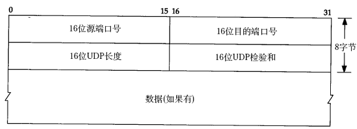

# 6. UDP 段格式

下图是 UDP 的段格式（该图出自[\[TCPIP\]](bi01.md#bibli.tcpip)）。

<div align="center">

  

  <p><b>图 36.11. UDP 段格式</b></p>

</div>

下面分析一帧基于 UDP 的 TFTP 协议帧。

```text
以太网首部
0000: 00 05 5d 67 d0 b1 00 05 5d 61 58 a8 08 00
IP 首部
0000:                                           45 00
0010: 00 53 93 25 00 00 80 11 25 ec c0 a8 00 37 c0 a8
0020: 00 01
UDP 首部
0020：      05 d4 00 45 00 3f ac 40
TFTP 协议
0020:                               00 01 'c'':''\''q'
0030: 'w''e''r''q''.''q''w''e'00 'n''e''t''a''s''c''i'
0040: 'i'00 'b''l''k''s''i''z''e'00 '5''1''2'00 't''i'
0050: 'm''e''o''u''t'00 '1''0'00 't''s''i''z''e'00 '0'
0060: 00
```

以太网首部：源 MAC 地址是 00:05:5d:61:58:a8，目的 MAC 地址是 00:05:5d:67:d0:b1，上层协议类型 0x0800 表示 IP。

IP 首部：每一个字节 0x45 包含 4 位版本号和 4 位首部长度，版本号为 4，即 IPv4，首部长度为 5，说明 IP 首部不带有选项字段。服务类型为 0，没有使用服务。16 位总长度字段（包括 IP 首部和 IP 层 payload 的长度）为 0x0053，即 83 字节，加上以太网首部 14 字节可知整个帧长度是 97 字节。IP 报标识是 0x9325，标志字段和片偏移字段设置为 0x0000，就是 DF=0 允许分片，MF=0 此数据报没有更多分片，没有分片偏移。TTL 是 0x80，也就是 128。上层协议 0x11 表示 UDP 协议。IP 首部校验和为 0x25ec，源主机 IP 是 c0 a8 00 37（192.168.0.55），目的主机 IP 是 c0 a8 00 01（192.168.0.1）。

UDP 首部：源端口号 0x05d4（1492）是客户端的端口号，目的端口号 0x0045（69）是 TFTP 服务的 well-known 端口号。UDP 报长度为 0x003f，即 63 字节，包括 UDP 首部和 UDP 层 payload 的长度。UDP 首部和 UDP 层 payload 的校验和为 0xac40。

TFTP 是基于文本的协议，各字段之间用字节 0 分隔，开头的 00 01 表示请求读取一个文件，接下来的各字段是：

```text
c:\qwerq.qwe
netascii
blksize 512
timeout 10
tsize 0
```

一般的网络通信都是像 TFTP 协议这样，通信的双方分别是客户端和服务器，客户端主动发起请求（上面的例子就是客户端发起的请求帧），而服务器被动地等待、接收和应答请求。客户端的 IP 地址和端口号唯一标识了该主机上的 TFTP 客户端进程，服务器的 IP 地址和端口号唯一标识了该主机上的 TFTP 服务进程，由于客户端是主动发起请求的一方，它必须知道服务器的 IP 地址和 TFTP 服务进程的端口号，所以，一些常见的网络协议有默认的服务器端口，例如 HTTP 服务默认 TCP 协议的 80 端口，FTP 服务默认 TCP 协议的 21 端口，TFTP 服务默认 UDP 协议的 69 端口（如上例所示）。在使用客户端程序时，必须指定服务器的主机名或 IP 地址，如果不明确指定端口号则采用默认端口，请读者查阅 ftp、tftp 等程序的 man page 了解如何指定端口号。/etc/services 中列出了所有 well-known 的服务端口和对应的传输层协议，这是由 IANA（Internet Assigned Numbers Authority）规定的，其中有些服务既可以用 TCP 也可以用 UDP，为了清晰，IANA 规定这样的服务采用相同的 TCP 或 UDP 默认端口号，而另外一些 TCP 和 UDP 的相同端口号却对应不同的服务。

很多服务有 well-known 的端口号，然而客户端程序的端口号却不必是 well-known 的，往往是每次运行客户端程序时由系统自动分配一个空闲的端口号，用完就释放掉，称为 ephemeral 的端口号，想想这是为什么。

前面提过，UDP 协议不面向连接，也不保证传输的可靠性，例如：

* 发送端的 UDP 协议层只管把应用层传来的数据封装成段交给 IP 协议层就算完成任务了，如果因为网络故障该段无法发到对方，UDP 协议层也不会给应用层返回任何错误信息。

* 接收端的 UDP 协议层只管把收到的数据根据端口号交给相应的应用程序就算完成任务了，如果发送端发来多个数据包并且在网络上经过不同的路由，到达接收端时顺序已经错乱了，UDP 协议层也不保证按发送时的顺序交给应用层。

* 通常接收端的 UDP 协议层将收到的数据放在一个固定大小的缓冲区中等待应用程序来提取和处理，如果应用程序提取和处理的速度很慢，而发送端发送的速度很快，就会丢失数据包，UDP 协议层并不报告这种错误。

因此，使用 UDP 协议的应用程序必须考虑到这些可能的问题并实现适当的解决方案，例如等待应答、超时重发、为数据包编号、流量控制等。一般使用 UDP 协议的应用程序实现都比较简单，只是发送一些对可靠性要求不高的消息，而不发送大量的数据。例如，基于 UDP 的 TFTP 协议一般只用于传送小文件（所以才叫 trivial 的 ftp），而基于 TCP 的 FTP 协议适用于各种文件的传输。下面看 TCP 协议如何用面向连接的服务来代替应用程序解决传输的可靠性问题。
